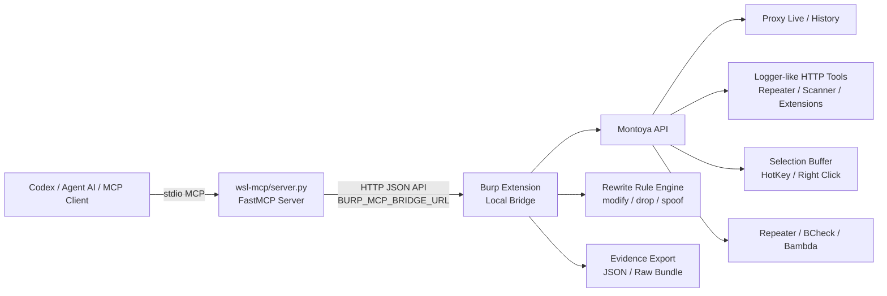
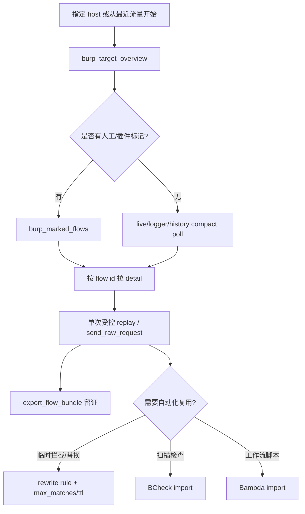

# BurpSuite MCP Bridge

> 面向 Burp Suite 与 Codex / Agent AI / MCP 客户端的本地桥接插件。
> 当前发布版本：**v2.0.1**；测试基线：**Burp Suite Professional 2026.4.2**；编译基线继续保持 `montoya-api 2025.10`，新能力按运行时检测启用。

BurpSuite MCP Bridge：

- 快速读取 Burp Proxy / Logger-like / Selection / History 中的关键流量；
- 以目标 host 为中心做流量画像、注释/颜色标记筛选与候选请求排序；
- 对指定流量按 ID 拉完整请求/响应、重放、送 Repeater、导出原始证据；
- 通过受控 Rewrite Rule、BCheck、Bambda 等接口把 AI 发现转化为 Burp 内可复用的操作。

---

## v2.0 重点能力

### 1. 低噪声流量读取

- `live`：Burp Proxy 实时流量缓冲区。
- `logger`：Burp 内部 HTTP 工具 / Repeater / Scanner / 其他扩展产生的 logger-like 流量。
- `selection`：Burp UI 右键 / HotKey / command palette 捕获给 AI 的一次性流量。
- `history`：按条件检索 Burp Proxy History。

默认检索接口采用 **compact-first**：先返回 `id`、`method`、`host`、`path`、`status`、body 长度、注释/颜色等关键字段；需要完整包时再调用对应 detail 接口，避免上下文被大包撑爆。

### 2. Ignore asset responses / 忽略低价值静态响应

Burp 插件 UI 中的选项：

```text
Capture Policy -> Ignore asset responses / 忽略低价值静态响应
```

v2.0 已对应新语义：

- 只过滤低价值静态**响应**，请求仍保留；
- 过滤范围包括图片、字体、音视频、`ico`、`css`、`pdf`、压缩包等；
- **不会过滤 JavaScript、SourceMap、WASM**，保留插件扫描、LinkFinder、源码映射分析所需线索；
- `burp_config_get` 会返回：

```text
ignoreStaticMode = response-noisy-assets-only; requests kept; js/source-map/wasm kept
```


### 3. 时间窗口搜索 / 排序

v2.0.1 增加时间字段相关操作，适合限定“刚才这一波测试”：

- `burp_history_search`：支持 `time_from`、`time_to`、`sort=newest|oldest`，按 Burp History 的 `time` 过滤；
- `burp_live_poll` / `burp_logger_poll` / `burp_selection_poll`：支持 `created_from`、`created_to`，按 MCP buffer 的 `createdAt` 过滤；
- `burp_target_overview` / `burp_marked_flows`：支持 `time_from`、`time_to`，会自动映射到 history time 与 live/logger/selection createdAt；
- 时间值支持 epoch seconds、epoch milliseconds 或 ISO-8601，例如 `2026-06-06T10:00:00Z`。

### 4. 目标视角与人工标记利用

- `burp_target_overview(host=...)`：按 host 聚合 live/history/logger/selection 的高价值候选请求。
- `burp_marked_flows(host=...)`：读取指定 host 下带注释或高亮颜色的流量索引，适合快速定位 Burp 中人工标记、插件标记或 AI 前一次标记的关键包。
- 支持从注释中提取 LinkFinder、Sensitive Field、Source Map、Email、Router Push 等信号并参与排序。

### 5. Burp 2026.4.x 官方能力接入

保持 2025.10 编译基线，运行在 2026.4.x 时自动检测并启用：

- HotKey / command palette / 右键菜单捕获 Selection 给 AI；
- 内部 HTTP 工具流量可用时使用官方 drop/spoof 能力；
- BCheck 导入：把 AI 生成或本地文件中的 BCheck 交给 Burp Scanner 官方流程执行；
- Bambda 导入：把 AI 生成或本地文件中的 Bambda 脚本导入 Burp Bambda Library，由 Burp UI 管理和执行。

### 6. Rewrite Rule 自动化更安全

- 支持 `modify`、`drop`、`spoof` 三类动作；
- 支持 `proxy`、`tool`、`all` 三类作用面；
- 支持 `ttl_seconds`、`max_matches`、`auto_disable`；
- 命中计数内存即时生效，持久化使用 debounce；自动禁用立即持久化，避免并发重放时超过限制。

---

## 架构流程图



## 推荐 AI 工作流



---

## 发布包内容

```text
burp-plugin/
  burpsuite-mcp-bridge-2.0.1-all.jar
  burpsuite-mcp-bridge-2.0-all.jar
  burpsuite-mcp-bridge-latest.jar
wsl-mcp/
  server.py
config-examples/
  codex-wsl-mirrored.toml
  codex-wsl-nat.toml
  codex-windows.toml
  codex-macos.toml
requirements-wsl.txt
.codex-plugin/plugin.json
.mcp.json
```

---

## 快速安装

### 1. 加载 Burp 插件

在 Burp Suite 中加载：

```text
burp-plugin/burpsuite-mcp-bridge-latest.jar
```

推荐默认配置：

```text
Bind host: 127.0.0.1
Port: 9639
Max live/logger entries: 1500
Max body preview bytes: 32768
Ignore asset responses: 按需开启
```

WSL mirrored、Windows 本机、macOS 本机通常使用 `127.0.0.1`。WSL NAT 场景需要把 `BURP_MCP_BRIDGE_URL` 指到 Windows 局域网 IP。

### 2. 安装 MCP server 依赖

```bash
python3 -m pip install -r requirements-wsl.txt
```

### 3. 配置 Codex / MCP 客户端

WSL mirrored / 本机 loopback 示例：

```toml
[mcp_servers.burpsuite-mcp-bridge]
command = "python3"
args = ["/mnt/d/AI_project/burpsuite-mcp-bridge-release/wsl-mcp/server.py"]

[mcp_servers.burpsuite-mcp-bridge.env]
BURP_MCP_BRIDGE_URL = "http://127.0.0.1:9639"
```

WSL NAT 示例：

```toml
[mcp_servers.burpsuite-mcp-bridge]
command = "python3"
args = ["/mnt/d/AI_project/burpsuite-mcp-bridge-release/wsl-mcp/server.py"]

[mcp_servers.burpsuite-mcp-bridge.env]
BURP_MCP_BRIDGE_URL = "http://192.168.1.100:9639"
```

更多示例见 `config-examples/`。

---

## MCP 工具分组

### 状态与帮助

- `burp_bridge_status`
- `burp_config_get`
- `burp_mcp_list(section=..., topic=..., detail=...)`

建议 AI 先调用 `burp_mcp_list(section="index")`，再按 section/topic 取小块帮助，避免一次性塞入过长上下文。

### 流量读取

- `burp_target_overview`
- `burp_marked_flows`
- `burp_live_poll` / `burp_live_overview`
- `burp_history_search`
- `burp_logger_poll` / `burp_logger_overview`
- `burp_extension_activity_overview`
- `burp_selection_poll`
- `burp_flow_get`
- `burp_logger_flow_get`
- `burp_selection_get`

### 重放与证据

- `burp_replay_flow`
- `burp_send_raw_request`
- `burp_send_to_repeater`
- `burp_export_flow`
- `burp_export_flow_bundle`

### 自动化与扩展

- `burp_rules_list`
- `burp_rule_upsert`
- `burp_rule_delete`
- `burp_bcheck_import`
- `burp_bambda_import`

### 缓冲区维护

- `burp_clear_live_buffer`
- `burp_clear_logger_buffer`
- `burp_clear_selection_buffer`

---

## Body 与证据策略

- 列表/搜索接口默认不返回完整 body；
- detail 接口可以按需返回预览 body；
- 大包、二进制包、报告证据建议使用：

```python
burp_export_flow_bundle(flow_id=123, source="history")
```

这样可以拿到完整原始 request/response 文件，同时避免把巨大响应塞进 MCP 上下文。

---

## 可选 Streamable HTTP MCP

默认示例使用 stdio MCP。如果需要 Streamable HTTP，可手动启动：

```bash
BURP_MCP_BRIDGE_URL=http://127.0.0.1:9639 python3 wsl-mcp/server.py --transport streamable-http --host 127.0.0.1 --port 9640 --path /mcp
```

默认 URL：

```text
http://127.0.0.1:9640/mcp
```

---

## 兼容性说明

- 编译基线：`montoya-api 2025.10`
- 当前实测：Burp Suite Professional `2026.4.2`
- 2026.4.x 新能力均按运行时检测启用；不可用时保留基础功能，不强制依赖新 API。
