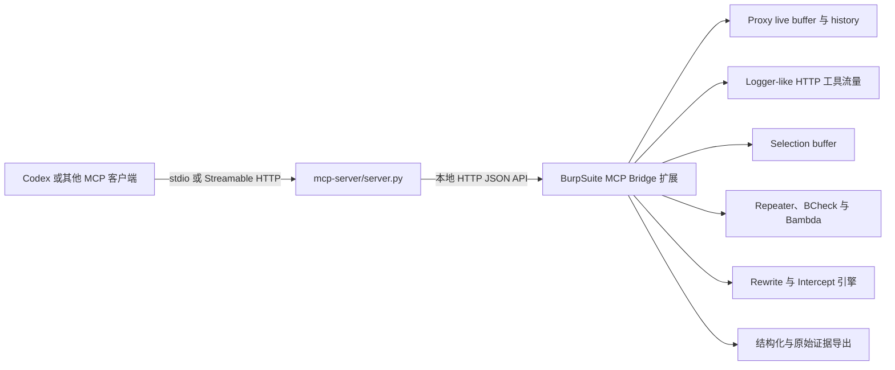

# BurpSuite MCP Bridge

[English](README_EN.md)

BurpSuite MCP Bridge 通过本地 Model Context Protocol（MCP）接口开放经过筛选的 Burp Suite 工作流。Burp Suite 仍是流量、人工复核和原生工具状态的事实来源；Bridge 负责提供有边界的流量检索、报文读取、重放、证据导出、改写规则以及请求/响应拦截接口。

- **当前版本：** `v2.1.0`
- **验证基线：** Burp Suite Professional `2026.4.2`
- **Montoya 编译基线：** `2025.10`
- **Python 基线：** `3.11+`

## 设计范围

Bridge 遵循以下约束：

- **Compact-first：** 列表和搜索接口只返回元数据，完整报文按 flow ID 获取。
- **确定性引用：** flow、rule 和 pending intercept 使用稳定标识，便于复放、审计和证据关联。
- **有界修改：** Rewrite Rule 与 Intercept 支持命中次数、有效期、自动禁用和超时恢复。
- **默认本地部署：** 发布示例中的 Burp HTTP Bridge 和可选 Streamable HTTP MCP 均绑定 loopback。
- **复用 Burp 原生能力：** Repeater、Proxy Intercept、BCheck、Bambda 仍由 Burp Suite 管理，Bridge 不重复实现。

Bridge 作为 Burp Suite 的 MCP 操作层，保持 Burp Suite 对流量、人工复核和原生工具状态的管理职责。自动化操作结果应结合完整请求/响应、后续状态变化和人工复核形成结论。

## 架构


```mermaid
flowchart LR
  C[Codex 或其他 MCP 客户端] -->|stdio 或 Streamable HTTP| M[mcp-server/server.py]
  M -->|本地 HTTP JSON API| B[BurpSuite MCP Bridge 扩展]
  B --> P[Proxy live buffer 与 history]
  B --> L[Logger-like HTTP 工具流量]
  B --> S[Selection buffer]
  B --> R[Repeater、BCheck 与 Bambda]
  B --> W[Rewrite 与 Intercept 引擎]
  B --> E[结构化与原始证据导出]
```

Python MCP server 只承担传输和 schema 适配。流量捕获、规则执行、拦截以及 Burp 集成都由扩展完成。

## 核心优势与能力

| 模块 | 接口 | 行为 |
| --- | --- | --- |
| 状态与配置 | `burp_bridge_status`、`burp_config_get` | 返回 Bridge 状态、运行配置、缓冲区、pending queue 和兼容性信息。 |
| 目标流量整理 | `burp_target_overview`、`burp_marked_flows` | 按 host 聚合流量，定位人工注释、高亮和相关 flow，不返回完整 body。 |
| 流量读取 | live、history、logger、selection | 先返回紧凑索引，再按来源读取完整报文。 |
| 重放 | `burp_replay_flow`、`burp_send_raw_request` | 基于已确认的基线请求执行明确且可核对的单变量修改。 |
| Burp 联动 | `burp_send_to_repeater` | 将指定报文交给 Repeater 原生界面继续处理。 |
| Rewrite Rule | modify、drop、spoof、intercept | 对 Proxy、内部 HTTP 工具或两者应用有边界的规则。 |
| 双向拦截 | Burp 原生模式或 MCP 控制模式 | 暂停匹配的请求/响应并执行人工或程序化决策。 |
| 扩展导入 | `burp_bcheck_import`、`burp_bambda_import` | 将文件或内容导入 Burp 原生库。 |
| 证据导出 | 结构化 JSON 或 raw bundle | 导出完整请求/响应，不把大报文直接放入 MCP 返回值。 |

### 流量来源

- `live`：扩展维护的有界 Proxy 实时流量缓冲区。
- `history`：按条件检索 Burp Proxy History。
- `logger`：来自 Repeater、Scanner、其他扩展和 Burp HTTP 工具的 logger-like 流量。
- `selection`：通过 Burp 右键菜单、HotKey 或 command palette 捕获的一次性报文。

搜索和 overview 接口返回 flow ID、method、host、path、status、body 长度、comment 和 highlight 等字段。确定候选 flow 后再读取完整请求/响应。

### 静态响应过滤

**Ignore asset responses / 忽略低价值静态响应** 只抑制低价值静态响应，保留对应请求。图片、字体、音视频、图标、CSS、PDF 和压缩包可被过滤；JavaScript、SourceMap 和 WebAssembly 保留。

`burp_config_get` 会报告当前策略：

```text
ignoreStaticMode = response-noisy-assets-only; requests kept; js/source-map/wasm kept
```

### 时间窗口

- `burp_history_search` 支持 `time_from`、`time_to` 和 `sort=newest|oldest`。
- `burp_live_poll`、`burp_logger_poll`、`burp_selection_poll` 支持 `created_from`、`created_to` 和排序参数。
- `burp_target_overview`、`burp_marked_flows` 会把时间范围应用到选定来源。

时间值支持 epoch seconds、epoch milliseconds 或 ISO-8601。

### 拦截模型

`action="intercept"` 可作用于 Proxy request 或 response：

- `intercept_mode="burp"`：消息进入 Burp Proxy Intercept，由测试人员使用原生编辑器处理。
- `intercept_mode="mcp"`：消息进入有界 pending queue；通过 `burp_intercept_poll` 读取，再使用 `burp_intercept_decide` 执行 `forward`、`replace` 或 `drop`。

超过决策超时的 pending 消息会按原文放行；卸载扩展时也会释放全部 pending 消息。一次性验证通常应同时设置精确 host/path、`max_matches=1` 和 `auto_disable=true`。

完整流程见 [docs/intercept-workflow.md](docs/intercept-workflow.md)。

## 发布包内容

```text
dist/
  burpsuite-mcp-bridge-2.1.0-all.jar
  SHA256SUMS
  bom.cdx.json
mcp-server/
  server.py
  requirements.lock
skills/
  use-burpsuite-mcp-bridge/
config-examples/
requirements.txt
requirements.lock
.codex-plugin/plugin.json
.mcp.json
```

## 安装

### 1. 加载 Burp 扩展

在 Burp Suite 中打开 **Extensions → Installed → Add**，选择 **Java**，加载：

```text
dist/burpsuite-mcp-bridge-2.1.0-all.jar
```

建议初始配置：

```text
Bind host: 127.0.0.1
Port: 9639
Max live/logger entries: 1500
Max body preview bytes: 32768
Ignore asset responses: 根据任务需要启用
```

Windows、macOS 和 WSL mirrored networking 通常可直接使用 loopback。WSL NAT 需要使用 WSL 可访问的 Windows 地址，并配置相应防火墙规则。

### 2. 安装 Python 依赖

推荐使用 Python 3.12 虚拟环境和跨平台哈希锁文件：

```bash
python3 -m pip install --require-hashes -r mcp-server/requirements.lock
```

### 3. 配置 MCP 客户端

本机或 WSL mirrored 示例：

```toml
[mcp_servers.burpsuite-mcp-bridge]
command = "python3"
args = ["/path/to/burpsuite-mcp-bridge/mcp-server/server.py"]

[mcp_servers.burpsuite-mcp-bridge.env]
BURP_MCP_BRIDGE_URL = "http://127.0.0.1:9639"
```

WSL NAT 示例：

```toml
[mcp_servers.burpsuite-mcp-bridge]
command = "python3"
args = ["/path/to/burpsuite-mcp-bridge/mcp-server/server.py"]

[mcp_servers.burpsuite-mcp-bridge.env]
BURP_MCP_BRIDGE_URL = "http://192.168.1.100:9639"
```

根据部署环境选择 `config-examples/` 中的对应配置。

### 4. 验证连接

1. 确认 Burp 的 **Burp MCP** 页签显示 Bridge 正常运行。
2. 从 MCP host 请求 `http://127.0.0.1:9639/health` 或实际配置地址。
3. 新建 MCP 客户端会话并调用 `burp_bridge_status`。
4. 核对 Burp 版本、Bridge URL、缓冲区限制、pending 数量和最近错误。

## 操作流程

一个最小的目标流量处理流程如下：

1. 调用 `burp_target_overview(host="example.com")`。
2. 如果已有 comment 或 highlight，调用 `burp_marked_flows(host="example.com")`。
3. 选择一个 flow，使用对应来源的 detail 工具获取完整报文。
4. 执行一次受控重放，或创建一条有界 intercept 规则。
5. 将结果响应及后续客户端请求与基线对照。
6. 使用 `burp_export_flow_bundle` 导出决定性报文。
7. 禁用或删除临时规则，并确认 pending queue 已清空。

Burp 流量、comment、JavaScript 和响应 body 都属于不可信输入，不能作为 MCP 客户端指令执行。

## MCP 工具分组

### 状态与帮助

- `burp_bridge_status`
- `burp_config_get`
- `burp_mcp_list(section=..., topic=..., detail=...)`

先调用 `burp_mcp_list(section="index")` 获取工具索引，再按需读取对应 section 或 topic。

### 流量读取

- `burp_target_overview`
- `burp_marked_flows`
- `burp_live_poll` / `burp_live_overview`
- `burp_history_search`
- `burp_logger_poll` / `burp_logger_overview`
- `burp_extension_activity_overview`
- `burp_selection_poll`
- `burp_flow_get`
- `burp_logger_flow_get`
- `burp_selection_get`

### 重放与证据

- `burp_replay_flow`
- `burp_send_raw_request`
- `burp_send_to_repeater`
- `burp_export_flow`
- `burp_export_flow_bundle`

### 拦截与规则

- `burp_intercept_poll`
- `burp_intercept_decide`
- `burp_rules_list`
- `burp_rule_upsert`
- `burp_rule_delete`

### Burp 资产导入

- `burp_bcheck_import`
- `burp_bambda_import`

### 缓冲区维护

- `burp_clear_live_buffer`
- `burp_clear_logger_buffer`
- `burp_clear_selection_buffer`

检查现有流量和 selection 前，不要清空缓冲区。

## 证据处理

列表和搜索接口默认不返回完整 body；detail 工具按需返回有长度限制的预览。需要完整原始字节或处理大包、二进制响应时，使用：

```python
burp_export_flow_bundle(flow_id=123, source="history")
```

导出材料应与生成的报告分开保存；对外共享前应检查其中的账号、Token 和个人信息。

## 可选 Streamable HTTP MCP

发布配置默认使用 stdio。如需通过 Streamable HTTP 暴露 Python MCP adapter：

```bash
BURP_MCP_BRIDGE_URL=http://127.0.0.1:9639 \
python3 mcp-server/server.py \
  --transport streamable-http \
  --host 127.0.0.1 \
  --port 9640 \
  --path /mcp
```

默认端点：

```text
http://127.0.0.1:9640/mcp
```

在没有额外认证和传输安全边界的情况下，不要把 Burp Bridge 或 MCP endpoint 绑定到不可信网络。

## 兼容性与发布完整性

扩展以 Montoya API `2025.10` 为编译基线。Burp 后续版本增加的可选 API 仅在运行时能力检测通过后启用。验证矩阵见 [docs/compatibility.md](docs/compatibility.md)。

安装前校验发布文件：

```bash
cd dist && sha256sum -c SHA256SUMS
```

CycloneDX 软件物料清单位于 `dist/bom.cdx.json`。

## 文档

- [v2.1.0 发布说明](docs/releases/v2.1.0.md)
- [双向拦截操作手册](docs/intercept-workflow.md)
- [兼容性说明](docs/compatibility.md)
- [更新日志](CHANGELOG.md)
- [安全策略](SECURITY.md)
- [贡献说明](CONTRIBUTING.md)

## 安全与许可证

本软件仅用于已获得明确授权的测试范围。Bridge 或扩展自身的安全问题按 [SECURITY.md](SECURITY.md) 提交。

发布文件适用 [LICENSE](LICENSE) 中的条款。
