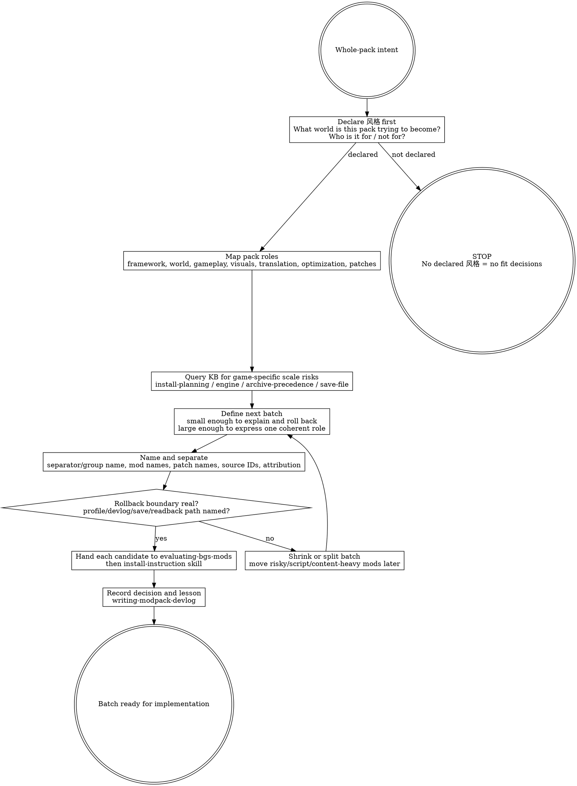

# Curating BGS Modpack (judgment skill)

A BGS modpack is not a shopping cart of impressive files. It is a declared world-style, built in recoverable increments, with enough naming, attribution, and rollback discipline that future-you can still explain what every layer is doing. Stability is the floor. 风格 is the soul. The curator is co-authoring a systemic world, not proving they can install more mods than a Vault-Tec procurement clerk can misfile requisitions.

## The Iron Law

```text
+------------------------------------------------------------------------------------------------+
| Declare the pack's 风格 first, then add mods in named, reversible batches; if you cannot say     |
| what role a batch plays or how to roll it back, you are stockpiling files, not curating a pack. |
+------------------------------------------------------------------------------------------------+
```

## Route gate (one primary skill per intent)

Use this skill when the question is **how to build or reshape the whole pack**: declared style, batch sizing, rollback boundaries, separators, naming convention, attribution, and devlog discipline.

Do **not** use this skill as the primary skill for adjacent intents:

| User intent | Primary skill |
|---|---|
| "Should this mod be included?" / judge quality, risk, and pack fit | `evaluating-bgs-mods` |
| "How do I install this mod correctly?" / read author instructions / choose files or FOMOD options | `interpreting-mod-author-instructions` |
| Record a pack decision, batch boundary, or lesson learned | `writing-modpack-devlog` |
| Enable/disable/sort `plugins.txt` or `loadorder.txt` | `writing-bgs-load-order` |
| Inspect actual conflicts, winning overrides, or whether reorder-vs-patch is safe | `xedit-conflict-audit` |

Terminal handoff: after this skill defines the style and next batch boundary, hand each candidate mod to `evaluating-bgs-mods`. After a batch decision is made, hand the decision to `writing-modpack-devlog`. Inclusion says "belongs in the next plan"; it does not mean "install loose files however you feel like it."

## When to use / When NOT

Use when:

- The user asks to build a modpack, plan the pack, or decide the next batch strategy.
- The pack lacks a declared 风格 and per-mod evaluation has no axis.
- A batch needs a rollback point, separator name, naming convention, or attribution policy.
- The mod list is growing and future debugging would depend on memory rather than structure.
- The user is tempted to call the pack done because it boots or seems stable.
- The pack needs a release/devlog boundary: what changed, what was learned, what future batches must avoid.

Do not use when:

- The only question is whether one mod should be included; use `evaluating-bgs-mods`.
- The user has already chosen the mod and needs install instructions; use `interpreting-mod-author-instructions`.
- The question is actual plugin order, master ordering, ESL flagging, or xEdit record state.
- You are about to write FO4/Skyrim/Starfield-specific facts into this skill. Query KB; do not fossilize game lore here.
- You are trying to replace judgment with a checklist of "N mods per batch". BB84's framework is anti-checklist: situational thought over ritual.

## Process Flow



## KB query discipline

This skill teaches the whole-pack judgment posture. It does **not** inline current game-specific operational facts. Query KB before turning scale risk into a batch decision.

Use these query shapes as the default:

```text
bgs_kb_query({
  query: "pack curation incremental batching rollback boundaries",
  domains: ["install-planning", "save-file"],
  games: ["<current game>"]
})

bgs_kb_query({
  query: "<current game> modpack scale risk scripts archives animation precombine LOD",
  domains: ["install-planning", "engine", "archive-precedence", "debugging"],
  games: ["<current game>"]
})

bgs_kb_query({
  query: "load order grouping templates separators modlist naming",
  domains: ["load-order", "install-planning"],
  games: ["<current game>"]
})
```

[STOP] If you are about to write "FO4 BA2 limit is X", "Skyrim animation stacks should use Y", or "Starfield currently needs Z" into this skill, STOP. Put that in a KB record or query an existing KB record. This skill may say "query game-specific scale risks"; it must not become a stale game-fact scrapbook.

## Checklist

1. State the pack 风格 in one or two sentences before evaluating new mods.
2. State who the pack is for and who will probably dislike it. A real style has exclusion power.
3. Split the pack into role lanes: framework, world/content, mechanics, visuals, translation, optimization, compatibility patches, and testing/proof.
4. Define the next batch by one coherent role, not by "everything I felt like adding today."
5. Keep the batch small enough that you can disable/revert it as a unit during diagnosis.
6. Treat script-heavy, quest/content-heavy, animation/behavior, archive-heavy, and engine-touching batches as higher-risk; query KB before sizing them.
7. Create a separator/group name that states the batch's role, not a vague date or mood.
8. Rename mods, patches, archives, and local folders so parent/patch relationships remain obvious two months later.
9. Preserve source attribution: author, original page/source, translator, paid dependency status, and any local edits.
10. Record the batch decision in `writing-modpack-devlog`: why this batch exists, rollback boundary, known risks, and what must be tested.
11. Hand each candidate mod to `evaluating-bgs-mods`; whole-pack style does not replace per-mod fit judgment.
12. Do not call the pack done because it boots. Stability is the floor; the pack must still express its declared 风格.

## Red Flags (STOP)

| Thought | Reality |
|---|---|
| "稳定 = 整合包做完了." | Stability is only the entry threshold. The pack's declared 风格 is the thing users remember. |
| "We'll define the style after installing enough mods." | Without 风格, every per-mod fit verdict is floating in empty air. |
| "This batch is big, but each mod is good." | Good individual mods can drown the pack when the batch has no single role or rollback boundary. |
| "I can always disable the batch later." | Script-heavy and save-touching mods may not disable cleanly. Rollback has to be designed before risk enters the save. |
| "The separator can just say Misc." | Misc is where future diagnosis goes to die. Name the role. |
| "I know what this patch belongs to." | You know today. Future-you staring at hundreds of mods does not. Name parent and purpose now. |
| "I'll patch everything in xEdit after the list is complete." | Theoretically possible is not operationally sane at whole-pack scale. Reduce repair debt before it becomes a vault-wide containment breach. |
| "The pack can claim no crashes / perfect FPS." | BB84's own devlog walked back that overconfidence after real play coverage found missed problems. |

## Rationalizations

| Excuse | Reality |
|---|---|
| "Naming and attribution are paperwork." | They are diagnostic infrastructure and author respect. A pack that cannot explain its layers cannot maintain them. |
| "More content makes the pack richer." | More content makes the pack louder. Richness comes from reinforcing the declared world style. |
| "I can use one giant batch because I have a mod manager." | A mod manager can toggle files; it cannot retroactively create a clean conceptual rollback boundary. |
| "If it breaks, binary search will find it." | Binary search only helps when the search units are coherent and reversible. Script/save-state risk breaks the assumption. |
| "The pack is mine, so I can absorb authorship into my brand." | The pack is co-authorship. Credit mod authors, translators, and paid dependencies explicitly. |
| "Perfection before release is safer." | Perfectionism can turn into 烂尾. Ship only when honest, but do not confuse infinite polishing with responsibility. |
| "Game-specific rules are common knowledge; I'll put them here." | Common knowledge ages. Game facts belong in KB so they can be versioned, filtered, and updated per game. |
| "A checklist can replace the style call." | BB84's posture is anti-checklist: use structure to force thought, not to avoid it. |

## Recommended Approach: Senior Curator's Lens

> This section reflects an experienced curator's perspective, distilled from BB84's
> BGS modpack curation work. It is RECOMMENDED guidance, **not enforced rule**.
> If the user has explicit alternative intent (different style, different priority,
> different scale), the agent SHOULD adapt rather than push these defaults. The
> objective rules in this skill body still apply regardless.

When the user does not have an overriding style preference, the recommended
curation approach is:

1. **Declare 风格 before adding any mod.** Style anchors what fits and what
   doesn't. Vagueness here costs more than vagueness anywhere else.
2. **Build incrementally with rollback points.** Each batch should have a save
   commit before it starts. The "deprecate not delete" discipline (KB record
   `pack-curation.deprecate-not-delete-on-upgrade`) is your insurance.
3. **Treat invisible compatibility work as the main job, not as polish.** BB84
   notes most of his time goes to record-conflict patches, LL coherence, item
   classification, sorting customization, localization integration — not to
   choosing mods. Plan accordingly.
4. **The world should make sense.** When a mod doesn't fit the curator's
   declared world, exclude it even if it's individually excellent.
5. **Ship over polish.** Avoid perfectionism that ends in abandonment. BB84
   2.0 video reference: "If chasing absolute perfection, the pack ends up
   abandoned."
6. **Localization is curation infrastructure, not polish.** In non-English
   locales (KB record `pack-curation.localization-layer-discipline`).

See KB record `mod-evaluation.bb84-curator-perspective-reference` for the full
curator essay.

## See also

- `evaluating-bgs-mods` — downstream per-mod fit gate. This skill declares the pack axis; that skill decides whether a candidate reinforces it.
- `interpreting-mod-author-instructions` — downstream install-instruction reading after a mod has passed the include gate.
- `writing-modpack-devlog` — terminal handoff for recording style declarations, batch boundaries, rollback points, and lessons learned.
- `writing-bgs-load-order` — plugin activation and load-order mechanics after the batch exists.
- `xedit-conflict-audit` — actual record-level conflict readback; do not infer conflict safety from curation notes.
- `bgs_kb_query` — query `install-planning`, `engine`, `archive-precedence`, `save-file`, and `load-order` for game-specific scale and tooling facts.
