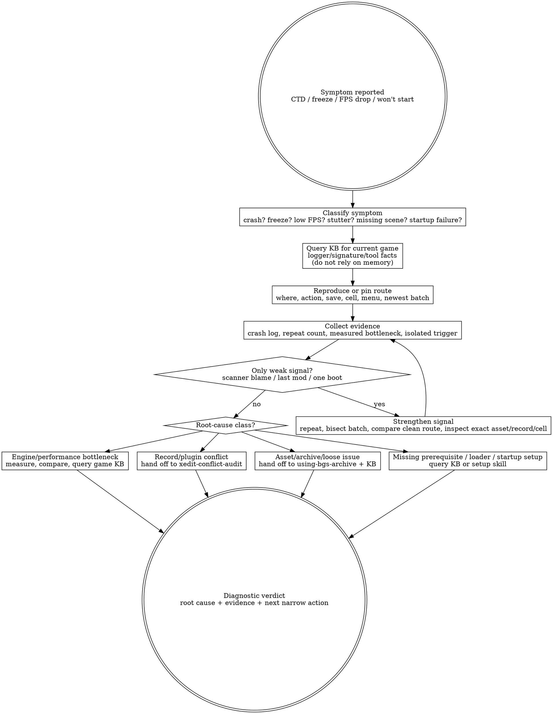

# Diagnosing BGS Problems (judgment skill)

Crashes and FPS collapses are not solved by ritual. A diagnostic pass starts with the symptom the player can reproduce, turns it into evidence, and only then chooses the tool or fix. Scanner output, last-installed-mod panic, and generic optimization lists are inputs to investigate, not verdicts to obey.

## The Iron Law

```text
+----------------------------------------------------------------------------------------------+
| Diagnose the symptom before prescribing the cure: reproduce it, collect evidence, isolate the |
| trigger, then assign root cause. A scanner's mod name is a clue, never the diagnosis.          |
+----------------------------------------------------------------------------------------------+
```

## Route gate (one primary skill per intent)

Use this skill when the primary question is: **"It crashed / FPS tanked / froze / won't start — what is the diagnostic ladder?"**

Do **not** use this skill as the primary skill for adjacent intents:

| User intent | Primary skill |
|---|---|
| "I installed a batch; how do I proactively verify it before playing?" | `testing-bgs-modpack` |
| "Which record wins / why is this override wrong / should I patch or reorder?" | `xedit-conflict-audit` |
| "Is this archive/loose asset conflict causing the problem?" | `using-bgs-archive`, then KB for game-specific asset/precombine facts |
| "Should this mod be in the pack at all?" | `evaluating-bgs-mods` |

Terminal handoff: once the ladder identifies the root-cause class, stop diagnosing and hand off to the narrow tool skill: `xedit-conflict-audit` for record-level evidence, `using-bgs-archive` for asset/archive evidence, `writing-bgs-load-order` for plugin enablement/order, or the relevant per-game KB record for crash-log signatures and console-tool routes.

## When to use / When NOT

Use when:

- The user says CTD, crash log, freeze, won't start, FPS drop, stuttering, performance, 崩溃, 掉帧, or 卡顿.
- A scanner or crash log named something and the user wants to know whether to remove it.
- A specific place/action/save route reliably crashes or tanks FPS.
- The game boots but the same area, menu, combat event, save load, or scene still fails.
- The question is reactive triage after a symptom appeared.

Do not use when:

- The user is doing planned post-install smoke/semantic verification before symptoms appear; use `testing-bgs-modpack`.
- The user asks for a broad conflict survey rather than a symptom-first failure ladder.
- The user wants a generic optimization shopping list without a reproducible problem.
- You are about to inline game-specific logger names, crash signatures, console commands, or toolchain facts. Query KB instead.
- You are tempted to treat the latest installed mod, the loudest scanner line, or a single successful boot as proof.

## Process Flow



## KB query discipline

This skill teaches the diagnostic posture. It does **not** carry game-specific crash signatures, logger names, console-tool commands, or current community tooling in the body.

Always query the KB before assigning meaning to crash-log or performance evidence:

```text
bgs_kb_query({
  query: "<game> crash log scanner attribution triage",
  domains: ["debugging"],
  games: ["<current game>"]
})

bgs_kb_query({
  query: "<symptom> diagnostic ladder performance crash freeze stutter",
  domains: ["debugging", "engine", "archive-precedence", "load-order"],
  games: ["<current game>"]
})
```

If the KB has no record for the current game's logger or signature, say so as `[GAP]`, then proceed only with game-agnostic evidence: reproducibility, recent-change window, isolation/bisect, and readback from the appropriate tool surface.

[STOP] If you are about to write a specific crash logger name, signature phrase, or console command into this skill body, STOP. That belongs in a KB record. This skill may instruct the agent to query for those facts; it must not fossilize them.

## Checklist

1. Name the exact symptom in user language: crash, freeze, FPS drop, stutter, won't start, missing scene, or UI/loader failure.
2. Ask for or infer the reproducible route: where, what action, which save, which menu/load/cell, and whether it happens every time.
3. Query KB for the current game's crash-log, performance, and tooling facts before interpreting evidence.
4. Separate hard evidence from weak leads: logs, repeatable triggers, measured bottlenecks, exact asset/record/cell readback vs scanner blame, last-installed-mod bias, and one-off boots.
5. If the signal is weak, strengthen it before prescribing: repeat, isolate the trigger, bisect the recent batch, or inspect the specific record/asset route.
6. For crashes/freezes, preserve the crash log or absence-of-log fact and group crashes by action/module/signature, not by a single scary line.
7. For FPS/stutter, measure the bottleneck route if the current game has a known measurement path in KB; do not assume ordinary graphics tradeoffs solve a CPU/render-command bottleneck.
8. For "won't start", distinguish loader/runtime/prerequisite failure from plugin/content failure before disabling mods.
9. For archive/loose asset suspicion, route to `using-bgs-archive` and query KB for asset precedence or precompute/precombine-style facts.
10. For record-level suspicion, route to `xedit-conflict-audit` and prove the winner/override state instead of changing order by vibes.
11. State the verdict as: symptom, reproduced signal, evidence, root-cause class, next narrow action, and remaining uncertainty.
12. If no root cause is proven, say `NOT DIAGNOSED YET` and name the missing evidence; do not downgrade uncertainty into a confident fix.

## Red Flags (STOP)

| Thought | Reality |
|---|---|
| "The scanner blamed mod X, so remove X." | Scanner attribution is heuristic. Treat it as a lead until the route, log pattern, or readback proves it. |
| "It booted once, so fixed." | Boot success does not prove the original crash/FPS route. Re-run the symptom route. |
| "The last installed mod caused it." | The last mod is context, not root cause. Load order, stale data, assets, and older conflicts can surface only after a new batch. |
| "FPS is low; lower graphics settings first." | BGS engines can be CPU/render-command-bound. Query KB and measure the actual bottleneck before tuning the wrong side. |
| "No crash log means no diagnosis." | Absence of a log is itself evidence. It may point to startup/loader/native-runtime failure; query KB and isolate. |
| "I can fix this with a generic optimization list." | Lists are prescriptions. Diagnosis starts from the symptom and evidence, then picks the narrow fix. |
| "The user wants speed, so skip the route." | BB84's posture is patience. Skipping the route is how the same failure returns under a different name. |

## Rationalizations

| Excuse | Reality |
|---|---|
| "Crash-log tools exist so I don't have to think." | Logs reduce search space; they do not decide causality for you. |
| "Bisecting is slow; I can guess from experience." | Guessing burns more time when the first confident prescription is wrong. Bisect only the relevant recent window, but bisect it. |
| "If disabling one mod stops the crash, that mod is bad." | It may be the trigger, a dependency victim, an asset provider, or the first mod exposing a deeper conflict. Prove the class. |
| "Optimization mods are harmless; install them all." | Unnecessary changes add variables. If the symptom is not the bottleneck they address, they muddy the diagnosis. |
| "The tool name is enough context." | Tool names are game-specific facts. Query KB for current meaning, version assumptions, and known limitations. |
| "The player only wants the game working, not a report." | The shortest useful report is still evidence-based: symptom, proof, root-cause class, next action. Anything less is ritual. |

## Recommended Approach: Senior Curator's Lens

> This section reflects an experienced curator's perspective, distilled from BB84's
> BGS modpack curation work. It is RECOMMENDED guidance, **not enforced rule**.
> If the user has a working diagnostic process they prefer, the agent SHOULD
> respect that. The objective rules in this skill body still apply.

Recommended diagnostic mindset:

1. **Crash logs lie. Buffout4 / Trainwreck / .NET SF tell you where the crash
   surfaced, often not where it originated.** Use the stack trace as one signal
   among many, not as ground truth.
2. **Suspect your last change first.** The mod / patch / load-order edit you
   made most recently has highest prior probability of being the cause, even if
   the crash log points elsewhere.
3. **In-game behavioral verification > short smoke test.** Many failures only
   surface after 30+ minutes of real play (script state accumulation, area
   transitions, quest state). BB84 reference: 1.0 → 2.0 transition where
   "stable 60fps no crash" claim was wrong because the curator had not played
   deeply enough.
4. **Silent failure modes are the dangerous class.** LL miscoherence, missing
   item drops, NPC outfit incoherence — these don't crash anything but degrade
   the world. Triage these proactively, not reactively.

See KB record `mod-evaluation.bb84-curator-perspective-reference` for the full
curator essay.

## See also

- `testing-bgs-modpack` — proactive post-install verification before a crash/performance symptom exists.
- `xedit-conflict-audit` — record-level root causes, winning overrides, and conflict severity after diagnosis points at plugin data.
- `using-bgs-archive` — archive/loose-file asset root causes; query KB for game-specific asset/precompute/precombine facts.
- `writing-bgs-load-order` — plugin enablement and load-order file mechanics when diagnosis points at plugin ordering.
- `bgs_kb_query` — required for per-game crash-log toolchains, scanner limitations, console-tool routes, engine signatures, and current community facts.
