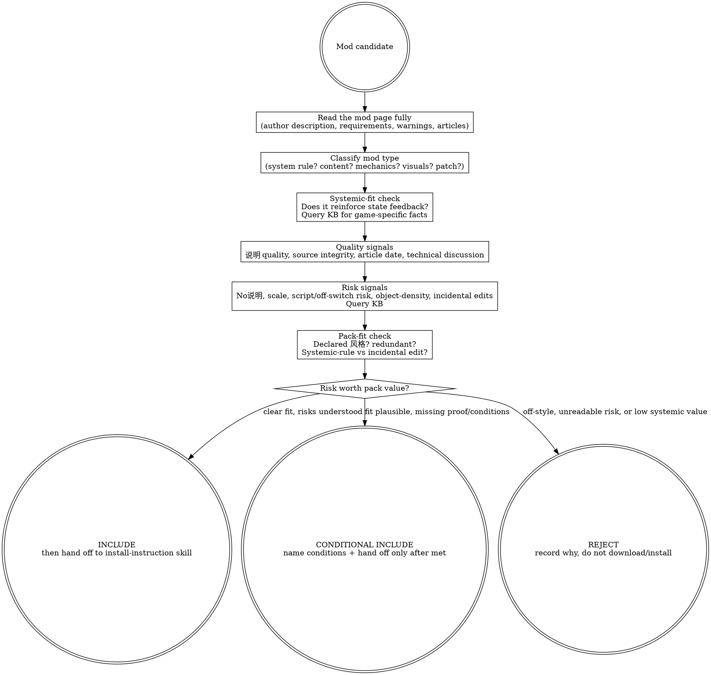

# Evaluating BGS Mods (judgment skill)

BGS games are systems simulators, not stage plays: the pack is trying to build a world where behavior leaves traces, state feeds back, and stories happen because systems collide. A mod is not admitted because it looks impressive in isolation; it is admitted when it reinforces the pack's declared 风格 and the game's systemic feedback loop. Stability is the floor. 风格 is the soul.

## The Iron Law

```text
+-----------------------------------------------------------------------------------------------+
| A mod earns a place in the pack only by fitting the pack's declared 风格 AND reinforcing the    |
| game's systemic feedback -- popularity, screenshots, and download counts are inputs, never fit. |
+-----------------------------------------------------------------------------------------------+
```

## Route gate (one primary skill per intent)

Use this skill when the decision is **whether the mod belongs** in the pack at all: quality, fit, risk, redundancy, and pack-value before download/install.

Do **not** use this skill as the primary skill for adjacent intents:

| User intent | Primary skill |
|---|---|
| "How do I install this?" / read the author's instructions / choose installer options | `interpreting-mod-author-instructions` |
| Edit, enable, disable, sort, or reason about `plugins.txt` / load order | `writing-bgs-load-order` |
| Inspect actual records, winners, overrides, or conflict severity | `xedit-conflict-audit` |

Terminal handoff: after an **INCLUDE** or **CONDITIONAL INCLUDE** verdict, stop judging and hand the mod page to `interpreting-mod-author-instructions`. Inclusion says "worth considering"; it does not mean "install however you feel like it."

## When to use / When NOT

Use when:

- The user asks "should I add this mod", "is this mod worth it", "这个mod值得装吗", or "does this fit my pack".
- A mod looks too good to be true and needs a judgment pass before download.
- Comparing multiple mods that claim to solve the same pack problem.
- Deciding whether a mod's edits are systemic rules or incidental 作者个人想法 fighting the pack.
- The pack already has a declared 风格 and the question is fit against that axis.

Do not use when:

- The user is already committed to install and needs author-instruction interpretation.
- The question is load-order mechanics or plugin enablement.
- The question is actual record-level conflict readback.
- The pack 风格 has not been declared; first declare it via `curating-bgs-modpack` to name the axis being judged.
- You are tempted to replace judgment with a generic popularity/recency checklist. BB84's framework is anti-checklist: situational thought over rules.

## Process Flow



## KB query discipline

This skill teaches the judgment posture. It does **not** inline game-specific operational facts. For every evaluation, query the KB for current game-specific facts and community-standard operational signals before turning risk into a verdict.

Use at least these two query shapes:

```text
bgs_kb_query({
  query: "<mod type> risk signals",
  domains: ["install-planning", "engine"],
  games: ["<current game>"]
})

bgs_kb_query({
  query: "mod-evaluation community operational signals",
  domains: ["install-planning", "engine"],
  games: ["<current game>"]
})
```

[STOP] If you are about to write a game-specific fact into this file, STOP — it belongs in a KB record. This skill may say "query for risk signals"; it must not fossilize one game's current toolchain, engine limits, or crash-diagnosis lore.

## Checklist

1. Read the author's 说明 fully before judging. If it is English, translate it; the curator's job is to understand it anyway.
2. Prefer the original mod page/source when possible because it preserves the author 说明. A rehost with the same files but missing explanation is missing the evaluation surface.
3. If there is no author 说明 at all, reject by default. You cannot evaluate consequences that the author did not describe.
4. Check the publication/update date of recommendation articles and read across different authors/time periods. Community advice ages.
5. Prefer pure technical discussion signals over commercial-pack promotion signals when using community articles or forum posts.
6. Declare the pack 风格 before evaluating fit. A pack without a named style has no axis for "belongs".
7. Judge the mod against that 风格, not against screenshot appeal, novelty, or download gravity.
8. Ask whether the mod reinforces systemic feedback: behavior traceability, state propagation, consistent consequences.
9. Treat most data overlap as normal until there is evidence it causes a real problem; do not confuse overlap with failure.
10. On overlap, prefer the mod imposing a systemic unified rule over an incidental vanilla-record tweak that looks like 作者个人想法.
11. Account for scale: too many mechanics-changing or story/content-heavy additions can drown the pack's own style even if each mod is individually good.
12. Name the mod's role in the pack. If future-you cannot tell why it exists, the pack will forget its own architecture.

## Red Flags (STOP)

| Thought | Reality |
|---|---|
| "No description, but lots of downloads, fine." | No 说明 means you cannot evaluate risk. Default reject. |
| "It was recommended in an old list, so it is trusted." | Community ecosystems change; yesterday's essential can become today's broken assumption. |
| "The rehost is enough; the files are the same." | Same binary without author 说明 loses the risk-evaluation surface. |
| "The scanner blames mod X, so remove X." | Auto-attribution is heuristic, not diagnosis. Do not yank by ritual. |
| "Stable load order means good pack." | Stability is the floor; declared 风格 is the goal. |
| "More dialogue/cinematic presentation automatically deepens RPG." | BGS's strength is state feedback; performance inflation can pull the pack off-axis. |
| "I have been doing this for two months; I understand the ecosystem now." | That is the documented over-confidence trap. Keep reading and cross-checking. |

## Rationalizations

| Excuse | Reality |
|---|---|
| "The 说明 is long English; skimming is enough." | Read it fully, even through machine translation. No read, no verdict. |
| "Install first; if it breaks, disable it." | Some mods do not cleanly disable. Uninstall is not rollback. |
| "Ordering does not matter; xEdit can patch anything." | True in principle can still be impractical at real pack scale. Prioritize judgment before creating repair debt. |
| "Patience is for beginners; I can go fast." | Patience avoids most avoidable failures. Speed without reading is not expertise. |
| "We can define style later; first make it stable." | Without declared 风格, you have no axis to decide fit. |
| "If it boots, the integration is correct." | Correctness is systemic: behavior must propagate coherently, not merely load. |
| "A few more decorative/object mods are harmless." | Visual clutter and placed-object density are still systemic risk; query KB before dismissing it. |

## Recommended Approach: Senior Curator's Lens

> This section reflects an experienced curator's perspective, distilled from BB84's
> BGS modpack curation work. It is RECOMMENDED guidance, **not enforced rule**.
> If the user has explicit alternative intent (e.g. "I want a tactical FO4 build"
> or "I'm doing pure visual showcase"), the agent SHOULD adapt rather than push
> these defaults. The objective rules in this skill body still apply regardless.

When the user does not have a strong overriding style preference, the recommended
evaluation lens applies these subjective biases:

1. **Lore-friendly increment over revolutionary overhaul.** Mods that extend the
   game's existing world language earn priority over mods that replace it.
2. **Stability for long sessions over short-term visual wow.** A mod that survives
   100-hour playthroughs without baking save state is more valuable than a mod
   with stunning screenshots and unknown long-term behavior.
3. **Honest description = real green flag.** Author describing features + caveats
   + known incompatibilities + version-specific notes earns trust regardless of
   surface polish. Hype language ("plug and play", "完美兼容") earns suspicion
   regardless of download count.
4. **Author maintenance pattern over single-mod metrics.** A responsive author
   with clear changelog earns trust across all their mods.
5. **System-respecting over content-replacing.** Mods that participate in the
   FormID + Papyrus + Quest state graph earn priority over mods that ignore it
   and bolt on scripted events.

See KB record `mod-evaluation.bb84-curator-perspective-reference` for the full
curator essay including the underlying Bethesda-design philosophy these biases
derive from.

## See also

- `interpreting-mod-author-instructions` — terminal handoff after an INCLUDE/CONDITIONAL INCLUDE verdict; this skill decides fit, that skill reads how to install.
- `curating-bgs-modpack` — defines the pack 风格 this skill judges against.
- `bgs_kb_query` — query domains `install-planning` and `engine`, including the community-operational-signals record, for game-specific and current operational risk facts.
