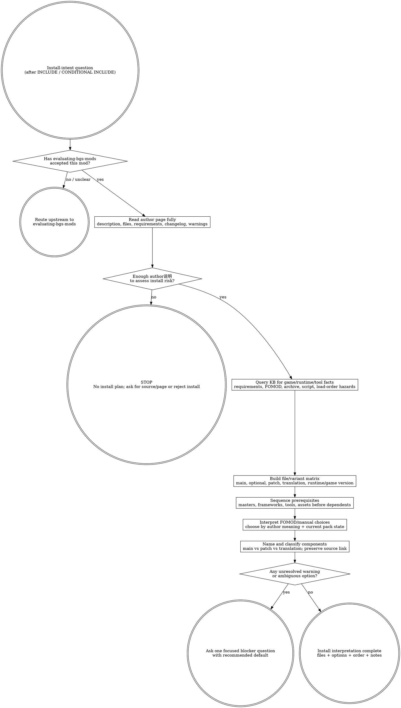

# Interpreting Mod Author Instructions (judgment skill)

This skill answers one question only: **How do I correctly download/install per the mod author's instructions?** It starts after `evaluating-bgs-mods` has said INCLUDE or CONDITIONAL INCLUDE. The job is not to decide whether the mod is good; the job is to read the author's说明 until the install path, file choice, prerequisite order, option logic, and consequences are actually understood.

## The Iron Law

```text
+-----------------------------------------------------------------------------------------------+
| No author说明, no install plan: understand the author's requirements, variants, and consequences |
| before touching downloads, FOMOD options, files, profiles, or load-order state.                 |
+-----------------------------------------------------------------------------------------------+
```

## Route gate (one primary skill per intent)

Use this skill when the user is asking **how to install a mod that is already worth considering**: which file to download, which variant to choose, how to read a FOMOD, what prerequisites must be present first, how to name/track the installed components, or what the author means by a warning.

Do **not** use this skill as the primary skill for adjacent intents:

| User intent | Primary skill |
|---|---|
| "Should I add this mod?" / quality, risk, fit, pack-value before install | `evaluating-bgs-mods` |
| Edit, enable, disable, sort, or reason about `plugins.txt` / load order | `writing-bgs-load-order` |
| Inspect actual records, winners, overrides, or conflict severity | `xedit-conflict-audit` |
| Extract, inspect, or repack BA2/BSA archives | `using-bgs-archive` |
| Compile/decompile Papyrus PSC/PEX | `using-bgs-papyrus` |
| Translate plugin text or emit SST/XML dictionaries | `using-bgs-translator` |

Upstream gate: `evaluating-bgs-mods`. Inclusion says "worth considering"; it does not grant permission to install by habit.

Terminal handoff target: **NONE**. This skill ends with an install interpretation: selected file(s), selected option(s), prerequisite order, naming/tracking notes, and open gaps. If follow-on work requires archive/Papyrus/translator/tool operations, route to the existing tool skill for that operation.

## When to use / When NOT

Use when:

- The user asks "how do I install this", "which file do I download", "which variant", "FOMOD choices", "author说明", "按作者说明安装", or "what do these install instructions mean".
- A mod page has multiple main files, optional files, compatibility patches, translations, or version/runtime variants.
- A FOMOD or installer offers choices whose consequences need interpretation against the pack and current environment.
- The author lists prerequisites, warnings, uninstall notes, tool steps, or compatibility notes that must be converted into an install plan.
- A downloaded archive or installed mod has vague naming and needs traceable local naming before it becomes future debugging debt.

Do not use when:

- The real question is whether the mod belongs in the pack at all. Use `evaluating-bgs-mods` first.
- The user is asking to actually perform the installation through MO2 tooling. Use the MO2/control-plane surface after this interpretation, not this skill as a mutator.
- The question is load order, plugin activation, or xEdit patching after install.
- The question is a game-specific engine fact. Query KB instead of fossilizing it here.
- You are tempted to substitute a generic "install normally" checklist for the author's actual instructions.

## Process Flow



## KB query discipline

This skill carries the cross-game interpretation framework. It does **not** inline game-specific facts about a specific runtime branch, script extender, archive format, FOMOD convention, or plugin limit. Query the KB for the current game and mod type before turning an instruction into an install decision.

Use at least these query shapes when relevant:

```text
bgs_kb_query({
  query: "author instruction install signals FOMOD variants requirements",
  domains: ["install-planning"],
  games: ["<current game>"]
})

bgs_kb_query({
  query: "<mod type> install requirements compatibility patches prerequisites",
  domains: ["install-planning", "load-order", "archive-precedence", "papyrus"],
  games: ["<current game>"]
})
```

[STOP] If you are about to write a game-specific install rule into this file, STOP — it belongs in a KB record. This skill may say "query for the current runtime and requirement facts"; it must not fossilize one game's current toolchain or one mod page's FOMOD choices.

## Checklist

1. Confirm the upstream gate: the mod has already passed `evaluating-bgs-mods` as INCLUDE or CONDITIONAL INCLUDE. If not, route upstream.
2. Read the original author page/source first when available. Rehosted files without说明 are not enough.
3. Read the author说明 fully, including requirements, file descriptions, compatibility notes, changelog warnings, uninstall notes, and installer option text.
4. If the说明 is in another language, translate it. Skipping because it is long or English is not acceptable.
5. If no author说明 exists, stop by default. Ask for the original page/source or decline to form an install plan.
6. Query KB for game-specific operational facts before applying a variant, runtime, archive, script, or plugin assumption.
7. Build a file matrix: main file(s), optional file(s), patches, translations, asset packs, old files, update-only files, and mutually exclusive variants.
8. Choose variants from author meaning plus current pack state, not from filename vibes, popularity, or whatever the installer preselected.
9. Sequence prerequisites before dependents: required masters/frameworks/assets/tools first, then the mod, then optional patches/translations as instructed.
10. For FOMOD/manual choices, record what was selected and why in terms the future maintainer can audit.
11. Rename and classify installed components so ownership is obvious: main file, compatibility patch, translation, or tool/output component.
12. Preserve a path back to the author page/source so future debugging can re-read the instructions.
13. If an instruction requires an adjacent tool operation, hand off to the exact tool skill for that operation after this interpretation.
14. If one ambiguity remains, ask one focused blocker question with a recommended default; do not invent an install path.

## Red Flags (STOP)

| Thought | Reality |
|---|---|
| "No description probably means normal install." | No说明 means risk cannot be assessed. Stop or find the original source. |
| "The file mirror has the archive, so the page doesn't matter." | The page is the install surface; files alone lose requirements and consequences. |
| "The FOMOD default is probably right." | Defaults are not pack-aware. Read option text and author notes. |
| "I can choose the variant from the filename." | Variant names are clues, not instructions. Confirm game/runtime/pack requirements. |
| "The instructions are English; I'll skim." | Translate and read. Language friction is not a waiver. |
| "The mod manager will sort it out." | Managers execute operations; they do not understand author intent. |
| "Patch is a good enough local name." | A patch with no owner is future debugging debt. |
| "Disable is rollback." | Some mods, especially scripted ones, do not cleanly leave an active save. |
| "This is install work, so KB is unnecessary." | Game/runtime facts live in KB; the skill is deliberately game-agnostic. |

## Rationalizations

| Excuse | Reality |
|---|---|
| "I already decided the mod is good, so install is routine." | Inclusion answers worth; install still has file, option, prerequisite, and consequence decisions. |
| "I'll download every optional file and sort it later." | Optional files often encode mutually exclusive variants or patch stacks. Build the matrix first. |
| "I'll install first and read if something breaks." | Reading is the install step that prevents preventable breakage. |
| "I remember what this patch is for." | Future-you forgets. Name and classify now. |
| "The author says use a tool; I'll improvise the tool step." | Interpret the required operation, then route to the tool skill that owns it. |
| "The comments say another variant works better." | Comments are clues; author instructions and current-game KB facts carry the plan. |
| "This is just a translation/asset/optional file." | Optional components still change ownership, conflict surfaces, and uninstall behavior. |
| "A generic install checklist is faster." | BB84's point is not checklist compliance; it is active reading and consequence awareness. |

## Recommended Approach: Senior Curator's Lens

> This section reflects an experienced curator's perspective, distilled from BB84's
> BGS modpack curation work. It is RECOMMENDED guidance, **not enforced rule**.
> If the user has explicit alternative intent (different install policy, different
> risk tolerance, or pack-specific convention), the agent SHOULD adapt rather than
> push these defaults. The objective rules in this skill body still apply.

Recommended author-instruction lens:

1. **Honest detailed instructions = green flag.** Author who lists prerequisites,
   conflicts, version compatibility, FOMOD option meanings, and known issues
   earns trust. Curt or evasive instructions earn skepticism.
2. **Patreon-locked main version or essential patches = red flag.** Walls
   critical content behind paywall while expecting community patches; structurally
   breaks the community patch ecosystem.

See KB record `mod-evaluation.author-signals` (KB) and
`mod-evaluation.bb84-curator-perspective-reference` for full curator essay.

## Investigating Nexus mods marked not_published / hidden / removed

When the agent or a MO2 refresh reports a mod as `status=not_published`, `status=hidden`, or `status=removed`, do NOT default to "disable + find replacement". The priority investigation order:

1. **Author republish check** (highest yield) — fetch original mod's `author` + `user.member_id`; search Nexus for the same mod name; visit author's profile; confirm candidate new modid has the same `user.member_id`. Modders sometimes restart with a fresh modid instead of updating in place. The "dead" listing is just abandoned.
2. **Author continuation off-Nexus** — GitHub source, Patreon, Discord.
3. **Third-party maintenance fork** — Nexus search for `"<mod name>" continued / updated / patched`. Beware permission ambiguity.
4. **Alternative implementation** — different author, possibly different approach (e.g., perk-based instead of SFSE-plugin-based).

After finding the answer:

- If author republished: update MO2 mod folder's `meta.ini` `modid=` and `installationFile=` to the new listing. Otherwise Option B refresh forever reports `not_published`.
- If switched to alternative: backup old mod folder, disable in modlist.txt with `[弃用]` separator convention.
- ALWAYS record the investigation in `docs/dev-log.md` so half-year-later "why did we switch X to Y?" is answerable.

Cross-link: KB record `mod-evaluation.investigating-pulled-mods.v1` for the full pattern with example cases.

## Comprehensive file enumeration and cross-reference (rigor discipline)

Authors organize files into categories to communicate intent. Reading only the
Main file's description is the most common shallow-investigation pattern, and
it skips the half of the curator's work that actually matters.

For every mod install or update, enumerate the FULL file listing under all
visible Nexus file categories:

- **Main** — current canonical builds. Often more than one. The variants encode
  game-runtime support (SFSE vs GamePass ASI), feature flags (with/without
  module X), color/size choices, fork lineages, and required-vs-optional
  prerequisites. Surface every variant to the curator with the differentiator
  named.
- **Optional** — compatibility patches and add-ons. Each carries a description
  identifying which other mod it patches and what game systems it touches.
  Walk this list one file at a time.
- **Update** — incremental patches against an earlier Main file. Usually
  require the Main file as prerequisite; do not install Update files standalone
  without verifying.
- **Archived / Old** — superseded versions. Do not install from this category
  by default; it exists for historical fallback, not as the recommended target.

For each Optional file the author lists:

1. Read the file description fully — what mod does it patch? What feature does
   it enable? Are there prerequisites listed?
2. Cross-reference the patched-mod claim against the curator's installed
   environment:
   - `<MO2Root>/profiles/<profile>/modlist.txt` — enabled (`+`) AND disabled
     (`-`) mods both count; the curator may re-enable a disabled CC mod and
     then need the patch installed.
   - `<MO2Root>/profiles/<profile>/plugins.txt` — active (`*`) plugins.
   - The actual `<MO2Root>/mods/<modname>/` folder list — sometimes a mod is
     present but not yet active.
3. Classify the patch as `install` (curator has the patched mod), `skip`
   (curator does not have the patched mod and is unlikely to install it), or
   `surface-to-curator` (ambiguous case where curator should decide).

When variants exist within a single category (e.g. Main has a 1k texture build
and a 2k texture build), do not auto-pick. Surface the variant set to the
curator with the differentiator named, the trade-off summarized, and the
recommended default highlighted. The curator decides.

Concrete illustrations:

- Stroud Premium Edition (Nexus #12330) main 2.5.3 file ships with four
  Optional files: `AddOn - SPE x TerranArmada`, `Patch SPE x Useful MessHalls`,
  `Patch SPE x Useful Infirmaries`, `AddOn - SPE x Deimog`. For a curator who
  has Terran Armada DLC and Useful Infirmaries CC mod, the first two of those
  four are install-relevant. The other two are skips because the curator does
  not have MessHalls or Deimog. Recommending all four wastes the curator's
  time; recommending only the main without enumerating the four wastes
  compatibility benefit.
- Starfield Shader Injector (Nexus #5562) main category lists two
  simultaneously-uploaded files: `SSI-1_10 (GamePassASI-1_16_236)` and
  `SSI-1_10 (SFSE-1_16_236)`. Same version, different runtime. Curator-pick on
  Steam vs Game Pass; never auto-install both.

The corresponding KB record `install-planning.audit-workflow-rigor.v1` defines
this as one of six audit-grade rigor disciplines.

## See also

- `evaluating-bgs-mods` — upstream judgment: decides whether the mod belongs in the pack before this skill interprets installation.
- `writing-bgs-load-order` — plugin enablement, `plugins.txt`, load-order, and sorting mechanics after install planning.
- `xedit-conflict-audit` — record-level conflict and winning-override inspection.
- `using-bgs-archive` — BA2/BSA inspection, extraction, and overlay-safe archive work when the author's instructions require asset operations.
- `using-bgs-papyrus` — PSC/PEX compile/decompile when author instructions require script work.
- `using-bgs-translator` — plugin text translation and SST/XML export when author instructions require localization work.
- `bgs_kb_query` — required source for game-specific install facts, runtime hazards, and operational conventions.
