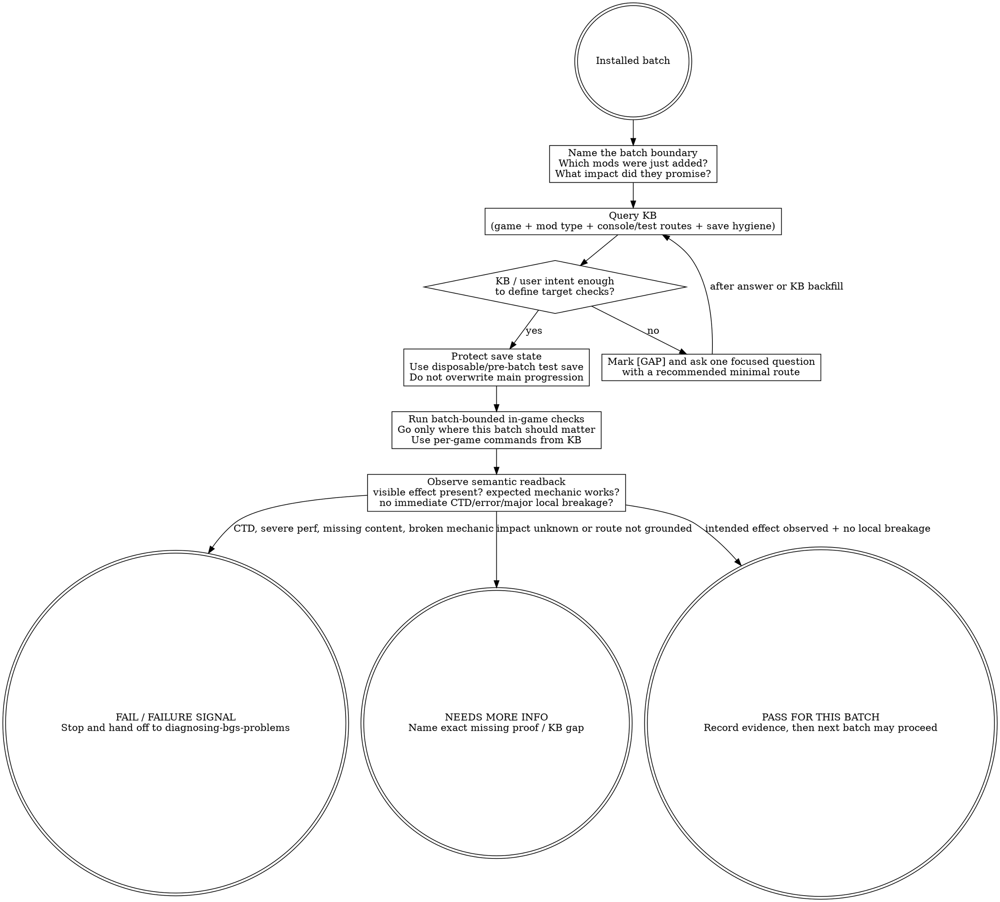

# Testing BGS Modpack Batches (judgment skill)

This skill answers one question: **"It's installed -- how do I PROACTIVELY verify this batch before declaring the batch good?"**

BB84's source material is thin here. That is part of the skill's operating doctrine: do not manufacture a giant universal QA checklist. Test the batch's intended in-game impact, preserve save hygiene, query KB for game-specific commands/routes, and mark `[GAP — needs user input]` when the substrate is silent.

## The Iron Law

```text
+------------------------------------------------------------------------------------------------+
| A batch is not accepted because the game reached the main menu. It is accepted only after the   |
| batch's intended in-game effect is observed in its target context, with no immediate local       |
| breakage, and without baking unverified state into the user's main save.                         |
+------------------------------------------------------------------------------------------------+
```

## Route gate (one primary skill per intent)

Use this skill when the user has already installed a batch and wants a **proactive post-install verification pass**: what to inspect, what commands/routes to use, what counts as enough evidence to move to the next batch.

Do **not** use this skill as the primary skill for adjacent intents:

| User intent | Primary skill |
|---|---|
| "It crashed", "FPS tanked", missing meshes, broken quests, bad logs, or any failure already observed | `diagnosing-bgs-problems` |
| "Should this mod go in the pack?" before install | `evaluating-bgs-mods` |
| Define pack style, batch size, rollback boundaries, naming/separator discipline | `curating-bgs-modpack` |
| Enable/disable/reorder plugins or edit `plugins.txt` | `writing-bgs-load-order` |
| Inspect records, conflicts, or override winners | `xedit-conflict-audit` / `xedit-automation` |

Terminal handoff: if proactive testing finds a failure signal, stop calling it "testing" and hand off to `diagnosing-bgs-problems`. A failed verification pass is not an invitation to improvise a fix inside this skill.

## When to use / When NOT

Use when:

- A small batch was installed and the user asks "what should I test before moving on?"
- The user asks "is it stable?", "post-install check", "验证安装", or "测试整合包".
- You need to verify visible new content, expected local mechanics, or immediate CTD/performance risk in the batch's target context.
- You need a save-hygiene reminder before the user commits playthrough state.
- You need to query KB for per-game console commands or test routes without fossilizing those facts in the skill.

Do not use when:

- A crash/perf/quest/mesh/script failure already exists. Escalate to `diagnosing-bgs-problems`.
- The question is whether to include the mod at all. Use `evaluating-bgs-mods`.
- The batch boundary is unknown and the user wants to plan the pack architecture. Use `curating-bgs-modpack`.
- You are about to write game-specific console command catalogs into this file. Those belong in KB.
- You are tempted to invent generic QA filler like "verify all systems work". Mark `[GAP — needs user input]` instead.

## Process Flow



## KB query discipline

This skill teaches the testing posture. It does **not** inline game-specific commands, cells, routes, log tools, or benchmark thresholds.

Before recommending a console command or test route, query KB for the current game and the batch's mod-impact type:

```text
bgs_kb_query({
  query: "post-install verification console commands test routes <mod type>",
  domains: ["install-planning", "debugging", "engine"],
  games: ["<current game>"]
})

bgs_kb_query({
  query: "save hygiene script initialization batch testing",
  domains: ["install-planning", "debugging", "engine"],
  games: ["<current game>"]
})
```

[STOP] If KB is silent on a command or route, do not invent one from memory. Mark `[GAP — needs user input]` and ask for the user's preferred test cell / route / save boundary, or recommend the smallest non-saving visual/mechanic check that follows from the mod author's stated impact.

[STOP] Per-game console commands and travel/debug shortcuts are KB facts. They belong in KB records, not in this game-agnostic skill body.

## Checklist

1. Name the batch: list only the mods just installed and the intended impact of each. If the batch boundary is unclear, mark `[GAP — needs user input]` and ask for it.
2. Read / reuse the author-stated impact: what should visibly or mechanically change if the install is correct?
3. Query KB for the current game's test routes, console commands, save-hygiene notes, and mod-type-specific verification signals.
4. If KB lacks routes or commands, mark `[GAP — needs user input]`; do not write a universal route from memory.
5. Protect save state before testing. Use a disposable/pre-batch test save or another user-approved save boundary. `[GAP — needs user input]`: exact safe-save procedure is game/profile-specific and not in the mined corpus.
6. Do **not** save over the user's main progression until the batch has a PASS verdict.
7. Visit the target context where the batch should matter: the cell, worldspace, UI screen, NPC, item, quest stage, mechanic trigger, or performance hotspot named by the batch/KB. `[GAP — needs user input]`: if no target context is known, the batch is not verifiable yet.
8. Look for positive evidence: visible new content present, expected local mechanic works once, expected patch/fix changes the previously relevant local behavior, and no immediate CTD or severe local breakage.
9. Treat silent absence as a failure signal: if the mod is enabled but the expected thing is visibly absent, stop and hand off to diagnosis instead of declaring success.
10. Treat error overlays / missing assets / broken UI / severe local FPS collapse as failure signals. `[GAP — needs user input]`: exact overlay strings and visual markers are per-game/per-mod facts for KB.
11. Do not expand into a whole-pack investigation. If the batch fails, route to `diagnosing-bgs-problems`; if it passes, record "PASS for this batch" and move to the next batch.
12. Record the evidence in plain terms: batch name, game/profile, save boundary, route used, positive observations, failure signals absent/present, remaining `[GAP]` items.

## Red Flags (STOP)

| Thought | Reality |
|---|---|
| "The main menu loaded, so the batch is stable." | Menu load is not the batch's in-game impact. Test where the batch should matter. |
| "MO2 says enabled; no need to enter the game." | Manager enablement is not semantic readback. Some failures only appear in-game or in xEdit. |
| "I'll save normally first so the mod initializes." | Do not bake unverified batch state into the main progression save. Use a save boundary. |
| "No CTD for five minutes means accepted." | No CTD is one support signal. Acceptance also needs the intended effect to appear/work. |
| "Something broke; keep using this checklist until fixed." | A failure signal exits this skill. Hand off to `diagnosing-bgs-problems`. |
| "Console commands are obvious across Bethesda games." | Per-game commands and safe cells belong in KB. Query first; mark `[GAP]` if absent. |
| "The source is thin; fill in normal QA advice." | This judgment layer is anti-checklist. Thin substrate means honest `[GAP]`, not filler. |

## Rationalizations

| Excuse | Reality |
|---|---|
| "Testing the whole pack every time is safer." | Proactive verification is batch-bounded. Whole-pack diagnosis begins after a failure signal. |
| "I can test after a few more batches; this one is small." | Delayed testing destroys the recent-batch boundary that makes failures attributable. |
| "The mod is visual only; no need for a save boundary." | Maybe, but the skill cannot know that without the author's stated impact and KB facts. Mark uncertainty instead of guessing. |
| "If the expected content is absent, maybe it appears later." | Maybe. It is still not verified. Mark NEEDS MORE INFO or hand off to diagnosis. |
| "A generic route through a few popular cells is good enough." | Routes must match the batch's intended impact and current game. Generic tourism is not proof. |
| "The user wants confidence, not gaps." | False confidence is worse than a marked gap. Honest `[GAP]` is the correct deliverable when the corpus is silent. |

## Recommended Approach: Senior Curator's Lens

> This section reflects an experienced curator's perspective, distilled from BB84's
> BGS modpack curation work. It is RECOMMENDED guidance, **not enforced rule**.
> If the user has a working testing process they prefer, the agent SHOULD respect
> that.

Recommended testing rhythm:

1. **Stage-test after each batch, not after each mod.** Single-mod testing has
   infinite time cost (KB record `pack-curation.testing-cost-economics`). Batch
   together additive low-risk mods, then enter a staged-test phase.
2. **Test the silent failure surface, not just the crash surface.** Walk through
   areas known to be touched by recent mods; check NPC outfit logic; check
   inventory drops; sample dialog flow; observe save file size growth pattern.
3. **Commit save before risky batches.** Saves are the rollback substrate.
4. **Long-session discovery is part of the testing rhythm.** Many defects only
   emerge after 10+ hours of real play. Don't claim "stable" from 30 minutes of
   smoke test.

See KB record `mod-evaluation.bb84-curator-perspective-reference` for the full
curator essay.

## See also

- `diagnosing-bgs-problems` — use after any crash, severe FPS drop, missing content, broken mechanic, log error, or failed verification signal.
- `curating-bgs-modpack` — owns batch boundaries, rollback rhythm, pack style, and naming/separator discipline.
- `evaluating-bgs-mods` — decides whether a mod should be included before install.
- `interpreting-mod-author-instructions` — reads author instructions and installer choices before the testable batch exists.
- `writing-bgs-load-order` — plugin enable/disable/order mechanics.
- `xedit-conflict-audit` / `xedit-automation` — record-level readback when a failed verification points to override/conflict semantics.
- `bgs_kb_query` — required source for per-game console commands, safe test cells/routes, save-hygiene specifics, and mod-category verification facts.
