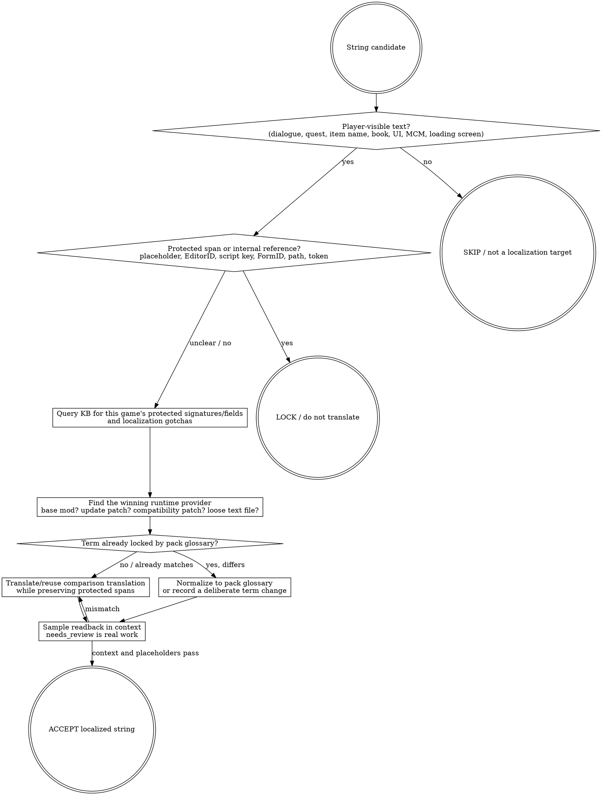

# Using bgs-translator

`bgs-translator` is the agent-driven translation pipeline for Bethesda plugin
text. It reads plugin strings, builds AI translation batches with glossary and
protected-span handling, writes a project memory database, and exports SST/XML
dictionaries for xTranslator or ESP-ESM Translator to finalize.

The browser GUI is the only GUI surface. The agent should prefer `xtl` for work
it can do directly; use the GUI for human review, provider/key setup when the
user wants it, prompt preview, progress monitoring, and manual cleanup.

## Prerequisites — verify before any other command

`xtl` is the CLI entry point. It is PyPI-distributed (`bgs-translator` package)
and is **not** bundled with this plugin; the vendored tree only carries
documentation and helper scripts. On a fresh machine `xtl version` will fail.

**This is a long-tail install task that the agent owns**, not the user. Do not
ask the user to install Python or pipx by hand. Run the readback first; if it
fails, route to the setup skill which performs the install and PATH-fix.

```powershell
# Readback. Run this BEFORE any of the workflow examples below.
xtl version
```

If `xtl version` errors with "command not found" or "not recognized", switch to
`setting-up-bgs-modding-environment` (look at "Step 3A - Install or verify
`xtl`" — it owns `pipx install bgs-translator==0.9.0rc1`, the pipx PATH-warning
flow, and the post-install smoke). After install, return here and proceed.

For an already-installed `xtl` that is broken, stale, or behind a recent
release, switch to `maintaining-modding-environments` ("Translator CLI
maintenance" section).

The KB cache that `xtl` reads from is `~/.bgs-modding-superpowers/kb/packs`,
unified with this plugin's `bgs_kb_*` MCP tools. If `bgs_kb_status` lists a pack
but `xtl batch plan` still produces a single-entry glossary subset, suspect a
stale legacy cache at `%LOCALAPPDATA%/bgs-modding-superpowers/kb` and surface it
to the user instead of accepting the poor glossary silently.

For RAG-quality translation against a game, the user needs the per-game pack
AND the corresponding localization pack (e.g. `bgs-kb-starfield` and
`bgs-l10n-starfield-zhhans` for Starfield Simplified Chinese). Setup skill
handles both. If only one is installed, surface the gap before running real
batches.

Human manuals, read these files and explain them to users who need GUI help:

- Chinese: `tools/bgs-translator/USER-GUIDE.zh-cn.md`
- English: `tools/bgs-translator/USER-GUIDE.en.md`

These files ship inside the materialized plugin tree under
`tools/bgs-translator/` alongside `scripts/restart-web-gui.ps1`; they are
present in a fresh vendor-clone install.

## 本地化判断 / Localization judgment

Localization is not "send every string to a provider." It is the curator's job
to decide which player-visible text should change, which technical spans must
stay exact, and which terms must remain consistent across the whole pack. A
translation tool can produce candidate text; it cannot decide the pack glossary,
the winning string provider, or whether a string is actually safe to edit.

The core mechanic is the runtime string chain: the player sees the value from
the plugin/patch layer that wins at runtime. A base-game translation or an older
mod translation can be overridden by a later mod, update patch, or compatibility
patch. Do not treat missing Chinese as a mysterious tool failure. First identify
the winning string provider, then localize that layer.

Source basis: BB84's FO4 localization 疑难杂症 transcript (`[E8]` in
`.opencode/artifacts/sixiang-build/injection-using-bgs-translator/framework-extraction.md`)
explains the override chain, attribution workflow, patch-localization ordering,
and non-translatable/signature caveats. That extraction also marks current
`[GAP]` items; do not fill those gaps from guesswork.



### Protected-span red flags

Never localize a span just because it appears in an extracted text table. The
safe default is: player-facing prose can be translated; identifiers and engine
references stay exact unless the per-game KB or the tool's schema proves they
are display values.

| Red flag | What to do instead |
|---|---|
| Placeholder, formatter token, alias marker, or bracket tag appears inside the text. | Preserve it byte-for-byte and translate only the surrounding prose. |
| The value looks like an EditorID, script property, config key, JSON key, file path, plugin name, FormID, or hex ID. | Lock it unless KB/tool docs identify it as display text. |
| A record/signature/field type is unfamiliar. | Query KB for the current game before translating; if KB is silent, mark `[GAP]` and review manually. |
| Generated naming-rule or FormID-dependent text is selected for comparison/bulk translation. | Do not bulk-translate. Use manual semantic review or leave locked until KB confirms the safe handling. |
| A translated plugin is being sorted after update/compatibility patches to "win" text. | Do not break the functional patch layer. Localize the patch that actually wins, then load that localized patch after the functional layer. |

### Rationalizations

| Excuse | Reality |
|---|---|
| "There must be a universal localization patch." | There is no final patch that covers every later mod-side string. Find the winning provider. |
| "The base-game Chinese patch is installed, so English text means the translator failed." | A later mod or patch may be overriding the localized base string. Attribute first. |
| "Just translate everything; the validator will catch problems." | Validators catch known placeholders, not every engine reference, naming-rule dependency, or glossary drift. |
| "The old Chinese ESP worked before; put it at the end." | That can invalidate update/compatibility patches, and stale translations may miss new records. Regenerate against the current winning layer. |
| "Different mods can translate the same term differently; players will understand." | A pack needs one glossary. A later competing term is a judgment call, not accidental drift. |

### KB query discipline

This section is game-agnostic. Do not fossilize FO4, Skyrim, or Starfield
protected-string lists in this skill. Before a real batch, query KB for the
current game and mod shape:

```text
bgs_kb_query({
  query: "localization protected strings placeholders EditorID FormID generated names",
  domains: ["install-planning", "plugin-format"],
  games: ["<current game>"]
})

bgs_kb_query({
  query: "translation glossary consistency string lookup override chain",
  domains: ["install-planning", "load-order"],
  games: ["<current game>"]
})
```

If KB is silent for a protected-string category, write `[GAP]` in the plan and
keep the string out of unattended AI translation. Per-game protected-string and
FormID-dependency patterns belong in KB records, not in this skill body.

## What xtl Does Better

Most translator tools focus on editing string tables. `xtl` builds a complete
LLM request for each batch:

1. It extracts only translatable plugin text into project memory.
2. It masks dangerous placeholders such as `{P0}` and `<Alias=...>`.
3. It deduplicates repeated text where safe.
4. It recalls relevant game/mod/player terminology.
5. It adds game context, mod context, signature explanations, style rules, and
   do-not-translate rules to a system prompt.
6. It sends compact JSON-shaped work items to the selected provider.
7. It validates the response before writing translations back to project memory.
8. It exports SST/XML for xTranslator instead of editing the original plugin.

This is why the output can be more context-aware than plain string-table machine
translation: the LLM receives the text plus the mod's purpose, game lore,
record-type meaning, glossary, and placeholder rules in one request.

## Help and Capability Discovery

Never assume a shown command is the only valid shape. Examples below are
templates. Before using an unfamiliar option, check the live CLI:

```powershell
# Show all top-level xtl command groups.
xtl --help

# Show provider commands and accepted provider options.
xtl profile --help
xtl profile add --help
xtl profile edit --help

# Show project import/export options.
xtl project --help
xtl project init --help
xtl project export --help

# Show inspect, planning, run, status, and cancellation options.
xtl inspect --help
xtl batch plan --help
xtl batch run --help
xtl batch status --help
```

Provider `--sdk-kind` is not always `openai-compat`. Check `xtl profile add
--help` for the currently supported values. At the time of this skill, the
code supports `openai`, `anthropic`, `gemini`, and `openai-compat`.

## Operating Rules

- Do not edit `.esp`, `.esm`, or `.esl` directly. `xtl` emits SST/XML only.
- Do not route translator work through xEdit or MO2 unless the user explicitly
  asks for an unrelated xEdit/MO2 task.
- Do not accept API keys in chat or command history. Use `xtl profile set-key`
  for hidden interactive input, or let the user enter the key in the browser GUI.
- Do not bypass prompt preview when the user has enabled it. If the user asks for
  a fully agent-run batch, set/confirm `behavior.prompt_preview_required=false`
  before dispatching.
- Always surface plan size, batch count, skipped placeholder-only count, and the
  output dictionary path.
- Treat `needs_review` as real work, not as success. Either fix it or report it.

## CLI End-to-End Flow

Use this flow when the user wants the agent to run the translation process.

1. Verify the local CLI.

   ```powershell
   # Confirm the installed/current xtl can start and report capabilities.
   xtl version
   ```

2. Inspect the plugin before creating a project.

   ```powershell
   # Example path only. Replace with the user's real ESP/ESM/ESL.
   xtl inspect plugin "D:\path\to\Mod.esm"
   ```

   If game detection is ambiguous, pass a real game value. Do not guess silently.
   Check available options with `xtl inspect plugin --help`.

3. Create or refresh a project.

   ```powershell
   # Create project memory from the source plugin. Example target language: zh-cn.
   xtl project init <project> --plugin "D:\path\to\Mod.esm" --target-lang zh-cn
   ```

4. Configure the provider if needed.

   ```powershell
   # Example: OpenAI-compatible provider. Check xtl profile add --help for all sdk kinds.
   xtl profile add <profile> --sdk-kind openai-compat --base-url <api-root> --model <model> --api-key-env <ENV_NAME> --json-mode json_object

   # Store the key with hidden input. Never put the real key in the command line.
   xtl profile set-key <profile>

   # Example advanced settings. Use xtl profile edit --help before changing these.
   xtl profile edit <profile> --max-concurrency 8 --rate-limit-rpm 120 --rate-limit-tpm 90000

   # Test the provider and then make it active.
   xtl profile probe <profile>
   xtl profile activate <profile>
   ```

   `set-key` prompts with hidden input and writes `translator/profiles/.env`.
   Never place a real key in a shell command, commit, log, or chat message.

5. Inspect project content.

   ```powershell
   # Get high-level counts by record signature.
   xtl inspect signatures <project>

   # Example: inspect 100 quest entries. Check xtl inspect entries --help for filters.
   xtl inspect entries <project> --sig QUST --limit 100
   ```

6. Research context before planning. For real mods, gather:

   - game-world context relevant to the mod;
   - mod context from the mod page/readme;
   - sampled entries by signature/field;
   - protected placeholders and recurring tags that must remain unchanged.

7. Plan the batch. For "all currently untranslated" use filters; for GUI
   queue/fanatic mode use `--queue <queue_id>` when the user submitted one.

   ```powershell
   # Example: plan untranslated QUST text in groups of 200.
   # This only writes plan.json and does not call the provider.
   xtl batch plan <project> --register dialogue --target-lang zh-cn --profile <profile> --batch-size 200 --sig QUST --game-lore-world "Starfield 2330 Settled Systems" --game-lore-summary "<detailed lore>" --mod-name "<mod name>" --mod-theme "<detailed mod context>" --style "Polished Simplified Chinese game localization."
   ```

   `--register`, `--sig`, `--field`, batch size, and context fields are examples.
   Check `xtl batch plan --help` and inspect project signatures before choosing.
   Report `plan_id`, `total_items`, `batch_count`, `skipped_reasons`, and the
   plan path.

8. Dispatch the run.

   ```powershell
   # Start a background worker and return immediately with run_id and log paths.
   xtl batch run <project> --plan <plan_id>
   ```

   `xtl batch run` returns immediately by default. Use `--wait` only for tests or
   deliberate foreground execution. Use `--dry-run` only for smoke tests. For
   no-human-preview agent runs, first confirm:

   ```powershell
   # Disable required browser prompt preview only when the user asked for agent-only execution.
   xtl config set behavior.prompt_preview_required false
   ```

9. Poll status and logs.

   ```powershell
   # Poll periodically after background launch.
   Start-Sleep -Seconds 10
   xtl batch status <run_id>

   # Inspect recent persisted run files/logs if progress looks stuck.
   xtl batch logs <run_id>

   # Request cancellation if the user asks to stop.
   xtl batch cancel <run_id>
   ```

10. Validate and export.

    ```powershell
    # Validate project state before export.
    xtl validate project <project>

    # Export xTranslator dictionary output.
    xtl project export <project> --format sst
    ```

    Tell the user which SST/XML files were emitted and that xTranslator/ESP-ESM
    Translator owns the final "Finalize" step.

## xTranslator Batch Processor Handoff

Use this when the user wants the agent to prepare xTranslator finalization but
accepts that a human must click through xTranslator. The human's job is only:
launch xTranslator through MO2 when needed, open `Wizards -> Batch Processor`,
paste the script provided by the agent, run it, then copy the bottom `Log` tab
back to the agent. The agent must inspect the log for every `StartRule`:

- `Loading Esp/esm/esl file...` succeeds for the intended file.
- `Applying sstRessources...` and `importing/applying vocabfile` run.
- `Saving Esp/Esm/Esl files...` or `Saving Strings files...` appears.
- No `BatchProcessor: Error` line appears.
- Saved paths point at the intended `- SC` output, not the source mod unless a
  deliberate loose-strings staging fallback was used.

xTranslator's command line cannot run this workflow headlessly. It can load one
file, but SST import/finalize is driven by Batch Processor text.

Before generating any Batch Processor script, create or verify the corresponding
MO2 output mod folder under `...\MO2\mods\` using the source mod's name plus
` - SC`, for example `D:\Starfield MO2\mods\Some Mod - SC`. This folder is the
only intended landing place for finalized translation files. Do not let
xTranslator save final deliverables into the source mod unless using the
temporary loose-strings staging fallback described below.

```powershell
# Create the sibling MO2 mod that will receive finalized Chinese output.
New-Item -ItemType Directory -Force -Path "D:\Starfield MO2\mods\Some Mod - SC" | Out-Null
```

### Batch Processor language

Generate one `StartRule` block per plugin. Use full Windows paths. Keep path
arguments unquoted inside the Batch Processor block; xTranslator reads the rest
of the line after the command prefix, so spaces are valid there.

Important commands:

- `LangSource=en` and `LangDest=zhhans` select the language pair.
- `UseDataDir=false` tells xTranslator to use the explicit file path instead of
  the game Data folder.
- `Command=LoadFile:<plugin>` loads one `.esm/.esp/.esl`.
- `Command=ImportSst:<applyOn>:<mode>:<sst>` imports an SST dictionary.
- `Command=Finalize` writes the final output for the loaded file.
- `Command=CloseFile` closes it before the next rule.

Useful `ImportSst` parameters:

- `applyOn=0`: apply to everything.
- `applyOn=1`: apply only to not-translated items.
- `mode=1`: strict FormID + original string matching.
- `mode=3`: strings-only matching.

Preferred pattern: run strict first, then optionally use strings-only only for
still-untranslated items:

```text
Command=ImportSst:0:1:C:\path\to\project\exports\mod_english_chinese.sst
Command=ImportSst:1:3:C:\path\to\project\exports\mod_english_chinese.sst
```

If the user is debugging record identity, omit the strings-only fallback so
unmatched records remain visible.

### Case A - plugin-finalized output

Use this for mods where xTranslator saves the plugin itself, such as a compact
ESM/ESP/ESL workflow. Do not load the source plugin. First copy the source
plugin to the sibling MO2 overlay directory named `Original Mod Name - SC`, then
load that copied file in Batch Processor.

```powershell
# Prepare the sibling MO2 overlay so xTranslator finalizes a copy, not the source plugin.
New-Item -ItemType Directory -Force -Path "D:\path\to\Mod Name - SC" | Out-Null
Copy-Item -LiteralPath "D:\path\to\Mod Name\mod.esm" -Destination "D:\path\to\Mod Name - SC\mod.esm" -Force
```

Then provide the human this Batch Processor block:

```text
StartRule
LangSource=en
LangDest=zhhans
UseDataDir=false
Command=LoadFile:D:\path\to\Mod Name - SC\mod.esm
Command=ImportSst:0:1:C:\path\to\project\exports\mod_english_chinese.sst
Command=ImportSst:1:3:C:\path\to\project\exports\mod_english_chinese.sst
Command=Finalize
Command=CloseFile
EndRule
```

Expected success log contains `Saving Esp/Esm/Esl files...` and a saved path
under `Mod Name - SC`.

### Case B - loose Strings output

Use this for string-backed Starfield plugins where xTranslator finalizes
`strings\*_zhhans.strings`, `*.dlstrings`, and `*.ilstrings` instead of changing
the BA2. Preferred: copy the plugin and text BA2 to `- SC`, load the copied
plugin there, and let xTranslator write loose strings directly under `- SC`.

```powershell
# Prepare a sibling overlay with the plugin and the BA2 that contains source strings.
New-Item -ItemType Directory -Force -Path "D:\path\to\Mod Name - SC" | Out-Null
Copy-Item -LiteralPath "D:\path\to\Mod Name\mod.esm" -Destination "D:\path\to\Mod Name - SC\mod.esm" -Force
Copy-Item -LiteralPath "D:\path\to\Mod Name\mod - main.ba2" -Destination "D:\path\to\Mod Name - SC\mod - main.ba2" -Force
```

Batch Processor block:

```text
StartRule
LangSource=en
LangDest=zhhans
UseDataDir=false
Command=LoadFile:D:\path\to\Mod Name - SC\mod.esm
Command=ImportSst:0:1:C:\path\to\project\exports\mod_english_chinese.sst
Command=ImportSst:1:3:C:\path\to\project\exports\mod_english_chinese.sst
Command=Finalize
Command=CloseFile
EndRule
```

Expected success log contains `Saving Strings files...` and saved files under
`Mod Name - SC\strings\`.

After verifying the target-language loose files exist under `Mod Name -
SC\strings\`, delete the temporary copied plugin/archive files from `Mod Name -
SC`. For string-localized mods, the delivered MO2 overlay only needs the loose
`strings\*_zhhans.strings`, `*.dlstrings`, and `*.ilstrings` files; keeping the
copied `.esm/.esp/.esl`, `.ba2`, or `.bsa` in `- SC` can shadow the source mod
unnecessarily.

```powershell
# After successful string finalization, keep only the loose translated strings.
Remove-Item -LiteralPath "D:\path\to\Mod Name - SC\mod.esm" -Force
Remove-Item -LiteralPath "D:\path\to\Mod Name - SC\mod - main.ba2" -Force
```

If the BA2 is too large to copy and the user accepts a staging step, load the
source plugin and let xTranslator write loose target-language strings into the
source mod's `strings` folder. Immediately move only the generated target
language files to `- SC\strings`:

```powershell
# Move the loose target-language strings produced by xTranslator into the sibling overlay.
New-Item -ItemType Directory -Force -Path "D:\path\to\Mod Name - SC\strings" | Out-Null
Move-Item -LiteralPath "D:\path\to\Mod Name\strings\mod_zhhans.strings" -Destination "D:\path\to\Mod Name - SC\strings\mod_zhhans.strings" -Force
Move-Item -LiteralPath "D:\path\to\Mod Name\strings\mod_zhhans.dlstrings" -Destination "D:\path\to\Mod Name - SC\strings\mod_zhhans.dlstrings" -Force
Move-Item -LiteralPath "D:\path\to\Mod Name\strings\mod_zhhans.ilstrings" -Destination "D:\path\to\Mod Name - SC\strings\mod_zhhans.ilstrings" -Force
```

Only use this fallback when the user explicitly accepts temporary writes to the
source mod directory. Never write into the game Stock/Data directory.

## Browser GUI Flow

Use the GUI when a human needs to configure, inspect, approve, or manually fix:

```powershell
# Launch the local browser control panel.
xtl gui
```

If the GUI or its process state becomes inconsistent, restart it with the stable
helper:

```powershell
# From tools/bgs-translator, restart the web GUI on the usual local port.
powershell -ExecutionPolicy Bypass -File .\scripts\restart-web-gui.ps1 -Port 7847
```

The GUI is browser-only. There is no Tk fallback.

High-signal tabs:

- Project: import plugin projects, see project metadata, export SST, open export
  directory, and see record signature translation stats.
- Entries: filter, inspect source/destination, quick translate, multi-select,
  submit selected entries, or use fanatic mode for all filtered entries.
- Prompt: inspect current pending prompt and approve/approve-all/skip/discard.
- Batches: watch run progress, request stop, inspect historical audit records,
  and discard completed run translations when supported.
- Profiles: create/activate/probe providers and store API keys locally.
- Glossary: edit player terms and do-not-translate terms.
- Logs: inspect run files and technical logs.

For detailed player-facing guidance, point the user to the manuals listed at the
top of this skill.

For maintaining Starfield official terminology packs, mod-specific glossary
packs, or third-party Skyrim/Fallout localization KBs, switch to
`maintaining-modding-environments`. Translator runs consume those packs; they do
not own KB release or provenance policy.

## Prompt Context Requirements

Do not send generic prompts. For every real batch, build context with:

- the game, era, faction/setting, and localization style;
- the mod's purpose, systems, characters, places, terminology, and UI tone;
- signature explanations only for signatures present in the batch;
- player glossary and do-not-translate rules;
- protected placeholder rules such as `{P0}` and `<Alias=...>`.

If the user provides a mod URL, browse it and summarize relevant features. If
the mod page is unavailable, use local readmes/project entries and state the
gap.

## Status Semantics

Align user-facing status with xTranslator concepts:

- `untranslated`: no accepted translation exists.
- `translated`: validated/accepted translation.
- `needs_review`: partial or suspicious translation that requires human review.
- `locked`: should remain unchanged and should not be sent to AI.

Placeholder-only and number-only strings should not enter AI batches. Do not
hide a mismatch between GUI counts and exported SST; investigate before
claiming success.

## Anti-Patterns

- Do not copy examples blindly. Check `--help` for supported values first.
- Do not make up hard caps. Respect user batch size/budget settings; if a prompt
  may exceed context, report it and ask for smaller batches/settings.
- Do not mark English source copied to destination as translated unless it is a
  deliberate locked/no-translate entry.
- Do not rely on string-only SST matching as proof of correct export. FormID and
  record identity should match xTranslator where possible.
- Do not leave orphaned pending-preview state after a service restart. Historical
  plans are audit records unless a real resume command exists.
- Do not promise cancellation is free; already-started provider calls may bill.
