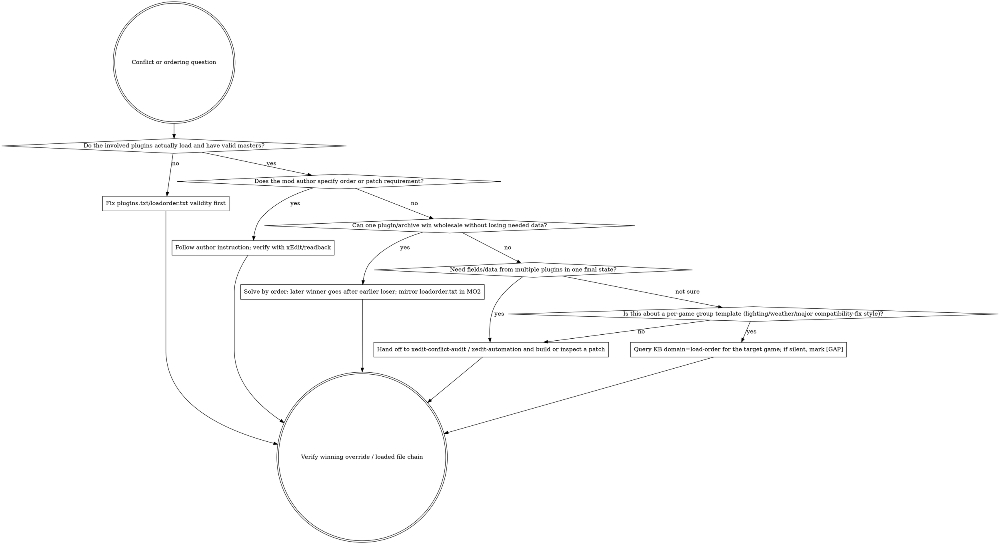

# Writing a BGS load order (plugins.txt)

> Sources for every claim in this skill: `Ortham/libloadorder` (the library
> behind LOOT), `ModOrganizer2/modorganizer/src/profile.cpp`,
> `ModOrganizer2/modorganizer-basic_games/.../game_plugins.py`, and xEdit's
> official docs Section 2.8.1.

## Two file formats — know which one applies

| Format | Games | File | Activation marker |
|---|---|---|---|
| **Asterisk format** (modern) | Fallout 4, Skyrim SE/AE/VR, Fallout 4 VR, Starfield | `plugins.txt` | leading `*` = active |
| **Textfile-only** (legacy) | Skyrim LE, Oblivion, Fallout 3, Fallout NV | `plugins.txt` (active only) + sibling `loadorder.txt` (full order) | presence in `plugins.txt` = active |

This skill covers the **asterisk format** in depth. If your target is Skyrim
LE / Oblivion / FO3 / FNV, the rules are different — see the "Legacy format"
section at the bottom.

## File location

| Context | Path |
|---|---|
| Vanilla install (no MO2) | `%LOCALAPPDATA%\<GameFolder>\plugins.txt` (e.g. `Fallout4`, `Skyrim Special Edition`, `Starfield`) |
| MO2-managed | `<MO2_Root>\profiles\<ProfileName>\plugins.txt` |
| MO2-managed sibling | `<MO2_Root>\profiles\<ProfileName>\loadorder.txt` (full order including inactive; MO2 keeps both) |
| Agent-authored (experiments) | `an agent-owned artifacts path` — generate your own, pass to `xedit_start({ pluginsFile })` |

**Ownership in MO2 use**: MO2 writes `plugins.txt` whenever the user toggles
plugin checkboxes in the GUI. LOOT can also write it. If you mutate it under
MO2, do it while MO2 is closed OR via mobase's `IPluginList` API — live edits
while MO2 is open get overwritten on its next save.

## Asterisk format reference

```
# This file was automatically generated by Mod Organizer.
*Unofficial Fallout 4 Patch.esp        ← * = ACTIVE; loads first among non-vanilla
ArmorKeywords.esm                       ← no * = present-but-INACTIVE; position preserved
*HUDFramework.esm
SomeDisabledMod.esp
*MyMod.esp                              ← bottom = loads LAST = wins conflicts
```

Verbatim parser rules (from `libloadorder/src/load_order/asterisk_based.rs`):

- Blank lines → ignored.
- Lines starting with `#` (column 0) → comment, ignored.
- Lines starting with `*` → plugin name follows; active.
- Lines starting with any other character → plugin name; inactive but tracked.
- **No inline comments.** `#` must be at column 0.
- Encoding: Windows-1252. Plugin names with non-Win1252 characters cannot be
  activated until renamed.
- Line endings: LF and CRLF both accepted on read. Prefer LF on write
  (libloadorder's default).
- Order: first line = lowest load-order index = loaded first. Last line = wins
  conflicts.

## 排序判断 / Ordering judgment

Ordering is not list housekeeping. It decides which plugin record or archive
payload the game actually sees when two mods touch the same thing: later wins.
For loose files, remember the separate asset layer: loose files can win over
BA2/BSA archive contents even when their plugin loads earlier. Use ordering to
choose whole-record / whole-archive winners; use a patch when you need one final
record stitched from multiple mods.

Iron law: **if the desired result cannot be expressed as "one later plugin wins
over one earlier plugin," stop sorting and audit/patch the conflict.**

The source-mined principle comes from BB84's Vortex-era sorting lesson and the
later xEdit "终极奥义": order is theoretically replaceable by a final
compatibility patch, but patching every conflicting FormID in a real pack is not
realistic. A sane order reduces the patch surface; it does not eliminate patching.



### Judgment rules

- Sort solves **priority**: which complete plugin record or BA2/BSA archive wins
  after a later-wins cascade.
- Patch solves **composition**: which fields from multiple plugins must be
  preserved together in one final winning record.
- Group ordering is a scale tool, not magic. Put mods into purpose-based groups
  so order can be reasoned about in batches; same-group conflicts still need a
  specific winner or a patch.
- Masters and official early-loading plugins are not discretionary. Infer them
  from the current runtime as described below; user-managed patches generally
  live late because they intentionally carry final stitched decisions.
- Prefer the later winner that expresses the pack's system rule over incidental
  edits from a content mod. Example principle: if one mod imposes the pack-wide
  equipment-slot rule and another content mod casually edits one vanilla slot,
  the system-rule mod usually belongs later. Verify the actual records.
- Do **not** inline per-game group templates here. For lighting, weather,
  major compatibility-fix placement, major overhauls, or game-specific community group layouts,
  query the KB first:

  ```text
  bgs_kb_query({ query: "load order group template lighting weather patch", games: ["<Game>"], domains: ["load-order"] })
  ```

  If the KB is silent, mark `[GAP]` instead of inventing a generic position.

### LOOT / automatic sort vs manual sort

| Situation | Default |
|---|---|
| Beginner / small pack, no author instruction, no known conflict | Use LOOT or the manager's automatic sort as a baseline, then validate. |
| Author specifies order, dependency, or required compatibility patch | Follow the author first; verify with xEdit/readback. |
| xEdit shows the automatic result chose the wrong winner | Manually reorder if one winner is enough; patch if fields must be stitched. |
| Per-game group placement question | Query KB `load-order` records; do not hardcode a cross-game template in this skill. |
| Recurring conflict family across many mods | Create/adjust a group rule, then patch only the records the group rule cannot express. |

### Red flags

| Thought | Reality |
|---|---|
| "排序无所谓，xEdit能补一切." | True only in principle; exhaustive FormID stitching is not realistic at pack scale. Sort first to reduce the patch surface. |
| "LOOT / auto-sort ran, so ordering judgment is done." | Auto-sort is a baseline. It cannot know every pack-specific winner or every author-required exception. |
| "Same group means no conflict." | Same group means conflicts should be rare. When two same-group mods touch the same record, decide winner or patch. |
| "Manager UI shows no conflict, so there is no conflict." | Record conflicts require xEdit readback. Asset/archive conflicts require asset-precedence inspection. |
| "Just put every patch last and forget the rest." | Patches late is correct, but a patch can only express decisions you actually audited. |
| "Lighting/weather/major compatibility-fix placement is universal." | Those are per-game template facts. Query KB and mark `[GAP]` if the pack has no record. |

### Rationalizations

| Excuse | Reality |
|---|---|
| "I'll patch everything later." | That is the impossible endgame. A sane order is how you avoid patching irrelevant conflicts one by one. |
| "Manual sorting is just vibes." | Manual sorting is only legitimate when tied to a known winner, author instruction, group rule, or xEdit readback. |
| "The content mod should win because it adds new things." | Content mods often carry incidental edits. A systemic-rule mod may be the right later winner. |
| "If two mods are incompatible, sorting harder will fix it." | Some conflicts are ordering conflicts; some are real incompatibilities. Escalate to audit instead of looping order changes. |
| "Archive conflicts are invisible, so ignore them." | Invisibility is why BA2/BSA precedence must be inspected rather than guessed. |

If sorting does not produce the intended winning override, hand off to
`xedit-conflict-audit`: inspect the record, name the winning override, decide
whether the current winner is safe, and only then route to patch authoring.

## Official / vanilla masters — infer them from the current game, do not hardcode

The engine loads each game's official plugins at fixed positions before reading
the user-managed `plugins.txt`. The exact set depends on the target game,
installed DLC, and any Creation Club / verified-content bundles.

**Do not hardcode a per-game vanilla-master list in your workflow.** Instead,
derive the official masters from the user's actual MO2-managed runtime:

1. Read `<MO2_Root>\ModOrganizer.ini` to learn `gameName` and `gamePath`.
2. Once xEdit is ready, call `xedit_call({ command: "files.list", args: {} })`
   and look at the earliest, auto-loaded official plugins. Treat those as the
   immutable official master set.
3. If xEdit is not ready yet, inspect the MO2-managed game root (`<gamePath>\Data`)
   and known official DLC/content files there. Do not add, remove, or reorder
   them in your generated `plugins.txt`.

libloadorder's writer skips these early-loading official plugins on save; MO2
re-injects them as active at read time. So whether they appear in the file or
not, they load first.

**Practical rule for agent-authored plugins.txt**: omit the official masters
you inferred from the actual target runtime. Start your file with user-managed
plugins instead.

## Six operations the agent does most often

### 1. Enable a currently-disabled plugin

Prefix the line with `*`. Position unchanged.

Before:
```
ArmorKeywords.esm
```
After:
```
*ArmorKeywords.esm
```

### 2. Disable without removing

Strip the leading `*`. Position preserved (the plugin stays in the file).

Before:
```
*HUDFramework.esm
```
After:
```
HUDFramework.esm
```

### 3. Remove a plugin entirely

Delete the whole line. Position is dropped. (MO2 will re-append it as inactive
at the end of `loadorder.txt` on next read — `plugins.txt` itself stays clean.)

### 4. Reorder (move X to load AFTER Y)

Cut the line, paste it after Y. **Mirror the change in `loadorder.txt` if it
exists** (MO2 maintains both files; out-of-sync state confuses MO2).

### 5. Add a brand-new plugin

Append at the bottom with `*` if you want it active.

```
*MyExistingMod.esp
*JustInstalledMod.esp          ← new line at the end
```

The bottom = loads last = wins conflicts with everything above. If you don't
want it to win conflicts, move it higher.

### 6. ESL conversion (ESP → light ESP)

**Do NOT do this by editing `plugins.txt`.** The light-plugin flag lives in
the plugin's file header, not in the load-order file. Route through the xEdit
daemon:

1. `xedit_call({ command: "plugin.esl.analyze", args: { file: "MyMod.esp" } })` — checks whether the plugin's FormIDs fit in the ESL FE-slot range.
2. If verdict says yes: `xedit_call({ command: "plugin.esl.apply", args: { file: "MyMod.esp" } })` — sets the light-plugin flag in the file header.

After flagging, the file extension stays `.esp`. The engine reads the new
flag at load time and remaps the plugin into the shared FE slot.

`plugins.txt` does NOT change as part of ESL conversion.

## Routing matrix: plugins.txt edit vs xEdit daemon command

| Operation | Right path | Why |
|---|---|---|
| Activate / deactivate a plugin | **Edit `plugins.txt`** (toggle `*`) | No daemon verb exists for activation; the daemon manipulates plugin *contents*, not the activation file. |
| Reorder plugins | **Edit `plugins.txt`** + mirror in `loadorder.txt` | xEdit docs 2.3 (verbatim): "Load order cannot be changed with xEdit." |
| Remove a plugin entry | **Edit `plugins.txt`** | Same reason. |
| Add new plugin to load order | **Edit `plugins.txt`** (append) | Daemon doesn't write the activation file. MO2 will project the mod's `.esp` via VFS once the file references it. |
| Check a plugin's masters | **`xedit_call({command:"files.get_masters", args:{file:"..."}})`** | Reads the plugin header. |
| Add a missing master to a plugin | **`xedit_call({command:"files.add_required_masters", args:{...}})`** | Mutates the file header. |
| Convert ESP → ESL | **`plugin.esl.analyze` → `plugin.esl.apply`** | Sets header flag; load-order file unchanged. |
| Clean ITM / UDR | **xEdit launcher with `-quickAutoClean`** OR daemon `files.clean_masters` | Both work; CLI faster for batch. |
| Sort the load order | **External LOOT** | Neither xEdit nor MO2 sorts; LOOT does, then writes `plugins.txt`. |
| Verify a load order is valid | **Combine**: read `plugins.txt`, then daemon `files.list` to confirm each `*`-prefixed file exists with required masters present. | Two-sided: file presence (libloadorder) + header consistency (xEdit). |

The rule of thumb: **`plugins.txt` is an activation surface owned by MO2 (or
LOOT, or the agent). The xEdit daemon never touches it.** The daemon's domain
ends at the file header of individual plugins.

## Generating a custom plugins.txt for xEdit experiments

When you want xEdit to load only a subset of mods (e.g., to isolate a
conflict between two specific plugins), generate a custom `plugins.txt` under
an **agent-owned artifacts path** and pass it to `xedit_start`:

```typescript
// 1. Write the file
const customPlugins = `# Agent-generated for conflict isolation between PluginA + PluginB
*<PrimaryGameMaster>.esm
*<OptionalCommunityFix>.esp
*PluginA.esp
*PluginB.esp
`;
await writeFile("<agent-owned-artifacts-path>/foo-vs-bar/plugins.txt", customPlugins);

// 2. Start xEdit pointing at the custom file + the right Data dir
await xedit_start({
  pluginsFile: "<agent-owned-artifacts-path>/foo-vs-bar/plugins.txt",
  dataPath: "<MO2_Root>/<managed game root>/Data",
  gameMode: "<GameMode>",
});
```

Notes for the experimental file:
- You MAY include the target game's primary / official masters here if you want
  to make the experiment self-describing, but you do not need to. xEdit auto-
  loads the official masters from the Data dir regardless.
- Order matters even for a 3-plugin file. Top = loads first.
- The file must be Windows-1252 encodable (UTF-8 works as long as you stay
  in ASCII).

## plugins.txt vs modlist.txt — common confusion

| File | What it lists | Prefix convention | Where |
|---|---|---|---|
| `plugins.txt` | `.esp/.esm/.esl` plugin filenames | `*` = active, no prefix = inactive | `<profile>/plugins.txt` |
| `modlist.txt` | MO2 **mod folder names** (under `mods/`) | `+` = enabled, `-` = disabled, `*` = foreign | `<profile>/modlist.txt` |

**The `*` in `modlist.txt` means "foreign mod" (MO2-managed but externally
owned), NOT "active."** Mixing the two formats is the #1 way to corrupt a
profile. Never copy/paste between them.

## MO2 path inspection (so you know which Data dir xEdit should target)

Before launching xEdit via the agent, read MO2's config to learn the
**managed game path**:

```powershell
# <MO2_Root>\ModOrganizer.ini contains lines like:
gameName=Fallout 4
gamePath=@ByteArray(D:\\awesome-bgs-mod-master\\.artifacts\\mo2\\Stock Game\\Fallout 4)
```

The `gamePath` value (strip the `@ByteArray(...)` wrapper) is where the
agent's `xedit_start({ dataPath: ... })` should point. Specifically, the Data
directory is `<gamePath>\Data`. Without an explicit `dataPath`, xEdit falls
back to the Windows registry — which points at the platform install path,
not necessarily the MO2-managed game root. That's the source of "wrong Data"
bugs.

## Validation

Three options for catching a malformed `plugins.txt` before launching xEdit
into a broken state:

1. **xEdit one-shot smoke**: launch xEdit with `-quickAutoClean` against the
   file. Non-zero exit = a master is missing or a `*`-prefixed plugin doesn't
   resolve. Cheap and authoritative.
   ```
   xEdit.exe -fo4 -D:"...\Data\" -P:"...\plugins.txt" -veryquickshowconflicts
   ```
2. **LOOT CLI**: uses libloadorder under the hood and surfaces validation
   errors in its GUI / log.
3. **Manual checks**: each `*`-prefixed plugin must exist as a file in the
   Data dir; no duplicate lines; under 255 active full plugins + under 4096
   active light plugins (`.esl` + flagged-ESP).

What makes a file invalid:

- More than 255 active full plugins (light plugins counted separately, see
  next bullet).
- More than 4096 active light plugins.
- Duplicate plugin lines.
- A `*`-prefixed line whose file does not exist in the Data dir.
- A line with a Windows-1252-unencodable filename.

## Legacy format (Skyrim LE / Oblivion / FO3 / FNV)

The OLD format used by pre-asterisk games:

- **No `*` prefix.** Presence of a plugin line in `plugins.txt` means it's
  active. Absence means it's not loaded.
- **`loadorder.txt` is the canonical full-order file** (active + inactive).
  `plugins.txt` contains only active plugins.
- `plugins.txt` uses **Windows-1252** encoding; `loadorder.txt` uses **UTF-8
  without BOM**.
- Max 255 active plugins (no ESL concept in these engines).
- CRLF line endings standard.

This format does NOT apply to FO4 / SSE / Starfield. If you're targeting one
of these older games, use this section's rules; for everything else, use the
asterisk format above.

## See also

- `xedit-automation` — hub skill for all xEdit work; routing doctrine,
  anti-patterns, sub-agent recipes.
- BGS KB records under `knowledge/bgs-kb/packs/core/records/` — daemon command,
  error-code, save-semantics, and glossary facts formerly kept in the retired
  `xedit-automation/xedit-knowledgebase.md` redirect.
- `setting-up-bgs-modding-environment` — explains how to inspect MO2's
  `ModOrganizer.ini` for `gamePath` before launching xEdit.
- xEdit official docs Section 2.8.1 — launcher flag reference for `-P:`,
  `-D:`, and friends.
- `Ortham/libloadorder` documentation — the authoritative source for the
  asterisk format semantics.
