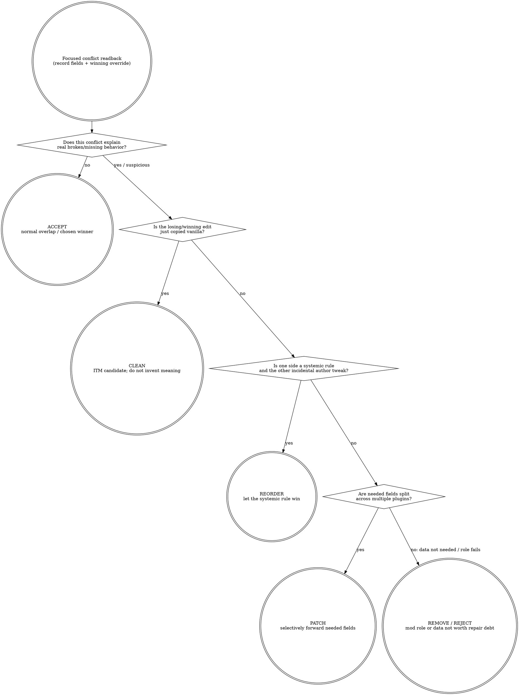

# xEdit Conflict Audit (W2)

Inherits the hub `xedit-automation` skill. Do not restate routing or anti-patterns here; this skill is the W2 workflow only.

## Purpose

For a record or a plugin in scope, produce a verdict: `no_conflict | itpo | itm | minor | breaking`, plus the winning override, the override chain, and a list of plugins that reference the record. Output is a concise summary, not the raw daemon round-trips.

## When To Use

- "Why is this mod's change not showing up?" → audit the affected records.
- "Which plugins overlap on this NPC / weapon / armour / keyword?" → audit by editor ID / form ID.
- "Is this load order safe to ship?" → audit a representative sample of records.

## Tools

Use these MCP intent tools (do not drop to `xedit_call` unless an intent tool does not fit):

- `xedit_session` (always first; once per conversation).
- `xedit_list_capabilities` (once per conversation; sanity-check drift).
- `xedit_find_record` (locate the record(s) you want to audit).
- `xedit_inspect_conflicts` (the verdict tool).
- `xedit_read_record` (when you need to see the actual conflicting field values).
- `xedit_call` for r6-only daemon fields that no intent wrapper exposes yet:
  `records.references`, `records.conflict_status`, and `records.apply_filter`.

If the conflict is broad (many records across many plugins), do not loop through them one by one in the orchestrator — **delegate to a read-only investigator sub-agent** (see Hub skill, "Sub-agent delegation recipes").

## 补丁 vs 改顺序决策 / Patch-vs-reorder decision

This is the judgment gate after the tool surface tells you what wins. xEdit shows the override chain; it does not decide whether the right answer is accept, reorder, clean, remove, or patch. BB84's rule is situational thought over ritual: most overlap is normal, sorting is a single-choice lever, and exhaustive FormID stitching is not realistic at pack scale.

Use this section only to choose the remedy. If the verdict becomes PATCH, stop here and hand off; this W2 skill audits conflicts and names intent, it does not author patch records.



| Decision | Use when | Do not use when |
|---|---|---|
| ACCEPT | The later winner is the intended rule, or the lost edit is not needed for this pack. | You have not read the actual fields; "no crash" is not proof. |
| REORDER | One plugin expresses a broader systemic rule and the other edit is incidental. Let the rule win to reduce patch surface. | Needed fields are split across both sides; order can only choose one winner. |
| PATCH | Multiple plugins carry needed data for the same FormID, and sorting would lose required behavior either way. | You only feel uncomfortable seeing red; most data overlap is normal. |
| CLEAN | The record is an unchanged copy of vanilla / ITM candidate. | You are about to delete a value whose purpose you have not understood. |
| REMOVE / REJECT | The conflict reveals the mod's relevant data is not needed, off-role, or not worth the repair debt. | The source is silent on a hard removal threshold; do not invent one. |

### KB query discipline

This decision section is game-agnostic. Do not inline game-specific xEdit lore,
record-class gotchas, or community patch-position folklore here.

Use KB when the conflict family depends on current game or ecosystem facts:

```text
bgs_kb_query({ query: "xedit patch vs reorder conflict family", domains: ["xedit", "load-order"], games: ["<current game>"] })
```

If KB is silent, mark `[GAP]` instead of inventing a game-specific rule.

### Red flags (STOP)

| Thought | Reality |
|---|---|
| "Red means broken; fix every red cell." | Red means overlapping data. Most overlap is normal; chase behavior-breaking conflicts. |
| "Just reorder until both changes work." | Reordering is a single-choice lever: A wins or B wins. It cannot merge values. |
| "The rightmost value wins, so the rest is irrelevant." | Earlier columns are evidence of lost behavior; read them before deciding. |
| "I'll drag the field directly into the winning mod." | That mutates the source mod and creates cleanup debt. Make a patch if both values are needed. |
| "xEdit can patch everything, so order doesn't matter." | True in principle, impractical at real pack scale. Use order to reduce patch debt. |
| "xEdit shows the conflict, so xEdit alone proves the cause." | Some problems are script-use or presentation mismatches; mark uncertainty instead of guessing. |

### Rationalizations

| Excuse | Reality |
|---|---|
| "Sorting is easier; I'll avoid patches." | Sorting chooses one side. If both sides contain needed fields, you are still dropping data. |
| "I'll patch all conflicts now so future me is safe." | Exhaustive FormID stitching is repair debt. Patch only the conflicts tied to intended behavior. |
| "The later mod is newer, so its override must be intended." | Later means winner, not correct. Compare the field's meaning against the pack's need. |
| "The game boots, so the conflict is acceptable." | Lost fields can silently disable features. Booting is not semantic success. |
| "The field label is obvious enough." | Some data names are abstract. If you do not know the purpose, investigate before forwarding. |

When the verdict is PATCH, route to `xedit-automation` (see its `## 补丁创作判断` section).

## R6 broad-audit shortcuts (capability gated)

Check `xedit_list_capabilities` and branch on `system.capabilities.supports.*`.
Use these r6+ one-call forms when available; old child-by-child and
record-by-record loops remain the fallback for pre-r6 daemons.

### Recursive references (`supports.referencesRecursive`)

For CELL/WRLD/DIAL/QUST targets, prefer:

```text
xedit_call({
  command: "records.references",
  args: { file, formId, recursive: true }
})
```

`recursive: true` unions outgoing references across ChildGroup descendants, so
one call replaces the old "list every ChildGroup child, then reference-probe each
child" loop. Deep reference: `xedit.references-recursive.v1`.

### ChildGroup conflict summary (`supports.conflictStatusChildGroup`)

When `records.conflict_status` returns `result.childGroup`, read that block
before expanding individual records. It summarizes per-signature child-group
state as `{ total, conflicting }` and includes a capped `conflictingHits` array
(cap 20) for the first concrete children to inspect.

This is the broad-audit starting point for CELL/WRLD/DIAL/QUST conflicts:
summarize the `childGroup` block, then deep-read only `conflictingHits` or a
small representative sample. Deep reference: `xedit.conflict-status-childgroup.v1`.

### `apply_filter` regex + `parentFormId` (`supports.applyFilterExtensions`)

Use `records.apply_filter` to collapse broad candidate discovery into a single
server-side query when the daemon advertises `supports.applyFilterExtensions`
(or the narrower `.regex` / `.multiPattern` subkeys, if exposed separately).

- Regex fields: `editorIdRegex`, `displayNameRegex`, `fullNameRegex`,
  `baseEditorIdRegex`, `baseDisplayNameRegex`.
- Regex engine: `System.RegularExpressions.TRegEx`.
- Guardrails: 100ms per-record timeout, 4-worker semaphore, and a
  `RegexSlotsExhausted` response counter so saturation is distinguishable from
  no matches.
- Multi-pattern OR: each `*Pattern` and `*Regex` field may be a scalar string or
  an array with OR semantics; max 32 entries.
- `parentFormId`: single-call ancestor filtering, e.g. "all REFRs whose
  container chain contains CELL X" without building your own parent walk.

Deep reference: `xedit.apply-filter-extensions.v1`.

## Workflow

1. **Bootstrap session.** `xedit_session({})`. Confirm `gameMode`, `consentEnabled` not needed here (read-only), and `loadOrderSize` matches expectation.
2. **Sanity-check capabilities.** `xedit_list_capabilities({})`. Read the `drift.onlyInLive` and `drift.onlyInDigest` arrays plus the r6 support keys. If a target command you intend to use is missing from live, stop and tell the user.
3. **Scope the audit.** Decide whether the audit is per-record, per-plugin, per-signature, or parent-scoped (e.g. all REFRs under a CELL).
4. **Locate records with the narrowest supported query.**
   - Per-record by FormID: `xedit_find_record({ file, formId })`.
   - Per-editor-ID: `xedit_find_record({ editorId })`.
   - Parent-scoped or regex candidate set on r6+: `xedit_call({ command: "records.apply_filter", args: { file?, signature?, parentFormId?, editorIdRegex?, ... } })`.
   - Per-plugin fallback: `xedit_call({ command: "records.list", args: { file, signature? } })`, then iterate or delegate if large.
5. **Inspect conflicts with child-group awareness.** For each focused target, prefer `xedit_inspect_conflicts({ file, formId })`. For broad CELL/WRLD/DIAL/QUST targets on r6+, call `records.conflict_status` through `xedit_call` if you need the raw `result.childGroup` summary; expand only `conflictingHits` or a representative sample instead of probing every child.
6. **Collect references efficiently.** On r6+, `xedit_call({ command: "records.references", args: { file, formId, recursive: true } })` gives a ChildGroup-wide outgoing-reference union. On pre-r6, fall back to the old child walk or delegate the loop.
7. **Classify verdicts.** Read the `verdict` field from the intent tool or map the raw `records.conflict_status` result with the same W2 labels:
   - `no_conflict` → safe.
   - `itpo` / `itm` → likely safe; consider cleaning.
   - `minor` → human review.
   - `breaking` → halt and surface.
8. **For non-trivial verdicts, read the actual record.** `xedit_read_record({ file, formId })`. Compare `record.fields` vs `winningOverride` vs `baseRecord`. Identify the diverging fields.
9. **Summarise.** Produce a short report: one row per record or child-group signature bucket audited, columns `[file, formId, editorId/signature, verdict, winningFile, referencerCount, childGroupConflicts]`. Surface only the breaking/minor verdicts to the user by default; the rest are appendix.

## Verification (what counts as semantic pass)

- The audit's verdict for each spot-checked record matches what manual xEdit GUI inspection would show.
- For breaking verdicts, you have read the actual record fields and can name the diverging fields.
- The output report is concise: one row per record or child-group signature
  bucket, no raw daemon envelopes.
- The session's audit log (`.opencode/artifacts/xedit-mcp/audit/YYYY-MM-DD.jsonl`) contains one entry per MCP tool call you made.

If you cannot meet these for a record, mark it `unknown` in the report and explain why — do not guess.

## Common Mistakes

- Calling `xedit_call records.conflict_status` directly when `xedit_inspect_conflicts` would do it with the verdict label already mapped; use raw `records.conflict_status` only when you need r6 response blocks such as `result.childGroup`.
- Treating `no_conflict` as proof of safety without reading at least one representative record.
- Looping through hundreds of records in the orchestrator's context when r6 `recursive`, `childGroup`, `apply_filter`, or delegation would collapse the work.
- Forgetting to call `xedit_session` first; downstream tools will refuse with `state_violation`.
- Asking the daemon for a file that is not in the load order; `LOAD001` will fire — load it via the session first.

## Delegation hints

This workflow is a strong candidate for read-only sub-agent delegation in two cases:

1. **Large scope** (> ~10 records to audit) — the round-trips will fill the orchestrator's context. Delegate the loop; receive the per-record summary table.
2. **Exploratory diagnosis** ("I don't know which record is causing this in-game issue") — let a sub-agent triangulate by editor ID and signature; you'll get the candidates back.

When delegating, include this skill and the hub skill in the sub-agent's prompt and provide the scope + budget.
