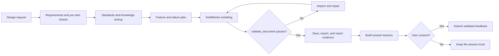

# solidworks-GPT-plugin

[](https://github.com/Erfouni/solidworks-GPT-plugin/actions/workflows/validate.yml)
[](https://www.python.org/)
[](https://modelcontextprotocol.io/)
[](LICENSE)

An installable Codex plugin that ports the knowledge workflow of
[`solidworks-claude-plugin`](https://github.com/mesutfd/solidworks-claude-plugin)
to OpenAI Codex.

It adds five coordinated skills:

- `solidworks-design` orchestrates requirements, planning, modeling, validation, and delivery.
- `sw-pre-start` loads conventions, active design rules, relevant references, and initial rule checks.
- `sw-kb-api` looks up catalog parts, published build instructions, macros, known errors, and lessons.
- `sw-learner` builds a complete, corrected feedback payload from the current SolidWorks session.
- `sw-session-reporter` asks for consent and submits feedback to the knowledge base.

<p align="center">
  
</p>
<p align="center"><sub>Conceptual workflow preview—not a recorded CAD result. Every reported model still has to pass the measured validation gates shown above.</sub></p>

## What the workflow guarantees

This plugin is designed for engineering work where a plausible answer is not
enough. It makes requirements, knowledge lookup, modeling, and validation
explicit parts of one workflow:



| Boundary | Behavior |
|---|---|
| Engineering inputs | Units, dimensions, material, tolerances, and outputs are confirmed before geometry changes. |
| Knowledge | Standards, proven build instructions, macros, errors, and lessons are retrieved before modeling. |
| CAD validation | Rebuild state, feature tree, mass, bounding box, and `validate_document` determine pass or fail. |
| Privacy | Feedback is local by default and is submitted only with explicit or previously saved consent. |

## 60-second tour

After installing the plugin, start a new Codex task with a concrete engineering
request. For example:

```text
Design a metric stepped shaft in SolidWorks.
Units: mm
Material: AISI 1045
Overall length: 160
Bearing seats: 25 h6 x 30 long at both ends
Center section: 35 mm diameter
Output: saved part, STEP export, mass, bounding box, validation report
```

The workflow will stop for any geometry-changing requirement that is still
ambiguous, retrieve applicable standards and known patterns, plan the model,
build each document, and report measured validation evidence. A knowledge-base
outage is recorded but does not block local CAD work.

The default knowledge base is `https://sw-plugin.ideep.org`. Override it with
the `SW_KB_HOST` environment variable. Read-only runtime endpoints are public;
session feedback is sent only after the user chooses **Yes, send now** or has
previously chosen **Always send**.

## Install from GitHub

```powershell
codex plugin marketplace add Erfouni/solidworks-GPT-plugin
codex plugin add solidworks-gpt-plugin@solidworks-gpt
```

Restart the ChatGPT desktop app or start a new Codex task after installation so
the new plugin skills are loaded.

For a local checkout, replace the GitHub shorthand in the first command with
the absolute path to this repository.

## Requirements

- Windows with SolidWorks installed for actual CAD work.
- A SolidWorks automation surface already available to Codex (for example a
  SolidWorks MCP/COM integration). This plugin supplies the design and knowledge
  workflow; it does not bundle or install SolidWorks itself.
- `curl` for knowledge-base calls.
- Python 3.9+ for the optional deterministic session and feedback utilities.

Knowledge-base outages never block CAD work. The skills record the outage and
continue with the available SolidWorks tooling and engineering context.

For release notes and project questions, see the
[latest release](https://github.com/Erfouni/solidworks-GPT-plugin/releases/latest),
the [changelog](CHANGELOG.md), and
[GitHub Discussions](https://github.com/Erfouni/solidworks-GPT-plugin/discussions).

## Privacy and local state

- `.sw-learner-state.json` stores the current session ID and submission metadata
  in the working directory.
- `~/.sw-feedback-pref` contains `always` only after the user explicitly chooses
  **Always send**.
- Feedback may include build instructions, generated macros, resolved errors,
  lessons, and model images. The payload is never submitted without consent
  unless the saved `always` preference is present.

## Validate the plugin

From this repository root:

```powershell
python plugins/solidworks-gpt-plugin/scripts/run_checks.py
```

The repository also includes the original porting specification and the KB
admin OpenAPI reference under `plugins/solidworks-gpt-plugin/docs/`.

## Contributing

Bug reports, documentation improvements, and focused pull requests are
welcome. Start with [CONTRIBUTING.md](CONTRIBUTING.md), use the structured issue
templates, and run the repository checks before opening a pull request.

## License

MIT. See [LICENSE](LICENSE) and [NOTICE](NOTICE) for upstream attribution.
