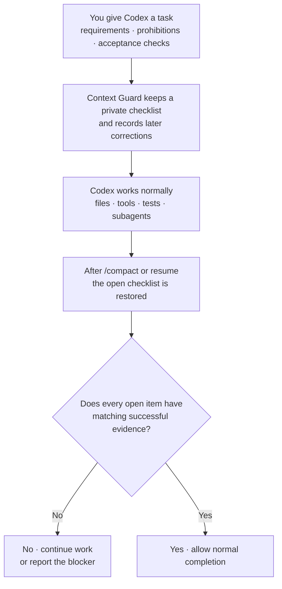

# Context Guard

[](https://github.com/GreenLv/codex-context-guard/actions/workflows/ci.yml)
[](https://github.com/GreenLv/codex-context-guard/actions/workflows/hol-plugin-scanner.yml)
[](https://hol.org/registry/plugins/gerui-lv%2Fcontext-guard)
[](https://github.com/GreenLv/codex-context-guard/releases)
[](LICENSE)

[简体中文](README.zh-CN.md) | [Introduction](https://greenlv.github.io/blogs/protecting-context-in-long-running-agent-tasks/) | [Changelog](CHANGELOG.md)

Context Guard keeps important requirements from disappearing during a long Codex task. It restores a private checklist after compaction or resume and requires successful evidence before the task can be reported complete. It does not gate ordinary edits, commits, or pushes with its own approval prompts.

It works beside Codex Plan, Goal, memories, subagents, worktrees, and the transcript; it does not replace or control them.

> Current release: `0.13.3`. See the [release notes](docs/releases/v0.13.3.md), [changelog](CHANGELOG.md), [compatibility matrix](docs/COMPATIBILITY.md), and [local acceptance record](docs/LOCAL_ACCEPTANCE.md).
>
> Source candidate: `0.13.5` (unreleased). It fixes answer-delivery tracking and bounded continuation feedback, and includes the HOL scanner and registry-refresh updates. It has not been tagged or published.
>
> Version `0.13.3` keeps ordinary commits and single branch pushes available even when an active release ledger is unreadable, while publication actions remain fail-closed. It is a compatible patch with no schema, protocol, activation, or host-permission change.
>
> Version `0.13.2` moved ordinary execution authorization out of Context Guard and kept requirement recovery, task continuity, honest completion checking, answer-delivery tracking, and private-control integrity.
>
> Version `0.12.4` fixes lost task limits, unrelated confirmations clearing pauses, incomplete recovery text, and commit-and-push target mistakes. See the [changelog](CHANGELOG.md) for changes and the [acceptance record](docs/LOCAL_ACCEPTANCE.md) for platform checks.

## Install

Requirements: Python 3.10 or newer, Codex CLI, and a Codex surface that loads plugins and lifecycle Hooks. Portable acceptance used Codex CLI `0.153.4` on macOS and `0.149.0` on native Windows; see [compatibility](docs/COMPATIBILITY.md) for the full evidence boundary.

```shell
git clone https://github.com/GreenLv/codex-context-guard.git
cd codex-context-guard
python3 scripts/manage_plugin.py --apply
```

On Windows:

```powershell
py -3.10 scripts\manage_plugin.py --apply
```

The installer adds this repository as a marketplace, installs `context-guard@codex-context-guard`, and verifies the installed copy. It also keeps versioned copies needed by tasks that started before an upgrade.

Installing a plugin does not trust its Hooks automatically. Start a fresh Codex task, open `/hooks`, review and trust all nine definitions, then start another fresh task so it loads the current version.

### Upgrade notes

Upgrade with the managed installer, then start a fresh task to load the new version. Keep old versioned caches for tasks that still use them; installed caches are immutable, and 0.13.3 never refreshes a consumed copy.

Version 0.13.3 narrows release enforcement before private release state is read: damaged release state cannot block an ordinary commit or one branch push, but tags, package uploads, GitHub Releases, mutation runners, and restricted compound calls remain protected. It keeps the schema and protocols from 0.13.2. See [compatibility](docs/COMPATIBILITY.md) before downgrading.

If the required Python interpreter and managed cache are both unavailable, Context Guard stops with a reinstall hint. Version history is in the [changelog](CHANGELOG.md); current behavior and platform limits are in [compatibility](docs/COMPATIBILITY.md). The [0.12.4 baseline](docs/BEHAVIOR_BASELINE_0_12_4.md) is historical.

## Try it

In a fresh task, activate Context Guard:

```text
$context-guard
```

Then inspect the protected state:

```text
context-guard status
context-guard diagnose
```

For a recovery check, use it on a non-trivial synthetic task, run `/compact`, and confirm that the same open requirements return immediately afterward.

## What it protects

- Requirements, acceptance criteria, prohibitions, and later corrections keep stable task-local identities.
- Compaction and resume restore the open checklist instead of relying only on a conversational summary.
- Successful tool evidence must match the named file, URL, image, or other requested result before it can close an item.
- A delivered answer is not a completed task. A natural answer actually delivered to a pure question closes that item as `answered` and never replays after compaction; an execution obligation always needs evidence; an unknown delivery state is never presented as completion.
- Images and other multimodal inputs keep only hashes and bounded metadata. When the user asks for an image change, completion evidence can be tied to an inspection of the changed image rather than merely to a successful tool call.
- Ambiguous output remains `unknown`; damaged or unverifiable private state blocks completion verification.
- Exports are explicit and redacted. Image bytes, credentials, and raw transcript content are not copied into the requirement ledger.

Automatic checks are used only when the request names a concrete target, such as a file, URL, edited image, or complete object list. If Context Guard cannot verify a result exactly, it leaves the item open instead of guessing. Waiting for the user, an external result, or a later turn does not close unfinished requirements.

## Who decides what

- You decide the task and which changes are allowed.
- Repository instructions and selected Skills define the adopted workflow, but cannot grant new authority.
- Codex Plan describes the model's current steps; Context Guard can keep a read-only reference but does not edit the plan.
- Tool, file, image, UI, and public-page readbacks establish facts. They do not by themselves decide whether an action is authorized.

From version 0.13 the responsibilities split like this:

- **You and the executing agent decide execution.** Whether an edit, commit, push, tag, or publication is within your authorization is judged by the main executing agent from the real conversation, repository rules, and host permissions — not by a Context Guard prompt. A Context Guard allow was never authorization, and the product now says so explicitly.
- **Context Guard owns correctness continuity.** It recovers requirements and constraints across compaction and resume, keeps task state continuous, checks completion claims against matching deterministic evidence, tracks whether a requested answer was actually delivered, and protects its own private control state. These checks are fail-closed and never ask you to re-authorize ordinary work.
- **An explicitly adopted release execution contract owns precise identity actions.** Only after an explicit adoption or an explicit `context-guard release` declaration do tier-A actions — tags, registry publish/yank, GitHub Releases — require an exact one-shot action ticket.

Context Guard does not grant permissions or replace platform approval, and specialized tools outside Hook coverage remain outside its view.

## Protection levels

Context Guard's checks follow the active protection level. Skills, repository instructions, or installing the plugin can suggest a level, but only you can turn on a stricter one.

| Level | How it turns on | What it does |
| --- | --- | --- |
| **Standard** (default) | Activating the guard | Recovers your requirements after compaction and resume, keeps task state continuous, checks completion honestly against deterministic evidence, and tracks answer delivery. No execution approvals and no repeated authorization asks: ordinary edits, commits, pushes, status questions, and compaction never trigger a Context Guard prompt. |
| **Strict** | You explicitly ask for strict evidence protection | Standard, plus enforced proof obligations for the current work unit — useful for formal deliverables and multi-image work. Strict never implies release or Git gating. |
| **Release** | Only an explicitly adopted release execution contract or an explicit `context-guard release` declaration | Standard, plus candidate-closure, publication-readiness, and exact one-shot tickets for covered tier-A identity actions (tags, registry publish/yank, GitHub Releases). Having a tag or release authorized never follows automatically from anything else. |
| **Observe** | Maintainer or canary configuration | Records bounded what-it-would-have-done results, without blocking anything. |

Everything else stays open by design: local edits, tests, ordinary commits, reads, searches, and dry-runs need no additional Context Guard approval, and turning the guard `off` stops all gating while prompt journaling continues. When a normal action is allowed, nothing appears on screen; when an action is refused — a release-contract ticket failure or an integrity failure — you get one short actionable reason.

## How it works



Codex still owns the work and its native planning state. Context Guard carries the checklist across context boundaries and, when project instructions have been adopted explicitly, restores their unfinished phases and plan reference before checking completion.

## Everyday example: write a technical design document without losing decisions

Suppose the task is:

```text
Write docs/design/checkout-v2.md.

- Keep the approved API and data-flow decisions unchanged.
- Do not change the rollout date or add infrastructure commitments.
- Follow the RFC template.
- Give every recommendation a source link or a "to verify" label.
```

After research, edits, diagrams, and `/compact`, Context Guard restores those same items. A passing Markdown check cannot close the whole task: the approved decisions, RFC template, source links, and prohibited commitments each still need matching evidence.

This example explains the contract boundary; it does not claim that Context Guard can decide whether the design itself is sound.

The same boundary applies to routine execution. After you say “finish the changes, commit and push” (完成修改，提交并推送), ordinary edits, commits, pushes, status questions, and compaction proceed without any Context Guard re-authorization, before and after a `/compact`. A reply that claims the whole task is complete still needs matching evidence for everything still open.

## What you may see in a guarded task

| ID | Meaning |
| --- | --- |
| `R001` | A requirement captured for this task. |
| `A003` | An acceptance item checked independently. |
| `E####` | A successful evidence record that may close a compatible item. |

These are task-local identifiers, not GitHub issues or global task numbers. They may appear in progress text but the private ledger is not printed in the final reply.

## When Context Guard asks Codex to continue

When an open requirement still lacks matching evidence and the reply claims the whole task is complete, Context Guard may ask Codex to continue with this standard redacted message:

```text
[Context Guard continuation] The task is not yet safely complete.
```

The message is normal when requested work is still open. If it is unexpected, ask Codex what remains and run `context-guard status` or `context-guard diagnose`. The default feedback names only the current work unit's pending-item count, one reason, and one next step — never the full historical ID list — and a turn can be corrected at most once; after that, unresolved work stays pending and the turn ends safely. Waiting for the user, an external result, or an explicitly deferred step ends the turn silently without closing unfinished requirements. Ordinary endings need no commands: when a reply verifiably completes the unit, the guard binds the unique successful evidence itself.

Existing tasks may keep the Hook version they started with. Start a fresh task after an upgrade; if an old Hook path is missing, see [Versioning](docs/VERSIONING.md) for recovery guidance.

## User controls

| Command | Purpose |
| --- | --- |
| `$context-guard` or `context-guard on` | Activate recovery and completion gating. |
| `context-guard off` | Disable gating while preserving prompt journaling. |
| `context-guard standard\|strict\|release\|observe` | Select a protection level explicitly; `release` does not authorize a publication action. |
| `context-guard adopt <project-relative-json>` | Explicitly adopt one validated project execution contract. |
| `context-guard status` | Show protected-state counts without raw prompts. |
| `context-guard diagnose` | Show bounded diagnostics without raw prompts or replies. |
| `context-guard export <path>` | Write an explicit redacted handoff in the current project. |
| `context-guard rollover <directory>` | Validate prepared successor input and write a non-overwriting handoff plus hash manifest. |

Read [Successor Pack Input](skills/context-guard/references/successor-pack.md) before using `rollover`. It never creates or authorizes another task.

## Private data and retention

Runtime data is stored under Codex-managed `PLUGIN_DATA`. Prompt bodies, task state, evidence summaries, and recovery files remain local runtime data and are not part of this repository.

Ended sessions are eligible for cleanup after 30 days. Redacted exports are created only when requested and omit raw prompts, transcripts, credentials, authorization headers, URL query values, and plugin-private paths. See [Privacy](docs/PRIVACY.md).

## Update and uninstall

```shell
git pull --ff-only
python3 scripts/manage_plugin.py --apply
```

Plugin source changes require a version bump. Historical caches and trusted archives remain available to tasks that already loaded them.

```shell
codex plugin remove context-guard@codex-context-guard
codex plugin marketplace remove codex-context-guard
```

Removing code does not remove private runtime data. Keep old data or caches while an active task may still depend on them.

## Documentation

- [Architecture](docs/ARCHITECTURE.md)
- [Privacy](docs/PRIVACY.md)
- [Compatibility](docs/COMPATIBILITY.md)
- [Versioning](docs/VERSIONING.md)
- [Local acceptance](docs/LOCAL_ACCEPTANCE.md)
- [Changelog](CHANGELOG.md)

## Validation

```shell
python3 scripts/validate_public_repo.py .
python3 scripts/audit_public_tree.py .
python3 scripts/run_current_behavior_suite.py
python3 scripts/check_phase3_transition.py
python3 scripts/context_guard.py self-test
ruff check .
python3 -m compileall -q scripts tests tools
git diff --check
```

The current-behavior runner discovers every current `test_*.py` module except the byte-frozen 0.11.x observation baseline. The transition audit runs that historical baseline separately and succeeds only when its exact fixed/inverted manifest matches; running the frozen file as an ordinary all-pass suite would intentionally report failures and unexpected successes.

The Hook runtime uses only the Python standard library. CI covers Ubuntu, macOS, and Windows on Python 3.10–3.13; CI does not substitute for native Hook trust or installed lifecycle evidence.

## Explicit non-goals

Context Guard is not a semantic proof system, security sandbox, transcript backup, cloud sync service, second Plan/Goal controller, agent scheduler, or replacement for tests and human review. It does not guarantee that arbitrary content is correct; it enforces only the deterministic checks it can express. It does not replace Codex's permission system, the `repository-release` publication contract, human review, or platform readbacks.

Version 0.13 keeps the model- and agent-agnostic baseline: it does not assume the model or agent host brings reliable long-context protection or recovery. The recovery → work unit → evidence → completion loop is provided locally by Context Guard itself, with protocol semantics separated from the Codex Hook adapter; whether an action is authorized is decided by you, the executing agent, and host permissions — not by a Context Guard prompt.

Project instructions and plan references are adopted only after the user who started the root task runs `context-guard adopt <project-relative-json>`. Installing a Skill, loading a template, or mentioning a plan in prose does not activate this behavior. Adoption does not modify Codex Plan state or grant authority. Covered action checks follow the protection levels described above.

## Contributing and security

See [CONTRIBUTING.md](CONTRIBUTING.md). Report sensitive issues through GitHub Private Vulnerability Reporting as described in [SECURITY.md](SECURITY.md).

Licensed under the [Apache License 2.0](LICENSE).
