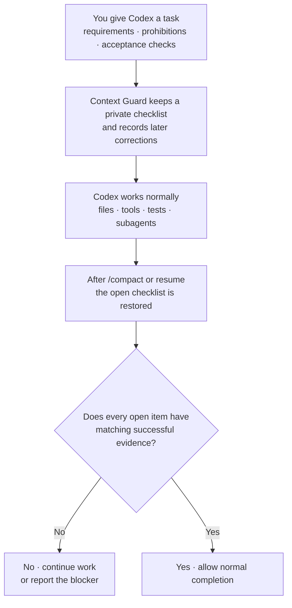

# Context Guard

[](https://github.com/GreenLv/codex-context-guard/actions/workflows/ci.yml)
[](https://github.com/GreenLv/codex-context-guard/actions/workflows/hol-plugin-scanner.yml)
[](https://github.com/GreenLv/codex-context-guard/releases)
[](LICENSE)

[简体中文](README.zh-CN.md) | [Introduction](https://greenlv.github.io/blogs/protecting-context-in-long-running-agent-tasks/) | [Changelog](CHANGELOG.md)

Context Guard keeps important requirements from disappearing during a long Codex task. It restores a private checklist after compaction or resume and requires successful evidence before the task can be reported complete.

It works beside Codex Plan, Goal, memories, subagents, worktrees, and the transcript; it does not replace or control them.

> Release status: `0.10.0` is the current source candidate; `0.9.5` is the latest published release. See the [changelog](CHANGELOG.md), [compatibility matrix](docs/COMPATIBILITY.md), and [local acceptance record](docs/LOCAL_ACCEPTANCE.md).

## Install

Requirements: Python 3.10 or newer, Codex CLI `0.146.0` or newer as the tested minimum, and a Codex surface that loads plugins and lifecycle Hooks.

```shell
git clone https://github.com/GreenLv/codex-context-guard.git
cd codex-context-guard
python3 scripts/manage_plugin.py --apply
```

On Windows:

```powershell
py -3.10 scripts\manage_plugin.py --apply
```

The installer adds this repository as a marketplace, installs `context-guard@codex-context-guard`, and verifies the installed copy. It also keeps versioned copies needed by tasks that started before an upgrade.

Installing a plugin does not trust its Hooks automatically. Start a fresh Codex task, open `/hooks`, review and trust all eight definitions, then start another fresh task so it loads the current version.

### Version and compatibility notes

- Version 0.9.5 requires a verified, full-coverage checkpoint before a task can be marked complete. It prepares routine file and text evidence automatically, preserves non-ASCII Hook input, reduces false UI matches, and rejects evidence from the wrong file, task, or Windows path. Visual and UI cases still require explicit inspection.
- Context Guard chooses a supported Python interpreter and can recover from a surviving managed cache. If neither is available, it stops with a reinstall hint instead of guessing.

Detailed version and platform evidence is in the [compatibility matrix](docs/COMPATIBILITY.md), [changelog](CHANGELOG.md), and [local acceptance record](docs/LOCAL_ACCEPTANCE.md).

## Try it

In a fresh task, activate Context Guard:

```text
$context-guard
```

Then inspect the protected state:

```text
context-guard status
context-guard diagnose
```

For a recovery check, use it on a non-trivial synthetic task, run `/compact`, and confirm that the same open requirements return immediately afterward.

## What it protects

- Requirements, acceptance criteria, prohibitions, and later corrections keep stable task-local identities.
- Compaction and resume restore the open checklist instead of relying only on a conversational summary.
- Successful tool evidence must match the named file, URL, image, or other requested result before it can close an item.
- Images and other multimodal inputs keep only hashes and bounded metadata. When the user asks for an image change, completion evidence can be tied to an inspection of the changed image rather than merely to a successful tool call.
- Ambiguous output remains `unknown`; damaged or unverifiable private state fails closed.
- Exports are explicit and redacted. Image bytes, credentials, and raw transcript content are not copied into the requirement ledger.

Automatic checks are used only when the request names a concrete target, such as a file, URL, edited image, or complete object list. If Context Guard cannot verify a result exactly, it leaves the item open instead of guessing. Waiting for the user, an external result, or a later turn does not close unfinished requirements.

## Who decides what

- The user decides the task and which changes are allowed.
- Repository instructions and selected Skills define the adopted workflow, but cannot grant new authority.
- Codex Plan describes the model's current steps; Context Guard can keep a read-only reference but does not edit the plan.
- Tool, file, image, UI, and public-page readbacks establish facts. A successful result cannot authorize a push, release, installation, or other change by itself.

Context Guard records these boundaries when the project opts in and asks for review if the adopted instructions or plan change. It does not intercept tools or grant permissions.

## How it works



Codex still owns the work and its native planning state. Context Guard carries the checklist across context boundaries and, when project instructions have been adopted explicitly, restores their unfinished phases and plan reference before checking completion.

## Everyday example: write a technical design document without losing decisions

Suppose the task is:

```text
Write docs/design/checkout-v2.md.

- Keep the approved API and data-flow decisions unchanged.
- Do not change the rollout date or add infrastructure commitments.
- Follow the RFC template.
- Give every recommendation a source link or a "to verify" label.
```

After research, edits, diagrams, and `/compact`, Context Guard restores those same items. A passing Markdown check cannot close the whole task: the approved decisions, RFC template, source links, and prohibited commitments each still need matching evidence.

This example explains the contract boundary; it does not claim that Context Guard can decide whether the design itself is sound.

## What you may see in a guarded task

| ID | Meaning |
| --- | --- |
| `R001` | A requirement captured for this task. |
| `A003` | An acceptance item checked independently. |
| `E####` | A successful evidence record that may close a compatible item. |

These are task-local identifiers, not GitHub issues or global task numbers. They may appear in progress text but the private ledger is not printed in the final reply.

## When Context Guard asks Codex to continue

When an open requirement still lacks matching evidence, Context Guard may ask Codex to continue with this standard redacted message:

```text
[Context Guard continuation] The task is not yet safely complete.
```

The message is normal when requested work is still open. If it is unexpected, ask Codex what remains and run `context-guard status` or `context-guard diagnose`. Waiting for the user, an external result, or an explicitly deferred step can end the current turn without closing the task.

Existing tasks may keep the Hook version they started with. Start a fresh task after an upgrade; if an old Hook path is missing, see [Versioning](docs/VERSIONING.md) for recovery guidance.

## User controls

| Command | Purpose |
| --- | --- |
| `$context-guard` or `context-guard on` | Activate recovery and completion gating. |
| `context-guard off` | Disable gating while preserving prompt journaling. |
| `context-guard status` | Show protected-state counts without raw prompts. |
| `context-guard diagnose` | Show bounded diagnostics without raw prompts or replies. |
| `context-guard export <path>` | Write an explicit redacted handoff in the current project. |
| `context-guard rollover <directory>` | Validate prepared successor input and write a non-overwriting handoff plus hash manifest. |

Read [Successor Pack Input](skills/context-guard/references/successor-pack.md) before using `rollover`. It never creates or authorizes another task.

## Private data and retention

Runtime data is stored under Codex-managed `PLUGIN_DATA`. Prompt bodies, task state, evidence summaries, and recovery files remain local runtime data and are not part of this repository.

Ended sessions are eligible for cleanup after 30 days. Redacted exports are created only when requested and omit raw prompts, transcripts, credentials, authorization headers, URL query values, and plugin-private paths. See [Privacy](docs/PRIVACY.md).

## Update and uninstall

```shell
git pull --ff-only
python3 scripts/manage_plugin.py --apply
```

Plugin source changes require a version bump. Historical caches and trusted archives remain available to tasks that already loaded them.

```shell
codex plugin remove context-guard@codex-context-guard
codex plugin marketplace remove codex-context-guard
```

Removing code does not remove private runtime data. Keep old data or caches while an active task may still depend on them.

## Documentation

- [Architecture](docs/ARCHITECTURE.md)
- [Privacy](docs/PRIVACY.md)
- [Compatibility](docs/COMPATIBILITY.md)
- [Versioning](docs/VERSIONING.md)
- [Local acceptance](docs/LOCAL_ACCEPTANCE.md)
- [Changelog](CHANGELOG.md)

## Validation

```shell
python3 scripts/validate_public_repo.py .
python3 scripts/audit_public_tree.py .
python3 -m unittest discover -s tests -p "test_*.py"
ruff check .
```

The Hook runtime uses only the Python standard library. CI covers Ubuntu, macOS, and Windows on Python 3.10–3.13; CI does not substitute for native Hook trust or installed lifecycle evidence.

## Explicit non-goals

Context Guard is not a semantic proof system, security sandbox, transcript backup, cloud sync service, second Plan/Goal controller, agent scheduler, or replacement for tests and human review.

Project instructions and plan references are adopted only after the user who started the root task runs `context-guard adopt <project-relative-json>`. Installing a Skill, loading a template, or mentioning a plan in prose does not activate this behavior. Context Guard does not block tools, modify Codex Plan state, or grant authority.

## Contributing and security

See [CONTRIBUTING.md](CONTRIBUTING.md). Report sensitive issues through GitHub Private Vulnerability Reporting as described in [SECURITY.md](SECURITY.md).

Licensed under the [Apache License 2.0](LICENSE).
