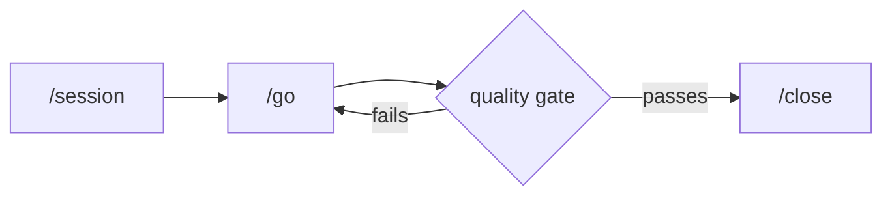

# Session Orchestrator

[](LICENSE)
[](CHANGELOG.md)
[](https://www.npmjs.com/package/session-orchestrator)

**Give your agents a working rhythm.**

You type three commands:

- **`/session`** reads your repository, your open issues and the last session, proposes what to work on, and waits for your correction.
- **`/go`** runs the agreed work in waves of parallel agents and runs your test, typecheck and lint commands between each wave. Work that fails a check goes back to be fixed before the next wave starts.
- **`/close`** checks every planned item against what actually happened, commits, and files the rest as issues for next time.

Session Orchestrator is a free, MIT-licensed workflow plugin for **Claude Code, Codex CLI, Cursor IDE, or [Pi](docs/pi-setup.md)**. It runs on your machine and writes plain text into your repository. No account, no server, nothing to sign up for.

[](https://session-orchestrator.com)



Longer explanation, with examples and screenshots: **[session-orchestrator.com](https://session-orchestrator.com)** ([auf Deutsch](https://session-orchestrator.com/de)).

[User guide](docs/USER-GUIDE.md) · [Install & upgrade](docs/install.md) · [Changelog](CHANGELOG.md)

## Install

You need **Node.js 24 or later**, a git repository, and one of the four agents below. Full requirements, upgrade path and uninstall: [docs/install.md](docs/install.md).

| Platform | Install |
|---|---|
| **Claude Code** | `/plugin marketplace add Kanevry/session-orchestrator` then `/plugin install session-orchestrator@kanevry`, then [install its Node dependencies once](docs/install.md#claude-code-install-the-node-dependencies-once). |
| **Codex CLI** | `git clone` the repo, `npm install`, then `node scripts/codex-install.mjs` ([guide](docs/codex-setup.md)). |
| **Cursor IDE** | `git clone` the repo, `npm install`, then `node scripts/cursor-install.mjs /path/to/your/project` ([guide](docs/cursor-setup.md)). |
| **Pi** | `pi install npm:session-orchestrator` ([guide](docs/pi-setup.md)). |

## Quick Start

**1. Run `/bootstrap` once in your project.** It creates the minimum structure and writes `.orchestrator/bootstrap.lock`. `/session` refuses to start until that file exists.

**2. Add a Session Config** to your project's instruction file — `CLAUDE.md` on Claude Code and Cursor, `AGENTS.md` on Codex CLI and Pi ([which file each platform reads](skills/_shared/instruction-file-resolution.md)). These seven fields are enough:

```yaml
## Session Config

test-command: npm test
typecheck-command: npm run typecheck
lint-command: npm run lint
agents-per-wave: 6
waves: 5
persistence: true
enforcement: warn
```

The first three are the commands `/go` runs between waves and `/close` runs at the end — use whatever your project actually uses. Everything else is opt-in: [full template](docs/session-config-template.md) · [every key, its type and default](docs/session-config-reference.md).

**3. Run the loop.**

```text
/session feature    # read the repo, propose scope, wait for your correction
/go                 # execute in waves, check between each
/close              # verify, commit, file the rest as issues
```

On Codex the same three are `$session-orchestrator:session feature`, `$session-orchestrator:go`, `$session-orchestrator:close` ([Codex usage](docs/codex-setup.md#usage)). `/plan` and `/evolve` extend the loop; you can start with just these three.

In headless Claude Code (`claude -p`), `/session` and `/plan` are reserved terminal-only built-in names and the bare form is refused; use `/session-orchestrator:session` and `/session-orchestrator:plan` there. Every other command keeps its bare form.

## How it works

When you type `/session feature`:

1. **It reads the project.** Git state, open issues, recent commits, documentation, host resources and the records of previous sessions become a Session Overview with one recommendation.
2. **You correct the scope.** Nothing is implemented until you agree to the plan.
3. **The work is split into waves.** The session type decides how many: housekeeping 1, feature 3, deep 5, the ultradeep profile 7. Each wave gets a purpose, a list of file paths it may write to, and a result that can be checked.
4. **`/go` runs it.** Agents whose file scopes do not overlap run at the same time on Claude Code and Codex; Cursor and Pi run them one after another. After each wave the quality gate runs, and anything it reports goes back for correction before the next wave starts.
5. **`/close` checks and records.** It compares the plan against what happened, runs the full quality gate, commits file by file, and opens issues for whatever was not finished.

**What it writes into your repository**, and nothing else — all of it plain text, all of it local:

```text
.orchestrator/bootstrap.lock        # written by /bootstrap, the gate for every later run
.orchestrator/current-session.json  # which session owns this working copy right now
.orchestrator/session.lock          # heartbeat lock; stops two sessions colliding in one checkout
.orchestrator/host.json             # host-local identity for peer-session detection
.orchestrator/metrics/*.jsonl       # append-only session, learning, event and subagent records
.orchestrator/steering/             # stable product/tech/structure context injected each session
.claude/STATE.md                    # wave progress and deviations (harness-specific directory)
```

The plugin is **50 skills, 26 slash commands, 14 typed subagents and 27 hook files across 10 event types**. A slash command is a skill whose frontmatter says `user-invocable: true` (24 of them) or one of the two remaining `commands/*.md` files (`/session`, `/templates-ack`) — one definition per name, so nothing is listed twice in the `/` picker. Skills, commands and agents are Markdown with YAML frontmatter; the code that dispatches, validates and records runs in `scripts/lib/*.mjs` and `hooks/*.mjs`. There is no build step and no compiled artifact — when a session does something you did not expect, you can open the file that decided it. Full inventory: [`docs/components.md`](docs/components.md).

## Why it is built this way

- **The wave order is deliberate.** Discovery runs first so every implementer starts from the same picture of the code. Impl-Core runs before Impl-Polish so the structure exists before anything integrates against it. The Quality wave simplifies generated code *before* tests are written — write the tests first and they assert whatever the model produced, so changing it later means rewriting the tests too.
- **Checks run between waves, not only at the end.** A mistake caught after wave 2 costs one wave. The same mistake found at `/close` has already been copied into every wave after it. Findings below the configured confidence threshold are not shown to you.
- **A crash does not lose the session.** `STATE.md` records which wave finished and what deviated from the plan. The next `/session` offers to continue from the last completed wave.
- **Two sessions in one working copy is treated as a real risk.** Two people, or two of your own sessions, in the same checkout share one git index, one filesystem and one `STATE.md`, and neither can see the other's uncommitted work. A heartbeat session lock, per-agent file-scope manifests, and the PSA rules in [`.claude/rules/parallel-sessions.md`](https://github.com/Kanevry/session-orchestrator/blob/main/.claude/rules/parallel-sessions.md) exist for exactly that case.
- **Guards run where the harness supports them, and the table below says where it does not.** A destructive-command policy — 11 rules block, 4 warn — and file-scope enforcement run as real hooks on Claude Code, as bridges on Cursor and Pi, and as instructions only on Codex. Details: [`docs/components.md`](docs/components.md#other-surfaces).
- **What it learns is opt-in and readable.** Every session appends a record. After 5 or more sessions, `/evolve analyze` proposes patterns with a confidence score; you read them and delete the ones you disagree with. Nothing is applied without you.
- **GitLab and GitHub, both fully.** It detects which one your remote points at and drives issues and merge/pull requests for either.

How this compares to other orchestrators, with measured results kept separate from unmeasured claims: [`docs/components.md` § Comparisons](docs/components.md#comparisons).

## Platform support

| Feature | Claude Code | Codex CLI | Cursor IDE | Pi |
|---|---|---|---|---|
| All 26 commands | Native slash commands | Generated skills (`$session-orchestrator:<name>`) | Native `.cursor/commands` slash commands | Prompt templates |
| Parallel agents | Agent tool | Multi-agent roles | Sequential only | Sequential (parallel planned) |
| Session persistence | `.claude/STATE.md` | `.codex/STATE.md` | `.cursor/STATE.md` | `.pi/STATE.md` |
| Scope enforcement | Active PreToolUse hook; blocking in `strict`, reporting in `warn` | Instructions only; no compatible `apply_patch` handler | `preToolUse` + `beforeShellExecution` bridge; scope blocking requires `strict`; `afterFileEdit` is post-hoc | `tool_call` bridge; scope blocking requires `strict` |
| Destructive-command guard | Active PreToolUse hook applies policy severity | Instructions only; no handler wired | `beforeShellExecution` bridge for supported commands | `tool_call` bridge for supported commands |
| AskUserQuestion | Native tool | Numbered-list fallback | Numbered-list fallback | Numbered-list fallback |
| Quality gates | Full | Full | Full | Full |

All four platforms share the same skills, commands and scripts; only the hooks differ, because each harness fires different events. Codex leaves its `PreToolUse` handlers empty because these guards do not yet match its tool names and edit payloads ([why](docs/codex-setup.md#why-our-pretooluse-guards-stay-unwired--the-reason-corrected)). Cursor and Pi have known event-coverage limits — see [`docs/cursor-setup.md`](docs/cursor-setup.md) and [`docs/pi-setup.md`](docs/pi-setup.md).

## Recent highlights (v5.3.0)

Highlights of the v5.3.0 line:

- **Gate commands die as a group now.** Both quality-gate paths start every command in its own process group and, on timeout, signal the whole group — SIGTERM, a grace period, then SIGKILL — instead of just the shell. The previously uncapped path B carries a 900 s ceiling and reports exit 124. Root cause was measured on 2026-09-20: four orphaned `tsgo --noEmit` processes at up to 8 GB each froze the host after a plain shell kill left them at PPID 1 (#1425, #1427, #1428).
- **An orphan watchdog, shipped off.** `scripts/lib/orphan-reaper.mjs` decides purely (own ancestry register ∧ PPID 1 ∧ age ∧ read-only allowlist ∧ identity re-checked before every signal) and runs detached from two hooks, throttled to one scan per 30 s. `reaper.enabled` defaults to `false` and `mode` to `report`; arming `kill` waits for a measured false-alarm rate (ADR-0015, HR-107).
- **Ledgers stop lying by omission.** `readEventsWithRotations` answers `complete: true | false | null`, a hand-placed archive is a notice rather than a gap, and the session-start probe plus the abandoned-session backfill read across rotations. `worktree_base_checked` records every worktree dispatch, including why it could not measure (#1423, #1414, #1424).
- **Codex entrypoints aligned** (MR !40, #1391): the `session` command reaches the portable `.agents/` surface, modes are parsed independently of the free text that follows, and `go`/`close` stay explicit-only on every generated surface.

Full changes and verification: [CHANGELOG.md](CHANGELOG.md).

## Documentation

- [User guide](docs/USER-GUIDE.md) — config reference, a walkthrough of one session, troubleshooting, FAQ
- [Install, upgrade, uninstall](docs/install.md) — requirements, per-harness setup, migration paths
- [Components & reference](docs/components.md) — every skill, command, agent and hook; the guards; comparisons
- [Telemetry](docs/telemetry.md) — what stays on your machine, what the optional anonymous telemetry would send, and every switch that turns it off
- [Contributing](https://github.com/Kanevry/session-orchestrator/blob/main/CONTRIBUTING.md) · [Plugin architecture](docs/plugin-architecture-v3.md) · [docs/ router](docs/README.md)

## Scope and support

Provided **as-is**: a community project, best-effort maintenance, no SLA. Questions and ideas go to [Discussions](https://github.com/Kanevry/session-orchestrator/discussions), bugs to [Issues](https://github.com/Kanevry/session-orchestrator/issues).

It is **not** an official product of any agent vendor — independent and community-maintained, not affiliated with, endorsed by or sponsored by Anthropic, OpenAI, Cursor or any agent it integrates with, and distributed through the Claude Code plugin marketplace without being an Anthropic product. It does **not replace** your agent; it runs on top of one, and you still need it installed. It is built for **one operator**: the parallel-session machinery protects your own concurrent sessions, not a shared team workspace.

The reasoning behind the method is taught at [agenticbuilders.at](https://agenticbuilders.at). The plugin is free and MIT; the courses go deeper and are not required to use it.

## License

[MIT](LICENSE) · [Privacy policy](https://gotzendorfer.at/en/session-orchestrator/privacy) · [npm](https://www.npmjs.com/package/session-orchestrator)
