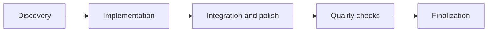

# Session Orchestrator

[](LICENSE)
[](CHANGELOG.md)
[](https://www.npmjs.com/package/session-orchestrator)
[](docs/telemetry/telemetry-claims.md)

**Give your agents a working rhythm.**

Plan the work. Run it in checked waves. Pick up where you left off. Session Orchestrator is a free, MIT-licensed workflow plugin for **Claude Code, Codex CLI, Cursor IDE, or [Pi](docs/pi-setup.md)**. It reads your repository and issues, coordinates scoped work, and records what passed and what remains.

[](https://session-orchestrator.com)


[34-second film](site/video/session-orchestrator-film.mp4) · [22-second camera preview](site/video/session-orchestrator-4.3-preview.mp4) · [How the film is made](marketing/vidlab/README.md)

The film shows the workflow: read first, then build in parallel lanes, check every step, send back what fails, and step in where it matters. Illustrations are generated with AI. The 22-second preview covers the planned 4.3 campaign; the current published release is 4.2.0.

[Website](https://session-orchestrator.com) · [User guide](docs/USER-GUIDE.md) · [Platform support](#platform-support) · [Changelog](CHANGELOG.md)

The same workflows are available on all four harnesses; Codex exposes commands as selectable skills. **Guard enforcement depends on the harness.** Claude Code runs the guard hooks directly; Cursor and Pi use bridges with documented limits. On Codex, destructive-command and file-scope rules are instructions only. With an active compatible scope hook, `strict` blocks supported out-of-scope edits, `warn` reports them without denial, and `off` disables the check (see [Platform support](#platform-support)).

## Requirements

| | |
|---|---|
| **Node.js** | **24 or later** (`node --version`) ; `package.json` `engines.node` is `>=24.0.0`. The plugin is ES modules and needs a real Node runtime. [Install Node.js](https://nodejs.org/). |
| **A coding agent** | Claude Code, Codex CLI, Cursor IDE, or Pi. This is a workflow layer *on top of* one of them, not a replacement. |
| **Harness version** | Codex CLI **0.144.4 or later** ([docs/codex-setup.md](docs/codex-setup.md)). No minimum is pinned for Claude Code, Cursor, or Pi; if `/plugin` (or the Cursor/Pi installer) runs, the plugin loads. |
| **OS** | macOS and Linux are tested in CI. Windows is untested and best-effort; shell hooks and the optional Bash/`jq` MCP server need WSL or Git Bash. |
| **Git** | A git repository. Session-orchestrator reads git state at every session start and commits at close. |

## Install

| Platform | Install |
|---|---|
| **Claude Code** | `/plugin marketplace add Kanevry/session-orchestrator` then `/plugin install session-orchestrator@kanevry` (run both inside Claude Code). |
| **Codex CLI** | `git clone https://github.com/Kanevry/session-orchestrator.git ~/Projects/session-orchestrator && cd ~/Projects/session-orchestrator && npm install && node scripts/codex-install.mjs` |
| **Cursor IDE** | `git clone https://github.com/Kanevry/session-orchestrator.git ~/Projects/session-orchestrator && cd ~/Projects/session-orchestrator && npm install && node scripts/cursor-install.mjs /path/to/your/project` |
| **Pi** | `pi install npm:session-orchestrator` ; dev fallback: `git clone https://github.com/Kanevry/session-orchestrator.git ~/Projects/session-orchestrator && cd ~/Projects/session-orchestrator && npm install && node scripts/pi-install.mjs /path/to/your/project --settings-only` |

For Claude Code, also install the package's Node dependencies **once** and restart Claude Code. First locate the installed plugin:

```bash
claude plugin list --json
```

Find the enabled `session-orchestrator@kanevry` entry, then replace the placeholder below with its `installPath` value:

```bash
cd "/absolute/installPath/from/the/list" && npm install
```

If that entry is missing or disabled, resolve it through `/plugin` first. Use the path reported for that entry; another cached version or a nested dependency is not the installed plugin.

Setup guides: [Codex](docs/codex-setup.md) · [Cursor IDE](docs/cursor-setup.md) · [Pi](docs/pi-setup.md). Per-IDE notes on `CLAUDE.md` vs `AGENTS.md`: [instruction-file-resolution](skills/_shared/instruction-file-resolution.md).

## Quick Start

In Codex, select the corresponding **Session Orchestrator** skill in the picker or use `$session-orchestrator:<command>`; the slash commands below name the shared workflows. For example, bootstrap with `$session-orchestrator:bootstrap`. See [Codex usage](docs/codex-setup.md#usage).

**1. Bootstrap the repo once.** Run `/bootstrap` in your project. It scaffolds the minimum structure and writes `.orchestrator/bootstrap.lock`, which session-start requires before `/session` will run.

**2. Declare a Session Config.** Add a `## Session Config` section to your project's `CLAUDE.md` (Claude Code, Cursor IDE) or `AGENTS.md` (Codex CLI, Pi). See [instruction-file-resolution](skills/_shared/instruction-file-resolution.md) for which file each platform reads. The smallest valid config is seven fields:

```yaml
## Session Config

test-command: npm test
typecheck-command: npm run typecheck
lint-command: npm run lint
agents-per-wave: 6
waves: 5
persistence: true
enforcement: warn
```

Everything else is opt-in. Full template: [`docs/session-config-template.md`](docs/session-config-template.md). Canonical types and defaults: [`docs/session-config-reference.md`](docs/session-config-reference.md).

**3. What the first `/session` writes into your repo.** Nothing outside these paths, all plain text, all local:

```text
.orchestrator/bootstrap.lock        # written by /bootstrap, the gate for every later run
.orchestrator/current-session.json  # which session owns this working copy right now
.orchestrator/session.lock          # heartbeat lock; stops two sessions colliding in one checkout
.orchestrator/host.json             # host-local identity for peer-session detection
.orchestrator/metrics/*.jsonl       # append-only session, learning, event and subagent records
.orchestrator/steering/             # stable product/tech/structure context injected each session
.claude/STATE.md                    # wave progress and deviations (harness-specific directory)
```

## A session in three commands

```text
/session feature    # research + Q&A: inspect git, issues, history, then agree on scope
/go                 # execute in typed waves sized by session type (feature: 3, deep: 5); quality gate between each
/close              # verify every item, commit cleanly, file carryover issues for the rest
```

In Codex, invoke the same loop through the generated command skills:

```text
$session-orchestrator:session feature
$session-orchestrator:go
$session-orchestrator:close
```

These entries preserve each command's full workflow and prechecks. Codex's native `/goal` is a separate feature. `/plan` and `/evolve` extend the loop, but you can start with just these three.

## Upgrade

```text
/plugin update session-orchestrator@kanevry     # Claude Code
```

Restart the harness afterwards, and re-run `npm install` in the plugin directory when the release adds dependencies. On Cursor and the Pi clone fallback, upgrade with `git pull` in your clone followed by the same install script you originally ran. Manage npm-installed Pi packages through Pi's package manager. For Codex, follow the [refresh instructions](docs/codex-setup.md#refresh-and-explicit-cache-invalidation) for your marketplace source, then reload the skill picker or restart Codex.

Session-start tells you when the running copy is behind: `scripts/lib/plugin-update-banner.mjs` compares the version of the code **that is actually loaded** against the published npm version and warns in the session-start banner (minor or major; patch-only updates stay silent). It fails silent: offline, a non-2xx response, or a malformed answer produces *no statement*, never a false "up to date".

Upgrading across a major version: **[docs/migration-v4.md](docs/migration-v4.md)** is the current one. v4.0.0 removes five skills, three commands and eight top-level scripts, each on a measured 90-day two-signal rule rather than a judgement call, and it names what replaces every removed invocation. [docs/migration-v3.md](docs/migration-v3.md) documents the older v2 → v3 path and the shape both guides follow (what changes · prerequisites · per-platform steps · what stays · known issues · rollback).

## Uninstall

Remove the plugin through your harness's own plugin manager: `/plugin` in Claude Code (marketplace entry `session-orchestrator@kanevry`), `codex plugin remove` on Codex CLI ([docs/codex-setup.md](docs/codex-setup.md)), or Pi's package manager for an npm-installed Pi package. On Cursor and the Pi clone fallback, delete the files the installer wrote into your project.

**What stays behind in your repo.** None of it is removed by uninstalling, and all of it is plain text you can delete by hand:

- `.orchestrator/`: `bootstrap.lock`, `metrics/` (your session and learning JSONL records), `policy/`, `steering/`, `runtime/`, `peers/`, `session.lock`
- `STATE.md` under your harness's state directory (`.claude/STATE.md` on Claude Code; see [Platform support](#platform-support))
- The `## Session Config` block you added to `CLAUDE.md` / `AGENTS.md`
- `.claude/rules/*.md` if you vendored the rule library via `/bootstrap --sync-rules`

Deleting `.orchestrator/metrics/` deletes your session history. Telemetry requires explicit consent (see [Data & telemetry](#safety--data--telemetry)). The session-start update check (`scripts/lib/plugin-update-banner.mjs`) makes an anonymous `GET` to the npm registry to compare your installed version against the latest release. Successful results are cached for 24 hours per repo; failed checks can retry at the next session start. Set `SO_DISABLE_UPDATE_CHECK=1` (or `DO_NOT_TRACK=1`) to turn it off.

## Lifecycle and waves

**Plan, Go, Close** describes the working rhythm. Bootstrap once per project, then start a session, execute its agreed scope, and close with evidence.

| Step | What happens | What carries forward |
|---|---|---|
| **Plan** | Read the code, issues and prior session. Agree the objective and assign file scopes. | One shared plan and separate responsibilities. |
| **Go** | Run independent tasks, combine the changes, check the result and fix findings. | Changes with verification evidence. |
| **Close** | Check the plan against the work, commit the result and record unfinished tasks. | A handover for the next session. |

Housekeeping uses **one** wave. Deep uses **five**; the **ultradeep** profile uses **seven**. Claude Code and Codex can run independent work in parallel. Cursor and Pi execute tasks sequentially. A failing check sends the findings back for correction.

<details>
<summary>Deep-session stages and the ultradeep profile</summary>



The deep session uses Discovery, Impl-Core, Impl-Polish, Quality and Finalization. Checks run between waves, with a full configured quality gate before completion. The diagram shows the successful path, not a guarantee that the first attempt passes.

Ultradeep is a profile over `session-type: deep`, not a fourth session-type value. It runs Research, Code-Discovery, Impl-Core, Impl-Polish, a read-only Review-Panel, Quality and Release, with a coordinator Synthesis-Gate after the first two waves. Downstream tooling still sees `deep`.

`/plan` is optional when you need a PRD or retrospective before a session. `/evolve` deliberately extracts patterns across sessions.

</details>

## How it works

The workflow starts with the state of the project. The plan records what to change, who handles each part and what counts as verified.

When you type `/session feature`:

1. **Read the project.** Git state, open issues, recent commits, documentation, resource health and prior-session records inform a Session Overview with a recommendation.
2. **Agree the scope.** Review the proposed work and correct the plan before implementation.
3. **Assign the work.** The session type determines the wave structure. Each wave has a purpose, declared paths and a result to verify.
4. **`/go` executes.** Independent agents can work in parallel on Claude Code and Codex; Cursor and Pi execute sequentially. Reviews and checks bring the work back together.
5. **`/close` verifies and records it.** Check planned items, run the full quality gate, commit the result and record unfinished work as carryover. The coordinator stages files individually.

Two complementary commands round out the loop: **`/plan`** runs *before* a session when you need a PRD or retrospective; **`/evolve`** runs occasionally to surface patterns across sessions and feed them back at the next start.

The system is markdown-driven config plus a thin Node runtime. Skills, commands, and agents are Markdown with YAML frontmatter; `scripts/lib/*.mjs` and `hooks/*.mjs` handle dispatch, validation, and telemetry. Everything is plain text: if something goes wrong, you can read every file and see what happened.

## What you get

Counts measured on 2026-09-07 with the command in brackets:

- **43 skills** for the session lifecycle (start, plan, execute, close, evolve), discovery, vault sync, MCP authoring, debugging, brainstorming, plan grilling, persona panels, cross-repo dispatch, learning→rule reconciliation, session-process eval, and audits (`ls -d skills/*/ | grep -v _shared | wc -l`)
- **25 slash commands** (`/session`, `/go`, `/close`, `/discovery`, `/plan`, `/grill`, `/evolve`, `/autopilot`, `/dispatcher`, `/reconcile`, `/eval`, `/test`, `/debug`, …) (`ls commands/*.md | wc -l`)
- **14 typed subagents** (code-implementer, test-writer, security-reviewer, session-reviewer, qa-strategist, architect-reviewer, …) (`ls agents/*.md | wc -l`)
- **27 hook files across 10 event types** for scope checks, destructive-command policy, templates-first gates and telemetry. Claude Code runs the guard hooks directly; Cursor and Pi bridge supported calls. Codex does not enforce the destructive-command or file-scope guard ([Platform support](#platform-support)) (`ls hooks/*.mjs | wc -l`)
- **26 rule files** and **18 ADRs** carrying the reasoning behind the mechanisms (`ls .claude/rules/*.md | wc -l`, `ls docs/adr/*.md | wc -l`)
- **664 vitest test files** covered by the full quality gate and CI; 13,789 static `it()`/`test()` definitions at that measurement, and the runtime total is higher because of parameterised blocks ([methodology](docs/telemetry/telemetry-claims.md)) (`find tests -name '*.test.mjs' | wc -l`); Full Gate 2026-09-09: 16847 passed / 11 skipped / 664 files

**Portable across harnesses by construction.** `scripts/generate-agents-skills.mjs` generates root `AGENTS.md` byte-identical from `CLAUDE.md` and the `.agents/skills/<name>/SKILL.md` mirrors, with spec-legal frontmatter and pointers to canonical instructions. `scripts/generate-codex-skills.mjs` generates the Codex command entrypoints. Plugin validation checks both surfaces. Separate manifests under `.claude-plugin/`, `.codex-plugin/` and `.cursor-plugin/` register each harness's components; see [Codex manifest compatibility](docs/codex-setup.md#manifest-compatibility).

Full component inventory: [`docs/components.md`](docs/components.md). Version history and per-release detail: [CHANGELOG.md](CHANGELOG.md).

## Why this design

- **Typed waves, not one big batch.** Discovery first, so implementers start with shared context. Impl-Core before Impl-Polish, so architecture lands before integrations. Quality runs a *simplification pass* on AI-generated code **before** tests are written; otherwise tests pin the AI patterns into place.
- **Inter-wave reviews, not just end-of-session.** Catching regressions between waves stops a bad pattern from propagating into later work; the confidence floor filters speculative criticism so only high-signal findings reach you.
- **State persists across crashes.** `STATE.md` records wave progress and deviations; the next `/session` offers to resume from the last completed wave.
- **Hook enforcement has a defined platform boundary.** On Claude Code, the active destructive-command hook applies the policy’s blocking and warning rules. With an active compatible scope hook, supported writes outside declared paths warn in `warn` mode and block in `strict` mode; `off` disables scope checking. Cursor and Pi bridge supported events. Both guards are instructions only on Codex ([Platform support](#platform-support)).
- **Parallel *operator* sessions are treated as a hazard.** Two humans, or two of your own sessions, in the same working copy share one git index, one filesystem, one `STATE.md`. A heartbeat session lock, peer-scope manifests, and the PSA rule set in [`.claude/rules/parallel-sessions.md`](https://github.com/Kanevry/session-orchestrator/blob/main/.claude/rules/parallel-sessions.md) exist for exactly that axis.
- **Cross-session learning is opt-in and inspectable.** Every session writes a record; after 5+ sessions `/evolve analyze` extracts confidence-scored patterns you can read and prune. Nothing is hidden.
- **VCS dual support, no lock-in.** Auto-detects GitLab or GitHub from your remote and drives the full lifecycle for both.

A comparison with other orchestrators, distinguishing measured results from unmeasured claims: [`docs/components.md` § Comparisons](docs/components.md#comparisons).

## Recent highlights (v4.2.0)

Highlights of the v4.2.0 line:

- **One place resolves a session into its shape.** `node scripts/session-shape.mjs` turns a mode (housekeeping/feature/deep, optional ultradeep profile) into waves, per-wave agent caps, isolation and enforcement, and records the result as an event. Housekeeping is now the maintenance loop (drift-check, sweep, evolve, reconcile, dialectic, memory-cleanup), driven by the session-start `maintenance-due` probe instead of close-time nudges.
- **Honest cost numbers.** Subagent telemetry schema v2 counts cache-read and cache-creation tokens (previously under-reported ~65,000×); a per-model price table rolls up USD per session. The issue-budget ledger is reconciled against the session record at close.
- **Leaner tree.** A dead-code sweep removed 13 unreachable library modules and their tests; `js-yaml` patched for GHSA-2883-xcg3-v3hh; ten reconciled learnings absorbed into the thematic rule files so the generated-rule surface stays under budget.

If upgrading from before 4.0, read [the v4 migration guide](docs/migration-v4.md). Full changes and verification: [CHANGELOG.md](CHANGELOG.md).

## Platform support

| Feature | Claude Code | Codex CLI | Cursor IDE | Pi |
|---|---|---|---|---|
| All 25 commands | Native slash commands | Generated skills (`$session-orchestrator:<name>`) | Native `.cursor/commands` slash commands | Prompt templates |
| Parallel agents | Agent tool | Multi-agent roles | Sequential only | Sequential (parallel planned) |
| Session persistence | `.claude/STATE.md` | `.codex/STATE.md` | `.cursor/STATE.md` | `.pi/STATE.md` |
| Scope enforcement | Active PreToolUse hook; blocking in `strict`, reporting in `warn` | Instructions only; no compatible `apply_patch` handler | `preToolUse` + `beforeShellExecution` bridge; scope blocking requires `strict`; `afterFileEdit` is post-hoc | `tool_call` bridge; scope blocking requires `strict` |
| Destructive-command guard | Active PreToolUse hook applies policy severity | Instructions only; no handler wired | `beforeShellExecution` bridge for supported commands | `tool_call` bridge for supported commands |
| AskUserQuestion | Native tool | Numbered-list fallback | Numbered-list fallback | Numbered-list fallback |
| Quality gates | Full | Full | Full | Full |

All platforms share the same skills, commands, and scripts; hooks use platform-specific adapters and event subsets. Codex leaves `PreToolUse` handlers empty because these guards do not yet match its tool names and edit payloads. Both the destructive-command and file-scope guards are instructions only there; see [`docs/codex-setup.md`](docs/codex-setup.md#why-our-pretooluse-guards-stay-unwired--the-reason-corrected). Platform detection lives in `scripts/lib/platform.mjs`. Cursor and Pi have known event-coverage limits; see [`docs/cursor-setup.md`](docs/cursor-setup.md) and [`docs/pi-setup.md`](docs/pi-setup.md).

## Safety & data & telemetry

**Your data stays in your repo.** Session Orchestrator runs locally, requires no account, and writes its records as append-only JSONL under `.orchestrator/metrics/` in *your* repository: sessions, learnings, events, subagent records. Those files are yours: readable, greppable, deletable. Optional anonymous usage telemetry is **off until you explicitly consent** and is separate from the local records ([docs/telemetry.md](docs/telemetry.md) says exactly what it would collect and how to turn it off). Reported metrics describe *this* repository under its own conditions and will not transfer unchanged to yours ([details](docs/telemetry/telemetry-claims.md)).

**Destructive-command guard.** On Claude Code, the active `hooks/pre-bash-destructive-guard.mjs` applies `.orchestrator/policy/blocked-commands.json` in the main session and in subagent waves. The policy has 10 blocking rules (`git reset --hard`, `rm -rf`, `git push --force`, and more) and 4 warning rules. Cursor and Pi use event bridges with documented limits; Codex does not enforce this guard. Scope `enforcement: warn` or `off` does not change the separate destructive-command policy. See [Platform support](#platform-support). Where the hook is active, bypass it per session only for intentional maintenance:

```yaml
allow-destructive-ops: true
```

The rule source of truth is [`.claude/rules/parallel-sessions.md`](https://github.com/Kanevry/session-orchestrator/blob/main/.claude/rules/parallel-sessions.md) (PSA-003), vendored to consumer repos via `/bootstrap`.

**Import probe.** `hooks/post-edit-import-probe.mjs` (PostToolUse on `Edit`/`Write`/`MultiEdit`) guards the other direction: a hook-reachable helper saved in a broken intermediate state makes *every* Bash/Edit/Write call fail with an internal hook error, host-wide, for every session sharing the working copy. Right after such a file is saved the probe runs ESLint `no-undef` on it (plus a child-process `import()` for `scripts/lib/**`) and reports the blast radius; it never blocks and always exits 0. It only fires for files listed in the committed allowlist [`hooks/_lib/hook-import-set.json`](hooks/_lib/hook-import-set.json), regenerated by `node scripts/generate-hook-import-set.mjs`. Kill switch: `SO_DISABLED_HOOKS=post-edit-import-probe`.

## Troubleshooting

**Codex plugin or hooks not loading.** Start with `codex plugin list --available --json`. Confirm `session-orchestrator@kanevry` is installed, enabled, unique, and at the tracked manifest version; then start a fresh task and review `/hooks`. Remove only the two allowlisted legacy IDs through `codex plugin remove`, and resolve marketplace conflicts through the public marketplace remove/add lifecycle before reinstalling. Any other pre-public plugin/config/cache/hook-state residue is unsupported: do not modify private Codex files; file an issue with `codex --version` plus the public plugin and marketplace list output. Full decision tree: [`docs/codex-setup.md`](docs/codex-setup.md#troubleshooting).

**Node is missing from the hook PATH.** The harness executes hook commands via `/bin/sh -c` with its own PATH. That shell does not source `~/.zshrc`/`~/.bashrc`, so Node installed via Homebrew, nvm, volta, or asdf can be invisible to hooks even though `node` works in your terminal. All hook commands route through [`hooks/run-node.sh`](hooks/run-node.sh), which resolves Node via `$SO_NODE_BIN` → PATH → well-known install dirs → nvm and degrades gracefully: hooks are skipped with **one** warning per 6 hours instead of a shell error on every tool call. Fixes, in order of preference: launch the harness from a shell where `node` resolves; export `SO_NODE_BIN=/abs/path/to/node`; or install Node 24+ to a standard location.

**`/session` refuses to start.** It needs `.orchestrator/bootstrap.lock`. Run `/bootstrap` first, or `/bootstrap --retroactive` if the repo already has a `## Session Config` block.

## Development

```bash
git clone https://github.com/Kanevry/session-orchestrator.git && cd session-orchestrator
npm install
npm test          # vitest
npm run lint      # ESLint v10 + Prettier
npm run typecheck # node --check on every .mjs file
```

`.npmrc` ships with `ignore-scripts=true` (supply-chain defence), so Husky git hooks don't auto-wire on install. Run `npx husky` once after cloning. `git commit` then runs gitleaks → owner-privacy scan → lint-staged → commitlint. CI re-runs everything, plus more.

Two directories share the name *rules* and play opposite roles: [`rules/`](rules/README.md) is the **deliverable rule library** shipped *out* to consumer repos via `/bootstrap --sync-rules`, while [`.claude/rules/`](https://github.com/Kanevry/session-orchestrator/tree/main/.claude/rules/) is this repo's own rule set with always-on and path-scoped entries.

Contributor docs: [Plugin Architecture (v3)](docs/plugin-architecture-v3.md) · [CONTRIBUTING.md](https://github.com/Kanevry/session-orchestrator/blob/main/CONTRIBUTING.md) · [sub-agent authoring spec](docs/agent-authoring.md).

## Why I built it

I kept a Notion page with 20–30 prompts for different projects. Before each session I copied the relevant row and explained how I wanted to work again. That routine gradually became Plan, Go, Close. I use it on my Mac M4 and the M5 at the office; Session Orchestrator is the tool that grew out of it.

## Support & scope

Session Orchestrator is provided **as-is**, a community project with no SLA, no commercial support contract, and no guaranteed response time. Maintenance is best-effort.

[Buy me a coffee, if this helped.](https://paypal.me/Kanevry)

- Questions, ideas, show-and-tell → [GitHub Discussions](https://github.com/Kanevry/session-orchestrator/discussions)
- Bugs and feature requests → [Issues](https://github.com/Kanevry/session-orchestrator/issues)

What it is **not**:

- **Not an official product of any agent vendor.** An independent, community-maintained project, not affiliated with, endorsed by, or sponsored by Anthropic, OpenAI, Cursor, or any agent it integrates with. (It is distributed through the Claude Code plugin marketplace, but is not an Anthropic product.)
- **Not a replacement** for Claude Code / Codex CLI / Cursor / Pi. It is a workflow layer that runs *on top of* your existing agent; you still need one of those installed.
- **Not a multi-user product.** Single-operator by design; the parallel-session machinery protects one operator's concurrent sessions, not a shared team workspace.

## Documentation

- [docs/ Router](docs/README.md): living reference vs. public decision history vs. active work documents
- [User Guide](docs/USER-GUIDE.md): installation, config reference, workflow walkthrough, FAQ
- [Components & Reference](docs/components.md): full skill/command/agent/hook inventory, repository anatomy, comparisons
- [Plugin Architecture (v3)](docs/plugin-architecture-v3.md): contributor guide, layering, hook anatomy, testing
- [Migration to v4](docs/migration-v4.md): upgrade path, removed surfaces and replacements
- [Telemetry](docs/telemetry.md) · [Telemetry claims](docs/telemetry/telemetry-claims.md): what is collected, how metrics are measured, why they may not transfer
- [Example Configs](https://github.com/Kanevry/session-orchestrator/tree/main/docs/examples/): Session Config examples for Next.js, Express, Swift
- [CHANGELOG.md](CHANGELOG.md): version history

We follow [Conventional Commits](https://www.conventionalcommits.org/). See [CONTRIBUTING.md](https://github.com/Kanevry/session-orchestrator/blob/main/CONTRIBUTING.md).

## Learn the method behind it

This plugin is a methodology turned into code. The reasoning behind it is taught hands-on at **[agenticbuilders.at](https://agenticbuilders.at)**: [Multi-Agent Orchestration](https://agenticbuilders.at/orchestrierung) and [Loop Engineering](https://agenticbuilders.at/loop-engineering). The courses cover why execution runs in waves, why each wave ends at a verification gate, and how to make an autonomous loop that finishes. The plugin is free and MIT; the courses are for going deeper, not a requirement for using it.

## Links

[Homepage](https://session-orchestrator.com) (also at [/de](https://session-orchestrator.com/de) in German, with the workflow, installation paths and platform limits) · [Privacy Policy](https://gotzendorfer.at/en/session-orchestrator/privacy) · [npm](https://www.npmjs.com/package/session-orchestrator)

## License

[MIT](LICENSE)
