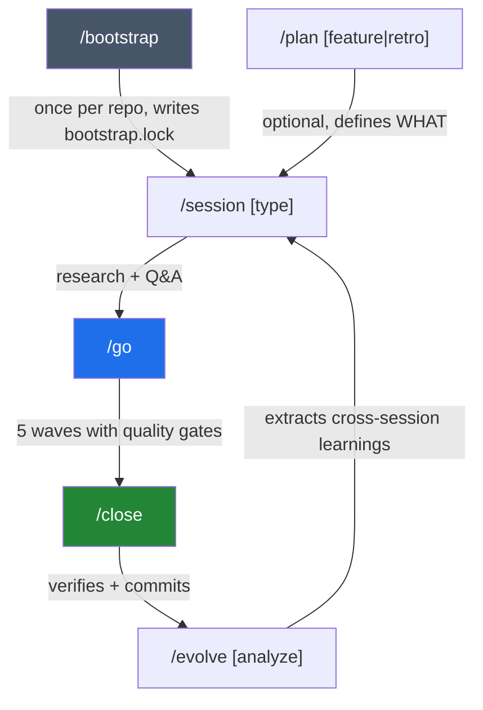
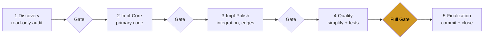

# Session Orchestrator

[](LICENSE)
[](CHANGELOG.md)
[](https://www.npmjs.com/package/session-orchestrator)
[](docs/telemetry/telemetry-claims.md)

Loop engineering for AI coding agents — turn ad-hoc sessions into a repeatable research → plan → wave-execute → close loop with verification gates. Runs on **Claude Code, Codex CLI, Cursor IDE, and [Pi](docs/pi-setup.md)**, as a community plugin (MIT, community-maintained) for solo devs and small teams.

The same workflows are available on all four harnesses; Codex exposes commands as selectable skills. **Enforcement depth differs** — scope enforcement is full on Claude Code, bridged on Cursor and Pi, and currently unavailable on Codex CLI (see [Platform support](#platform-support)).

## Requirements

| | |
|---|---|
| **Node.js** | **24 or later** (`node --version`) — `package.json` `engines.node` is `>=24.0.0`. The plugin is ES modules and needs a real Node runtime. [Install Node.js](https://nodejs.org/). |
| **A coding agent** | Claude Code, Codex CLI, Cursor IDE, or Pi. This is a workflow layer *on top of* one of them, not a replacement. |
| **Harness version** | Codex CLI **0.144.4 or later** ([docs/codex-setup.md](docs/codex-setup.md)). No minimum is pinned for Claude Code, Cursor, or Pi — if `/plugin` (or the Cursor/Pi installer) runs, the plugin loads. |
| **OS** | macOS and Linux are first-class and run in CI (`ubuntu-latest`, `macos-latest`). Windows is **not** covered by CI and has not been tested natively — treat it as best-effort. The Node core is portable (paths via `path.join`, tmp via `os.tmpdir()`), but `hooks/hooks.json` invokes hook commands via `sh` (see line 14) and the optional MCP server (`scripts/mcp-server.sh`) is a Bash script that needs `jq` on `PATH` — both need WSL or Git Bash on Windows. |
| **Git** | A git repository. Session-orchestrator reads git state at every session start and commits at close. |

## Install

| Platform | Install |
|---|---|
| **Claude Code** | `/plugin marketplace add Kanevry/session-orchestrator` then `/plugin install session-orchestrator@kanevry` (run both inside Claude Code). |
| **Codex CLI** | `git clone https://github.com/Kanevry/session-orchestrator.git ~/Projects/session-orchestrator && cd ~/Projects/session-orchestrator && npm install && node scripts/codex-install.mjs` |
| **Cursor IDE** | `git clone https://github.com/Kanevry/session-orchestrator.git ~/Projects/session-orchestrator && cd ~/Projects/session-orchestrator && npm install && node scripts/cursor-install.mjs /path/to/your/project` |
| **Pi** | `pi install npm:session-orchestrator` — or dev-fallback: `git clone https://github.com/Kanevry/session-orchestrator.git ~/Projects/session-orchestrator && cd ~/Projects/session-orchestrator && npm install && node scripts/pi-install.mjs /path/to/your/project --settings-only` |

For Claude Code, also install Node dependencies **once** (hooks import `zx`) and restart Claude Code:

```bash
# Claude Code has no `plugin dir` subcommand, so resolve the install path from the cache.
SO_DIR="$(dirname "$(find ~/.claude/plugins/cache -path '*session-orchestrator*' -name package.json 2>/dev/null | head -1)")"
cd "$SO_DIR" && npm install
```

If `SO_DIR` comes back empty, the plugin is not installed from a marketplace — check `/plugin list` inside Claude Code first.

Setup guides: [Codex](docs/codex-setup.md) · [Cursor IDE](docs/cursor-setup.md) · [Pi](docs/pi-setup.md). Per-IDE notes on `CLAUDE.md` vs `AGENTS.md`: [instruction-file-resolution](skills/_shared/instruction-file-resolution.md).

## Upgrade

```text
/plugin update session-orchestrator@kanevry     # Claude Code
```

Restart the harness afterwards, and re-run `npm install` in the plugin directory when the release adds dependencies. On Cursor and Pi the upgrade is `git pull` in your clone followed by the same install script you originally ran. For Codex, follow the [refresh instructions](docs/codex-setup.md#refresh-and-explicit-cache-invalidation) for your marketplace source, then reload the skill picker or restart Codex.

Session-start tells you when the running copy is behind: `scripts/lib/plugin-update-banner.mjs` compares the version of the code **that is actually loaded** against the published npm version and warns in the session-start banner (minor or major; patch-only updates stay silent). It fails silent — offline, a non-2xx response, or a malformed answer produces *no statement*, never a false "up to date".

Upgrading across a major version: **[docs/migration-v4.md](docs/migration-v4.md)** is the current one — v4.0.0 removes five skills, three commands and eight top-level scripts, each on a measured 90-day two-signal rule rather than a judgement call, and it names what replaces every removed invocation. [docs/migration-v3.md](docs/migration-v3.md) documents the older v2 → v3 path and the shape both guides follow (what changes · prerequisites · per-platform steps · what stays · known issues · rollback).

## Uninstall

Remove the plugin through your harness's own plugin manager — `/plugin` in Claude Code (marketplace entry `session-orchestrator@kanevry`), `codex plugin remove` on Codex CLI ([docs/codex-setup.md](docs/codex-setup.md)). On Cursor and Pi, delete the files the installer wrote into your project.

**What stays behind in your repo** — none of it is removed by uninstalling, and all of it is plain text you can delete by hand:

- `.orchestrator/` — `bootstrap.lock`, `metrics/` (your session and learning JSONL records), `policy/`, `steering/`, `runtime/`, `peers/`, `session.lock`
- `STATE.md` under your harness's state directory (`.claude/STATE.md` on Claude Code — see [Platform support](#platform-support))
- The `## Session Config` block you added to `CLAUDE.md` / `AGENTS.md`
- `.claude/rules/*.md` if you vendored the rule library via `/bootstrap --sync-rules`

Deleting `.orchestrator/metrics/` deletes your session history. Nothing is sent anywhere without your explicit consent (see [Data & telemetry](#safety--data--telemetry)) — the one exception is the session-start update check (`scripts/lib/plugin-update-banner.mjs`): a single anonymous `GET` to the npm registry, at most once per day per repo, comparing your installed version against the latest release. Set `SO_DISABLE_UPDATE_CHECK=1` (or `DO_NOT_TRACK=1`) to turn it off. Beyond that, there is nothing else to revoke.

## Quick Start

In Codex, select the corresponding **Session Orchestrator** skill in the picker or use `$session-orchestrator:<command>`; the slash commands below name the shared workflows. For example, bootstrap with `$session-orchestrator:bootstrap`. See [Codex usage](docs/codex-setup.md#usage).

**1. Bootstrap the repo once.** Run `/bootstrap` in your project — it scaffolds the minimum structure and writes `.orchestrator/bootstrap.lock`, which session-start requires before `/session` will run.

**2. Declare a Session Config.** Add a `## Session Config` section to your project's `CLAUDE.md` (Claude Code, Cursor IDE) or `AGENTS.md` (Codex CLI, Pi) — see [instruction-file-resolution](skills/_shared/instruction-file-resolution.md) for which file each platform reads. The smallest valid config is seven fields:

```yaml
## Session Config

test-command: npm test
typecheck-command: npm run typecheck
lint-command: npm run lint
agents-per-wave: 6
waves: 5
persistence: true
enforcement: warn
```

Everything else is opt-in. Full template: [`docs/session-config-template.md`](docs/session-config-template.md). Canonical types and defaults: [`docs/session-config-reference.md`](docs/session-config-reference.md).

**3. What the first `/session` writes into your repo.** Nothing outside these paths, all plain text, all local:

```text
.orchestrator/bootstrap.lock        # written by /bootstrap, the gate for every later run
.orchestrator/current-session.json  # which session owns this working copy right now
.orchestrator/session.lock          # heartbeat lock — stops two sessions colliding in one checkout
.orchestrator/host.json             # host-local identity for peer-session detection
.orchestrator/metrics/*.jsonl       # append-only session, learning, event and subagent records
.orchestrator/steering/             # stable product/tech/structure context injected each session
.claude/STATE.md                    # wave progress and deviations (harness-specific directory)
```

## A session in three commands

```text
/session feature    # research + Q&A — inspect git, issues, history, then agree on scope
/go                 # execute in five typed waves (fixed roles), with a quality gate between each
/close              # verify every item, commit cleanly, file carryover issues for the rest
```

In Codex, invoke the same loop through the generated command skills:

```text
$session-orchestrator:session feature
$session-orchestrator:go
$session-orchestrator:close
```

These entries preserve each command's full workflow and prechecks. Codex's native `/goal` is a separate feature. `/plan` and `/evolve` extend the loop, but you can start with just these three.

## Lifecycle and waves


The rendered diagram above ([`assets/wave-lifecycle.svg`](assets/wave-lifecycle.svg)) survives anywhere Markdown does. The Mermaid source below is the maintainable version of the same two flows:





`/plan` is optional — you can create issues manually and jump straight to `/session`. `/evolve` runs deliberately after 5+ sessions, not automatically. Both diagrams show the happy path; a failing gate stops the wave and hands the findings back.

For sessions that outgrow five waves there is a named **`ultradeep` profile**: a profile over `session-type: deep` that runs seven waves — Research + Code-Discovery, a blocking coordinator Synthesis-Gate, Impl-Core, Impl-Polish, a read-only Review-Panel, Quality, Release — instead of a fourth session-type enum value. Downstream tooling still sees `deep`.

## How it works

Most agentic-coding tools jump straight into writing code. Session Orchestrator adds a structured loop on top: research first, agree on scope, then execute in typed waves with verification gates between them.

When you type `/session feature`:

1. **Phase analysis runs in parallel** — git state, open issues, recent commits, SSOT freshness, resource health, and prior-session memory are all inspected, then distilled into a structured Session Overview with a recommendation, not a wall of raw data.
2. **You agree on scope** — through a tool-rendered picker (Claude Code) or a numbered list (Codex / Cursor / Pi). The orchestrator has an opinion and tells you what it would do.
3. **The plan is decomposed into waves** — Discovery (read-only), Impl-Core, Impl-Polish, Quality, Finalization. Each wave has a defined purpose and a deliverable; agent counts scale by session type.
4. **`/go` executes** — agents work in parallel within a wave. A session-reviewer audits the output between waves on eight dimensions; only findings at confidence ≥ 80 reach you.
5. **`/close` ships it** — every planned item is verified, quality gates run full, and unfinished work becomes carryover issues. Files are staged individually, so parallel sessions can't stomp each other.

Two complementary commands round out the loop: **`/plan`** runs *before* a session when you need a PRD or retrospective; **`/evolve`** runs occasionally to surface patterns across sessions and feed them back at the next start.

The system is markdown-driven config plus a thin Node runtime — skills, commands, and agents are Markdown with YAML frontmatter; `scripts/lib/*.mjs` and `hooks/*.mjs` handle dispatch, validation, and telemetry. Everything is plain text: if something goes wrong, you can read every file and see what happened.

## What you get

Counts measured on 2026-09-07 with the command in brackets:

- **43 skills** for the session lifecycle (start, plan, execute, close, evolve), discovery, vault sync, MCP authoring, debugging, brainstorming, plan grilling, persona panels, cross-repo dispatch, learning→rule reconciliation, session-process eval, and audits (`ls -d skills/*/ | grep -v _shared | wc -l`)
- **25 slash commands** (`/session`, `/go`, `/close`, `/discovery`, `/plan`, `/grill`, `/evolve`, `/autopilot`, `/dispatcher`, `/reconcile`, `/eval`, `/test`, `/debug`, …) (`ls commands/*.md | wc -l`)
- **14 typed subagents** (code-implementer, test-writer, security-reviewer, session-reviewer, qa-strategist, architect-reviewer, …) (`ls agents/*.md | wc -l`)
- **27 hook files across 10 event types**, enforcing scope, blocking destructive commands, gating templates-first, and capturing telemetry — full on Claude Code; experimental, post-hoc, or bridged elsewhere ([Platform support](#platform-support)) (`ls hooks/*.mjs | wc -l`)
- **26 always-on rule files** and **18 ADRs** carrying the reasoning behind the mechanisms (`ls .claude/rules/*.md | wc -l`, `ls docs/adr/*.md | wc -l`)
- **667 vitest test files** run on every commit — 13,827 static `it()`/`test()` definitions at that measurement, and the runtime total is higher because of parameterised blocks ([methodology](docs/telemetry/telemetry-claims.md)) (`find tests -name '*.test.mjs' | wc -l`)

**Portable across harnesses by construction.** `scripts/generate-agents-skills.mjs` generates root `AGENTS.md` byte-identical from `CLAUDE.md` and the `.agents/skills/<name>/SKILL.md` mirrors, with spec-legal frontmatter and pointers to canonical instructions. `scripts/generate-codex-skills.mjs` generates the Codex command entrypoints. Plugin validation checks both surfaces. Separate manifests under `.claude-plugin/`, `.codex-plugin/` and `.cursor-plugin/` register each harness's components; see [Codex manifest compatibility](docs/codex-setup.md#manifest-compatibility).

Full component inventory: [`docs/components.md`](docs/components.md). Version history and per-release detail: [CHANGELOG.md](CHANGELOG.md).

## Why this design

- **Typed waves, not one big batch.** Discovery first, so implementers start with shared context. Impl-Core before Impl-Polish, so architecture lands before integrations. Quality runs a *simplification pass* on AI-generated code **before** tests are written — otherwise tests pin the AI patterns into place.
- **Inter-wave reviews, not just end-of-session.** Catching regressions between waves stops a bad pattern from propagating into later work; the confidence floor filters speculative criticism so only high-signal findings reach you.
- **State persists across crashes.** `STATE.md` records wave progress and deviations; the next `/session` offers to resume from the last completed wave.
- **Hooks enforce, not just warn.** A pre-Bash guard blocks destructive shell commands, and pre-Edit scope enforcement blocks writes outside an agent's allowed paths — in main sessions and subagent waves alike ([Safety](#safety--data--telemetry)).
- **Parallel *operator* sessions are treated as a hazard.** Two humans — or two of your own sessions — in the same working copy share one git index, one filesystem, one `STATE.md`. A heartbeat session lock, peer-scope manifests, and the PSA rule set in [`.claude/rules/parallel-sessions.md`](.claude/rules/parallel-sessions.md) exist for exactly that axis.
- **Cross-session learning is opt-in and inspectable.** Every session writes a record; after 5+ sessions `/evolve analyze` extracts confidence-scored patterns you can read and prune. Nothing is hidden.
- **VCS dual support, no lock-in.** Auto-detects GitLab or GitHub from your remote and drives the full lifecycle for both.

How this compares to other orchestrators — with the parts that are measured and the parts that are not: [`docs/components.md` § Comparisons](docs/components.md#comparisons).

## Recent highlights (v4.0.1)

4.0.1 is a patch on top of 4.0.0 — if you're upgrading from before 4.0, read [docs/migration-v4.md](docs/migration-v4.md) first; nothing below removes anything further. Highlights of the v4.0.1 line: Codex command entrypoints, a redesigned public site, and a review-hardened owner-privacy scanner — plus the sixteen follow-ups the 4.0.0 review left open:

- **4.0.0 removed public surfaces and split the largest instruction files.** Five skills, three commands and eight top-level scripts were dropped on a measured two-signal rule (0 telemetry ∧ 0 fleet invocation over 90 days ∧ no runtime consumer, never a judgement call); `.claude/rules/` went 61 → 26 files; `session-start`, `session-end` and the wave loop keep every phase, with bodies moved into per-phase `references/` files. Full detail and upgrade steps: [docs/migration-v4.md](docs/migration-v4.md).
- **Codex command workflows are now selectable skills.** `scripts/generate-codex-skills.mjs` generates 51 entries (25 command-backed, 26 skill-backed); `go`, `close`, and 6 others that were previously absent from the skill surface (`harness-audit`, `portfolio`, `release`, `session`, `templates-ack`, `test`) are now discoverable and invocable as `$session-orchestrator:<name>`. Native `commands: []` stops the installer from separately aliasing the source commands into policy-less duplicates. The intercepting standard root manifest moved to [`.cursor-plugin/plugin.json`](.cursor-plugin/plugin.json) so it no longer shadows Codex's own manifest resolution (Refs #1263).
- **Public website redesigned**, including a German `/de` landing page.
- **Review-driven hardening.** The owner-privacy scanner (CP11) now fails CLOSED on a corrupted or env-configured-but-unresolvable confidential-names list instead of silently degrading to allow, and no longer prints the names-file path into logs; `check-unwired-features` splits 46 coordinator-invoked modules out of its actionable finding set (52 → 5 unreachable), so the report names what an operator can actually act on; a new session-start probe (`telemetry-flush-health`) surfaces when the sandbox refused a telemetry flush instead of that failure staying silent.
- **Sixteen follow-ups from the 4.0.0 review closed, and the patch itself was reviewed before the cut.** A four-reviewer panel plus an external Codex gpt-6-astra pass over the packed npm tarball found two P1 and three P2 defects in this session's own changes — a names-file path printed into the scanner's failing output, a deep-import contract change, a flag swallowed as a value, a substring match that hid a real finding, a comment that counted as a target — all fixed before publishing. The residual list lives in GitLab #1268–#1273.

Full list, with the evidence for each claim: [CHANGELOG.md](CHANGELOG.md).

## Platform support

| Feature | Claude Code | Codex CLI | Cursor IDE | Pi |
|---|---|---|---|---|
| All 25 commands | Native slash commands | Generated skills (`$session-orchestrator:<name>`) | Native `.cursor/commands` slash commands | Prompt templates |
| Parallel agents | Agent tool | Multi-agent roles | Sequential only | Sequential (parallel planned) |
| Session persistence | `.claude/STATE.md` | `.codex/STATE.md` | `.cursor/STATE.md` | `.pi/STATE.md` |
| Scope enforcement | PreToolUse hooks | Unavailable — pending a real `apply_patch` adapter | `preToolUse` + `beforeShellExecution` via cursor-hook-bridge; `afterFileEdit` post-hoc | `tool_call` bridge |
| AskUserQuestion | Native tool | Numbered-list fallback | Numbered-list fallback | Numbered-list fallback |
| Quality gates | Full | Full | Full | Full |

All platforms share the same skills, commands, and scripts; hooks use platform-specific adapters and event subsets. Codex intentionally wires only its six supported project event slots and omits Claude-only events plus Edit/Write payload handlers until a real Codex `apply_patch` adapter exists, so scope enforcement is currently unavailable there. Platform detection lives in `scripts/lib/platform.mjs`. Cursor and Pi have known event-coverage caveats — see [`docs/cursor-setup.md`](docs/cursor-setup.md) and [`docs/pi-setup.md`](docs/pi-setup.md).

## Safety & data & telemetry

**Your data stays in your repo.** Session Orchestrator runs locally, requires no account, and writes its records as append-only JSONL under `.orchestrator/metrics/` in *your* repository — sessions, learnings, events, subagent records. Those files are yours: readable, greppable, deletable. Optional anonymous usage telemetry is **off until you explicitly consent** and is separate from the local records ([docs/telemetry.md](docs/telemetry.md) says exactly what it would collect and how to turn it off). Reported metrics describe *this* repository under its own conditions and will not transfer unchanged to yours ([details](docs/telemetry/telemetry-claims.md)).

**Destructive-command guard.** `hooks/pre-bash-destructive-guard.mjs` enforces `.orchestrator/policy/blocked-commands.json` — 14 rules, of which 10 block outright (`git reset --hard`, `rm -rf`, `git push --force`, and more) and 4 warn — in the main session *and* in subagent waves. Bypass per session only for intentional maintenance:

```yaml
allow-destructive-ops: true
```

The rule source of truth is [`.claude/rules/parallel-sessions.md`](.claude/rules/parallel-sessions.md) (PSA-003), vendored to consumer repos via `/bootstrap`.

**Import probe.** `hooks/post-edit-import-probe.mjs` (PostToolUse on `Edit`/`Write`/`MultiEdit`) guards the other direction: a hook-reachable helper saved in a broken intermediate state makes *every* Bash/Edit/Write call fail with "Internal hook error — request blocked", host-wide, for every session sharing the working copy. Right after such a file is saved the probe runs ESLint `no-undef` on it (plus a child-process `import()` for `scripts/lib/**`) and reports the blast radius; it never blocks and always exits 0. It only fires for files listed in the committed allowlist [`hooks/_lib/hook-import-set.json`](hooks/_lib/hook-import-set.json), regenerated by `node scripts/generate-hook-import-set.mjs`. Kill switch: `SO_DISABLED_HOOKS=post-edit-import-probe`.

## Troubleshooting

**Codex plugin or hooks not loading.** Start with `codex plugin list --available --json`. Confirm `session-orchestrator@kanevry` is installed, enabled, unique, and at the tracked manifest version; then start a fresh task and review `/hooks`. Remove only the two allowlisted legacy IDs through `codex plugin remove`, and resolve marketplace conflicts through the public marketplace remove/add lifecycle before reinstalling. Any other pre-public plugin/config/cache/hook-state residue is unsupported: do not modify private Codex files; file an issue with `codex --version` plus the public plugin and marketplace list output. Full decision tree: [`docs/codex-setup.md`](docs/codex-setup.md#troubleshooting).

**"'node' not found on the hook PATH — plugin hooks are skipped."** The harness executes hook commands via `/bin/sh -c` with its own PATH — that shell does not source `~/.zshrc`/`~/.bashrc`, so Node installed via Homebrew, nvm, volta, or asdf can be invisible to hooks even though `node` works in your terminal. All hook commands route through [`hooks/run-node.sh`](hooks/run-node.sh), which resolves Node via `$SO_NODE_BIN` → PATH → well-known install dirs → nvm and degrades gracefully: hooks are skipped with **one** warning per 6 hours instead of a shell error on every tool call. Fixes, in order of preference: launch the harness from a shell where `node` resolves; export `SO_NODE_BIN=/abs/path/to/node`; or install Node 24+ to a standard location.

**`/session` refuses to start.** It needs `.orchestrator/bootstrap.lock` — run `/bootstrap` first, or `/bootstrap --retroactive` if the repo already has a `## Session Config` block.

## Development

```bash
git clone https://github.com/Kanevry/session-orchestrator.git && cd session-orchestrator
npm install
npm test          # vitest
npm run lint      # ESLint v10 + Prettier
npm run typecheck # node --check on every .mjs file
```

`.npmrc` ships with `ignore-scripts=true` (supply-chain defence), so Husky git hooks don't auto-wire on install — run `npx husky` once after cloning. `git commit` then runs gitleaks → owner-privacy scan → lint-staged → commitlint. CI re-runs everything, plus more.

Two directories share the name *rules* and play opposite roles: [`rules/`](rules/README.md) is the **deliverable rule library** shipped *out* to consumer repos via `/bootstrap --sync-rules`, while [`.claude/rules/`](.claude/rules/) is this repo's own always-on rule set.

Contributor docs: [Plugin Architecture (v3)](docs/plugin-architecture-v3.md) · [CONTRIBUTING.md](CONTRIBUTING.md) · [sub-agent authoring spec](docs/agent-authoring.md).

## Support & scope

Session Orchestrator is provided **as-is** — a community project with no SLA, no commercial support contract, and no guaranteed response time. Maintenance is best-effort.

- Questions, ideas, show-and-tell → [GitHub Discussions](https://github.com/Kanevry/session-orchestrator/discussions)
- Bugs and feature requests → [Issues](https://github.com/Kanevry/session-orchestrator/issues)

What it is **not**:

- **Not an official product of any agent vendor.** An independent, community-maintained project — not affiliated with, endorsed by, or sponsored by Anthropic, OpenAI, Cursor, or any agent it integrates with. (It is distributed through the Claude Code plugin marketplace, but is not an Anthropic product.)
- **Not a replacement** for Claude Code / Codex CLI / Cursor / Pi. It is a workflow layer that runs *on top of* your existing agent — you still need one of those installed.
- **Not a multi-user product.** Single-operator by design; the parallel-session machinery protects one operator's concurrent sessions, not a shared team workspace.

## Documentation

- [docs/ Router](docs/README.md) — living reference vs. public decision history vs. active work documents
- [User Guide](docs/USER-GUIDE.md) — installation, config reference, workflow walkthrough, FAQ
- [Components & Reference](docs/components.md) — full skill/command/agent/hook inventory, repository anatomy, comparisons
- [Plugin Architecture (v3)](docs/plugin-architecture-v3.md) — contributor guide, layering, hook anatomy, testing
- [Migration guide](docs/migration-v3.md) — upgrade path, known issues, rollback
- [Telemetry](docs/telemetry.md) · [Telemetry claims](docs/telemetry/telemetry-claims.md) — what is collected, how metrics are measured, why they may not transfer
- [Example Configs](docs/examples/) — Session Config examples for Next.js, Express, Swift
- [CHANGELOG.md](CHANGELOG.md) — version history

We follow [Conventional Commits](https://www.conventionalcommits.org/) — see [CONTRIBUTING.md](CONTRIBUTING.md).

## Learn the method behind it

This plugin is a methodology turned into code. The reasoning behind it — why execution runs in waves, why every wave ends at a verification gate, how to make an autonomous loop that actually finishes — is taught hands-on at **[agenticbuilders.at](https://agenticbuilders.at)**: [Multi-Agent Orchestration](https://agenticbuilders.at/orchestrierung) and [Loop Engineering](https://agenticbuilders.at/loop-engineering). The plugin is free and MIT; the courses are for going deeper, not a requirement for using it.

## Links

[Homepage](https://session-orchestrator.com) (also at [/de](https://session-orchestrator.com/de) in German, with a plain-words layer above the developer detail) · [Privacy Policy](https://gotzendorfer.at/en/session-orchestrator/privacy) · [npm](https://www.npmjs.com/package/session-orchestrator)

## License

[MIT](LICENSE)
