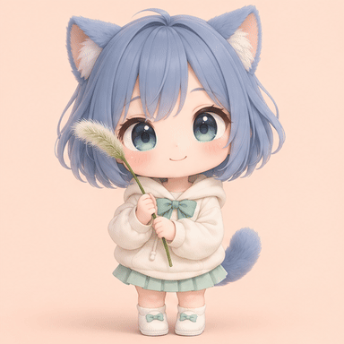
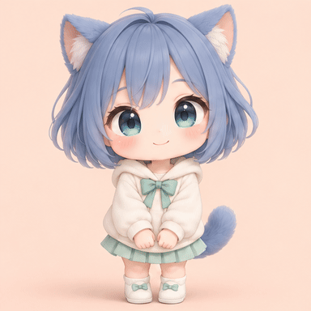
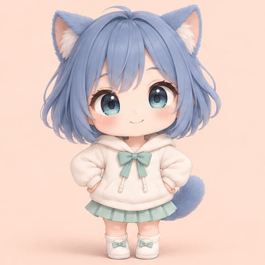

# Anime Reaction GIF

把一个原创动漫角色的几个表情和动作，做成可循环的反应贴纸。
这是一个 Codex skill：用内置图像生成工具制作姿势图，再用 FFmpeg
裁剪、安排停顿，导出 GIF、MP4 和实际解码的检查图。

| 狗尾草打喷嚏 | 双手比心 | 鼓脸跺脚 |
|---|---|---|
|  |  |  |

三个示例都是 384×384、约 2.6 秒的无限循环动图。每段用了六个真实生成的
关键姿势，采用反应贴纸的停顿节奏。它们是关键姿势动画；如果想要更顺滑，
应增加真正的中间姿势，单纯提高帧率不会凭空增加动作。

## 安装到 Codex

把这句话发给 Codex：

> 使用 $skill-installer 安装 https://github.com/LIghtJUNction/anime-reaction-gif/tree/main/skills/anime-reaction-gif

安装完成后，**下一轮**即可使用：

> 用 $anime-reaction-gif 做一个原创小机器人开心挥手的反应 GIF，角色外观和镜头位置保持一致，黑底，循环播放，同时输出 MP4 预览。

示例里的猫耳女孩只是这组作品的角色，技能不限定角色、服装、画风或动作。
可以做一组保持同一角色外观的贴纸，也可以更换主题、网格和姿势数量。
新姿势使用内置 `image_gen`，不需要另外配置 API key；现有姿势图的组装可离线完成。

仓库也提供 [Codex 插件清单](.codex-plugin/plugin.json)，把同一个技能打包为
`anime-reaction-gif` 插件。清单指向现有 `skills/` 目录；无需 MCP 服务或 API key。
本地组装只依赖 Python 标准库和系统 FFmpeg/ffprobe，没有第三方 Python 包依赖。
漏洞报告与运行时的数据边界见 [SECURITY.md](SECURITY.md)。

## 工作方式

1. 按用户的角色和动作生成一张等分的姿势图。保持角色身份、镜头、背景和位置，
   把手、脚、耳朵和道具留在每个格子内部。
2. 看清每个格子，确认表情、肢体、网格和角色一致。
3. 按动作安排播放顺序与停顿，导出循环 GIF 和普通 MP4 预览。
4. 查看实际导出的解码联系表、手机尺寸预览和首尾帧，再交付。

默认作品不带标题、编号、水印或网址，说明文案单独提供。
生成图片会有角色或肢体变化的可能，需要检查姿势图；代码只能检查像素网格，
不能自动判断画出来的人物是否正确。

## 仅组装现有姿势图

需要 Python 3 和系统 FFmpeg/ffprobe（包含 PNG、GIF、FFV1、libx264）。
Python 脚本只用标准库，**无需 pip 安装**。例如克隆仓库后：

```sh
python3 skills/anime-reaction-gif/scripts/assemble_sheet.py \
  skills/anime-reaction-gif/assets/examples/sources/heart-hands-sheet.png \
  --output output/heart-hands.gif \
  --columns 3 --rows 2 --cell-size 512 --size 384 --fps 12 \
  --sequence 0,1,2,3,4,5,0 \
  --durations .4,.25,.25,.65,.3,.4,.35 --background 0xf5caba
```

格子索引从 0 开始，按从左到右、从上到下排列。`--sequence` 和 `--durations`
可调整顺序和停顿；省略时会播放所有格子并回到第一格。
`--columns`、`--rows`、`--size`、`--fps`、`--inset` 均可配置。
`--cell-size` 用来校对预期格子尺寸；如果网格不能等分，脚本会在写输出前停止。
每个停顿至少保留一帧，GIF 时间会按 10 毫秒量化。输出名称已存在时，需换名
或明确传入 `--overwrite`。

所有裁剪和编码逐段通过 FFmpeg 执行，不在 Python 中缓存整段 RGB 帧。
除 GIF/MP4 外，脚本会保留姿势裁图、实际 GIF 解码联系表、240 像素预览和
包含来源/输出 SHA256、时长、帧数、循环设置的 JSON。

安装器仅取得 `skills/anime-reaction-gif` 目录也能使用：脚本、参考说明、提示词
和示例源图都在这个目录内，没有依赖仓库根目录的路径。

## 素材与出处

- [姿势生成与节奏说明](skills/anime-reaction-gif/references/spritesheets.md)
- [原始生成提示词](skills/anime-reaction-gif/assets/examples/generation-prompts.json)
- [来源、时序和输出哈希](skills/anime-reaction-gif/assets/examples/manifest.json)
- [三个原始姿势图](skills/anime-reaction-gif/assets/examples/sources/)
- MP4：[打喷嚏](skills/anime-reaction-gif/assets/examples/grass-sneeze.mp4)、[比心](skills/anime-reaction-gif/assets/examples/heart-hands.mp4)、[跺脚](skills/anime-reaction-gif/assets/examples/pout-stomp.mp4)

这组三个原创角色姿势图由内置 `image_gen` 生成，GIF/MP4 由 FFmpeg 组装。
创作起点是[这条参考帖子](https://x.com/94vanAI/status/2105862317049336233?s=20)
中的动漫反应形式；本仓库没有收录或重发下载的参考视频，也没有复制其中的角色帧。
完整提示词和原始生成姿势图保留下来，方便检查和制作下一组动作。

代码采用 [MIT License](LICENSE)。示例为本工作流生成的素材，随仓库提供供演示与复用。
本技能负责生成和检查素材；发布到外部平台仍需要用户授权。
