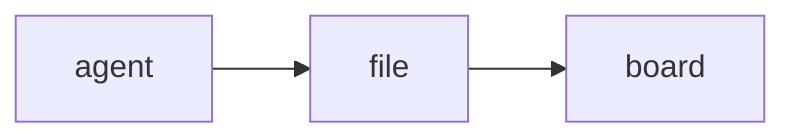

# stickypane

**A board in your terminal that your coding agent writes to and you read.**

Kanban boards, checklists, charts, forms and live logs for AI coding agents
such as Claude Code and Codex: plain Markdown files, a CLI, an MCP server and
a terminal UI (TUI) written in Go, next to your agent in tmux, WezTerm or any
terminal.

[](https://github.com/LeeSwallow/stickypane/actions/workflows/ci.yml)
[](https://github.com/LeeSwallow/stickypane/releases)
[](https://goreportcard.com/report/github.com/LeeSwallow/stickypane)
[](LICENSE)

English · [한국어](README.ko.md)

[Install](#install) · [Quick start](#quick-start) · [Keys](#keys) · [Command line and MCP](#command-line-and-mcp) · [Contributing](#contributing) · [Roadmap](ROADMAP.md) · [Discussions](https://github.com/LeeSwallow/stickypane/discussions)


An agent working in the pane next to you produces a lot of text, and the
things that matter scroll away with it: where the plan stands, what is done,
what it wants you to decide. Chat is the wrong place for that. A board is
the right one.

stickypane is that board. It is a folder of plain files (`.sticky/`), shown
as panes in a terminal window: your agent writes a file, it appears; it
ticks an item, the box ticks; it asks a question, a form with buttons shows
up, you press one, and the agent reads your answer back. You work the board
with keys or the mouse and every change lands in the same files, so the
agent sees what you did without being told.


**What it shows.** Notes in Markdown, kanban boards, checklists, charts,
Mermaid diagrams, forms you answer, logs followed as they grow, shell
scripts with a Run button, and folders as books of pages. Any file of your
project — the README, a log under `logs/` — can be put on the board with one
command.

**What it asks of the agent.** Nothing it does not already know how to do.
Writing a Markdown file is enough; for the rest there are one-line commands
that need no reading first (`stickypane todo plan add "write tests"`,
`stickypane chart tokens add input 1200`, `stickypane show README.md`) and the
same as MCP tools. A one-screen guide, added to `CLAUDE.md` or `AGENTS.md`,
or the plugin, tells it all of this.

**What it asks of you.** Nothing to configure: no server, no hooks, no
terminal plugin. It runs in a plain window, in tmux, WezTerm or Zellij, next
to Claude Code, Codex or any agent that can edit files. The files are yours,
in your repository, readable without stickypane.

> **Status: design stage.** stickypane is pre-1.0 and I am still deciding
> how the board should behave; file names, command names and `sticky.json`
> may change until v0.1.0. The most useful thing you can do is try it with
> your agent for a day and tell me what you expected the board to do: open
> a [design feedback issue](https://github.com/LeeSwallow/stickypane/issues/new?template=design_feedback.yml)
> or an [Idea](https://github.com/LeeSwallow/stickypane/discussions). The
> open questions are in [ROADMAP.md](ROADMAP.md); the principles in
> [VISION.md](VISION.md).

## Contents

- [Install](#install): Homebrew, a release archive, `go install`, from source
- [Quick start](#quick-start): the board next to your agent in four steps
- [The folder is the board](#the-folder-is-the-board) and [the shapes of a note](#shapes-of-a-markdown-note)
- [Keys](#keys), [mouse](#mouse), [settings](#settings), [themes](#themes)
- [Notes that link](#notes-that-link), [notes that react](#notes-that-react), [the index](#the-index)
- [Command line and MCP](#command-line-and-mcp)
- [Contributing](#contributing), [support](#support), [license](#license)

## Install

stickypane is one program with no runtime dependencies. It runs on macOS,
Linux and Windows, in any terminal that shows Unicode and color: Terminal,
iTerm2, Ghostty, WezTerm, Kitty, Alacritty, Windows Terminal, and inside
tmux or Zellij. No special font is needed.

### Homebrew

```sh
brew install --cask LeeSwallow/tap/stickypane
```

### A release archive

Every [release](https://github.com/LeeSwallow/stickypane/releases) has an
archive for each system: `darwin` (macOS), `linux` and `windows`, each for
`amd64` (Intel and AMD) and `arm64` (Apple silicon, ARM). Each holds the
program, the license, and the licenses of the libraries it is built from.

macOS and Linux:

```sh
VERSION=0.1.0 OS=linux ARCH=amd64      # or OS=darwin, ARCH=arm64
curl -LO "https://github.com/LeeSwallow/stickypane/releases/download/v$VERSION/stickypane_${VERSION}_${OS}_${ARCH}.tar.gz"
tar -xzf "stickypane_${VERSION}_${OS}_${ARCH}.tar.gz" stickypane
sudo install stickypane /usr/local/bin/   # or any folder on your PATH
```

On macOS, a program downloaded by a browser is held back by Gatekeeper;
`xattr -d com.apple.quarantine stickypane` lets it run. Homebrew does this
for you.

Windows, in PowerShell:

```powershell
$v = "0.1.0"
Invoke-WebRequest "https://github.com/LeeSwallow/stickypane/releases/download/v$v/stickypane_${v}_windows_amd64.zip" -OutFile stickypane.zip
Expand-Archive stickypane.zip -DestinationPath "$env:LOCALAPPDATA\stickypane"
# add it to your PATH, once
[Environment]::SetEnvironmentVariable("Path", "$env:Path;$env:LOCALAPPDATA\stickypane", "User")
```

Each release lists the archives' SHA-256 sums in `checksums.txt`; check one
with `shasum -a 256 <archive>` or, in PowerShell, `Get-FileHash <archive>`.

### With Go

```sh
go install github.com/LeeSwallow/stickypane/cmd/stickypane@latest
```

This needs Go 1.26 or later and puts the program in `$(go env GOPATH)/bin`.

### From source

```sh
git clone https://github.com/LeeSwallow/stickypane
cd stickypane
go build -o stickypane ./cmd/stickypane
```

### Check that it works

```sh
stickypane version     # stickypane 0.1.0
stickypane env         # the system, shell, pane tool, locale and editor it found
```

### Update and remove

Update the way you installed it: `brew upgrade --cask stickypane`, a newer
archive, or `go install ...@latest` again. To remove it, run
`stickypane setup --undo` if you installed the plugin, then
`brew uninstall --cask stickypane` or delete the program. Your notes stay
in each project's `.sticky/` folder; they are plain files, yours to keep or
delete.

## Quick start

**1. Open the board next to your agent.** In the project's folder, split
the terminal and run `stickypane` in the new pane:

| Terminal | Command |
| --- | --- |
| tmux | `tmux split-window -h stickypane`, or a popup: `tmux display-popup -E stickypane` |
| WezTerm | `wezterm cli split-pane --right -- stickypane` |
| Zellij | `zellij run --direction right -- stickypane` |
| Windows Terminal | `wt -w 0 split-pane -V stickypane` |
| anything else | a second window or tab, in the same folder: `stickypane` |

`stickypane env` prints the right command for the terminal you are in.

**2. The first run sets the project up.** In a git repository it makes
`.sticky/` at the top of the repository and tells your agent about the
board, then opens it. Nothing to configure: every setting has a default
(`S` on the board changes them).

**3. Teach your agent, once.** Pick one:

| Way | How | For |
| --- | --- | --- |
| the plugin | `stickypane setup` | Claude Code and Codex: five skills, slash commands, a session hook |
| a guide in its instructions | done by step 2: a short guide in `CLAUDE.md` or `AGENTS.md` | any agent that reads those files |
| MCP | `stickypane setup --mcp`, or `claude mcp add stickypane -- stickypane mcp` | any MCP client |

For another MCP client, the server is the command `stickypane mcp` on
standard input and output:

```json
{ "mcpServers": { "stickypane": { "command": "stickypane", "args": ["mcp"] } } }
```

**4. Ask for things.** "Keep a checklist of this refactor on the board."
"Explain the structure on the board as a page." "Ask me on the board
before you deploy." The agent writes the files; the board shows them as
they change, and what you do on the board lands in the same files.

### More on the setup

Telling the agent means a short guide where it reads it: `CLAUDE.md` and
`AGENTS.md` when they exist, a Claude Code skill
(`.claude/skills/stickypane/SKILL.md`) when the project has a `.claude`
folder but no `CLAUDE.md`, and a new `AGENTS.md` when there is nothing. An
agent with the plugin installed gets nothing in its file, since the plugin
teaches it. `stickypane init` does the same without opening the board, and
works outside a git repository too; it is safe to run again. `--skill`
writes the skill instead of the instruction files and `--no-agent-docs`
makes the folder only.

`stickypane setup` installs the plugin for every agent it finds, through
the agents' own commands:

```sh
stickypane setup                       # asks, then installs for Claude Code and Codex
stickypane setup --scope project --mcp --yes
stickypane setup --undo                # takes it out again
```

`--scope` is where Claude Code installs it: `user` (every project, the
default), `project` (this repository, shared with the team) or `local`
(this repository, just you). `--mcp` also registers `stickypane mcp` as an
MCP server, `--agents claude,codex` limits it to some agents, and
`--dry-run` prints the commands without running them. In a terminal it
asks for what the flags did not say.

The plugin is in layers. The way in, `using-the-board`, says which of four
skills fits a job: `tracking-progress`, `asking-the-user`,
`talking-in-chat` and `connecting-notes`. The commands `/board:show`,
`/board:status`, `/board:index`, `/board:track`, `/board:ask`,
`/board:say`, `/board:kinds` and `/board:setup` each start one. A session
hook tells the agent what is on the board when a session starts in a
project that has one. In a git repository the agent's first
`stickypane show` or `stickypane todo` makes the board, so no setup step
is needed.

## The folder is the board

One file in `.sticky/` is one note. Create a file to stick a note, edit it to
update the note, delete it to take the note down. A one-line file is a
complete note:

```markdown
check env before deploy
```

What a file is depends on its name:

| File                    | Is                                                    |
| ----------------------- | ----------------------------------------------------- |
| `*.md`                  | a note; its front matter may give it a shape (below)   |
| `*.log` `*.txt` `*.out` | a log: shown as it is and followed as it grows         |
| `*.sh` `*.ps1`          | a script: shown with a Run button, run with sh or PowerShell |
| a folder                | a tab: a screen of its own, with the files in it as notes |
| a folder in a tab       | a book: one note whose pages are the files in it       |
| anything else           | not shown                                              |

```
.sticky/
  sticky.json         the board: theme, language, which tab is open, the root tab's layout
  10-plan.md          a note of the root tab, named after your project
  build.log           a log, followed live
  deploy/             a tab
    sticky.json       this tab's title and layout
    run.sh            a script; its output goes to run.log
    docs/             one note with three pages
      01-intro.md
      02-usage.md
      03-faq.md
```

A number in front of a name orders the notes, the pages and the tabs and
is not part of the title: `10-plan.md` is shown as "plan" and a folder
`20-release` as the tab "release", until front matter or `sticky.json`
gives it a title of its own.

**Tabs.** Each folder of `.sticky/` is a tab, listed on the first line of
the screen with its number; the files in the folder are its notes, and the
root folder is the first tab, named after the project. `1`–`9`, `(` `)` or
a click switch tabs; the active tab is remembered. A tab's folder can hold
its own `sticky.json` with a `title` and the layout of its notes, so one
folder is one complete, shareable screen. `stickypane show deploy/run.sh`
switches to that tab.

**Books.** A folder inside a tab is shown as one pane that scrolls like one
long note: its files follow one another, each under a rule with its name,
and the border says which page the view is on (`docs · usage  2/3`).
`j` `k`, the wheel and the paging keys scroll through all of it; `,` and
`.` jump to the page before or after; every other key acts on the page the
view is on. `stickypane link docs` puts a folder of your project on the
board as a tab without copying it, and `stickypane link README.md` does the same for
a file; both make a symbolic link, so what you change on the board is
changed in the real file.

**Scripts.** `enter` on a script asks first (`Run deploy.sh in myproject?`),
then runs it with `sh` in the project folder. The output is written to a log
of the same name next to the script, which the board opens and follows while
the script runs. A script never runs without that yes, each time: it is a
file your agent may have written.

**Markdown notes.** Front matter says what a note is. Every key is optional.

| Key     | Values                                                 |
| ------- | ------------------------------------------------------ |
| `type`  | `note` (default), `board`, `checklist`, `log`, `chart`, `form` |
| `title` | shown in the title bar and the note's border            |
| `view`  | for a chart: `bar`, `spark`, `heat`                     |

## sticky.json: how the board is arranged

Where a note is on the screen is not written into the note. It goes to
`sticky.json`: the root one for the root tab and for the board as a whole,
and one in each tab's folder for that tab's notes, the way Bruno keeps a
folder's settings in the folder. The board writes them as you press keys:

```json
{
  "notes": {
    "10-plan.md": { "open": true, "size": "half", "pin": true },
    "build.log": { "title": "CI build", "open": true, "rows": 12 },
    "docs": { "open": true, "color": "blue" }
  },
  "order": ["docs", "10-plan.md", "build.log"],
  "ignore": ["drafts", "*.tmp.md"],
  "theme": "catppuccin-mocha",
  "tab": "deploy",
  "version": 1
}
```

A tab's own file (`deploy/sticky.json`) has `title`, `notes` keyed by the
names inside the tab, and `order`; `theme`, `language`, `ignore` and `tab`
are only in the root file.

| Key in `notes` | Values                                        | Key on the board |
| -------------- | --------------------------------------------- | ---------------- |
| `open`         | `true` shows the note, `false` folds it away  | `o`, `enter`     |
| `size`         | `page` (whole width), `half`, `card`          | `+` `-`          |
| `rows`         | the height in lines the note asks for         |                  |
| `color`        | `yellow` `pink` `blue` `green` `purple` `orange` | `c`           |
| `pin`          | `true` keeps the note first                   | `p`              |
| `title`        | a name for a book, a log or a script          | `R`              |

Next to `notes`, `theme` names the theme (`T` on the board), `language` the
language of the screen (`stickypane language ko`; `auto` follows `LANG`),
`order` lists the notes you moved and `ignore` what to leave out.

`order` lists the notes you moved with `{` and `}`; the others follow by
name. `ignore` is the one part you write by hand: names or patterns the
board should not show.

Keeping this apart from the notes means three things. A log, a script or a
linked README can be opened, sized and named although it has no front matter.
The board never rewrites a note because you rearranged the screen, so it
cannot collide with your agent writing that note. And you can commit the file
to share a layout, or leave it out of git to keep it yours.

A Markdown note may still carry `open`, `size`, `rows`, `color` and `pin` in
its front matter. That is the note's own proposal, which is how an agent says
"show this now"; what `sticky.json` says wins. A note that neither opens is
folded away, except that a note that appears while stickypane is running is
shown for that run, so what your agent just wrote is in front of you at once.

## Shapes of a Markdown note

Front matter gives a Markdown note its shape. Below, a release tab with
four of them: a log, a form, a Mermaid diagram and a chart.


**Board.** Each `## Heading` is a column and each top-level list item is a
card. Indented lines under a card are its details. Any other line under a
column shows up as a card too, and text before the first heading is the
board's description.

```markdown
---
type: board
title: Auth work
open: true
---
## To do
- payments
## Doing
- login API
  - refresh tokens come later
## Done
- schema
```

**Checklist.** `- [ ]` and `- [x]` lines, shown with a progress bar.

**Log.** One entry per line. Next to other notes it asks for ten lines, and
it follows its end as the file grows until you scroll up. A `.log` file is
the same thing without front matter.

**Chart.** Each `label: number` line is a value; any other line is shown as
text above the chart. `view` picks the drawing: `bar` (default), `spark` for
a one-line trend, or `heat` for a calendar of days when the labels are dates.

```markdown
---
type: chart
title: Tokens per day
view: heat
---
2026-09-28: 41,200
2026-09-29: 8,900
2026-09-30: 0
```

```
app       ████████████████████████ 61        9 10
board     ████████████▏            31   Mon  █ ·
checklist ████████▎                21        ▒ ▓
store     ██████▎                  16   Wed  ·
```

**Diagrams.** A `mermaid` code block in a plain note is drawn as a diagram
instead of being shown as source. Flowcharts (`graph`, `flowchart`), sequence
diagrams and entity-relationship diagrams (`erDiagram`) are drawn; a block
that cannot be drawn keeps its source.

````markdown

````

```
┌───────┐     ┌──────┐     ┌───────┐
│ agent ├────►│ file ├────►│ board │
└───────┘     └──────┘     └───────┘
```

**Chat.** A conversation with your agent, kept in the folder. Each message
is `@name HH:MM text` under a heading for its day; the board writes the
time. You press n to answer, as `$STICKYPANE_USER`, git's `user.name` or
your login name; the agent says things with `stickypane say` and hears you
with `stickypane watch --once --note chat --type message.added`.

```markdown
---
type: chat
---
## 2026-10-03
@min 14:02 can you rerun the tests?
@claude 14:03 41/41 pass
```

**Form.** A document that asks. Your agent writes the questions; you answer
on the board; the answers land in the same file.

```markdown
---
type: form
title: Deploy now?
open: true
---
The build is green. Where should it go?

## Target
- ( ) staging
  Try it there first.
- ( ) production

## Also
- [ ] run migrations
- [ ] clear the cache

## Note
> 

[ Deploy ] [ Cancel ]
```

```
  ○ staging                      ╭──────────────────────────────╮
      Try it there first.        │ after lunch                  │
› ◉ production                   ╰──────────────────────────────╯
  ☑ run migrations               ┏━━━━━━━━┓ ╭────────╮
  ☐ clear the cache              ┃ Deploy ┃ │ Cancel │
                                 ┗━━━━━━━━┛ ╰────────╯
```

| Line                  | Is                                             |
| --------------------- | ---------------------------------------------- |
| `- ( ) text`          | an option; choosing one clears the others      |
| `- [ ] text`          | an option; choose as many as you like          |
| indented line below   | the option's description                       |
| `> text`              | a line to fill in                              |
| `[ Label ] [ Label ]` | buttons; a form without any gets `[ Submit ]`  |

Everything else is Markdown and is drawn as such. Options of one kind in a
row are one question, named by the heading above it. Pressing a button writes
`submitted: <label>` and `submitted_at` into the front matter; changing an
answer afterwards takes them out again. The agent reads the answers from the
file, or waits for them:

```sh
stickypane wait deploy --timeout 10m
# submitted: Deploy
# at: 2026-10-02T14:03:05+09:00
# Target: production
# Also: run migrations
# Note: after lunch
```

Notes are ordered by file name, pinned ones first, until you move them. A
file that does not fit its shape is still shown, never hidden.

## Keys

| Any note            |                         | Open board or checklist |                      |
| ------------------- | ----------------------- | ----------------------- | -------------------- |
| `tab` / `shift+tab` | next, previous note     | `h` `l`                 | change column        |
| `enter`             | open, then zoom         | `j` `k`                 | change card or item  |
| `o`                 | open or close           | `H` `L`                 | move a card sideways |
| `+` / `-`           | bigger, smaller         | `J` `K`                 | reorder a card       |
| `N`                 | jot a note              | `space`                 | tick an item         |
| `a`                 | add by shape            | `n`                     | new card or item     |
| `p` / `c` / `R`     | pin, color, rename      | **Open script**         |                      |
| `{` / `}`           | move earlier, later     | `enter`                 | run, after a yes     |
| `,` / `.`           | turn a book's pages     |                         |                      |
| `m`                 | move to a folder        |                         |                      |
| `x` / `D` / `u`     | archive, delete, undo   | **Zoomed note**         |                      |
| `e` / `E`           | edit here, in `$EDITOR` | `esc`                   | back                 |
| `r` / `?` / `q`     | reload, help, quit      | `j` `k` `g` `G`         | scroll               |
| `T`                 | next theme              |                         |                      |
| `z`                 | zoom                    | **Open form**           |                      |
| `[` / `]`           | previous, next screen   |                         |                      |
| `1`–`9` / `(` `)`   | switch tab              |                         |                      |
|                     |                         | `j` `k`                 | change control       |
|                     |                         | `enter` / `space`       | choose, type, press  |

The focused open note takes the keys in the right-hand column where it is;
you do not have to zoom in first. When the focused note has no cursor of its
own, `j` `k` `g` `G` and the paging keys (`pgdn` `pgup`, `space` `b`,
`ctrl+f` `ctrl+b`, `ctrl+d` `ctrl+u`) scroll it inside its pane; a note with
a cursor scrolls to keep the cursor in view.

**How the screen is shared.** Open notes are placed left to right by `size`
(`page` takes a row, two `half` notes share one, `card`s sit three or more
to a row) and each row is stretched to the full width. The rows then share
the height: a short note takes what it needs and the long ones split the
rest, so the screen is always full and never scrolls as a whole. A note gets
at least ten lines; notes that would get less go to the next screen, shown
as `2/3` under the title bar. A form uses `enter` itself,
so `z` is the way to zoom into one.

## Notes that link

Notes name each other with `[[name]]`, as in Obsidian: `[[plan]]`,
`[[plan#write tests]]`, `[[deploy/run|the run]]`. A link is drawn as its
name or alias, and a name finds its note with or without `.md` and its
folder. `f` on a note lists the notes it links to and the notes that link
to it, and `enter` goes there; the index shows how many notes link to each
one, and `stickypane index --json` lists `links` and `backlinks`.


A line that is only `![[plan]]` shows that note there, in its own shape and
read only: a checklist with its progress, a board with its columns. It
follows the note it shows. Embeds go one level deep.

A chart can be computed from another note: give it `from:` and stickypane
fills in its values and keeps them up to date, in the file itself.

```markdown
---
type: chart
title: Progress
from: plan          # one note: done and open (a board: cards per column)
---
```

With `from: plan, release` it draws one bar per note: percent done for a
checklist, cards for a board, answered questions for a form, lines for a
log. That is the whole list; anything else is a `stickypane watch --exec`
recipe.

## Notes that react

Everything that happens on the board is an event: a note made or removed,
an item ticked, a card moved, a form sent, a line logged, a message said, a chart value
changed. `stickypane watch` prints them as they happen, one a line, and
runs a command for each with `--exec`, so one note can answer another and
anything outside can listen:

```sh
stickypane watch                                   # 14:02:05  plan.md  item.ticked  write tests
stickypane watch --json | jq .                     # for programs
stickypane watch --note plan --type item.ticked \
  --exec 'stickypane chart progress add done 1'    # a chart that counts the ticks
stickypane watch --type card.moved \
  --exec '[ "$STICKY_TO" = Done ] && printf "\a"'  # a bell when a card is done
stickypane watch --once --note deploy --type form.submitted   # wait for the user
```

`--note` and `--type` filter (`--type card` takes every card event), and
`--once` ends at the first event, which is how an agent waits for the user
to do something. The command given to `--exec` runs in your own shell with
the event in `STICKY_EVENT` (JSON) and in `STICKY_NOTE`, `STICKY_KIND`,
`STICKY_TYPE`, `STICKY_ITEM`, `STICKY_FROM`, `STICKY_TO` and `STICKY_TIME`.
Nothing reacts unless you start a watch: the board itself never runs
anything without asking. Over MCP the same events come from `wait_event`.

## API requests (experimental)

A `.http` note is an API client on the board, in the format resterm and the
VS Code REST Client read, so the same file works there too: REST requests,
WebSocket sessions and gRPC calls side by side. `enter` sends the picked
one after a yes; under the list, the board shows what that request got
last time.


```http
# @env dev

### Create user
POST {{rest}}/users
Content-Type: application/json

{"name": "{{user}}"}
# @assert response.statusCode == 201
# @capture file id {{response.json.id}}

### Live updates
# @websocket timeout=5s idle-timeout=1s subprotocols=json
# @ws send {"type":"subscribe","channel":"builds"}
# @ws wait 500ms
# @ws close 1000 done
# @assert response.received >= 1
GET {{socket}}/events

### Get user
# @grpc users.v1.Users/Get
# @grpc-plaintext true
# @grpc-metadata x-trace-id: demo-1
# @assert response.grpc.status == "OK"
GRPC {{grpc}}

{"id": "{{id}}"}
```

| | REST | WebSocket | gRPC |
| --- | --- | --- | --- |
| written as | a method and a URL | a `ws://` URL, or `# @websocket`, and `# @ws` steps: `send`, `send-json`, `send-base64`, `ping`, `pong`, `wait`, `close` | `GRPC host:port`, `# @grpc package.Service/Method`, a JSON body |
| the log shows | the body | the transcript, `→` sent and `←` received, to the millisecond | the messages; a stream as a list |
| checks read | `response.statusCode`, `response.json("a.b")`, `response.header("X")` | `response.received`, `response.json("[0].type")` | `response.grpc.status`, `response.json("name")` |

**gRPC without generated code.** Messages are written as JSON. The
descriptors come from `# @grpc-descriptor api.protoset` (what `protoc
--descriptor_set_out` or `buf build -o` writes), else from the server's
reflection service, else fields go by number (`{"1": 7}`), as
`protoc --decode_raw` shows them. `# @grpc-plaintext true` speaks HTTP/2
without TLS. Unary calls and server streams are sent; a status other than
OK ends the request like an HTTP error (`404 NOT_FOUND · user 7 not found`).

**Environments.** `{{name}}` works in the URL, headers, body, `@ws` steps,
gRPC metadata and target. Values come from `@name = value` lines, captures
of earlier responses, `rest-client.env.json` or `resterm.env.json` (the
`$shared` block, then the environment chosen with `# @env`, which `e` on the
board changes), `env:NAME`, and the project's `.env`. Credentials in
headers and metadata are hidden in the log.

**For agents.** `stickypane api api` lists the requests (`#2  WS  Live
updates`), `stickypane api api "live" --env dev` sends one and `--all`
every one, printing each log; the MCP tool `api` does the same and returns
the logs of a failed run too. Each request's last result stays in `api.log`
under its title, a line such as `[101 Switching Protocols · 1.1s · Live
updates · 2↑ 2↓ · 1/1 ✔]` at its end, so `stickypane watch --note api.log`
hears when one is sent.

## Languages

The screen speaks English and Korean: `stickypane language ko`, or leave it
on `auto` and set `LANG`. Key names and the agent's guide stay English; see
[docs/translating.md](docs/translating.md) to add a language.

## The index

A board with many notes stays easy to read: `i` or `/` opens the index,
every note of every tab in a line, the way a wiki's index page lists its
pages. Each line has the note's shape, title, what it counts (`2/5`,
`7 cards`), a gist and when it changed; open notes are marked `●`. Type to
filter, choose with the arrows, and `enter` goes to the note, switching tab
and opening it.


The gist is the note's own `summary:` from its front matter when it has
one, so a note can say in a line what it is; otherwise it is what to look
at first: the next open item of a checklist, the latest line of a log, the
first line of anything else.

`stickypane index` prints the same index as Markdown (`--json` for
programs), and the MCP tool `index` gives it to agents, which read it
instead of every note.

## Settings

Nothing has to be set: every setting has a default and the board works as
it is. `S` on the board opens the settings panel: `j` `k` pick a setting,
`h` `l` change it, and it applies at once. `stickypane config` does the
same from the command line.


| Setting | Default | Changes |
| --- | --- | --- |
| `theme` | `auto` | the colors; `auto` follows the terminal's background |
| `language` | `auto` | the screen's words |
| `time` | `auto` | how days and times are written; `auto` follows the locale's country |
| `editor` | `auto` | what `E` opens; `auto` is `$VISUAL`, `$EDITOR`, then the first editor found |
| `stale` | `30m` | when a kanban card that has not moved is flagged; `off` never |

```sh
stickypane config                # every setting, its value, and which are defaults
stickypane config stale 1h
```

A setting at its default is not written; the others go to the root
`sticky.json`.

## Themes

Everything on the screen is drawn from a dozen color roles (text, muted,
accent, selection, good, warn, bad, info, and the six note colors), so a
theme is one palette and the whole board follows it. `T` tries the next
theme, `stickypane theme` lists them and `stickypane theme nord` chooses one;
the choice is kept in `sticky.json` as `"theme"`. With no choice (`auto`) the
board asks the terminal whether it is dark and picks `stickypane-dark` or
`stickypane-light`.

| Theme                                 | For a   | Palette from                               |
| ------------------------------------- | ------- | ------------------------------------------ |
| `stickypane-dark`, `stickypane-light` | dark, light | stickypane                             |
| `catppuccin-mocha`, `catppuccin-latte` | dark, light | [catppuccin/nvim](https://github.com/catppuccin/nvim) (MIT) |
| `tokyonight-night`, `tokyonight-day`  | dark, light | [folke/tokyonight.nvim](https://github.com/folke/tokyonight.nvim) (Apache-2.0) |
| `gruvbox-dark`, `gruvbox-light`       | dark, light | [ellisonleao/gruvbox.nvim](https://github.com/ellisonleao/gruvbox.nvim) (MIT) |
| `nord`                                | dark    | [gbprod/nord.nvim](https://github.com/gbprod/nord.nvim) (WTFPL) |
| `dracula`                             | dark    | [Mofiqul/dracula.nvim](https://github.com/Mofiqul/dracula.nvim) (MIT) |

The palettes are those themes' own values, used the way the themes use
them: blue for focus, mauve for headings, the comment color for what is
muted. A theme never paints the background; the terminal's stays, so pick a
theme made for the background you have.

How the colors are used follows what terminal tools agree on: focus is the
border color, not a different shape alone; the title sits in the top border
in the note's color; the selected line has a background tint; key hints are
the accent; everything secondary is muted; and `faint` is never used, since
it is unreadable on a light background.

## Deleting and moving

Nothing you do on the board erases a file.

- `D` asks, then moves the note to `.sticky/.trash/`. `x` moves it to
  `.sticky/archive/` without asking. `u` takes back whichever you did last.
- `m` lists the folders: pick one and the note becomes a page of that book,
  pick the top level to take a page out of its book, or name a new folder.
- `{` and `}` swap the note with its neighbor; the order is kept in
  `sticky.json`.
- `R` renames what you see, not the file: a Markdown note's `title`, or for
  a book, a log or a script the `title` in `sticky.json`.

From the command line:

```sh
stickypane mv plan deploy/       # into the tab deploy
stickypane mv deploy/plan .      # back to the first tab
stickypane mv plan roadmap       # a new name; it keeps its place on the screen
stickypane rm roadmap            # to .sticky/.trash/
stickypane restore roadmap       # and back
stickypane archive roadmap       # to .sticky/archive/
stickypane link README.md        # show a project file without copying it
```

None of these writes over another note or reaches outside `.sticky/`.

## Editing a note

`e` opens the focused note's file in a small editor that works like vi, so
you can fix a note without leaving the board. `E` hands the file to your own
editor instead: `$VISUAL` or `$EDITOR`, any of them. Terminal editors (vim,
nvim, helix, nano, emacs -nw, micro) take the terminal until you quit; GUI
editors (VS Code, Cursor, Zed, Sublime, JetBrains, Kate, TextMate) are told
to wait until you close the file, so you need not add `--wait`. With neither
variable set, the first of nvim, vim, vi and nano found is used.

| Keys                          | Do                                     |
| ----------------------------- | -------------------------------------- |
| `i` `a` `I` `A` `o` `O`       | insert text; `esc` goes back           |
| `h` `j` `k` `l` `w` `b` `e` `0` `^` `$` `gg` `G` | move                |
| `ctrl+f` `ctrl+b`, `ctrl+d` `ctrl+u` | a page, half a page             |
| `x` `dd` `dw` `D` `cc` `cw` `C` `r` `J` | delete, change, replace, join |
| `yy` `p` `P`, `u` `ctrl+r`    | copy and paste, undo and redo          |
| `/text` `n` `N`, `:12`        | search, go to a line                   |
| `:w` `:q` `:wq` `ZZ` `:q!`    | save, quit, both, quit without saving  |

The border shows the cursor's line and column and which page of the file it
is on. If the file changes on disk while it is open, usually because your
agent wrote to it, a buffer you have not touched follows the file. One with
your changes is kept, you are told, and `:w` does not overwrite the file:
`:w!` does, and `:e!` loads it again. Counts (`3dd`) and visual mode are not
there.

## Mouse

| Do this                    | And                                             |
| -------------------------- | ----------------------------------------------- |
| click a title in the bar   | a closed note opens, an open one takes the focus, the focused one closes |
| click a note               | it takes the focus                              |
| click an item, option, button or card | it is ticked, chosen, pressed or selected |
| double-click a note        | zoom; on a script, run it after a yes           |
| click Yes or No on a question | answer it; a click anywhere else is no       |
| wheel                      | scroll the note under the pointer               |

In tmux the mouse reaches stickypane only with `set -g mouse on`.

## Command line and MCP

Editing the files is all an agent needs. For scripts, and for agents that
would rather call a tool, the same notes are reachable two more ways.

The shortest path: put something in front of the user.

```sh
stickypane show plan                 # a note, by name
stickypane show README.md            # any file of the project: linked and shown
stickypane show logs/app.log         # a log file: linked, shown and followed live
stickypane show docs/                # a folder: linked as a tab of its own
stickypane hide plan
```

Everything else:

```sh
stickypane list --json                       # every note: name, title, type, open, size
stickypane cat plan                          # print a note's file
echo "- [ ] build" | stickypane write plan --type checklist --title "Release" --open
stickypane answers deploy                    # what the user answered in a form
stickypane wait deploy --timeout 10m         # the same, once a button is pressed
```

`wait` exits with code 3 when its time runs out. Both take `--json`.

**Small changes without reading the note.** An agent that ticks an item by
rewriting the whole checklist has to read it first, and may write it back
wrong. These commands change one thing and print where the note stands:

```sh
stickypane todo plan add "write tests"       # plan.md: 0/1
stickypane todo plan check tests             # plan.md: 1/1
stickypane card work add "login API" --to Doing
stickypane card work move login --to Done    # work.md: 2 cards
stickypane chart tokens set input 1,200      # tokens.md: input = 1,200
stickypane chart tokens add input 800        # tokens.md: input = 2,000
stickypane log worklog --time "tests passed" # worklog.md: 12 lines
stickypane say chat "41/41 pass" --as claude # chat.md: 3 messages
stickypane set plan open=true size=half      # to sticky.json
stickypane set plan title="The plan"         # to the note's front matter
```

A note that does not exist yet is made, open on the screen, so an agent never
has to know the file format for these. An item, a card or a column is named
by its text, by a part of it that nothing else has, or by its position
(`#2`). When the name fits nothing, or more than one thing, the error lists
what there is.

`stickypane mcp` serves the notes over the Model Context Protocol on standard
input and output. It is layered the way the plugin is, so an agent finds
its way without reading everything:

| Layer | Over MCP | At the command line |
| --- | --- | --- |
| the way in | the `guide` tool | `stickypane guide` |
| a skill for a job: tracking progress, asking the user, talking in a chat, connecting notes | `guide` with the skill as `topic`, or the prompt of that name | `stickypane guide tracking-progress` |
| one thing changed | `index`, `read_note`, `write_note`, `todo`, `card`, `chart`, `log`, `say`, `set_keys`, `arrange_note` (show, hide, move, remove, restore) | the commands above |
| waiting for the user | `read_answers`, `wait_event` | `stickypane wait`, `stickypane watch` |

The skills are the plugin's own files, carried in the program, so a client
without the plugin reads the same ones.

```sh
claude mcp add stickypane -- stickypane mcp
```

`write` and `write_note` replace the whole note, exactly as overwriting the
file would. Read a note before rewriting it. A name may point into a book
(`docs/intro`) or at a log (`build.log`).

## How edits are written

The board never overwrites a file with what it last saw. An edit is an intent
("move this card to that column") applied to the file as it is at that moment,
and the file is then replaced in one step. If your agent changed that card in
the meantime, nothing is written and the board tells you. A note that is a
symlink is edited where it really lives.

Replacing the file has two limits:

- A program that keeps a note open and keeps appending to it
  (`some-command >> .sticky/log.md`) goes on writing to the old file after
  you edit that note from the board. Writing a line at a time, the way agents
  do, is fine.
- A write that lands in the instant between the board reading a file and
  replacing it is lost.

## Adding a shape

A shape is one package under `internal/widget/` that implements the
`widget.Widget` interface, plus one line in `internal/kinds/kinds.go`.

## Contributing

Design feedback is worth more than code right now: what you expected the
board to show, and what it did. [CONTRIBUTING.md](CONTRIBUTING.md) says how
an idea becomes an issue, a proposal, a pull request and a release, how to
take an issue, and how to set up and test. Good places to start: issues
labelled [good first issue](https://github.com/LeeSwallow/stickypane/labels/good%20first%20issue)
or [accepted](https://github.com/LeeSwallow/stickypane/labels/accepted).
Coding agents read [AGENTS.md](AGENTS.md) first.

## Support

Questions go to [Discussions](https://github.com/LeeSwallow/stickypane/discussions),
bugs and ideas to the [issue tracker](https://github.com/LeeSwallow/stickypane/issues/new/choose),
and security problems privately, as [SECURITY.md](SECURITY.md) says. More
in [SUPPORT.md](SUPPORT.md).

## Alternatives

If you want a kanban that lives in Markdown files and nothing else,
[kanban-md](https://github.com/antopolskiy/kanban-md) and
[Backlog.md](https://github.com/MrLesk/Backlog.md) do that well. If you want
to watch commands and metrics in a configured dashboard,
[sampler](https://github.com/sqshq/sampler) and
[wtf](https://github.com/wtfutil/wtf) are for that. stickypane is for the
space between you and an agent: files the agent writes, a screen you read,
and answers that go back.

## License

[MIT](LICENSE), © 2026 LeeSwallow. The libraries stickypane is built from
are all under MIT or BSD licenses; they and the color palettes of the
themes are listed in [THIRD_PARTY_NOTICES.md](THIRD_PARTY_NOTICES.md), and
every release archive carries their license texts.
