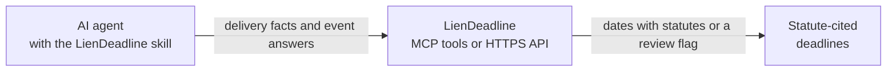

<a href="https://liendeadline.com/agent-skill?utm_source=github&utm_medium=readme&utm_campaign=liendeadline-skills"><picture>
  <source media="(prefers-color-scheme: dark)" srcset="https://raw.githubusercontent.com/LienDeadline/liendeadline-mcp/main/assets/readme/hero-dark.svg">
  
</picture></a>

[](https://skills.sh/liendeadline/skills)
[](https://claude.ai/directory/connectors/liendeadline)
[](https://github.com/LienDeadline/skills/releases/latest)
[](https://github.com/LienDeadline/skills/blob/main/LICENSE)

**Give your AI agent a lien deadline playbook: it asks for the facts that matter, gets each date
from LienDeadline, and cites the statute behind it.**

Built for US construction material suppliers and their credit and finance teams. The skill works
with Claude Code, Codex, Cursor, Gemini CLI, GitHub Copilot and other agents that read
[Agent Skills](https://agentskills.io). When a date can't be confirmed, your agent says so and
explains why. It never guesses.

[Install](#install) · [Try asking](#try-asking) · [Coverage](#what-it-covers) ·
[Privacy](#privacy-and-safety) · [FAQ](#faq) · [liendeadline.com](https://liendeadline.com/?utm_source=github&utm_medium=readme&utm_campaign=liendeadline-skills)

## Why it matters

Miss a preliminary notice or a lien filing deadline and a supplier can lose its lien rights on the
job, and with them its leverage to get paid. The deadlines depend on the state, the project type
and who hired you. They can also move when something happens on the job, such as the owner's
final payment or a notice of extension.

Ask a general-purpose AI assistant and it may answer from memory, with a confident date and no
source. This skill gives your agent a better routine: collect the facts, get the date from
LienDeadline's calculation, show the statute, and flag anything it can't confirm.

## What the skill does

- **Asks the right questions.** The project's state and type, who hired you, your first and last
  delivery dates, and plain yes, no or unknown answers about events that can move a deadline.
- **Gets the dates from LienDeadline.** It uses the LienDeadline tools when they're connected, or
  calls LienDeadline's public API directly. No account or key.
- **Shows its work.** Every deadline comes with its status, the statute behind it, and any warnings
  or assumptions. The agent reports a date only when LienDeadline's answer matches the facts it sent.
- **Flags instead of guessing.** A missing fact, an "unknown" answer or a case that isn't covered
  yet comes back as "needs review" with the reason, never a made-up date.
- **Points you to the rules.** It links the state's lien guide so you and your counsel can check
  the details.

## In action

<picture>
  <source media="(prefers-color-scheme: dark)" srcset="https://raw.githubusercontent.com/LienDeadline/liendeadline-mcp/main/assets/readme/example-dark.svg">
  
</picture>

## Install

**Any agent, one command.** Adds the skill to Claude Code, Codex, Cursor, Gemini CLI, GitHub
Copilot and other agents that read Agent Skills:

```bash
npx skills add LienDeadline/skills
```

Or install it for a specific agent:

**Claude Code.** The plugin adds the skill and connects LienDeadline's hosted tools. Nothing runs
on your computer.

```bash
claude plugin marketplace add LienDeadline/skills
claude plugin install liendeadline@liendeadline
```

Inside a Claude Code session, run `/plugin marketplace add LienDeadline/skills`, then
`/plugin install liendeadline@liendeadline`.

**Codex.** The plugin adds the skill and the LienDeadline tools.

```bash
codex plugin marketplace add LienDeadline/skills
codex plugin add liendeadline@liendeadline
```

**Gemini CLI.** The extension adds the skill and the LienDeadline tools.

```bash
gemini extensions install https://github.com/LienDeadline/skills
```

**GitHub CLI.** Adds the skill for GitHub Copilot and the other agents it supports.

```bash
gh skill install LienDeadline/skills liendeadline
```

**Claude on the web, desktop or mobile.** Nothing to install: add
[LienDeadline from Claude's Connectors directory](https://claude.ai/directory/connectors/liendeadline).

**Any other MCP client.** Connect `https://mcp.liendeadline.com/mcp` (Streamable HTTP, no sign-in).
If your agent reads Agent Skills, add the skill with the first command above as well.

## Try asking

- "We supplied a Florida commercial job for a subcontractor from Aug 3 to Sep 10, 2026. No final
  payment, no termination. When are our notice and lien deadlines?"
- "Same job, but I don't know whether the owner made final payment. What changes?"
- "Can I still file a lien for my last delivery on a Kansas job?"
- "Which states have lien guides? Show me Ohio's rules for material suppliers."

If your agent needs a fact you haven't given, it asks. If you don't know the answer, say so: the
deadline that depends on it comes back as "needs review", with the reason.

## What it covers

| | Today |
| --- | --- |
| **Calculated deadlines** | Preliminary notice and lien filing for Florida and Kansas private projects |
| **More states** | Added as each state's reviewed rules are released. The skill checks what's live for your project, so you never get a date for a state that isn't ready. |
| **Everything else** | "Needs review" with the reason: other states, public projects, and any deadline that depends on a fact you don't know |
| **Lien guides** | All 50 states and DC, with statute citations |

Results are calculated baselines, not legal advice.

## How it works



The skill is plain-language instructions with no code of its own. Your agent follows them and
sends LienDeadline only the structured facts it needs.

- **Claude Code plugin:** uses LienDeadline's hosted server, so nothing runs on your computer.
- **Codex, Cursor and Gemini CLI packages:** start the open-source
  [LienDeadline MCP server](https://liendeadline.com/mcp?utm_source=github&utm_medium=readme&utm_campaign=liendeadline-skills) ([GitHub](https://github.com/LienDeadline/liendeadline-mcp)) on your computer with
  `npx`, pinned to one exact release. This needs Node.js 22.22 or newer.
- **The skill on its own:** uses the LienDeadline tools if you've connected them, or calls the
  public API over HTTPS.

## Privacy and safety

- **Read-only.** It never sends notices, files liens or makes payments.
- **No account or key.** The skill, the hosted tools and the public API work without sign-in.
- **Only the facts it needs.** State, delivery dates, project type, who hired you, and yes, no or
  unknown answers, with an event's date when the answer is yes. LienDeadline uses them to calculate
  your dates and doesn't keep them.
- **Anonymous usage counts.** LienDeadline may count usage in aggregate with PostHog: which tool or
  API operation ran, the type of client, whether it worked and how long it took. When your agent
  calls the API directly, the skill adds a fixed `X-LienDeadline-Client: skill` header so those
  calls count as skill use. The counts never include your project facts, results, IP address or
  account details, and no user profiles are built. The local MCP server sends no telemetry of its own.

Server logs and retention are covered in LienDeadline's [privacy policy](https://liendeadline.com/privacy).

## FAQ

**Is this legal advice?**
No. LienDeadline calculates baselines from published state rules and shows the statute behind
each date. Statutes change and every project is different, so check critical deadlines with
qualified counsel before you rely on them. LienDeadline is not a law firm and files nothing for you.

**Which states can it calculate?**
Florida and Kansas private projects today. More states are added as their reviewed rules are
released, and the skill checks what's live for your project each time. Lien guides cover all 50
states and DC.

**Do I need an account or API key?**
No. Install the skill and ask.

**What if I don't know one of the answers?**
Say "unknown". The deadline that depends on it comes back as "needs review" with the reason. The
other deadline can still be calculated.

**Will it send notices or file liens for me?**
No. It reads and calculates only.

## Links

- **Website:** [liendeadline.com](https://liendeadline.com/?utm_source=github&utm_medium=readme&utm_campaign=liendeadline-skills), with a [setup guide for this skill](https://liendeadline.com/agent-skill?utm_source=github&utm_medium=readme&utm_campaign=liendeadline-skills)
- **State lien guides:** [liendeadline.com/state-lien-guides](https://liendeadline.com/state-lien-guides)
- **MCP server:** [liendeadline.com/mcp](https://liendeadline.com/mcp?utm_source=github&utm_medium=readme&utm_campaign=liendeadline-skills) and [LienDeadline/liendeadline-mcp](https://github.com/LienDeadline/liendeadline-mcp)
- **Help center:** [liendeadline.com/help](https://liendeadline.com/help)
- **Support:** [support@liendeadline.com](mailto:support@liendeadline.com),
  [liendeadline.com/contact](https://liendeadline.com/contact) or an
  [issue in this repository](https://github.com/LienDeadline/skills/issues)
- **Privacy policy:** [liendeadline.com/privacy](https://liendeadline.com/privacy)
- **Terms of service:** [liendeadline.com/terms](https://liendeadline.com/terms)
- **Security:** report issues privately as described in [SECURITY.md](https://github.com/LienDeadline/skills/blob/main/SECURITY.md)

**For contributors:** the repository layout, checks and manifest notes are in
[CONTRIBUTING.md](https://github.com/LienDeadline/skills/blob/main/CONTRIBUTING.md).

## License

[MIT](https://github.com/LienDeadline/skills/blob/main/LICENSE)
