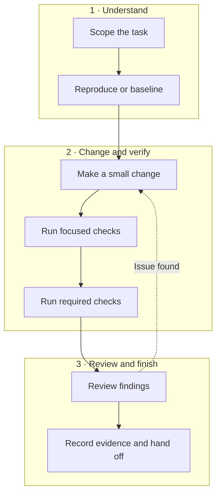
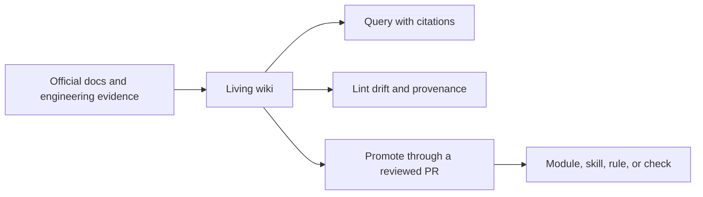
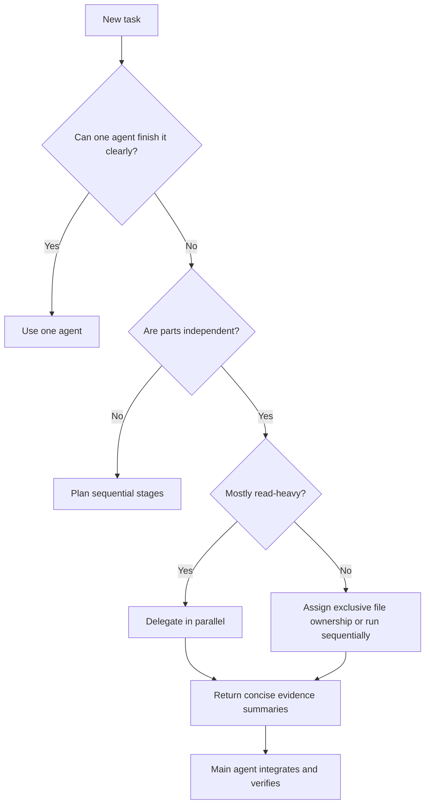

# Codex How To

Turn Codex from a code generator into a verifiable engineering workflow.


This engineering-first guide takes a task through scoping, implementation,
testing, review, and evidence—with focused workflows for frontend, backend,
DevOps, security, and multi-agent orchestration.

[](https://github.com/Phelan164/codex-howto/actions/workflows/validate.yml)
[](LICENSE)
[](https://skills.sh/phelan164/codex-howto)
[](https://skillstore.io/skills/phelan164-engineering-loop)
[](https://skillstore.io/skills/phelan164-engineering-loop)

[Start learning](modules/00-mental-model/README.md) ·
[Try the engineering loop](#try-the-engineering-loop) ·
[See measured results](#what-the-seed-measurements-show) ·
[Browse all skills](#engineering-skill-catalog) ·
[Fork a tested edition](resources/fork-an-edition.md) ·
[Contribute](#contributing)

> **Status:** community preview. Content was checked against official Codex
> documentation on 2026-07-31. Codex changes quickly; verify settings and
> commands through the links marked **Official source**.

### Use it, verify it, improve it

1. **Use it:** [install the flagship loop](#try-the-engineering-loop) or run the
   [dependency-free playground](labs/engineering-playground/README.md).
2. **Verify it:** inspect the [raw task receipts](examples/measurements/engineering-loop-runs.csv)
   before trusting an efficiency claim.
3. **Improve it:** [fork the repository](https://github.com/Phelan164/codex-howto/fork),
   run the same evaluator on your stack, and contribute a sanitized result.

If the workflow saves you a failed iteration, [star the repository](https://github.com/Phelan164/codex-howto)
to follow new measurements. A fork is most useful when it produces a
reproducible task, evaluator, correction, translation, or workflow profile—not
just another copy.

## Try the engineering loop

Install the flagship skill with the community
[skills.sh installer](https://skills.sh/phelan164/codex-howto):

```bash
npx skills add Phelan164/codex-howto --skill engineering-loop -g -a codex -y
```

Start a new Codex task in a small, version-controlled project:

```text
$engineering-loop Implement this change end to end. Continue through focused
tests, required checks, diff review, and verified fixes. Report the commands
run, evidence produced, and anything that remains unverified.
```

Expect a baseline, a bounded implementation, focused and required checks, a
final diff review, and an evidence handoff—not just generated code. Inspect the
[skill source](skills/engineering-loop/SKILL.md) before installing it, or use
the dependency-free
[five-minute playground](labs/engineering-playground/README.md) first.

## See the engineering loop



Read it top to bottom: understand the task, make and verify one small change,
then review and hand off evidence. A verified review finding returns to the
change step.

The repository treats generated code as an intermediate result. Completion
requires observable behavior, relevant checks, diff review, and an explicit
record of anything that remains unverified.

| Ad hoc Codex use | Repository workflow |
|---|---|
| Start from a vague request | Define goal, context, constraints, and done conditions |
| Generate a large solution in one pass | Reproduce, change minimally, and verify incrementally |
| Load broad context “just in case” | Route to one lifecycle skill and only relevant specialists |
| Treat passing output as proof | Record commands, results, review findings, and residual risk |
| Add agents because parallelism is available | Delegate only independent, bounded work |

## What the seed measurements show

Skills are not automatically more efficient. In controlled GPT-5.6-sol runs,
the best choice changed with task size:

| Task | Quality result | Most token-efficient variant |
|---|---|---|
| Small backend boundary fix | All three variants passed | No repository skill: 390,144 reported tokens |
| Medium 2048 browser game | All three variants passed | Lean skill v0.4.0: 380,767 reported tokens |

On the game task, the lean `engineering-loop` used **31.2% fewer reported
tokens than v0.2.0** and **54.0% fewer than the no-repository-skill control**.
On the smaller backend fix, the control remained cheapest. This suggests that
lifecycle guidance may be redundant for a bounded fix but useful when a task
spans implementation, testing, review, and evidence handoff.

These are two controlled seed tasks, not universal performance claims. Read the
[backend result](examples/measurements/gpt-5.6-sol-backend-boundary-2026-07-31.md),
the [2048 result](examples/measurements/gpt-5.6-sol-2048-game-2026-07-31.md),
and the [measurement protocol](resources/engineering-loop-measurement.md) before
changing a team workflow.

The [interactive benchmark explorer](https://codex-howto-benchmark.nguyenvantamdk2.chatgpt.site)
turns the six runs into a
task-size toggle, proportional token comparison, run-detail table, method
summary, and visible limitations. Its source and rendered evidence are checked
in CI so the shareable view remains traceable to the repository measurements.
The standalone
[measurement article](resources/articles/do-codex-skills-save-tokens.md)
explains the setup, results, boundary hypothesis, and replication protocol
without requiring a repository click. A complete
[Vietnamese edition](resources/articles/do-codex-skills-save-tokens.vi.md)
preserves the same measurements and limitations for local publication.

## Measure workflows instead of collecting them

Established community projects already provide strong engineering methods.
[`mattpocock/skills`](https://github.com/mattpocock/skills) emphasizes small,
composable workflows for real engineering.
[`obra/superpowers`](https://github.com/obra/superpowers) provides a more
prescriptive design, planning, TDD, review, and verification lifecycle.

This repository does not vendor or rename those catalogs. It provides
[comparison profiles](resources/third-party-workflow-profiles.md) and a common
[measured task receipt](examples/templates/measured-task-receipt.md) so teams
can compare no skill, the lean Codex loop, and selected third-party workflows
under the same task contract.

The useful question is not “which catalog is best?” It is “which minimum
workflow improves acceptance, evidence, or safety enough to justify its
context, checkpoints, time, and total tokens for this task class?”

## Five-minute engineering demo

Use the dependency-free [engineering playground](labs/engineering-playground/README.md)
to demonstrate a complete backend defect loop safely:

```bash
demo_root="$(mktemp -d)"
cp -R labs/engineering-playground "$demo_root/playground"
mkdir -p "$demo_root/playground/.agents/skills"
cp -R skills/engineering-loop "$demo_root/playground/.agents/skills/"
cd "$demo_root/playground"
git init
```

Start Codex in that directory and ask:

```text
$engineering-loop Inspect the inventory reservation contract, reproduce one
uncovered input-boundary defect, add the smallest regression test, implement
the fix, run the required checks, and review the final diff. Work only in this
disposable playground.
```

Watch for four proof points: a failing regression before the fix, a small
implementation diff, passing focused checks, and a final evidence report.
Then use the
[measurement protocol](resources/engineering-loop-measurement.md) to compare
no-skill, full-skill, and lean-skill runs without treating one demo as proof.
For a larger implementation exercise, use the
[dependency-free 2048 benchmark](labs/2048-game-benchmark/README.md) and inspect
the [GPT-5.6-sol seed measurement](examples/measurements/gpt-5.6-sol-2048-game-2026-07-31.md).
To measure a genuinely partitioned large task, compare one agent with bounded
backend/frontend ownership in the
[incident-response orchestration benchmark](labs/incident-response-benchmark/README.md).
Use [PRESENTING.md](PRESENTING.md) for a 15-minute talk track, demo checklist,
and copy-ready announcement.

## Make Codex know-how compound

The [Codex Living Wiki](knowledge/README.md) turns repeated research into a
reviewed, source-grounded knowledge layer:



It adapts
[Karpathy's LLM Wiki idea](https://gist.github.com/karpathy/442a6bf555914893e9891c11519de94f)
for Codex engineering. External source bodies stay out of Git by default,
deterministic lint checks mechanical integrity, and factual changes remain
human-reviewed.

Try a read-only query:

```text
$maintain-codex-wiki What does this repository know about orchestration
efficiency? Cite wiki pages, separate evidence from recommendation, and do not
modify files.
```

The wiki starts with Markdown and repository search—no database, embeddings, or
MCP service until measured retrieval quality justifies them.

## Why this repository exists

Official documentation is the source of truth for product behavior. This
repository turns that product surface into a practical, runnable curriculum for
software engineers.

You will learn how to:

- give Codex enough context without flooding the conversation;
- encode repository conventions in `AGENTS.md`;
- turn repeated frontend, backend, DevOps, testing, review, and security work into skills;
- connect external systems through MCP;
- choose safe sandbox and approval settings;
- delegate bounded work to specialized agents;
- orchestrate parallel work without creating edit conflicts;
- reduce wasted context, retries, and unnecessary token use;
- compile evolving Codex know-how into a review-first living wiki;
- automate stable workflows only after they are reliable interactively.

## What is included

- **14 progressive modules** covering safety, prompting, `AGENTS.md`, skills,
  MCP, subagents, orchestration, context efficiency, automation, and
  living knowledge maintenance.
- **9 installable skills** covering the end-to-end engineering
  loop, frontend, backend, DevOps, testing, code review, security review, and
  orchestration, plus review-first knowledge maintenance and an explicit
  router kept as an educational example.
- **A living maintainer wiki** with registered provenance, deterministic
  linting, review gates, and a measured promotion path into the curriculum.
- **Copy-ready examples** for project configuration, custom agents, prompts,
  engineering specifications, dependency-aware tickets, handoffs, hooks, MCP,
  and local plugins.
- **A dependency-free playground** with seeded defects for practicing the full
  implement–test–review loop safely.

## Who this is for

- **Beginners** who can open Codex but are unsure how to structure a real task.
- **Working engineers** who want repeatable workflows for production repositories.
- **Tech leads** who want shared agent instructions and review standards.
- **Platform teams** building skills, plugins, MCP integrations, and CI automation.

## Choose your route

| Goal | Start here |
|---|---|
| Learn safe Codex fundamentals | [Track A · Safe beginner](LEARNING-ROADMAP.md#track-a-safe-beginner) |
| Build and review application code | [Track B · Application engineer](LEARNING-ROADMAP.md#track-b-application-engineer) |
| Work with delivery and infrastructure | [Track C · Platform and DevOps engineer](LEARNING-ROADMAP.md#track-c-platform-and-devops-engineer) |
| Coordinate subagents efficiently | [Track D · Agent orchestrator](LEARNING-ROADMAP.md#track-d-agent-orchestrator) |
| Maintain evolving Codex know-how | [Track E · Knowledge maintainer](LEARNING-ROADMAP.md#track-e-knowledge-maintainer) |
| Learn by fixing a small project | [Engineering playground](labs/engineering-playground/README.md) |

## Learning path

| Stage | Module | Outcome | Time |
|---|---|---|---:|
| Foundation | [00 · Mental model](modules/00-mental-model/README.md) | Choose the right Codex surface and task shape | 25 min |
| Foundation | [01 · Sandbox and approvals](modules/01-sandbox-and-approvals/README.md) | Set safe autonomy boundaries before the first write | 45 min |
| Foundation | [02 · CLI and surfaces](modules/02-cli-and-surfaces/README.md) | Install, authenticate, navigate, and inspect safely | 35 min |
| Foundation | [03 · Prompts and plans](modules/03-prompts-and-plans/README.md) | Write scoped prompts with observable completion criteria | 40 min |
| Foundation | [04 · AGENTS.md](modules/04-agents-md/README.md) | Make repository guidance durable and local | 45 min |
| Engineering | [05 · Engineering skills](modules/05-engineering-skills/README.md) | Build and install reusable engineering workflows | 60 min |
| Engineering | [06 · MCP and tools](modules/06-mcp-and-tools/README.md) | Add live data and actions without bloating instructions | 45 min |
| Engineering | [07 · Testing and review](modules/07-testing-and-review/README.md) | Close the implementation–verification–review loop | 55 min |
| Scale | [08 · Subagents](modules/08-subagents/README.md) | Delegate narrow, independent work | 50 min |
| Scale | [09 · Orchestration](modules/09-orchestration/README.md) | Coordinate parallel agents with clear ownership | 70 min |
| Scale | [10 · Context and token efficiency](modules/10-context-and-token-efficiency/README.md) | Reduce context pollution and expensive retries | 50 min |
| Scale | [11 · Automation, plugins, and hooks](modules/11-automation-plugins-hooks/README.md) | Package and automate stable workflows | 60 min |
| Operations | [12 · Troubleshooting](modules/12-troubleshooting/README.md) | Diagnose failures by layer instead of guessing | 35 min |
| Operations | [13 · Living Codex wiki](modules/13-living-codex-wiki/README.md) | Compile, verify, and promote evolving know-how | 55 min |

Full path: roughly **10–11 hours**. Start with modules 00–03, then follow the
shortest track that matches your work.

## Five-minute safe start

1. Install Codex using the [official quickstart](https://developers.openai.com/codex/quickstart).
2. Open a small, version-controlled repository.
3. Ask Codex:

   ```text
   Goal: explain how this repository is built and tested.
   Context: inspect the root configuration and contributor docs.
   Constraints: read only; do not install dependencies or change files.
   Done when: return the exact build, test, lint, and type-check commands,
   and cite the files that define them.
   ```

4. Review the result.
5. Generate a starter `AGENTS.md` with `/init`, then replace generic text with verified commands.

## Engineering skill catalog

Start with the model, the task contract, and repository guidance. Add one
focused skill only when it improves a measured engineering outcome or supplies
non-generic workflow, safety, policy, or tool knowledge. Use the
[model-adaptive skill guide](resources/model-adaptive-skills.md) and
[three-way ablation protocol](resources/engineering-loop-measurement.md) before
standardizing a skill for a team.

This repository includes nine installable starter skills:

| Skill | Purpose |
|---|---|
| [`engineering-loop`](skills/engineering-loop/SKILL.md) | Drive a change through baseline, implementation, testing, review, and evidence |
| [`build-frontend`](skills/build-frontend/SKILL.md) | Implement accessible UI changes with visual and behavioral verification |
| [`build-backend`](skills/build-backend/SKILL.md) | Change APIs, services, persistence, and contracts safely |
| [`operate-devops`](skills/operate-devops/SKILL.md) | Modify delivery and infrastructure with rollback-aware validation |
| [`review-code`](skills/review-code/SKILL.md) | Find consequential defects, regressions, and missing tests |
| [`test-software`](skills/test-software/SKILL.md) | Design risk-based tests and implement the highest-value coverage |
| [`review-security`](skills/review-security/SKILL.md) | Trace trust boundaries and report exploitable security risks |
| [`orchestrate-engineering`](skills/orchestrate-engineering/SKILL.md) | Coordinate bounded agents while protecting context and avoiding edit conflicts |
| [`maintain-codex-wiki`](skills/maintain-codex-wiki/SKILL.md) | Query, capture, ingest, archive, lint, and promote review-first Codex knowledge |

The [quick start](#try-the-engineering-loop) installs `engineering-loop`.
Install the Living Wiki maintainer through the same
[open agent skills ecosystem](https://skills.sh/phelan164/codex-howto):

```bash
npx skills add Phelan164/codex-howto --skill maintain-codex-wiki -g -a codex -y
```

The flagship skills also have independently scanned SkillStore pages:
[Engineering Loop](https://skillstore.io/skills/phelan164-engineering-loop) and
[Maintain Codex Wiki](https://skillstore.io/skills/phelan164-maintain-codex-wiki).

List all nine skills without installing:

```bash
npx skills add Phelan164/codex-howto --list
```

Alternatively, inspect and copy a skill into `.agents/skills/` for one project
or `~/.agents/skills/` for personal reuse:

```bash
mkdir -p .agents/skills
cp -R /path/to/codex-howto/skills/review-code .agents/skills/
```

Inspect every skill before installing it, then start a new Codex task and invoke
it explicitly:

```text
$review-code Review this branch against main. Lead with consequential findings
and list checks you could not run.
```

The explicit-only
[`choose-engineering-flow`](examples/skills/choose-engineering-flow/SKILL.md)
router remains an educational example, not a recommended runtime dependency.
Clear skill descriptions should normally let Codex select the relevant
workflow without spending another turn on routing. The orchestrator remains
explicit-only because accidental activation adds coordination overhead.
`maintain-codex-wiki` is also explicit-only because capture, ingest, archive,
and promotion can change shared factual guidance.

For a complete local develop–test–review cycle, install `engineering-loop` and
start with:

```text
$engineering-loop Implement this change end to end. Continue through focused
tests, required checks, diff review, and verified fixes. Stop on missing
authority or an ambiguous test environment.
```

## The orchestration rule

Use one agent by default. Add agents only when the work has independent, bounded parts.



Parallel agents often improve elapsed time and protect the main thread from noisy logs, but they normally use **more total tokens**. The efficiency target is fewer failed loops and cleaner context, not the maximum number of agents.

## Repository map

```text
codex-howto/
├── .github/                 # Validation workflow and PR template
├── .codex-plugin/           # Plugin manifest over the existing skill catalog
├── modules/                 # Progressive tutorials and labs
├── skills/                  # Installable engineering skills
├── knowledge/               # Review-first maintainer evidence wiki
├── labs/
│   └── engineering-playground/ # Self-contained practice project
├── examples/
│   ├── agents/              # Project-scoped custom agent definitions
│   ├── config/              # Conservative Codex configuration
│   ├── prompts/             # Copy-ready task and orchestration prompts
│   └── AGENTS.md            # Starter repository guidance
├── resources/               # Checklists and comparison material
└── scripts/validate_repo.py # Offline structural validation
```

See [CATALOG.md](CATALOG.md) for the complete index and [LEARNING-ROADMAP.md](LEARNING-ROADMAP.md) for suggested tracks.

For a dependency-free end-to-end exercise, copy the
[engineering playground](labs/engineering-playground/README.md) to a disposable
directory and practice backend, frontend, DevOps, testing, review, security, and
orchestration workflows against its seeded defects.

## Source policy

- Product behavior and configuration claims must link to official OpenAI documentation.
- Community examples must be labeled as community material.
- Version-sensitive examples should include a verification date.
- Secrets, production credentials, and destructive defaults are never included.
- Marketing claims such as “10x productivity” are intentionally avoided.

## Inspiration and related work

The progressive-module idea was inspired by [luongnv89/claude-howto](https://github.com/luongnv89/claude-howto). This repository is an original Codex-focused curriculum and does not copy its tutorial text or templates.

The skill-system refinements were inspired by the original
[mattpocock/skills](https://github.com/mattpocock/skills) repository. Its
invocation, routing, debugging, and review ideas were adapted to Codex without
copying its skills.

The workflow-calibration profiles also study
[obra/superpowers](https://github.com/obra/superpowers), particularly its
design gates, worktree isolation, verification discipline, staged review, and
skill-behavior testing. `codex-howto` links to both MIT-licensed upstream
projects rather than vendoring their catalogs.

Bounded autonomous-loop controls were informed by
[affaan-m/everything-claude-code](https://github.com/affaan-m/everything-claude-code),
especially its plan-build-judge, evaluation, context-budget, and cost-tracking
workflows. The Codex adaptation remains optional and is measured as a focused
component rather than importing the full harness.

The living-wiki pattern was inspired by
[Karpathy's LLM Wiki idea](https://gist.github.com/karpathy/442a6bf555914893e9891c11519de94f).
The review-first Codex adaptation also studies
[Astro-Han/karpathy-llm-wiki](https://github.com/Astro-Han/karpathy-llm-wiki),
[lucasastorian/llmwiki](https://github.com/lucasastorian/llmwiki), and
[atomicstrata/llm-wiki-compiler](https://github.com/atomicstrata/llm-wiki-compiler).
External source bodies are not copied into this repository by default.

Useful related community projects:

- [freestylefly/CodexGuide](https://github.com/freestylefly/CodexGuide)
- [geekjourneyx/awesome-codex-guide](https://github.com/geekjourneyx/awesome-codex-guide)
- [bozhouDev/codex-orange-book](https://github.com/bozhouDev/codex-orange-book)
- [RoggeOhta/awesome-codex-cli](https://github.com/RoggeOhta/awesome-codex-cli)
- [ComposioHQ/awesome-codex-skills](https://github.com/ComposioHQ/awesome-codex-skills)
- [VoltAgent/awesome-codex-subagents](https://github.com/VoltAgent/awesome-codex-subagents)

The authoritative upstream implementation is [openai/codex](https://github.com/openai/codex).

## Contributing

Contributions are welcome. Start with [CONTRIBUTING.md](CONTRIBUTING.md). New
tutorials should include a concrete outcome, a safe exercise, a verification
step, and official sources.

If the guide is useful, choose the action that creates the most value:

- try the playground and report a reproducible gap;
- [contribute anonymized engineering-loop measurements](https://github.com/Phelan164/codex-howto/issues/8);
- [test the Living Wiki against normal repository search](https://github.com/Phelan164/codex-howto/issues/16);
- [fork it into a tested stack, team, translation, or benchmark edition](resources/fork-an-edition.md);
- share it with one relevant developer community; or
- star it so you can find it again.

Use the [community guide](COMMUNITY.md) for responsible participation and the
[launch kit](resources/community-launch-kit.md) for audience-specific
presentation material.

## License and trademarks

Released under the [MIT License](LICENSE). “OpenAI” and “Codex” are trademarks
of their respective owners. This is an independent community project and is not
endorsed by OpenAI or Anthropic.
