<div align="center">


**Plug-and-play MCP. UI superpowers for your agent.**

[](https://www.npmjs.com/package/@pymodel/designer-skill-mcp)
[](https://www.npmjs.com/package/@pymodel/designer-skill-mcp)
[](https://github.com/PyModel/designer-skill/actions/workflows/test.yml)
[](LICENSE)
[](https://skills.sh/pymodel/designer-skill)
<br />
[](#tools)
[](#references)
[](#tools)
[](designer-skill-mcp/package.json)
[](#setup)

[Setup](#setup) · [How it works](#how-it-works) · [References](#references) · [Tools](#tools) · [Development](#development)

</div>

## Setup

[](#setup)

**Paste into your agent** (Claude Code, Codex, Cursor, any MCP client). It installs the skill, wires the MCP and verifies the tools:

```text
Add designer-skill alongside Niblet Designer UI. The designer core is keyless: it routes requests, loads guidance and runs supplemental static checks. Niblet optionally supplies real screens and licensed materials; the host owns implementation and rendered verification.

1. Install or refresh the skill into the user skill directory (not this project):
npx skills add PyModel/designer-skill --skill designer-skill -g -y

2. Add the local MCP using this client's native MCP configuration, in the user-level (not project-level) config:
Name: designer-skill
Transport: stdio
Command: npx
Args: -y @pymodel/designer-skill-mcp@latest

No API key is needed. Do not add one.

3. Verify: list the designer-skill server's tools and confirm get_preflight_brief, dispatch_intent, review_and_gate are present. Do not run a sample check.

When setup is complete, confirm the skill is installed and the three named tools are exposed. On UI work: call get_preflight_brief, use dispatch_intent and load only relevant guidance. If an unresolved visual question warrants retrieval, use the separately configured niblet server's discovered tools. Prefer its image content for inspection; designer-skill's catalogue wrappers return metadata or routing guidance only. Run review_and_gate as supplemental static evidence, then perform the required rendered, functional and accessibility checks in the host. Never treat static success as UI PASS. Preserve audit/plan scope. Continue an active authorized task; otherwise report designer-skill ready, and report Niblet paired only if its tools were actually observed.
```

No Niblet? Continue from local product evidence; catalogue retrieval is optional.

**Or pick one:**

| | Install |
|---|---|
| 🟣 **Claude Code plugin** (skill + MCP) | `/plugin marketplace add PyModel/designer-skill` then `/plugin install designer-skill@pymodel` |
| 🟢 **Codex plugin** | `codex plugin marketplace add PyModel/designer-skill`, then install **designer-skill** from **pymodel** in `/plugins` |
| ⚫ **Cursor plugin** | Install from the marketplace; ships `mcp.json`, skills, `/designer-setup` · `/designer-status` |
| 🔵 **MCP only, any client** | `claude mcp add designer-skill -- npx -y @pymodel/designer-skill-mcp` (same args for `codex mcp add`, `pythinker mcp add --transport stdio`) |
| 🟠 **Skill only** | `npx skills add PyModel/designer-skill --skill designer-skill` or copy `skills/designer-skill/` into `~/.claude/skills/` / `~/.codex/skills/` |

Canonical MCP config ([`mcp.json`](mcp.json)):

```json
{ "mcpServers": { "designer-skill": { "command": "npx", "args": ["-y", "@pymodel/designer-skill-mcp@latest"] } } }
```

`@latest` tracks npm; teams pin `@pymodel/designer-skill-mcp@0.22.0`. Plugin skill content updates separately (`/plugin update …`). MCP registry name: `io.github.PyModel/designer-skill-mcp`. Requires Node 22+.

<details>
<summary><strong>Per-client config</strong> (VS Code, Codex TOML, Kilo, Open Code, Claude Desktop, Pythinker, Pi)</summary>

**VS Code** `.vscode/mcp.json` (1.99+):

```json
{ "servers": { "designer-skill": { "type": "stdio", "command": "npx", "args": ["-y", "@pymodel/designer-skill-mcp"] } } }
```

**Codex CLI** `~/.codex/config.toml`:

```toml
[mcp_servers.designer-skill]
command = "npx"
args = ["-y", "@pymodel/designer-skill-mcp"]
```

**Open Code** `opencode.json`:

```json
{ "mcp": { "designer-skill": { "type": "local", "command": ["npx", "-y", "@pymodel/designer-skill-mcp"] } } }
```

**Claude Desktop, Cursor (`.cursor/mcp.json`), Kilo Code (`mcp_settings.json`), Pythinker (`~/.pythinker/mcp.json`)**: the canonical `mcpServers` JSON above. Pythinker verify: `pythinker mcp test designer-skill` ([guide](docs/blog/integrating-designer-skill-with-pythinker.md)).

**Pi**: the same JSON, or register the skill natively: `{ "skills": [{ "path": "/path/to/skills/designer-skill/SKILL.md" }] }`

**Local checkout**: replace `npx` with `"command": "node", "args": ["/abs/path/to/designer-skill-mcp/dist/index.js"]`.

</details>

## How it works

```mermaid
flowchart LR
  A[Prompt] --> B[get_preflight_brief]
  B --> C[dispatch_intent]
  C --> D[get_reference]
  D --> E[Build / polish UI]
  E --> F[review_and_gate]
  F -->|FAIL: fix| E
  F -->|static checks pass| G[Rendered checks<br/>by the host]
  classDef start fill:#f8fafc,stroke:#94a3b8,color:#18181b
  classDef route fill:#eff6ff,stroke:#3b82f6,color:#1e3a8a
  classDef know fill:#faf5ff,stroke:#7c3aed,color:#4c1d95
  classDef work fill:#fff7ed,stroke:#e87a3d,color:#7c2d12
  classDef gate fill:#ecfdf5,stroke:#10b981,color:#065f46
  classDef host fill:#fff1f2,stroke:#e11d48,color:#881337
  class A start
  class B,C route
  class D know
  class E work
  class F gate
  class G host
```

[](#how-it-works)



| 🔵 Route | 🟣 Know | 🟢 Check |
|---|---|---|
| `dispatch_intent` maps "make it pop" or "it feels off" to design verbs and at most four references. | 24 designer references (type, color, motion, a11y, anti-slop, redesign, worst-case data, dependency selection…) plus 26 `ux/*` references (forms, collaboration, canvas, AI, i18n…). | A 44-rule deterministic detector backs `review_and_gate`, which reports each required rule as ran, unsupported, unresolved or waived. |

The gate is static only: overall status is `FAIL` or `NOT_VERIFIED`, never a rendered-readiness pass. Rendered, accessibility and performance checks stay `NOT_RUN` until the host supplies evidence.

### Niblet ecosystem

| Owner | Responsibility |
|---|---|
| `designer-skill` | One entry point for scope, routing, craft/UX guidance and verification reporting |
| Niblet platform | Real-screen catalogue, recorded design references and license-recorded materials |
| Niblet MCP | Reference images and material retrieval; hosted `get_ui_component` provides React source |
| Agent host | Authorized file/dependency changes, browser/native interaction, rendered inspection and evidence |

Discover tools per server: the same `find_ui_references` name on designer-skill is a **text-only REST wrapper**, not Niblet's image-delivering tool. Prefer Niblet MCP for reference inspection and materials. Do not call both providers for the same question or infer connectivity from installation. Consult [`niblet-catalogue`](skills/designer-skill/reference/niblet-catalogue.md) for deployment differences, bounds and licensing.

Use one product-grounded design contract. Niblet's surface modes (**Persuade, Operate, Read, Experience**) describe the user's job; designer-skill's execution modes (**audit, plan, refine, implement, system**) describe permitted work. They are independent: an Operate surface can receive a read-only audit or an authorized refinement. Existing product tokens, components and real content win over reference aesthetics. Component retrieval does not authorize dependency installation or source writes, and neither MCP certifies rendered quality.

**Example:** *"Use designer-skill to redesign this pricing page without breaking functionality."* → `get_preflight_brief` → `dispatch_intent` → `get_reference` → edit → `review_and_gate`.

<div align="center">

**Built with it:** [pythinker.com](https://pythinker.com)

<a href="https://pythinker.com"></a>

</div>

## References

[](#references)

| File | Use when | Tier |
|---|---|---|
| `design-principles` | Typography, spacing, color, layout, hierarchy | 🔵 core |
| `differentiation-playbook` | Being distinctive: inverse test, layout menu, named references | 🔵 core |
| `aesthetic-systems` | Picking a look: 5 systems with palettes, fonts, shadows | 🔵 core |
| `motion-and-interaction` | Timing, springs, scroll, reduced motion | 🔵 core |
| `engineering-and-performance` | Tokens, a11y, responsive, Core Web Vitals | 🔵 core |
| `avoid-ai-slop` | Ban list, category-reflex checks, completeness contract | 🔵 core |
| `refactor-and-redesign` | Audit → diagnose → redesign without breaking behavior | 🔵 core |
| `command-playbook` | Intent → verb dispatch | 🔵 core |
| `verification-and-recovery` | Evidence rules, gate statuses, failure triage | 🔵 core |
| `interaction-design` | Fitts/Hick/Miller, forms, navigation, errors, loading | 🔴 extended |
| `visual-critique` | Seven-dimension critique | 🔴 extended |
| `design-systems` | Token architecture, component specs, theming | 🔴 extended |
| `project-init` | Discovery interview, PRODUCT.md, DESIGN.md | 🔴 extended |
| `craft-flow` | Scope-adaptive implementation and evidence workflow | 🔴 extended |
| `live-mode` | Authorized source variants using host-discovered preview tools | 🔴 extended |
| `css-techniques` | Modern CSS: container queries, `:has()`, `clamp()`, logical props | 🔴 extended |
| `motion-vocabulary` | Map a feel word ("the bouncy thing") to the standard motion term | 🔴 extended |
| `fluid-input-principles` | Gesture-first fluid-interface principles translated for web | 🔴 extended |
| `native-web` | Platform-correct mobile web: tap, viewport, safe areas, zoom | 🔴 extended |
| `worst-case-data` | Design and verify against extreme real data, not demo values | 🔴 extended |
| `variant-prototyping` | Time-boxed side-by-side variants for genuinely open decisions | 🔴 extended |
| `dependency-selection` | Method for choosing or adding a UI dependency, not a picks list | 🔴 extended |
| `niblet-catalogue` | Optional real-screen references and materials via Niblet; advisory, unconfigured-safe | 🔴 extended |
| `craft-provenance` | Historical capability mapping and attribution; load only when needed | 🔴 extended |

Plus 26 `ux/*` references, authored in [`skills/ux-designer/`](skills/ux-designer/) and vendored at `skills/designer-skill/reference/ux/` (generated by `node scripts/sync-ux.mjs`, checked by test), so a designer-skill-only install is self-contained. Each `SKILL.md` is a short router with a one-line description; references load only when a task needs them.

| Phrase | Verbs | Reads |
|---|---|---|
| "make it pop" | `amplify` · `color` | `aesthetic-systems`, `design-principles` |
| "it feels off" | `check` · `layout` | `refactor-and-redesign`, `avoid-ai-slop` |
| "production-ready" | `ship` · `check` | `engineering-and-performance` |
| "add some motion" | `motion` | `motion-and-interaction` |
| "it looks AI-made" | `review` · `brand` | `avoid-ai-slop`, `aesthetic-systems` |
| "redesign this" | `check` · `refresh` | `refactor-and-redesign`, `command-playbook` |

## Tools

[](#tools)

<!-- tools:start -->
| Tool | Purpose |
|---|---|
| `get_preflight_brief` | Scope and verification contract (call first) |
| `load_project_context` | Read PRODUCT.md / DESIGN.md from the project (absolute `cwd`) |
| `get_design_system` | SKILL.md router and reference map |
| `get_reference` | Load one reference by name (designer or `ux/*`) |
| `anti_slop_checklist` | Advisory style and truthful-content review guidance |
| `list_commands` | All design verbs with descriptions |
| `get_command` | Help and reference names for one verb |
| `dispatch_intent` | Map a request → verb(s) + at most four references to read |
| `commit_design_direction` | Validate a context-grounded direction record |
| `get_palette_seed` | OKLCH brand seed for authorized new palette work |
| `detect_antipatterns` | Deterministic static scan (44 rules): coverage, file hashes, gaps |
| `review_and_gate` | Static gate per required rule; never claims rendered readiness |
| `find_ui_references` | Optional text-only Niblet real-screen search or selected-screen metadata (`NIBLET_TOKEN`) |
| `get_design_reference` | Optional niblet structured reference for a web screen (`NIBLET_TOKEN`) |
| `find_ui_materials` | Niblet materials routing guidance; retrieval runs on the Niblet MCP package or hosted MCP (`kind: pack` refused) |
<!-- tools:end -->

**Resources:** `designer://skill` · `designer://reference/{+name}` · **Prompt:** `design` (`task`, optional `aesthetic`)

## Development

[](#development)

```bash
cd designer-skill-mcp
npm ci
npm run build   # syncs skills/ → assets/ (generated, gitignored), compiles TypeScript
npm run typecheck && npm test   # tsc over src + test, then vitest; `npm run smoke` drives the packed tarball
```

### Skill robustness checks

Edit UX guidance only in `skills/ux-designer/references/`; `npm run sync-skill` regenerates the standalone mirror before bundling. Run `node scripts/sync-ux.mjs` from the repository root for filesystem-only distribution.

Run reports now use **v2**, plus a host-owned verification plan. Validate both bundled JSON schemas, then run the dependency-free `skills/designer-skill/scripts/validate-report.mjs REPORT PLAN AUTHORIZED_ROOT` for evidence hashes, confinement, revision/plan matching and rendered-readiness semantics. Its own PASS means report validation, not UI certification. Legacy v1 reports fail closed and must be regenerated from real evidence; update host readers/writers together.

Behavioral action-plan cases and a deterministic grader live in [`evals/designer-skill/`](evals/designer-skill/README.md). Synthetic grader tests do not count as model evaluations, and model proposals do not prove actual tool-use compliance or rendered quality. Keep model, host, skill hash and repetitions with evaluation results.

**HTTP mode** (Streamable HTTP at `/mcp`):

```bash
node dist/index.js --http --port 3017 --root /abs/project                     # 127.0.0.1
DESIGNER_SKILL_HTTP_TOKEN=… node dist/index.js --http --host 0.0.0.0 --root /abs/project
```

Every HTTP bind requires at least one `--root`. Loopback binds validate the Host header; a non-loopback bind also requires `DESIGNER_SKILL_HTTP_TOKEN` (`Authorization: Bearer …`).

**Release:** `./scripts/release.sh "notes"` bumps and syncs every version, verifies, tags and pushes; [`publish.yml`](.github/workflows/publish.yml) publishes npm (with provenance), the MCP registry entry and the GitHub release. Contract details: [`docs/HARDENING.md`](docs/HARDENING.md).

<div align="center">

[](LICENSE)
[](designer-skill-mcp/)
[](skills/designer-skill/)

</div>
