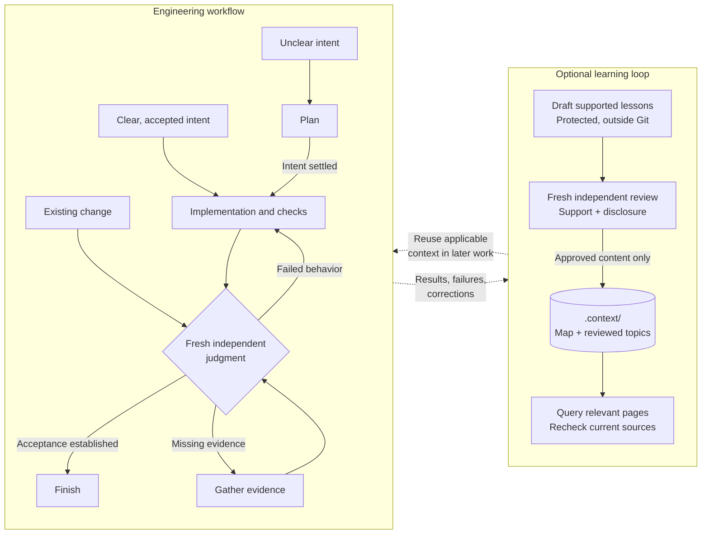

<p align="center">
  
</p>

# AgentOps

AgentOps is an operations layer for AI coding agents. It encodes software
engineering practices into reusable skills and tools for planning,
implementation, coordination, testing, and independent review. AI agents are
stochastic workers; AgentOps supplies the operational and engineering discipline
for directing their work and checking the results.

Use one skill for a bug fix or combine them for a larger project. The instructions
are plain Markdown you can inspect and adapt. Your coding agent does the work
with your existing tests, issue tracker, and Git workflow.

[](https://github.com/boshu2/agentops/actions/workflows/validate.yml)
[](LICENSE)
[](https://github.com/boshu2/agentops/releases/latest)

[Install](#quickstart) · [Workflow](#workflow) · [Why these skills exist](#why-these-skills-exist) ·
[Skill library](#choose-skills-by-the-work) · [Documentation](docs/documentation-index.md)

<a id="why-these-skills-exist"></a>

## Why use AgentOps?

| When the agent… | What AgentOps adds |
|---|---|
| Builds something different from what you meant | Concrete acceptance examples shared by implementation and review |
| Uses three names for the same concept | Consistent domain language across the request, code and tests |
| Says “done” after a green test run | Fresh independent judgment with missing coverage called out |
| Repeats the last session's investigation | Reusable checks, tools and reviewed project context |

## Workflow

**Start where the work is. You do not need to run Plan before Implement.**
Choose guidance for the uncertainty and coordination your task needs.



Query `.context/README.md` and relevant topics only when they can change the
next action. Compounding is the aim; count it only when reuse improves later
work, and retain failed reuse as evidence.

### Choose skills by the work

| Your starting point | Where to enter |
|---|---|
| You know what needs to change | [Implement](skills/implement/SKILL.md) directly. Use [Test](skills/test/SKILL.md) or [Refactor](skills/refactor/SKILL.md) for focused work. |
| Behavior or scope is unclear | [Plan](skills/plan/SKILL.md) to settle it; [Research](skills/research/SKILL.md) to establish facts. |
| A change or design already exists | [Review](skills/review/SKILL.md) for advice; fresh [Validate](skills/validate/SKILL.md) for acceptance. |
| Work spans tasks or agents | [Orchestrate](skills/orchestrate/SKILL.md) to coordinate scope, dependencies, integration and validation. |
| Earlier work may answer the question | [Memory](skills/memory/SKILL.md) to retrieve relevant, reviewed context. |

All 36 skills are optional. Use one, combine a few, or work directly in your
coding agent. Browse the [full skill catalog](docs/SKILL-ROUTER.md).

Keep the accepted behavior fixed unless you authorize a scope change. A fresh
reviewer checks the exact result; the author cannot approve their own work.
Delivery follows your repository's policy.

<a id="install"></a>

## Quickstart

Choose one installation method to avoid duplicate copies.

### 1. Get the skills

<details>
<summary><strong>Claude Code</strong></summary>

<a id="claude-code"></a>

```bash
claude plugin marketplace add boshu2/agentops
claude plugin install agentops@agentops-marketplace
claude plugin details agentops@agentops-marketplace
```

Check that `agentops` appears in the plugin inventory. The bundle includes
skills, four agents and [tool-call guards](#optional-admission-control-hooks).

</details>

<details>
<summary><strong>Codex</strong></summary>

<a id="codex"></a>

```bash
codex plugin marketplace add boshu2/agentops
codex plugin add agentops@agentops-marketplace
codex plugin list --json
```

Check that `agentops` appears in the inventory. Skills use the `agentops:` prefix;
custom roles and read limits have [separate setup](docs/install-day2-ops.md#install-and-update-runtime-plugins).

</details>

<details>
<summary><strong>Cursor and other agents</strong></summary>

With Node.js installed, run from your project directory:

```bash
npx skills@latest add boshu2/agentops --agent cursor
```

Select `research` for the first task below, or choose the whole library. Omit
`--agent cursor` to choose another agent; add `-g` for a user-level install.
Check the skill's source path in Cursor's [native skill picker](https://cursor.com/docs/skills).
See [host coverage and limits](docs/contracts/multi-runtime-tier-charter.md#host-and-install-surface-mapping).

</details>

<a id="try-one-task"></a>

### 2. Try one task

Open a new agent conversation in your project and paste this read-only task.
It uses your agent's normal permissions and needs no `ao` CLI.

```text
Use the AgentOps Research skill to trace how this repository validates user
input. Follow one path from the input through its checks and tests. Cite the
files and line numbers, explain one edge case, and identify missing coverage.
Name the Research skill file you loaded. Answer here without changing files.
```

**Check the result:** follow the cited code and use any missing coverage to
request a fix or regression test. The reported skill path helps catch missing
or duplicate installations.

To invoke Research directly, use `/agentops:research` in Claude Code,
`$agentops:research` in Codex, or `/` and the installed Research entry in Cursor.

## From behavior to verified change

**Behavior-driven development (BDD)** gives implementation and review the same
observable example. **Domain-driven design (DDD)** keeps its terms consistent
with the actual system. For a system that calls queued work a **Job**:

```gherkin
Given a Job has already completed
When the worker receives that Job again
Then it returns the completed result without repeating the side effect
```

Keep the example in the existing issue or conversation. Test both the returned
result and the absence of a repeated side effect. No `.feature` file or new
glossary is required.

<a id="how-independent-review-works"></a>

<details>
<summary>Try the implementation and validation prompts</summary>

Adapt these illustrative prompts to your system. They have not been executed
in your repository. These use Codex syntax; replace `$agentops:` with
`/agentops:` in Claude Code.

When the behavior is agreed, implement directly. Use Plan first only if the
behavior or scope is unclear.

```text
$agentops:implement When a completed Job is received again, return its result
without repeating the side effect. Stay within the agreed scope. Add a
regression check for both outcomes and run the owning checks.
```

Give a **fresh, author-distinct reviewer** the accepted scope, exact change and
check results. The Validate skill requires the [optional `ao` CLI](#optional-ao-cli).

```text
$agentops:validate Check the change against the accepted Job behavior above.
Inspect the implementation and evidence. Report PASS, FAIL or NOT_PROVEN,
with checked scope and any missing evidence. Do not change the code.
```

`PASS` requires evidence for every criterion. `FAIL` means failed acceptance or
an out-of-scope change; missing proof or reviewer independence is `NOT_PROVEN`.
Repair failures or gather evidence, then obtain fresh judgment.

</details>

## Design principles

1. **Agree on behavior.** Tests cannot redefine what was promised.
2. **Use the domain's language.** Clarify ambiguity that changes behavior.
3. **Separate authorship from acceptance.** Review the exact result independently.
4. **Leave useful improvements.** Preserve regression checks, tools and supported decisions.

The [Practice Registry](PRACTICE-REGISTRY.md) records the engineering lineage.
See [how it works](docs/how-it-works.md) for the full responsibilities.

## Where AgentOps fits

AgentOps grew independently from applying DevOps experience and established
engineering practices to agents. Use it with your existing tools and selected
skills from other libraries.

<details>
<summary>Compare libraries, trackers and agent factories</summary>

| Project or tool | Role alongside AgentOps |
|---|---|
| [Compound Engineering](https://github.com/EveryInc/compound-engineering-plugin) | A connected development workflow and reusable solution records |
| [Matt Pocock's skills](https://github.com/mattpocock/skills) | Composable practices for intent, domain modeling, TDD and review |
| [Beads](AGENTS.md#repository-work-tracker) or your existing tracker | Owns work status, dependencies and handoffs |
| Factories such as [Gas City](skills/using-gc/SKILL.md) | Own agent coordination and execution through their native control plane |

Choose which workflow leads the task. Carry accepted behavior and evidence
into [independent judgment](skills/validate/SKILL.md). Shared practices are not
proof that every combination has been tested.

</details>

## Optional `ao` CLI

Install `ao` for deterministic repository checks, evidence tools, or a skill
that requires it, including Validate.

```bash
brew tap boshu2/agentops https://github.com/boshu2/homebrew-agentops
brew install agentops
ao version
ao quick-start
```

With Go installed: `go install github.com/boshu2/agentops/cli/cmd/ao@latest`.
`ao quick-start` provides read-only guidance; `ao init` is optional evidence setup.
Use `ao gate check` for repository checks and `ao config --show` to inspect
configuration. See the [command reference](cli/docs/COMMANDS.md) and
[installation guide](docs/install-day2-ops.md).

## Updating and advanced setup

<details>
<summary><strong>Upgrading to 3.8</strong></summary>

<a id="upgrading-to-38"></a>
<a id="upgrading-to-37"></a>

Version 3.8 retains existing 3.7 command and skill names. Use the
[plugin update instructions](docs/install-day2-ops.md#install-and-update-runtime-plugins)
or the [source and Skills installer guide](docs/install-day2-ops.md#update).
For Homebrew: `brew update && brew upgrade agentops`. Start a new session
afterward; new installs do not silently remove obsolete copies.

**Upgrading from 3.6 or earlier:** read the [migration guide](docs/MIGRATION.md).
Version 3.7 removed commands and skill names, including `learn`, `codebase-recon`
and `swarm`; their current owners are `memory`, `research` and `agent-native`.
See the [3.8 release notes](docs/releases/2026-09-22-v3.8.0-notes.md) and
[3.7 removals](docs/releases/2026-09-13-v3.7.0-notes.md).

</details>

<details>
<summary><strong>Source installs and skill dependencies</strong></summary>

<a id="other-installation-paths"></a>

From an AgentOps checkout with `ao` installed:

```bash
ao skills link --skill test --skill refactor --dry-run
ao skills link --skill test --skill refactor
```

Omit selectors for the whole catalog. Linking preserves existing real
directories and foreign links. See [source setup and removal](docs/install-day2-ops.md#install-source-checkout).
Skill installation does not install tool dependencies:

| Skill | Needs | Why |
|---|---|---|
| `rpi` | `ao`, conditional | delegates exact-subject checks to Validate; only persists `verdict.v2` when requested, with the fixed-dispatch adapter optional |
| `plan` | `ao`, conditional | runs `ao provenance snapshot-intent` with an explicit evidence root when the intent source is not durable |
| `validate` | `ao` | derives exact subject identity with the helper and uses `ao provenance store-verdict` when persistence is requested; Python/schema checks are developer-only |
| `reality-check` | `ao`, conditional | inspect selected goal measurements with `ao goals` or evidence-store facts with `ao status` |
| `using-gc` | `ao` | rig prep runs `ao gc prepare` and `ao gc check` |
| `doc` | `ao`, optional | a requested continuity handoff may use `ao session handoff`/`rehydrate` |
| `reverse-engineer` | `python3` | Phase 1's mechanical teardown runs `scripts/reverse_engineer.py` |
| `skill-builder` | `python3`, conditional | Create mode's `build.sh` runs `scripts/generate-skill-mesh.py`; heal/check/audit modes are bash-only |
| `ms` | `python3`, conditional, plus `ms` binary | the MCP-search fallback runs `python3 skills/ms/scripts/mcp-search.py`; the `ms` binary is required for CLI load, write, and admin operations |
| `memory` | `python3`, conditional | a selected toil investigation can use the repository helper `scripts/toil-mining/recent_human.py` on cleared Codex sources |
| `security` | `python3`, conditional | the composable suite and offline redteam surfaces run `security_suite.py` when that scan type is selected |
| `cass` | `python3`, optional | `scripts/prompt_miner.py` mines repeated prompts; one of several selectable Scripts-table entries |

</details>

<details>
<summary><strong>Shared project context</strong></summary>

<a id="shared-project-context"></a>

[Memory](skills/memory/SKILL.md) can read reviewed `.context/` notes with ordinary
filesystem tools; no `ao` or Beads is needed. See this repo's [context map](.context/README.md).

Adding notes requires authorized sources and fresh review of factual support
and disclosure before Git admission. Drafts and evidence stay in protected
external storage. These procedures do not enforce access permissions or prove
that saved notes improve later work. See [Memory's storage rules](skills/memory/SKILL.md#access-storage-and-honest-limits).

</details>

<details>
<summary><strong>Permissions, optional hooks, and removal</strong></summary>

<a id="optional-admission-control-hooks"></a>

The Claude Code plugin includes PreToolUse guards for private tracker data in
commits, manual provenance-ledger edits and installed-skill overwrites. Installing
only `ao` does not add hooks; other paths can opt in through [CC Hooks](skills/cc-hooks/SKILL.md).
Read-budget guards, Codex roles and trusted Codex hooks have [separate setup](docs/install-day2-ops.md#install-and-update-runtime-plugins).

Disable Claude's plugin with `/plugin disable agentops`. Remove it with
`claude plugin uninstall agentops@agentops-marketplace`; for Codex, use
`codex plugin remove agentops@agentops-marketplace`.

</details>

<details>
<summary><strong>Architecture and saved review evidence</strong></summary>

AgentOps is the operations layer for agentic engineering. Its federated integration graph
connects evidence while Git owns content, the tracker owns work and the coding
runtime or selected factory owns execution. Your repository owns delivery.

Native execution requires zero AgentOps skills. [RPI](skills/rpi/SKILL.md),
[Gas City](skills/using-gc/SKILL.md) and [Agentic Coding Flywheel](skills/using-flywheel/SKILL.md)
are optional; their completion reports do not replace independent review.

On request, Validate can save `verdict.v2` with exact content, checked scope and
evidence. New proof belongs in selected, protected storage outside Git;
existing evidence is preserved. Beads is optional.

Read the [architecture](docs/ARCHITECTURE.md), [operating contract](docs/agent-workflow-reference.md)
and [storage rules](docs/adr/ADR-0016-state-tiers.md).

</details>

## Troubleshooting

| Symptom | What to check |
|---|---|
| `plugin` is not recognized | Update your agent to a version with plugin support |
| A skill is missing | Check its inventory or picker, then start a new session |
| `ao` is not found | Install the CLI and check PATH; Go installs usually use `$(go env GOPATH)/bin` |
| A skill needs another tool | Check its dependencies in the installation guide |
| An old skill name fails | Check the [migration guide](docs/MIGRATION.md#skills) and stale copies |

[Report a reproducible issue](https://github.com/boshu2/agentops/issues) with your
runtime version, install method, command or prompt, and observed result.
Share only evidence you are authorized to disclose.

## Limits

Skills guide agents; installation alone does not enforce their instructions.
A green test suite or an agreeing model can still miss a defect. Missing proof
stays `NOT_PROVEN`. Saving notes does not establish improved outcomes or
automatic knowledge compounding. See [product evidence and limits](PRODUCT.md).

## FAQ

**Do I need the CLI, an orchestrator or several agents?**

No. Start with one coding agent and a skill such as Research, Test or Refactor.
Obtain fresh, author-distinct judgment when a change is ready. The Validate skill
requires `ao`; native independent review does not.

**Must the reviewer use another model provider?**

No. The default is a fresh context from the author's model family. Cross-model
review is an explicit choice; independence still matters.

**Must durable work live in Git?**

No. Keep source in Git, handoffs in your tracker and requested proof in protected
external storage, following each owner's access and retention rules.

## Contributing

Contributions are welcome: documentation fixes, reproducible bug reports,
tests, CLI improvements and skills. Read the [contribution guide](docs/CONTRIBUTING.md).

Licensed under [Apache-2.0](LICENSE).
