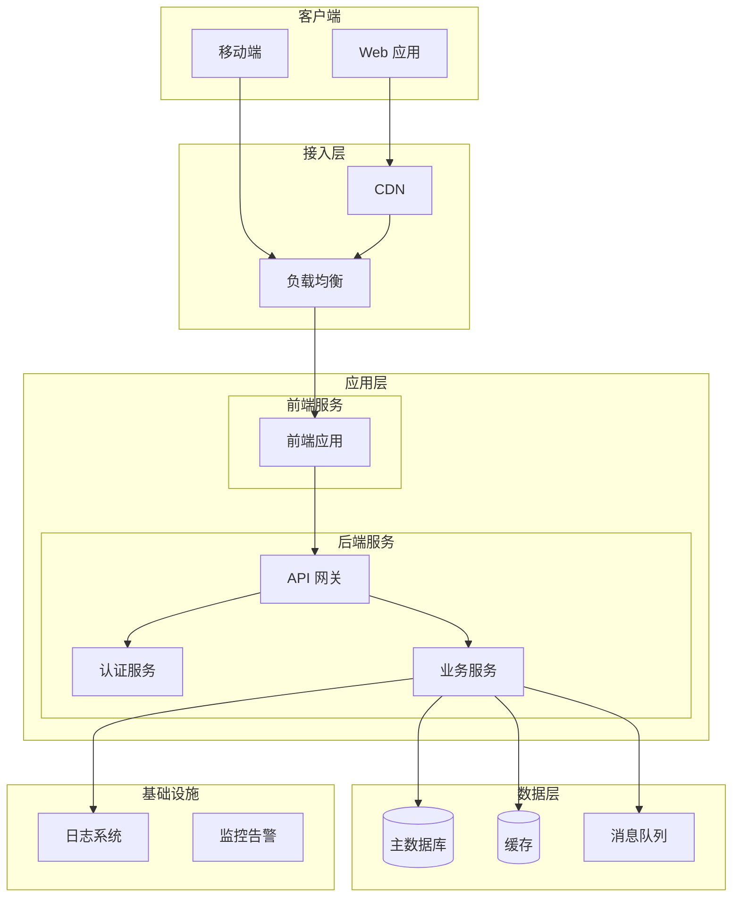

# 系统架构设计方法论

## 适用场景

基于技术调研结论，设计完整的系统架构，包括：
- 架构模式选择（单体/前后端分离/微服务）
- 系统分层和模块划分
- 目录结构设计
- 数据模型设计
- API设计

## 架构设计流程

### 1. 架构模式选择

根据项目规模、团队规模、业务复杂度选择合适的架构模式：

| 架构模式 | 适用场景 | 优点 | 缺点 | 团队规模 |
|----------|----------|------|------|----------|
| **单体应用** | 小型项目、快速迭代、MVP | 简单、开发快、易部署 | 扩展性差、耦合高 | 1-3人 |
| **前后端分离** | 中型项目、团队协作、多端支持 | 职责清晰、并行开发、技术独立 | 部署复杂、接口管理 | 3-10人 |
| **微服务** | 大型项目、独立部署、高可用 | 独立扩展、技术异构、故障隔离 | 复杂度高、运维成本高 | 10+人 |
| **Serverless** | 事件驱动、弹性伸缩、按需付费 | 免运维、自动扩展、成本优化 | 冷启动、供应商锁定 | 任意 |

**选择决策树**：

```
项目规模？
├─ 小型（< 10个页面）
│  └─ 单体应用 或 前后端分离（简化版）
├─ 中型（10-50个页面）
│  └─ 前后端分离
└─ 大型（> 50个页面）
   ├─ 业务模块独立？
   │  ├─ 是 → 微服务
   │  └─ 否 → 前后端分离
   └─ 流量波动大？
      └─ 是 → Serverless
```

### 2. 系统分层设计

#### 经典三层架构

```
┌─────────────────────────────────┐
│      表现层 (Presentation)       │  ← 用户界面、API接口
├─────────────────────────────────┤
│       业务层 (Business)          │  ← 业务逻辑、流程控制
├─────────────────────────────────┤
│      数据层 (Data Access)        │  ← 数据库访问、ORM
└─────────────────────────────────┘
```

#### 前后端分离架构

```
┌──────────────┐
│   前端应用    │  ← React/Vue/Angular
└──────┬───────┘
       │ HTTP/WebSocket
┌──────▼───────┐
│   API网关    │  ← 路由、认证、限流
└──────┬───────┘
       │
┌──────▼───────┐
│   后端服务    │  ← 业务逻辑
└──────┬───────┘
       │
┌──────▼───────┐
│   数据库     │  ← PostgreSQL/MongoDB
└──────────────┘
```

#### 微服务架构

```
┌──────────┐
│  前端应用 │
└────┬─────┘
     │
┌────▼─────┐
│ API网关  │
└────┬─────┘
     │
     ├─────┬─────┬─────┐
     │     │     │     │
┌────▼┐ ┌─▼──┐ ┌▼───┐ ┌▼────┐
│用户 │ │订单│ │商品│ │支付 │
│服务│ │服务│ │服务│ │服务 │
└────┘ └────┘ └────┘ └─────┘
  │      │      │       │
  └──────┴──────┴───────┘
         │
    ┌────▼────┐
    │ 数据库  │
    └─────────┘
```

### 3. 系统架构图

使用 Mermaid 绘制系统架构图：

**前后端分离架构示例**：



### 4. 目录结构设计

**重要原则**：
1. **遵循框架惯例**：使用检测到的框架的标准目录结构
2. **关注点分离**：业务逻辑、数据访问、API层清晰分离
3. **测试并置**：测试文件与源码在同层或专用tests目录
4. **配置集中**：环境配置统一管理

#### Next.js App Router 项目结构

```
project/
├── app/                    # Next.js App Router
│   ├── (auth)/            # 路由组：认证相关页面
│   │   ├── login/
│   │   └── register/
│   ├── (dashboard)/       # 路由组：仪表板
│   │   ├── layout.tsx
│   │   └── page.tsx
│   ├── api/               # API Routes
│   │   ├── auth/
│   │   └── users/
│   ├── layout.tsx         # 根布局
│   └── page.tsx           # 首页
├── components/            # React组件
│   ├── ui/               # UI组件
│   └── features/         # 功能组件
├── lib/                   # 工具库
│   ├── db.ts             # 数据库连接
│   ├── auth.ts           # 认证逻辑
│   └── utils.ts          # 工具函数
├── prisma/               # Prisma ORM
│   └── schema.prisma
├── public/               # 静态资源
├── tests/                # 测试
└── package.json
```

#### Express + React 前后端分离结构

```
project/
├── client/               # 前端
│   ├── src/
│   │   ├── components/
│   │   ├── pages/
│   │   ├── hooks/
│   │   └── App.tsx
│   ├── public/
│   └── package.json
├── server/               # 后端
│   ├── src/
│   │   ├── routes/      # 路由
│   │   ├── controllers/ # 控制器
│   │   ├── services/    # 业务逻辑
│   │   ├── models/      # 数据模型
│   │   ├── middleware/  # 中间件
│   │   └── app.ts       # 入口
│   ├── tests/
│   └── package.json
├── shared/              # 共享代码
│   └── types/          # TypeScript类型
└── docker-compose.yml
```

#### Python FastAPI 项目结构

```
project/
├── app/
│   ├── api/             # API路由
│   │   ├── v1/
│   │   │   ├── endpoints/
│   │   │   └── router.py
│   │   └── deps.py      # 依赖注入
│   ├── core/            # 核心配置
│   │   ├── config.py
│   │   └── security.py
│   ├── models/          # 数据模型
│   ├── schemas/         # Pydantic schemas
│   ├── services/        # 业务逻辑
│   └── main.py          # 入口
├── tests/
├── alembic/             # 数据库迁移
├── requirements.txt
└── pyproject.toml
```

#### Go 标准项目结构

```
project/
├── cmd/                 # 主程序入口
│   └── api/
│       └── main.go
├── internal/            # 私有代码
│   ├── handler/        # HTTP处理器
│   ├── service/        # 业务逻辑
│   ├── repository/     # 数据访问
│   └── model/          # 数据模型
├── pkg/                 # 公共库
│   └── utils/
├── api/                 # API定义
│   └── openapi.yaml
├── migrations/          # 数据库迁移
├── tests/
├── go.mod
└── go.sum
```

### 5. 技术栈总览

输出完整的技术栈清单：

| 层级 | 技术 | 版本 | 说明 |
|------|------|------|------|
| **前端** | | | |
| 框架 | Next.js | 14.x | App Router模式 |
| UI库 | React | 18.x | |
| 样式 | Tailwind CSS | 3.x | 原子化CSS |
| 状态管理 | Zustand | 4.x | 轻量级状态管理 |
| **后端** | | | |
| 运行时 | Node.js | 20.x | LTS版本 |
| 框架 | Next.js API Routes | 14.x | 与前端一体 |
| ORM | Prisma | 5.x | 类型安全ORM |
| **数据** | | | |
| 主数据库 | PostgreSQL | 16.x | 关系型数据库 |
| 缓存 | Redis | 7.x | 可选 |
| **基础设施** | | | |
| 容器化 | Docker | 24.x | 开发环境 |
| CI/CD | GitHub Actions | - | 自动化部署 |
| 部署 | Vercel | - | 托管平台 |

## 输出要求

完成架构设计后，应输出以下内容（通常作为架构文档的第2-3章）：

```markdown
## 2. 架构概述

### 2.1 架构类型选择

**本项目选择**：[架构模式] - [选择理由]

### 2.2 系统架构图

[Mermaid架构图]

### 2.3 技术栈总览

[技术栈表格]

---

## 3. 目录结构

[目录树]

### 目录说明

- `app/`: [说明]
- `components/`: [说明]
- `lib/`: [说明]
```

## 关键原则

1. **遵循惯例**：使用框架的标准结构，不要自创
2. **职责清晰**：每个目录的职责明确，不要混杂
3. **扩展性**：结构要易于扩展，不要过早优化
4. **一致性**：命名和组织保持一致

## 常见误区

❌ **自创结构**：不遵循框架惯例，自己发明目录结构
❌ **过度设计**：小项目用微服务架构
❌ **职责混乱**：业务逻辑、数据访问、UI混在一起
❌ **忽略测试**：没有规划测试文件的位置
