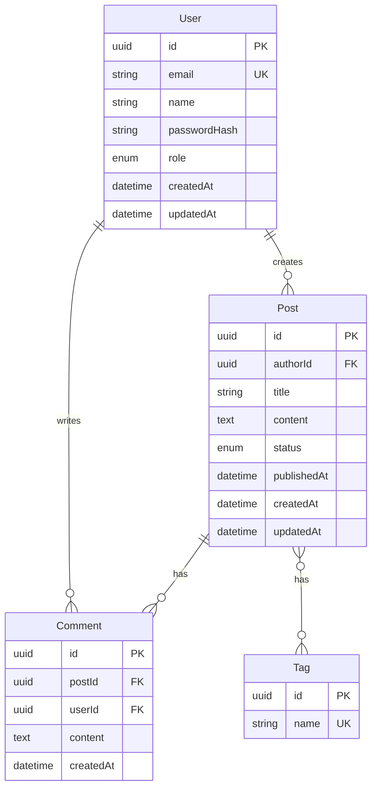

# 数据模型与API设计方法论

## 适用场景

在系统架构确定后，需要设计：
- 数据库表结构和关系
- 数据字典和约束
- API接口规范
- 请求/响应格式

## 数据模型设计

### 1. 实体识别

从PRD中识别核心实体（名词）：

**示例**：
- 用户系统：User（用户）、Role（角色）、Permission（权限）
- 博客系统：User（用户）、Post（文章）、Comment（评论）、Tag（标签）
- 电商系统：User（用户）、Product（商品）、Order（订单）、OrderItem（订单项）

### 2. 关系识别

确定实体之间的关系：

| 关系类型 | 说明 | 示例 |
|----------|------|------|
| **一对一 (1:1)** | 一个A对应一个B | User - Profile |
| **一对多 (1:N)** | 一个A对应多个B | User - Post |
| **多对多 (M:N)** | 多个A对应多个B | Post - Tag |

**关系表示**：
- `||--o{`: 一对多
- `||--||`: 一对一
- `}o--o{`: 多对多

### 3. 实体关系图 (ERD)

使用 Mermaid 绘制 ERD：



### 4. 数据字典

为每个表定义详细的字段信息：

#### User 表

| 字段 | 类型 | 约束 | 默认值 | 说明 |
|------|------|------|--------|------|
| id | UUID | PK | uuid_generate_v4() | 主键 |
| email | VARCHAR(255) | UNIQUE, NOT NULL | - | 邮箱，用于登录 |
| name | VARCHAR(100) | NOT NULL | - | 用户名 |
| passwordHash | VARCHAR(255) | NOT NULL | - | 密码哈希（bcrypt） |
| role | ENUM('user', 'admin') | NOT NULL | 'user' | 用户角色 |
| createdAt | TIMESTAMP | NOT NULL | NOW() | 创建时间 |
| updatedAt | TIMESTAMP | NOT NULL | NOW() | 更新时间 |

**索引**：
- `idx_user_email`: email（唯一索引，用于登录查询）
- `idx_user_role`: role（用于角色筛选）

#### Post 表

| 字段 | 类型 | 约束 | 默认值 | 说明 |
|------|------|------|--------|------|
| id | UUID | PK | uuid_generate_v4() | 主键 |
| authorId | UUID | FK, NOT NULL | - | 作者ID，外键关联User.id |
| title | VARCHAR(200) | NOT NULL | - | 文章标题 |
| content | TEXT | NOT NULL | - | 文章内容 |
| status | ENUM('draft', 'published', 'archived') | NOT NULL | 'draft' | 文章状态 |
| publishedAt | TIMESTAMP | NULL | - | 发布时间 |
| createdAt | TIMESTAMP | NOT NULL | NOW() | 创建时间 |
| updatedAt | TIMESTAMP | NOT NULL | NOW() | 更新时间 |

**索引**：
- `idx_post_author`: authorId（用于查询用户的文章）
- `idx_post_status`: status（用于筛选状态）
- `idx_post_published`: publishedAt（用于按发布时间排序）

### 5. 数据类型选择

| 数据类型 | 使用场景 | PostgreSQL | MySQL | MongoDB |
|----------|----------|------------|-------|---------|
| **主键** | 唯一标识 | UUID, SERIAL | INT AUTO_INCREMENT, UUID | ObjectId |
| **字符串** | 短文本 | VARCHAR(n) | VARCHAR(n) | String |
| **长文本** | 文章内容 | TEXT | TEXT | String |
| **整数** | 数量、年龄 | INTEGER, BIGINT | INT, BIGINT | Number |
| **小数** | 价格、评分 | DECIMAL(p,s) | DECIMAL(p,s) | Number |
| **布尔** | 是否标志 | BOOLEAN | TINYINT(1) | Boolean |
| **日期时间** | 时间戳 | TIMESTAMP | DATETIME | Date |
| **枚举** | 固定选项 | ENUM | ENUM | String |
| **JSON** | 灵活数据 | JSONB | JSON | Object |

**推荐**：
- **主键**：使用 UUID 而非自增ID（避免暴露数据量、分布式友好）
- **时间戳**：使用 TIMESTAMP WITH TIME ZONE（时区友好）
- **枚举**：使用 ENUM 而非字符串（类型安全、节省空间）
- **JSON**：PostgreSQL 使用 JSONB（支持索引和查询）

## API设计

### 1. API规范选择

| 规范 | 适用场景 | 优点 | 缺点 |
|------|----------|------|------|
| **RESTful** | 通用场景、CRUD操作 | 简单、标准、易理解 | 过度获取、多次请求 |
| **GraphQL** | 复杂查询、多端适配 | 按需获取、类型安全 | 学习曲线、缓存复杂 |
| **gRPC** | 微服务、高性能 | 性能高、类型安全 | 浏览器支持差 |

**本项目推荐**：RESTful（除非有特殊需求）

### 2. RESTful API设计原则

#### 资源命名

- **使用名词**：`/users`, `/posts`, `/comments`（不是 `/getUsers`, `/createPost`）
- **使用复数**：`/users`（不是 `/user`）
- **使用小写**：`/users`（不是 `/Users`）
- **使用连字符**：`/order-items`（不是 `/orderItems` 或 `/order_items`）

#### HTTP方法

| 方法 | 用途 | 示例 | 幂等性 |
|------|------|------|--------|
| GET | 获取资源 | `GET /users` | 是 |
| POST | 创建资源 | `POST /users` | 否 |
| PUT | 完整更新 | `PUT /users/123` | 是 |
| PATCH | 部分更新 | `PATCH /users/123` | 否 |
| DELETE | 删除资源 | `DELETE /users/123` | 是 |

#### URL设计

| 操作 | 方法 | URL | 说明 |
|------|------|-----|------|
| 获取列表 | GET | `/api/v1/users` | 支持分页、筛选、排序 |
| 获取详情 | GET | `/api/v1/users/:id` | 返回单个资源 |
| 创建 | POST | `/api/v1/users` | 请求体包含资源数据 |
| 完整更新 | PUT | `/api/v1/users/:id` | 替换整个资源 |
| 部分更新 | PATCH | `/api/v1/users/:id` | 只更新指定字段 |
| 删除 | DELETE | `/api/v1/users/:id` | 删除资源 |

**嵌套资源**：
- `GET /api/v1/users/:userId/posts` - 获取用户的文章
- `POST /api/v1/posts/:postId/comments` - 为文章创建评论

**查询参数**：
- 分页：`?page=1&limit=20`
- 筛选：`?status=published&author=123`
- 排序：`?sort=-createdAt`（-表示降序）
- 搜索：`?q=keyword`

### 3. 请求/响应格式

#### 成功响应

**单个资源**：
```json
{
  "success": true,
  "data": {
    "id": "123",
    "name": "John Doe",
    "email": "john@example.com"
  }
}
```

**资源列表**：
```json
{
  "success": true,
  "data": [
    { "id": "1", "name": "Item 1" },
    { "id": "2", "name": "Item 2" }
  ],
  "meta": {
    "page": 1,
    "limit": 20,
    "total": 100,
    "totalPages": 5
  }
}
```

#### 错误响应

```json
{
  "success": false,
  "error": {
    "code": "VALIDATION_ERROR",
    "message": "邮箱格式不正确",
    "details": [
      {
        "field": "email",
        "message": "必须是有效的邮箱地址"
      }
    ]
  }
}
```

**错误码**：
- `VALIDATION_ERROR`: 验证错误（400）
- `UNAUTHORIZED`: 未认证（401）
- `FORBIDDEN`: 无权限（403）
- `NOT_FOUND`: 资源不存在（404）
- `CONFLICT`: 资源冲突（409，如邮箱已存在）
- `INTERNAL_ERROR`: 服务器错误（500）

### 4. 认证和授权

#### 认证方案

**JWT (推荐)**：
```
Authorization: Bearer <token>
```

**请求头**：
```
POST /api/v1/auth/login
Content-Type: application/json

{
  "email": "user@example.com",
  "password": "password123"
}
```

**响应**：
```json
{
  "success": true,
  "data": {
    "token": "eyJhbGciOiJIUzI1NiIsInR5cCI6IkpXVCJ9...",
    "user": {
      "id": "123",
      "name": "John Doe",
      "email": "john@example.com"
    }
  }
}
```

#### 授权模型

**RBAC (基于角色)**：
```typescript
enum Role {
  USER = 'user',
  ADMIN = 'admin'
}

// 中间件检查
if (user.role !== Role.ADMIN) {
  throw new ForbiddenError();
}
```

### 5. API接口列表

| 模块 | 方法 | 路径 | 描述 | 认证 | 权限 |
|------|------|------|------|------|------|
| **认证** | | | | | |
| | POST | /api/v1/auth/register | 用户注册 | 否 | - |
| | POST | /api/v1/auth/login | 用户登录 | 否 | - |
| | POST | /api/v1/auth/logout | 用户登出 | 是 | - |
| | GET | /api/v1/auth/me | 获取当前用户 | 是 | - |
| **用户** | | | | | |
| | GET | /api/v1/users | 获取用户列表 | 是 | admin |
| | GET | /api/v1/users/:id | 获取用户详情 | 是 | - |
| | PATCH | /api/v1/users/:id | 更新用户信息 | 是 | self/admin |
| | DELETE | /api/v1/users/:id | 删除用户 | 是 | admin |
| **文章** | | | | | |
| | GET | /api/v1/posts | 获取文章列表 | 否 | - |
| | GET | /api/v1/posts/:id | 获取文章详情 | 否 | - |
| | POST | /api/v1/posts | 创建文章 | 是 | - |
| | PATCH | /api/v1/posts/:id | 更新文章 | 是 | author/admin |
| | DELETE | /api/v1/posts/:id | 删除文章 | 是 | author/admin |

## 输出要求

完成数据模型和API设计后，应输出以下内容（通常作为架构文档的第4-5章）：

```markdown
## 4. 数据模型

### 4.1 实体关系图 (ERD)

[Mermaid ERD]

### 4.2 数据字典

#### User 表

[字段表格]

#### Post 表

[字段表格]

---

## 5. API 设计

### 5.1 API 规范

- **风格**：RESTful
- **版本**：URL 前缀 `/api/v1`
- **认证**：Bearer Token (JWT)
- **格式**：JSON

### 5.2 接口列表

[接口表格]

### 5.3 响应格式

[成功响应示例]
[错误响应示例]
```

## 关键原则

1. **规范化**：遵循数据库范式，避免冗余
2. **类型安全**：使用强类型（UUID、ENUM）
3. **RESTful**：遵循REST原则，资源导向
4. **一致性**：命名、格式、错误码保持一致
5. **文档化**：每个字段、每个接口都有清晰说明

## 常见误区

❌ **使用动词**：`/getUsers`, `/createPost`（应该用HTTP方法表示动作）
❌ **过度嵌套**：`/users/:id/posts/:id/comments/:id`（最多2层）
❌ **暴露实现**：`/api/getUserFromDatabase`（暴露内部实现）
❌ **不一致**：有的用复数有的用单数，有的驼峰有的下划线
