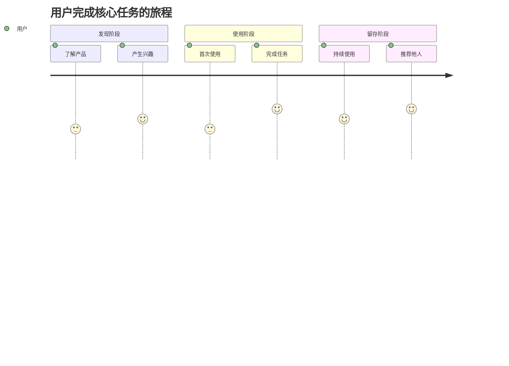

# PRD 编写指南

## 适用场景

完成需求穿透和调研分析后，需要输出一份完整的产品需求文档(PRD)，供设计师、开发者、测试人员使用。

## PRD 标准结构

### 1. 概述

- **功能名称**：[清晰简洁的名称]
- **版本**：1.0
- **日期**：[当前日期]
- **作者**：PM Agent

### 摘要

> 下游 Agent 请优先阅读本节，需要细节时再查阅完整文档。

- **核心目标**：[用一句话描述]
- **目标用户**：[主要用户群体]
- **关键功能**：[3-5 个最核心功能]
- **技术约束**：[重要约束或偏好]
- **优先级**：[MVP 范围说明]

---

### 2. 需求穿透分析（核心章节）

参见 `pm/requirement-penetration` skill 的输出要求。

---

### 3. 竞品调研

#### 3.1 竞品分析

使用 `WebSearch` 搜索相关竞品：

| 竞品 | 核心功能 | 用户体验亮点 | 用户痛点 | 我们的机会 |
|------|----------|--------------|----------|------------|
| [竞品 1] | [功能] | [亮点] | [痛点] | [机会] |
| [竞品 2] | [功能] | [亮点] | [痛点] | [机会] |
| [竞品 3] | [功能] | [亮点] | [痛点] | [机会] |

#### 3.2 差异化策略

| 维度 | 竞品做法 | 我们的做法 | 差异化价值 |
|------|----------|------------|------------|
| [维度 1] | [做法] | [做法] | [价值] |
| [维度 2] | [做法] | [做法] | [价值] |

---

### 4. 目标用户

#### 用户画像 1：[名称]

- **基本特征**：[年龄、职业、收入等]
- **行为特征**：[使用习惯、偏好等]
- **核心需求**：[最想解决的问题]
- **痛点场景**：[具体的痛苦场景描述]
- **期望体验**：[理想的体验是什么样]

#### 用户旅程图

---

### 5. 功能需求

#### FR-001：[需求标题]

- **需求描述**：[清晰的需求描述]
- **用户价值**：[这个功能给用户带来什么价值]
- **优先级**：P0/P1/P2
- **需求来源**：显性/隐性/潜在/惊喜
- **验收标准**：
  - [ ] AC-1：[可测试的标准 1]
  - [ ] AC-2：[可测试的标准 2]
- **边界情况**：
  - [边界情况 1 及处理方式]
  - [边界情况 2 及处理方式]

#### FR-002：[需求标题]

- **需求描述**：[描述]
- **用户价值**：[价值]
- **优先级**：P1
- **需求来源**：[来源]
- **验收标准**：
  - [ ] AC-1：[标准]

---

### 6. 非功能需求

#### NFR-001：性能需求

- **页面加载**：首屏加载 < 2s，完整加载 < 3s
- **交互响应**：用户操作响应 < 100ms
- **API 响应**：接口响应 < 200ms

#### NFR-002：体验需求

- **易用性**：新用户无需教程即可完成核心任务
- **一致性**：交互模式和视觉风格保持一致
- **容错性**：操作可撤销，错误可恢复

#### NFR-003：安全需求

- **数据安全**：敏感数据加密存储和传输
- **隐私保护**：符合相关隐私法规

---

### 7. 用户故事

#### US-001：[故事标题]

- **作为** [用户类型]
- **我想要** [目标行为]
- **以便** [预期价值]
- **验收标准**：
  - [ ] [标准 1]
  - [ ] [标准 2]
- **优先级**：P0

#### US-002：[故事标题]

- **作为** [用户类型]
- **我想要** [目标行为]
- **以便** [预期价值]
- **验收标准**：
  - [ ] [标准]
- **优先级**：P1

---

### 8. 成功指标

| 指标类型 | 指标 | 目标值 | 衡量方式 |
|----------|------|--------|----------|
| 核心指标 | [指标] | [目标] | [方式] |
| 体验指标 | [指标] | [目标] | [方式] |
| 业务指标 | [指标] | [目标] | [方式] |

---

### 9. 范围定义

#### 本期范围（In Scope）

- [功能 1]
- [功能 2]

#### 范围外（Out of Scope）

- [排除项 1]：[排除原因]
- [排除项 2]：[排除原因]

---

### 10. 风险与依赖

#### 风险登记

| 风险 | 可能性 | 影响 | 缓解措施 |
|------|--------|------|----------|
| [风险] | 高/中/低 | 高/中/低 | [措施] |

#### 依赖项

| 依赖 | 类型 | 状态 | 负责人 |
|------|------|------|--------|
| [依赖项] | 技术/业务/外部 | 已就绪/待定 | [负责人] |

---

### 11. 里程碑

| 里程碑 | 内容 | 目标日期 |
|--------|------|----------|
| MVP | [核心功能] | - |
| V1.0 | [完整功能] | - |
| V1.1 | [优化迭代] | - |

---

## 编写原则

### 清晰性
- 使用简单直接的语言
- 避免模糊词汇（"可能"、"大概"、"尽量"）
- 每个需求都有明确的验收标准

### 完整性
- 覆盖所有必要章节
- 功能需求和非功能需求都要考虑
- 边界情况和异常处理要说明

### 可执行性
- 设计师能根据PRD设计界面
- 开发者能根据PRD编写代码
- 测试人员能根据PRD编写测试用例

### 用户导向
- 每个功能都说明用户价值
- 从用户视角描述需求
- 关注用户体验细节

## 输出要求

1. **文件命名**：`prd-{功能名称}-{日期}.md`
2. **文件位置**：项目根目录或 `docs/` 目录
3. **格式**：Markdown格式，使用标准的章节结构
4. **长度**：根据功能复杂度，通常5-20页

## 质量检查清单

在输出PRD前，检查以下项目：

- [ ] 摘要部分是否清晰，能让读者快速理解核心内容
- [ ] 需求穿透分析是否完整（显性、隐性、潜在、惊喜四层）
- [ ] 每个功能需求是否有明确的验收标准
- [ ] 非功能需求是否考虑（性能、体验、安全）
- [ ] 用户故事是否符合 "作为-我想要-以便" 格式
- [ ] 范围定义是否明确（In Scope 和 Out of Scope）
- [ ] 风险和依赖是否识别
- [ ] 文档格式是否规范，易于阅读

---

**记住**：好的PRD不是功能的堆砌，而是对用户需求的精准洞察和优雅满足。
