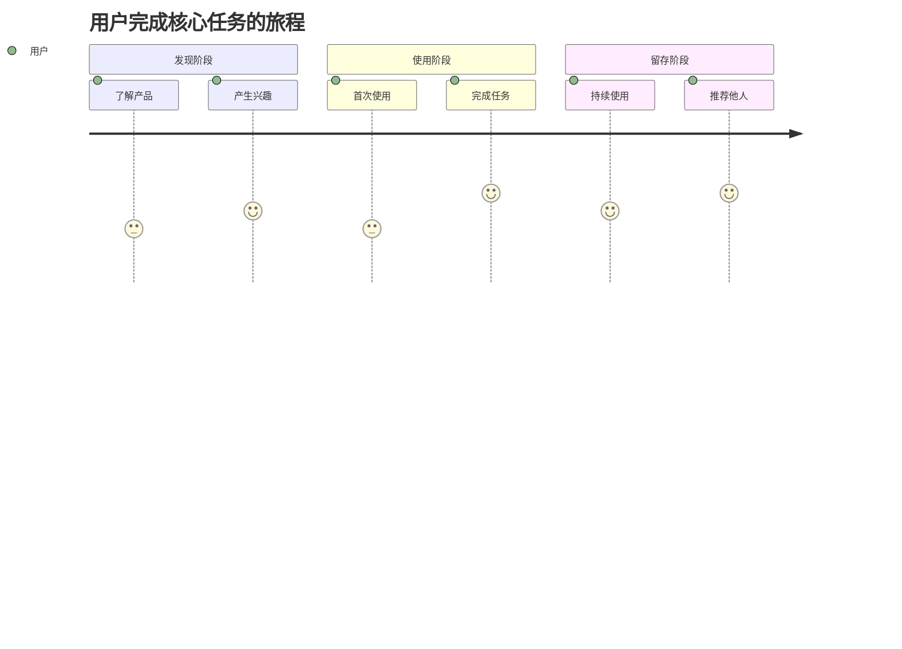

# 用户研究方法论

## 适用场景

在产品设计前，需要深入理解目标用户是谁、他们的特征是什么、他们在什么场景下使用产品、他们的行为路径是什么。

## 核心方法

### 1. 用户画像 (User Persona)

用户画像是对目标用户的具象化描述，帮助团队建立对用户的共同理解。

#### 用户画像模板

**用户画像 1：[给用户起个名字，如"技术小白张三"]**

- **基本特征**：
  - 年龄：[年龄段]
  - 职业：[职业]
  - 收入：[收入水平]
  - 教育：[教育背景]
  - 地域：[所在地区]

- **行为特征**：
  - 使用习惯：[如何使用类似产品]
  - 技术水平：[对技术的熟悉程度]
  - 使用频率：[多久使用一次]
  - 使用时长：[每次使用多久]
  - 设备偏好：[PC/移动端/平板]

- **心理特征**：
  - 性格特点：[如保守/激进、理性/感性]
  - 价值观：[看重什么]
  - 动机：[为什么使用产品]
  - 顾虑：[担心什么]

- **核心需求**：
  - 最想解决的问题：[核心痛点]
  - 期望的结果：[想要达成什么]
  - 愿意付出的代价：[时间/金钱/学习成本]

- **痛点场景**：
  - 场景描述：[具体的使用场景]
  - 当前解决方案：[现在怎么解决]
  - 痛点：[现有方案的问题]
  - 情绪：[遇到痛点时的感受]

- **期望体验**：
  - 理想流程：[希望如何完成任务]
  - 关键体验点：[最在意的体验]
  - 成功标准：[什么样算成功]

#### 创建用户画像的步骤

1. **识别用户群体**：产品可能服务多类用户，先列出所有用户类型
2. **选择主要用户**：选择2-3个最重要的用户类型深入分析
3. **收集用户数据**：
   - 如果有现有用户：分析用户数据、用户访谈、用户调研
   - 如果是新产品：竞品用户分析、目标市场研究、假设验证
4. **具象化描述**：给用户起名字、配图片，让用户"活"起来
5. **验证画像**：与真实用户对比，确保画像准确

#### 多用户画像的处理

如果产品服务多类用户，需要：
- 明确**主要用户**（Primary Persona）：产品主要服务的用户
- 识别**次要用户**（Secondary Persona）：也会使用但不是核心
- 考虑**边缘用户**（Edge Persona）：极端情况下的用户

**优先级原则**：
- 主要用户的需求优先满足
- 次要用户的需求在不影响主要用户的前提下满足
- 边缘用户的需求用于测试产品的健壮性

### 2. 用户旅程图 (User Journey Map)

用户旅程图描绘用户完成核心任务的完整路径，包括每个阶段的行为、想法、情绪和痛点。

#### 用户旅程图模板

#### 旅程图的关键要素

**1. 阶段划分**

典型的用户旅程包含以下阶段：
- **认知阶段**：用户如何知道产品
- **考虑阶段**：用户如何评估产品
- **购买/注册阶段**：用户如何开始使用
- **首次使用阶段**：用户第一次使用的体验
- **持续使用阶段**：用户日常使用的体验
- **推荐阶段**：用户是否会推荐给他人

**2. 每个阶段的分析维度**

| 维度 | 描述 |
|------|------|
| **行为** | 用户在做什么 |
| **想法** | 用户在想什么 |
| **情绪** | 用户的情绪状态（1-5分） |
| **触点** | 用户与产品的接触点 |
| **痛点** | 用户遇到的问题 |
| **机会** | 我们可以改进的地方 |

**3. 情绪曲线**

用1-5分标注用户在每个阶段的情绪：
- 5分：非常满意，"Wow"体验
- 4分：满意
- 3分：一般，没有特别感受
- 2分：不满意，有些失望
- 1分：非常不满意，想放弃

**目标**：
- 识别情绪低点（痛点），优先优化
- 创造情绪高点（峰值体验），形成记忆点
- 确保结束时情绪高（峰终定律）

#### 创建用户旅程图的步骤

1. **定义核心任务**：用户使用产品要完成的主要任务
2. **划分旅程阶段**：将任务分解为关键阶段
3. **填充每个阶段**：
   - 用户在做什么（行为）
   - 用户在想什么（想法）
   - 用户的情绪如何（情绪）
   - 用户遇到什么问题（痛点）
4. **绘制情绪曲线**：可视化用户的情绪变化
5. **识别优化机会**：在痛点处寻找改进机会

### 3. 用户场景 (User Scenario)

用户场景是对用户在特定情境下使用产品的故事化描述。

#### 场景描述模板

**场景：[场景名称]**

- **用户**：[哪个用户画像]
- **情境**：[什么时间、什么地点、什么情况下]
- **目标**：[用户想要完成什么]
- **行为**：[用户会做什么]
- **结果**：[期望的结果]
- **情绪**：[过程中的情绪变化]

**示例**：

**场景：周末在家整理照片**

- **用户**：摄影爱好者李四
- **情境**：周末下午，在家用电脑，刚拍完一次旅行回来
- **目标**：快速找到最好的照片，删除重复和模糊的照片
- **行为**：
  1. 导入200张照片
  2. 快速浏览，标记喜欢的
  3. 删除明显不好的
  4. 对比相似的照片，选择最好的
  5. 导出精选照片
- **结果**：从200张照片中精选出30张，用时30分钟
- **情绪**：开始兴奋，中间有些疲惫（照片太多），最后满意（快速完成）

## 输出要求

完成用户研究后，应输出以下内容（通常作为PRD的第4章）：

### 4. 目标用户

#### 用户画像 1：[名称]

- **基本特征**：[年龄、职业、收入等]
- **行为特征**：[使用习惯、偏好等]
- **核心需求**：[最想解决的问题]
- **痛点场景**：[具体的痛苦场景描述]
- **期望体验**：[理想的体验是什么样]

#### 用户画像 2：[名称]

[同上]

#### 用户旅程图

#### 关键场景

**场景1：[场景名称]**
- [场景描述]

**场景2：[场景名称]**
- [场景描述]

## 关键原则

1. **具象化**：用户画像要有名字、有故事，让团队能"看见"用户
2. **真实性**：基于真实数据和观察，不要凭空想象
3. **聚焦**：2-3个主要用户画像足够，不要贪多
4. **动态更新**：随着对用户的了解加深，持续更新画像

## 常见误区

❌ **用户画像太抽象**：只有年龄、性别等基本信息，没有行为和心理特征
❌ **用户画像太多**：列出10个用户画像，导致无法聚焦
❌ **凭空想象**：没有数据支撑，完全靠猜测
❌ **一次性工作**：创建后就不再更新，与真实用户脱节
