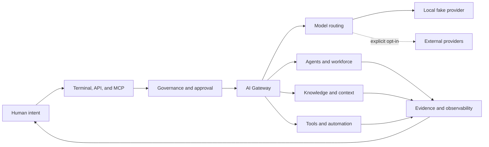

# Unified AI System

<p align="center">
  <strong>A terminal-first, self-hosted AI and MCP gateway for models, agents, knowledge, and tools.</strong>
</p>

<p align="center">
  <a href="README.md">English</a> |
  <a href="README.zh-CN.md">简体中文</a> |
  <a href="https://happy520ai.github.io/unified-ai-system/">Project Site</a>
</p>

<p align="center">
  <a href="https://github.com/happy520ai/unified-ai-system/actions/workflows/ci.yml">
    
  </a>
  <a href="https://github.com/happy520ai/unified-ai-system/actions/workflows/docker-build-push.yml">
    
  </a>
  <a href="https://github.com/happy520ai/unified-ai-system/actions/workflows/hol-plugin-scanner.yml">
    
  </a>
  <a href="https://github.com/happy520ai/unified-ai-system/releases/latest">
    
  </a>
  <a href="https://registry.modelcontextprotocol.io/v0.1/servers/io.github.happy520ai%2Funified-ai-system/versions/0.4.0">
    
  </a>
  <a href="LICENSE">
    
  </a>
  <a href="https://codespaces.new/happy520ai/unified-ai-system?quickstart=1">
    
  </a>
</p>

Run and govern models, agents, knowledge, and tools through one open gateway.
The first verified request needs no account or API key; real providers remain
explicit opt-in and human authority stays inside the execution path.
Rough natural-language requests can be structured locally before any model is
called, while the original request remains visible and unchanged.

<p align="center">
  <a href="https://happy520ai.github.io/unified-ai-system/#enhance">
    
  </a>
  <br />
  <sub>Actual v0.4.0 local output: deterministic enhancement, no provider call, no credential required. <a href="https://happy520ai.github.io/unified-ai-system/#enhance">Try the browser-local preview</a> or <a href="docs/prompt-enhancement.md">read the contract</a>.</sub>
</p>

<p align="center">
  <a href="#try-it-in-60-seconds"><strong>Try it in 60 seconds</strong></a>
  ·
  <a href="#why-it-is-different">Why it is different</a>
  ·
  <a href="#operate-from-the-terminal">Use the CLI</a>
  ·
  <a href="#connect-codex-cursor-and-cline">Connect Codex, Cursor, or Cline</a>
</p>

## Try It in 60 Seconds

With Docker installed, run the complete gateway path without cloning the
repository:

```bash
docker run --rm ghcr.io/happy520ai/unified-ai-system/ai-gateway-service:0.4.0 pnpm gateway demo
```

The container starts an isolated gateway, proves health and readiness, sends
one deterministic fake-provider request, prints the result, and removes
itself. The expected output confirms `execution: fake`, real calls disabled,
and process cleanup. No account, API key, or browser UI is involved. See the
[credential-free terminal proof](docs/assets/terminal-demo.png).

If that verified path is useful, [star the repository](https://github.com/happy520ai/unified-ai-system)
and choose a terminal or MCP path below.

## What You Get

| Capability | Current public preview |
| --- | --- |
| **AI gateway** | Chat, streaming, local natural-language prompt enhancement, diagnostics, explicit provider selection, and routing foundations. |
| **Governed agents** | Structured planning and workforce modules with approval, permission, and evidence surfaces. |
| **Knowledge and context** | Retrieval, context shaping, reusable knowledge, and memory-oriented modules. |
| **Terminal and API** | CLI commands for prompt enhancement, demo, startup, status, chat, and diagnostics, plus direct HTTP and shared SDK access. |
| **Codex and MCP** | A tested stdio MCP server with governed health, prompt enhancement, fake chat, knowledge, workflow, and workforce tools. |
| **Extension layer** | Shared contracts, SDKs, context modules, provider adapters, and tools. |
| **Local-first runtime** | Credential-free startup plus an anonymously pullable multi-architecture container. |

## Why It Is Different

- **A control plane, not another chat skin.** Models, agents, knowledge, tools,
  permissions, and evidence belong in one governed execution path.
- **Useful before cloud configuration.** A fresh clone and the public container
  can prove the complete local path without provider credentials.
- **Human authority is architectural.** Real execution is explicit, observable,
  interruptible, and designed to remain accountable.

Read the longer [project vision](VISION.md) and the
[public roadmap](ROADMAP.md).

If this is the kind of open AI infrastructure you want to exist, star the
repository and join the
[Codex MCP launch discussion](https://github.com/happy520ai/unified-ai-system/discussions/6).

## Operate From The Terminal

The source checkout includes a real terminal interface rather than only a
scripted screenshot:

```bash
# Terminal 1
pnpm gateway serve

# Terminal 2
pnpm gateway status
pnpm gateway enhance "Build a small API for my team" --profile coding
pnpm gateway chat "Build a small API for my team" --enhance --profile coding
pnpm gateway chat "Hello from Unified AI System"
pnpm gateway doctor
```

`enhance` previews a structured prompt locally through the gateway without
calling a model. `chat --enhance` explicitly applies that transformation to
the final user message; plain `chat` remains unchanged. `demo`, `status`,
`enhance`, `chat`, `doctor`, and `version` support `--json`. The chat
command refuses to send when a real provider may be active unless the operator
adds `--allow-real-provider` explicitly for that request. Read the
[prompt enhancement guide](docs/prompt-enhancement.md) and
[CLI reference](docs/cli.md) for commands, profiles, exit codes, and safety
behavior.

## Connect Codex, Cursor, And Cline

Choose the smallest integration that fits. Use the plugin for the complete
Codex bundle, direct MCP for the runtime alone, or the skill when you only want
the reviewed operating workflow.

### Codex Plugin

Docker is the only runtime dependency for the published integration. Add this
repository as a Codex marketplace source:

```bash
codex plugin marketplace add happy520ai/unified-ai-system --ref master
```

Restart the ChatGPT desktop app, open **Plugins** from ChatGPT Work or Codex,
choose the **Unified AI System** marketplace, and install the plugin. The bundle
adds a focused gateway skill and starts its credential-free MCP runtime in an
isolated container. Use `codex plugin marketplace list` to inspect the source.

The plugin is gated by the HOL Plugin Scanner with a required score of at least
80 and no high or critical findings. Its public configuration and scan policy
live in [`.codex-plugin/plugin.json`](.codex-plugin/plugin.json) and
[`.plugin-scanner.toml`](.plugin-scanner.toml). The bundled MCP command pins the
reviewed `0.4.0` multi-platform OCI digest, disables container networking, and
drops Linux capabilities; see the
[image content review](docs/security/mcp-image-review-0.4.0.md).

### Agent Skill

To add only the reviewed operating workflow to the current project, use the
cross-agent `skills` CLI:

```bash
npx skills add happy520ai/unified-ai-system --skill unified-ai-gateway --agent codex --copy --yes
```

The command clones the public repository and copies the exact skill into
`.agents/skills/unified-ai-gateway`. It does not run Docker, register an MCP
server, or access a provider. The path was verified with `skills` 1.5.21 in an
empty directory. Review the [skill source](skills/unified-ai-gateway/SKILL.md)
or open its [skills.sh listing](https://skills.sh/happy520ai/unified-ai-system/unified-ai-gateway)
before installation.

A hardened catalog variant is also published in
[Agentic Awesome Skills](https://github.com/sickn33/agentic-awesome-skills/blob/main/skills/unified-ai-gateway/SKILL.md)
after its [source validation and security review](https://github.com/sickn33/agentic-awesome-skills/pull/1061)
passed.

### Direct Codex MCP

Run the gateway as a local MCP server with one anonymous container command:

```bash
codex mcp add unified-ai-system -- docker run --rm -i ghcr.io/happy520ai/unified-ai-system/mcp-server:0.4.0
```

Restart Codex, then use `/mcp` to inspect the pinned `0.4.0` image's nine tools
for gateway health, readiness, provider-free prompt enhancement, fake-provider
chat, knowledge, workflows, and workforce status. The source checkout exposes
the same tool set through its project-level Codex configuration.

The dedicated MCP image starts its own isolated gateway and removes it when the
session ends. It fails closed if a gateway may call a real provider. See the
[MCP server guide](packages/mcp-server/README.md), the
[active official Registry entry](https://registry.modelcontextprotocol.io/v0.1/servers/io.github.happy520ai%2Funified-ai-system/versions/0.4.0),
and its source metadata in [`server.json`](server.json).

First task to try in Codex:

> Use `gateway_prompt_enhance` to turn "build a small API for my team" into a
> coding prompt. Show the preserved original request, detected language,
> enhanced prompt, and proof that no provider was called.

Follow the [60-second Codex MCP quickstart](docs/codex-mcp-quickstart.md) for
three safe tasks, expected evidence, diagnostics, and removal.

### Codex And Cursor Configs

With Node.js, pnpm, and Docker available, [add-mcp](https://github.com/neon-solutions/add-mcp)
can write the pinned container command into both project-level client configs:

```bash
pnpm dlx add-mcp@2.0.0 "docker run --rm -i ghcr.io/happy520ai/unified-ai-system/mcp-server:0.4.0" --name unified-ai-system -a codex -a cursor -y
```

This exact command was verified with `add-mcp` 2.0.0 in an empty directory. It
created `.codex/config.toml` and `.cursor/mcp.json` without provider
credentials. Remove an `-a` option when configuring only one client, review
the generated file, and restart that client. Other `add-mcp` targets are not
claimed here as verified.

### Cline MCP

Cline can install the same published server without cloning the repository:

```bash
cline mcp install unified-ai-system --yes --json -- docker run --rm -i ghcr.io/happy520ai/unified-ai-system/mcp-server:0.4.0
```

The command was verified with Cline CLI `3.0.48` in an isolated configuration.
See the [agent-readable installation guide](llms-install.md) for expected JSON,
a safe verification task, and removal steps.

## Run The Gateway

Run the public container:

```bash
docker run --rm --publish 3100:3100 \
  ghcr.io/happy520ai/unified-ai-system/ai-gateway-service:0.4.0
```

Call it directly from another terminal:

```bash
curl --request POST http://127.0.0.1:3100/chat \
  --header "content-type: application/json" \
  --data "{\"prompt\":\"Hello from Unified AI System\"}"
```

The default runtime uses a deterministic local fake provider. Terminal and API
workflows are the public product surface; no browser UI is required or exposed
by default.

## Run From Source

Requirements:

- Node.js 22 recommended; Node.js 20 or newer supported.
- pnpm 9.15.4 or newer.
- Git.

```bash
git clone https://github.com/happy520ai/unified-ai-system.git
cd unified-ai-system
corepack enable
corepack prepare pnpm@9.15.4 --activate
pnpm install --frozen-lockfile
pnpm verify:public-clone
pnpm gateway demo
pnpm gateway serve
```

The Codespaces button prepares Node.js 22, pnpm 9.15.4, and the workspace
dependencies in a browser terminal. Its container configuration pins the
gateway to fake-provider mode; run `pnpm gateway demo` after setup completes.

Useful local endpoints:

- Health: [http://127.0.0.1:3100/health/check](http://127.0.0.1:3100/health/check)
- Setup readiness: [http://127.0.0.1:3100/setup/readiness](http://127.0.0.1:3100/setup/readiness)

## Architecture



The system is currently a modular monolith: one deployable gateway with clear
internal ownership boundaries and reusable workspace packages. See the
[architecture guide](docs/architecture.md) for details.

## Honest Boundaries

| Question | Verified answer |
| --- | --- |
| Can anyone clone and inspect the project? | **Yes.** The repository is public under Apache-2.0. |
| Can a clean clone run without an API key? | **Yes.** Health and fake-provider chat are verified. |
| Is the container publicly pullable? | **Yes.** The `master` image is available from GHCR. |
| Is there a hosted public API? | **No.** Users run a local or self-hosted instance. |
| Is a browser UI bundled? | **No.** The retired Workbench was removed; CLI, API, SDK, and MCP are the supported surfaces. |
| Can users connect real providers? | **Yes.** They supply credentials and explicitly enable execution. |
| Is this production-certified, L5, or established AGI? | **No such claim is made.** Those claims require operational and independent evidence beyond local tests. |

Real provider calls are disabled by default. Begin with
[`.env.example`](.env.example) and the
[provider guide](docs/providers.md), and never commit credentials.

## Verify The Project

```bash
pnpm check
pnpm test
pnpm check:public
pnpm verify:public-clone
pnpm verify:mcp
```

Every push to `master` runs Linux CI and a real container startup smoke test.
The container path checks health, setup readiness, the terminal-only public
surface, fake-provider chat, the MCP handshake, tool discovery, and managed
process cleanup before the multi-architecture image is published.

## Build With Us

The project is early enough for focused contributions to shape its foundations.
Current entry points include:

- [Document a generic MCP client configuration](https://github.com/happy520ai/unified-ai-system/issues/9)
- [Add PowerShell examples to the credential-free quickstart](https://github.com/happy520ai/unified-ai-system/issues/10)
- [Document how to add and test a provider adapter](https://github.com/happy520ai/unified-ai-system/issues/3)

You can also [help shape the next terminal-first CLI commands](https://github.com/happy520ai/unified-ai-system/discussions/5).

Read [CONTRIBUTING.md](CONTRIBUTING.md), join
[Discussions](https://github.com/happy520ai/unified-ai-system/discussions), or
send a focused pull request. Security reports belong in
[SECURITY.md](SECURITY.md).

## Repository Map

```text
apps/
  agent-console/          Terminal CLI and operator interaction
  ai-gateway-service/     Main gateway runtime and HTTP API
packages/
  mcp-server/             Codex-ready stdio MCP server
  ...                     Contracts, SDKs, configuration, and engines
docs/                     Public user and architecture documentation
tools/                    Maintained repository and runtime checks
```

Historical phase documents and generated evidence stay off `master`. The
pre-cleanup engineering history remains available on the
[archive branch](https://github.com/happy520ai/unified-ai-system/tree/codex/archive-before-public-core-cleanup-20260730).

## Project Links

- [Official MCP Registry entry](https://registry.modelcontextprotocol.io/v0.1/servers/io.github.happy520ai%2Funified-ai-system/versions/0.4.0)
- [v0.4.0 Codex Plugin and Project Site](https://github.com/happy520ai/unified-ai-system/releases/tag/v0.4.0)
- [v0.3.2 Discovery Metadata](https://github.com/happy520ai/unified-ai-system/releases/tag/v0.3.2)
- [v0.3.1 MCP Registry Distribution](https://github.com/happy520ai/unified-ai-system/releases/tag/v0.3.1)
- [v0.3.0 Terminal and Codex MCP Preview](https://github.com/happy520ai/unified-ai-system/releases/tag/v0.3.0)
- [v0.2.0 Terminal CLI Preview](https://github.com/happy520ai/unified-ai-system/releases/tag/v0.2.0)
- [Codex MCP server](packages/mcp-server/README.md)
- [Documentation](docs/README.md)
- [Roadmap](ROADMAP.md)
- [Vision](VISION.md)
- [Support](SUPPORT.md)
- [Launch kit](docs/launch-kit.md)

If this direction is useful, star the repository so more builders can find it,
then tell us what the next trustworthy capability should be.

Licensed under [Apache-2.0](LICENSE).
