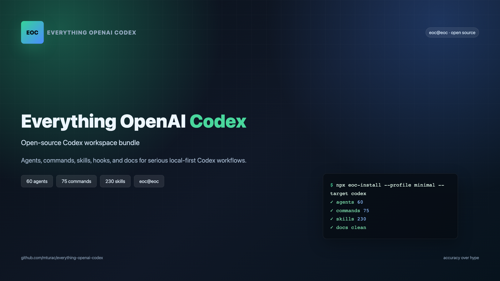
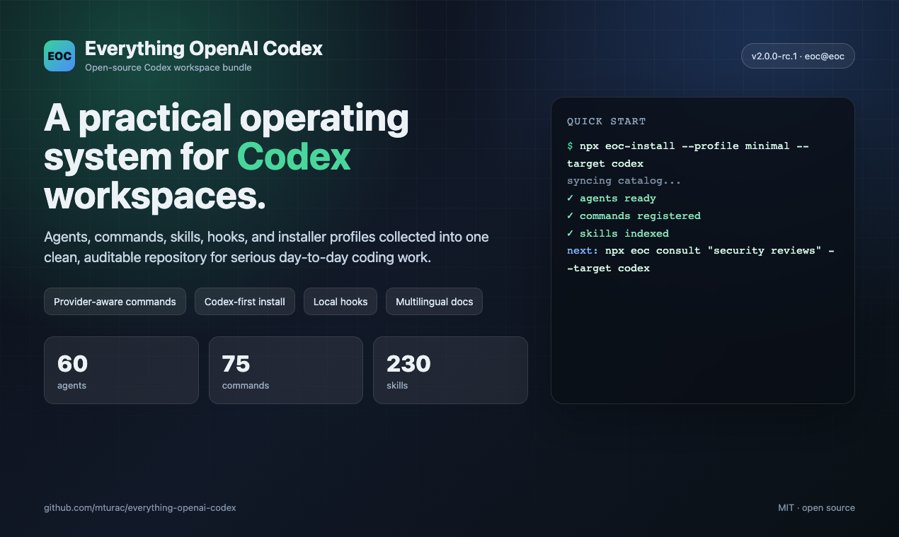
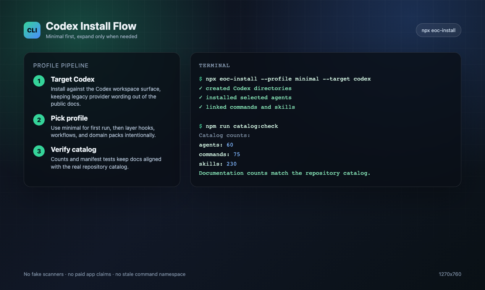
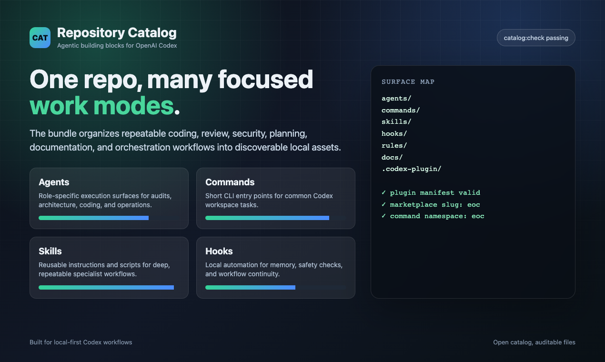
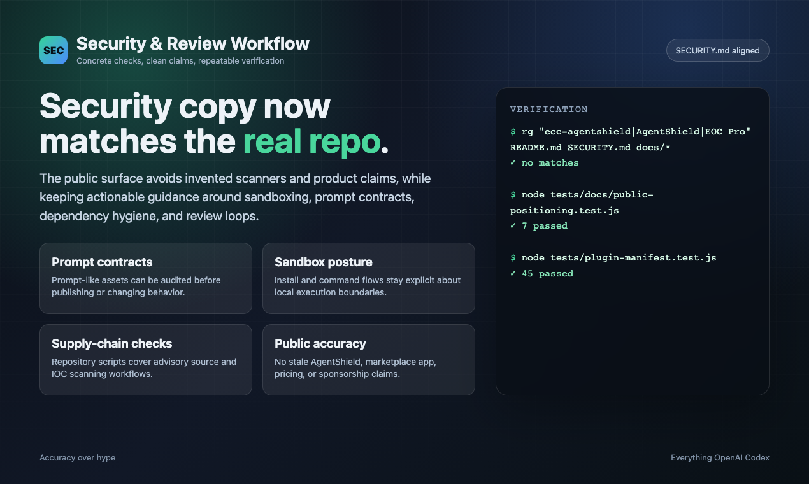

**Language:** English | [Português (Brasil)](docs/pt-BR/README.md) | [简体中文](README.zh-CN.md) | [繁體中文](docs/zh-TW/README.md) | [日本語](docs/ja-JP/README.md) | [한국어](docs/ko-KR/README.md) | [Türkçe](docs/tr/README.md) | [Русский](docs/ru/README.md) | [Tiếng Việt](docs/vi-VN/README.md) | [ไทย](docs/th/README.md)

# Everything OpenAI Codex



[](https://github.com/mturac/everything-openai-codex/stargazers)
[](https://github.com/mturac/everything-openai-codex/network/members)
[](https://github.com/mturac/everything-openai-codex/graphs/contributors)
[](https://www.npmjs.com/package/ecc-universal)
[](LICENSE)


> **Live GitHub and npm badges above are the source of truth.** EOC is a field-tested, MIT-licensed Codex workflow system with 12+ language ecosystems and a public rc.1 release track.

---

<div align="center">

**Language / 语言 / 語言 / Dil / Язык / Ngôn ngữ**

[**English**](README.md) | [Português (Brasil)](docs/pt-BR/README.md) | [简体中文](README.zh-CN.md) | [繁體中文](docs/zh-TW/README.md) | [日本語](docs/ja-JP/README.md) | [한국어](docs/ko-KR/README.md)
 | [Türkçe](docs/tr/README.md) | [Русский](docs/ru/README.md) | [Tiếng Việt](docs/vi-VN/README.md) | [ไทย](docs/th/README.md)

</div>

---

**The operating system for serious OpenAI Codex work.**

Everything OpenAI Codex, or **EOC**, turns a raw agent harness into a repeatable engineering environment: scoped instructions, reusable skills, quality gates, session memory, install profiles, cross-harness adapters, and release evidence in one open-source repo.

This is not a prompt dump. It is a maintained workflow system extracted from daily Codex use on real software projects. The repo currently ships a validated catalog of **60 agents, 230 skills, 110 rules, 28 hook matchers, 29 install modules, and 75 legacy command shims**.

Works across **OpenAI Codex**, **Cursor**, **OpenCode**, **Gemini**, **Zed**, **GitHub Copilot**, Trae, and adjacent agent harnesses.

EOC v2.0.0-rc.1 adds the public Hermes operator story on top of that reusable layer: start with the [Hermes setup guide](docs/HERMES-SETUP.md), then review the [rc.1 release notes](docs/releases/2.0.0-rc.1/release-notes.md) and [cross-harness architecture](docs/architecture/cross-harness.md).

## Why This Exists

AI coding tools get dramatically better when the harness has memory, boundaries, checks, and reusable operating patterns. EOC packages those pieces as installable, test-covered surfaces instead of asking every project to rediscover them.

| If you need... | EOC gives you... |
|---|---|
| Safer Codex sessions | AGENTS.md guidance, hook gates, no-verify blocks, MCP health checks, and supply-chain scanners |
| Better long-running work | session capture, compaction prompts, observer memory, status snapshots, and handoff-friendly logs |
| Reusable expertise | skill packs for backend, frontend, security, ML, docs, operations, and release work |
| Cross-tool portability | install targets and adapters for Codex, Cursor, OpenCode, Gemini, Zed, Copilot, Trae, and more |
| Reviewer confidence | catalog checks, manifest validators, PromptGuard-aware prompt surfaces, and a broad regression suite |

## Start Here

Use one path only:

```bash
# Recommended for OpenAI Codex plugin users
/plugin install eoc@eoc
```

or:

```bash
# Manual, low-context install for a local project
npx eoc-install --profile minimal --target codex
```

Do not stack plugin and full manual installs. If you already did, use [Reset / Uninstall ecc](#reset--uninstall-ecc).

---

## Screenshots

| Overview | Install flow |
|---|---|
|  |  |

| Catalog surface | Security workflow |
|---|---|
|  |  |

For launch copy, submission targets, and image links, see the [launch kit](docs/LAUNCH-KIT.md).

---

## Core Documentation

This repo is the source of truth. Use maintained repository docs instead of external video or thread references.

| Document | When to use it |
|----------|----------------|
| [Hermes setup](docs/HERMES-SETUP.md) | Set up the Hermes x EOC operator workflow |
| [rc.1 release notes](docs/releases/2.0.0-rc.1/release-notes.md) | Understand the current public release surface |
| [Cross-harness architecture](docs/architecture/cross-harness.md) | Port skills, rules, and adapters between harnesses |
| [Token optimization](docs/token-optimization.md) | Tune Codex model, compaction, and cost settings |

---

## What's New

### v2.0.0-rc.1 — Surface Refresh, Operator Workflows, and EOC 2.0 Alpha (Apr 2026)

- **Dashboard GUI** — New Tkinter-based desktop application (`ecc_dashboard.py` or `npm run dashboard`) with dark/light theme toggle, font customization, and project logo in header and taskbar.
- **Public surface synced to the live repo** — metadata, catalog counts, plugin manifests, and install-facing docs now match the actual OSS surface: 60 agents, 230 skills, and 75 legacy command shims.
- **Operator and outbound workflow expansion** — `brand-voice`, `social-graph-ranker`, `connections-optimizer`, `customer-billing-ops`, `google-workspace-ops`, `project-flow-ops`, and `workspace-surface-audit` round out the operator lane.
- **Media and launch tooling** — `manim-video`, `remotion-video-creation`, and upgraded social publishing surfaces make technical explainers and launch content part of the same system.
- **Framework and product surface growth** — `nestjs-patterns`, richer Codex/OpenCode install surfaces, and expanded cross-harness packaging keep the repo usable beyond OpenAI Codex alone.
- **EOC 2.0 alpha is in-tree** — the Rust control-plane prototype in `ecc2/` now builds locally and exposes `dashboard`, `start`, `sessions`, `status`, `stop`, `resume`, and `daemon` commands. It is usable as an alpha, not yet a general release.
- **Operator status snapshots** — `ecc status --markdown --write status.md` turns the local state store into a portable handoff covering readiness, active sessions, skill-run health, install health, pending governance events, and linked work items from Linear/GitHub/handoffs. Use `ecc work-items upsert ...` for manual entries, `ecc work-items sync-github --repo owner/repo` for PR/issue queue state, and `ecc status --exit-code` to fail automation when readiness needs attention.

### v1.9.0 — Selective Install & Language Expansion (Mar 2026)

- **Selective install architecture** — Manifest-driven install pipeline with `install-plan.js` and `install-apply.js` for targeted component installation. State store tracks what's installed and enables incremental updates.
- **6 new agents** — `typescript-reviewer`, `pytorch-build-resolver`, `java-build-resolver`, `java-reviewer`, `kotlin-reviewer`, `kotlin-build-resolver` expand language coverage to 10 languages.
- **New skills** — `pytorch-patterns` for deep learning workflows, `documentation-lookup` for API reference research, `bun-runtime` and `nextjs-turbopack` for modern JS toolchains, plus 8 operational domain skills and `mcp-server-patterns`.
- **Session & state infrastructure** — SQLite state store with query CLI, session adapters for structured recording, skill evolution foundation for self-improving skills.
- **Orchestration overhaul** — Harness audit scoring made deterministic, orchestration status and launcher compatibility hardened, observer loop prevention with 5-layer guard.
- **Observer reliability** — Memory explosion fix with throttling and tail sampling, sandbox access fix, lazy-start logic, and re-entrancy guard.
- **12 language ecosystems** — New rules for Java, PHP, Perl, Kotlin/Android/KMP, C++, and Rust join existing TypeScript, Python, Go, and common rules.
- **Community contributions** — Korean and Chinese translations, biome hook optimization, video processing skills, operational skills, PowerShell installer, Antigravity IDE support.
- **CI hardening** — 19 test failure fixes, catalog count enforcement, install manifest validation, and full test suite green.

### v1.8.0 — Harness Performance System (Mar 2026)

- **Harness-first release** — EOC is now explicitly framed as an agent harness performance system, not just a config pack.
- **Hook reliability overhaul** — SessionStart root fallback, Stop-phase session summaries, and script-based hooks replacing fragile inline one-liners.
- **Hook runtime controls** — `ecc_HOOK_PROFILE=minimal|standard|strict` and `ecc_DISABLED_HOOKS=...` for runtime gating without editing hook files.
- **New harness commands** — `/harness-audit`, `/loop-start`, `/loop-status`, `/quality-gate`, `/model-route`.
- **NanoClaw v2** — model routing, skill hot-load, session branch/search/export/compact/metrics.
- **Cross-harness parity** — behavior tightened across OpenAI Codex, Cursor, OpenCode, and Codex app/CLI.
- **997 internal tests passing** — full suite green after hook/runtime refactor and compatibility updates.

### v1.7.0 — Cross-Platform Expansion & Presentation Builder (Feb 2026)

- **Codex app + CLI support** — Direct `AGENTS.md`-based Codex support, installer targeting, and Codex docs
- **`frontend-slides` skill** — Zero-dependency HTML presentation builder with PPTX conversion guidance and strict viewport-fit rules
- **5 new generic business/content skills** — `article-writing`, `content-engine`, `market-research`, `investor-materials`, `investor-outreach`
- **Broader tool coverage** — Cursor, Codex, and OpenCode support tightened so the same repo ships cleanly across all major harnesses
- **992 internal tests** — Expanded validation and regression coverage across plugin, hooks, skills, and packaging


### v1.4.1 — Bug Fix (Feb 2026)

- **Fixed instinct import content loss** — `parse_instinct_file()` was silently dropping all content after frontmatter (Action, Evidence, Examples sections) during `/instinct-import`. ([#148](https://github.com/mturac/everything-openai-codex/issues/148), [#161](https://github.com/mturac/everything-openai-codex/pull/161))

### v1.4.0 — Multi-Language Rules, Installation Wizard & PM2 (Feb 2026)

- **Interactive installation wizard** — New `configure-ecc` skill provides guided setup with merge/overwrite detection
- **PM2 & multi-agent orchestration** — 6 new commands (`/pm2`, `/multi-plan`, `/multi-execute`, `/multi-backend`, `/multi-frontend`, `/multi-workflow`) for managing complex multi-service workflows
- **Multi-language rules architecture** — Rules restructured from flat files into `common/` + `typescript/` + `python/` + `golang/` directories. Install only the languages you need
- **Chinese (zh-CN) translations** — Complete translation of all agents, commands, skills, and rules (80+ files)
- **Enhanced CONTRIBUTING.md** — Detailed PR templates for each contribution type

### v1.3.0 — OpenCode Plugin Support (Feb 2026)

- **Full OpenCode integration** — 12 agents, 24 commands, 16 skills with hook support via OpenCode's plugin system (20+ event types)
- **3 native custom tools** — run-tests, check-coverage, security-audit
- **LLM documentation** — `llms.txt` for comprehensive OpenCode docs

### v1.2.0 — Unified Commands & Skills (Feb 2026)

- **Python/Django support** — Django patterns, security, TDD, and verification skills
- **Java Spring Boot skills** — Patterns, security, TDD, and verification for Spring Boot
- **Session management** — `/sessions` command for session history
- **Continuous learning v2** — Instinct-based learning with confidence scoring, import/export, evolution

See the full changelog in [Releases](https://github.com/mturac/everything-openai-codex/releases).

---

## Quick Start

Get up and running in under 2 minutes:

### Pick one path only

Most OpenAI Codex users should use exactly one install path:

- **Recommended default:** install the OpenAI Codex plugin, then copy only the rule folders you actually want.
- **Use the manual installer only if** you want finer-grained control, want to avoid the plugin path entirely, or your OpenAI Codex build has trouble resolving the self-hosted marketplace entry.
- **Do not stack install methods.** The most common broken setup is: `/plugin install` first, then `install.sh --profile full` or `npx eoc-install --profile full` afterward.

If you already layered multiple installs and things look duplicated, skip straight to [Reset / Uninstall ecc](#reset--uninstall-ecc).

### Low-context / no-hooks path

If hooks feel too global or you only want ecc's rules, agents, commands, and core workflow skills, skip the plugin and use the minimal manual profile:

```bash
./install.sh --profile minimal --target codex
```

```powershell
.\install.ps1 --profile minimal --target codex
# or
npx eoc-install --profile minimal --target codex
```

This profile intentionally excludes `hooks-runtime`.

If you want the normal core profile but need hooks off, use:

```bash
./install.sh --profile core --without baseline:hooks --target codex
```

Add hooks later only if you want runtime enforcement:

```bash
./install.sh --target codex --modules hooks-runtime
```

### Find the right components first


```bash
npx eoc consult "security reviews" --target codex
```

It returns matching components, related profiles, and preview/install commands. Use the preview command before installing if you want to inspect the exact file plan.

For production ML/MLOps workflows, keep the install opt-in and component-scoped:

```bash
npx eoc consult "mlops training model deployment" --target codex
npx eoc install --profile minimal --target codex --with capability:machine-learning
```

### Step 1: Install the Plugin (Recommended)

> NOTE: The plugin is convenient, but the OSS installer below is still the most reliable path if your OpenAI Codex build has trouble resolving self-hosted marketplace entries.

```bash
# Add marketplace
/plugin marketplace add https://github.com/mturac/everything-openai-codex

# Install plugin
/plugin install eoc@eoc
```

### Naming + Migration Note

EOC now has three public identifiers, and they are not interchangeable:

- GitHub source repo: `mturac/everything-openai-codex`
- Codex marketplace/plugin identifier: `eoc@eoc`
- npm package: `ecc-universal`

This is intentional. OpenAI marketplace/plugin installs are keyed by a canonical plugin identifier, so EOC uses `eoc@eoc` to keep tool names and slash-command namespaces short enough for strict Desktop/API validators. Older posts may still show the former long marketplace identifier; treat that as a legacy alias only. Separately, the npm package stayed on `ecc-universal`, so npm installs and marketplace installs intentionally use different names.

### Step 2: Install Rules Only If You Need Them

> WARNING: **Important:** OpenAI Codex plugins cannot distribute `rules` automatically.
>
> If you already installed EOC via `/plugin install`, **do not run `./install.sh --profile full`, `.\install.ps1 --profile full`, or `npx eoc-install --profile full` afterward**. The plugin already loads ecc skills, commands, and hooks. Running the full installer after a plugin install copies those same surfaces into your user directories and can create duplicate skills plus duplicate runtime behavior.
>
> For plugin installs, manually copy only the `rules/` directories you want under `~/.codex/rules/ecc/`. Start with `rules/common` plus one language or framework pack you actually use. Do not copy every rules directory unless you explicitly want all of that context in Codex.
>
> Use the full installer only when you are doing a fully manual ecc install instead of the plugin path.
>

```bash
# Clone the repo first
git clone https://github.com/mturac/everything-openai-codex.git
cd everything-openai-codex

# Install dependencies (pick your package manager)
npm install        # or: pnpm install | yarn install | bun install

# Plugin install path: copy only ecc rules into an ecc-owned namespace
mkdir -p ~/.codex/rules/ecc
cp -R rules/common ~/.codex/rules/ecc/
cp -R rules/typescript ~/.codex/rules/ecc/

# Fully manual ecc install path (use this instead of /plugin install)
# ./install.sh --profile full
```

```powershell
# Windows PowerShell

# Plugin install path: copy only ecc rules into an ecc-owned namespace
New-Item -ItemType Directory -Force -Path "$HOME/.codex/rules/ecc" | Out-Null
Copy-Item -Recurse rules/common "$HOME/.codex/rules/ecc/"
Copy-Item -Recurse rules/typescript "$HOME/.codex/rules/ecc/"

# Fully manual ecc install path (use this instead of /plugin install)
# .\install.ps1 --profile full
# npx eoc-install --profile full
```

For manual install instructions see the README in the `rules/` folder. When copying rules manually, copy the whole language directory (for example `rules/common` or `rules/golang`), not the files inside it, so relative references keep working and filenames do not collide.

### Fully manual install (Fallback)

Use this only if you are intentionally skipping the plugin path:

```bash
./install.sh --profile full
```

```powershell
.\install.ps1 --profile full
# or
npx eoc-install --profile full
```

If you choose this path, stop there. Do not also run `/plugin install`.

### Reset / Uninstall ecc

If ecc feels duplicated, intrusive, or broken, do not keep reinstalling it on top of itself.

- **Plugin path:** remove the plugin from OpenAI Codex, then delete the specific rule folders you manually copied under `~/.codex/rules/ecc/`.
- **Manual installer / CLI path:** from the repo root, preview removal first:

```bash
node scripts/uninstall.js --dry-run
```

Then remove ecc-managed files:

```bash
node scripts/uninstall.js
```

You can also use the lifecycle wrapper:

```bash
node scripts/ecc.js list-installed
node scripts/ecc.js doctor
node scripts/ecc.js repair
node scripts/ecc.js uninstall --dry-run
```

ecc only removes files recorded in its install-state. It will not delete unrelated files it did not install.

If you stacked methods, clean up in this order:

1. Remove the OpenAI Codex plugin install.
2. Run the ecc uninstall command from the repo root to remove install-state-managed files.
3. Delete any extra rule folders you copied manually and no longer want.
4. Reinstall once, using a single path.

### Step 3: Start Using

```bash
# Skills are the primary workflow surface.
# Existing slash-style command names still work while ecc migrates off commands/.

# Plugin install uses the canonical namespaced form
/eoc:plan "Add user authentication"

# Manual install keeps the shorter slash form:
# /plan "Add user authentication"

# Check available commands
/plugin list eoc@eoc
```

**That's it!** You now have access to 60 agents, 230 skills, and 75 legacy command shims.

### Dashboard GUI

Launch the desktop dashboard to visually explore ecc components:

```bash
npm run dashboard
# or
python3 ./ecc_dashboard.py
```

**Features:**
- Tabbed interface: Agents, Skills, Commands, Rules, Settings
- Dark/Light theme toggle
- Font customization (family & size)
- Project logo in header and taskbar
- Search and filter across all components

### Multi-model commands require additional setup

> WARNING: `multi-*` commands are **not** covered by the base plugin/rules install above.
>
> To use `/multi-plan`, `/multi-execute`, `/multi-backend`, `/multi-frontend`, and `/multi-workflow`, you must also install the `ccg-workflow` runtime.
>
> Initialize it with `npx ccg-workflow`.
>
> That runtime provides the external dependencies these commands expect, including:
> - `~/.codex/bin/codeagent-wrapper`
> - `~/.codex/.ccg/prompts/*`
>
> Without `ccg-workflow`, these `multi-*` commands will not run correctly.

---

## Cross-Platform Support

This plugin now fully supports **Windows, macOS, and Linux**, alongside tight integration across major IDEs (Cursor, Zed, OpenCode, Antigravity) and CLI harnesses. All hooks and scripts have been rewritten in Node.js for maximum compatibility.

### Package Manager Detection

The plugin automatically detects your preferred package manager (npm, pnpm, yarn, or bun) with the following priority:

1. **Environment variable**: `CODEX_PACKAGE_MANAGER`
2. **Project config**: `.codex/package-manager.json`
3. **package.json**: `packageManager` field
4. **Lock file**: Detection from package-lock.json, yarn.lock, pnpm-lock.yaml, or bun.lockb
5. **Global config**: `~/.codex/package-manager.json`
6. **Fallback**: First available package manager

To set your preferred package manager:

```bash
# Via environment variable
export CODEX_PACKAGE_MANAGER=pnpm

# Via global config
node scripts/setup-package-manager.js --global pnpm

# Via project config
node scripts/setup-package-manager.js --project bun

# Detect current setting
node scripts/setup-package-manager.js --detect
```

Or use the `/setup-pm` command in OpenAI Codex.

### Hook Runtime Controls

Use runtime flags to tune strictness or disable specific hooks temporarily:

```bash
# Hook strictness profile (default: standard)
export ecc_HOOK_PROFILE=standard

# Comma-separated hook IDs to disable
export ecc_DISABLED_HOOKS="pre:bash:tmux-reminder,post:edit:typecheck"

# Cap SessionStart additional context (default: 8000 chars)
export ecc_SESSION_START_MAX_CHARS=4000

# Disable SessionStart additional context entirely for low-context/local-model setups
export ecc_SESSION_START_CONTEXT=off

# Keep context/scope/loop warnings but suppress API-rate cost estimates
export ecc_CONTEXT_MONITOR_COST_WARNINGS=off
```

Windows PowerShell:

```powershell
[Environment]::SetEnvironmentVariable('ecc_CONTEXT_MONITOR_COST_WARNINGS', 'off', 'User')
```

---

## What's Inside

This repo is an **OpenAI Codex plugin** - install it directly or copy components manually.

```
everything-openai-codex/
|-- .codex-plugin/   # Plugin manifest
|   |-- plugin.json         # Plugin metadata and component paths
|
|-- agents/           # 60 specialized subagents for delegation
|   |-- planner.md           # Feature implementation planning
|   |-- architect.md         # System design decisions
|   |-- tdd-guide.md         # Test-driven development
|   |-- code-reviewer.md     # Quality and security review
|   |-- security-reviewer.md # Vulnerability analysis
|   |-- build-error-resolver.md
|   |-- e2e-runner.md        # Playwright E2E testing
|   |-- refactor-cleaner.md  # Dead code cleanup
|   |-- doc-updater.md       # Documentation sync
|   |-- docs-lookup.md       # Documentation/API lookup
|   |-- chief-of-staff.md    # Communication triage and drafts
|   |-- loop-operator.md     # Autonomous loop execution
|   |-- harness-optimizer.md # Harness config tuning
|   |-- cpp-reviewer.md      # C++ code review
|   |-- cpp-build-resolver.md # C++ build error resolution
|   |-- fsharp-reviewer.md   # F# functional code review
|   |-- go-reviewer.md       # Go code review
|   |-- go-build-resolver.md # Go build error resolution
|   |-- python-reviewer.md   # Python code review
|   |-- database-reviewer.md # Database/Supabase review
|   |-- typescript-reviewer.md # TypeScript/JavaScript code review
|   |-- java-reviewer.md     # Java/Spring Boot code review
|   |-- java-build-resolver.md # Java/Maven/Gradle build errors
|   |-- kotlin-reviewer.md   # Kotlin/Android/KMP code review
|   |-- kotlin-build-resolver.md # Kotlin/Gradle build errors
|   |-- harmonyos-app-resolver.md # HarmonyOS/ArkTS app development
|   |-- rust-reviewer.md     # Rust code review
|   |-- rust-build-resolver.md # Rust build error resolution
|   |-- pytorch-build-resolver.md # PyTorch/CUDA training errors
|   |-- mle-reviewer.md      # Production ML pipeline, eval, serving, and monitoring review
|
|-- skills/           # Workflow definitions and domain knowledge
|   |-- coding-standards/           # Language best practices
|   |-- clickhouse-io/              # ClickHouse analytics, queries, data engineering
|   |-- backend-patterns/           # API, database, caching patterns
|   |-- frontend-patterns/          # React, Next.js patterns
|   |-- frontend-slides/            # HTML slide decks and PPTX-to-web presentation workflows (NEW)
|   |-- article-writing/            # Long-form writing in a supplied voice without generic AI tone (NEW)
|   |-- content-engine/             # Multi-platform social content and repurposing workflows (NEW)
|   |-- market-research/            # Source-attributed market, competitor, and investor research (NEW)
|   |-- investor-materials/         # Pitch decks, one-pagers, memos, and financial models (NEW)
|   |-- investor-outreach/          # Personalized fundraising outreach and follow-up (NEW)
|   |-- continuous-learning/        # Legacy v1 Stop-hook pattern extraction
|   |-- continuous-learning-v2/     # Instinct-based learning with confidence scoring
|   |-- iterative-retrieval/        # Progressive context refinement for subagents
|   |-- strategic-compact/          # Manual compaction suggestions (Longform Guide)
|   |-- tdd-workflow/               # TDD methodology
|   |-- security-review/            # Security checklist
|   |-- eval-harness/               # Verification loop evaluation (Longform Guide)
|   |-- verification-loop/          # Continuous verification (Longform Guide)
|   |-- videodb/                   # Video and audio: ingest, search, edit, generate, stream (NEW)
|   |-- golang-patterns/            # Go idioms and best practices
|   |-- golang-testing/             # Go testing patterns, TDD, benchmarks
|   |-- cpp-coding-standards/         # C++ coding standards from C++ Core Guidelines (NEW)
|   |-- cpp-testing/                # C++ testing with GoogleTest, CMake/CTest (NEW)
|   |-- django-patterns/            # Django patterns, models, views (NEW)
|   |-- django-security/            # Django security best practices (NEW)
|   |-- django-tdd/                 # Django TDD workflow (NEW)
|   |-- django-verification/        # Django verification loops (NEW)
|   |-- laravel-patterns/           # Laravel architecture patterns (NEW)
|   |-- laravel-security/           # Laravel security best practices (NEW)
|   |-- laravel-tdd/                # Laravel TDD workflow (NEW)
|   |-- laravel-verification/       # Laravel verification loops (NEW)
|   |-- python-patterns/            # Python idioms and best practices (NEW)
|   |-- python-testing/             # Python testing with pytest (NEW)
|   |-- quarkus-patterns/            # Java Quarkus patterns (NEW)
|   |-- quarkus-security/            # Quarkus security (NEW)
|   |-- quarkus-tdd/                 # Quarkus TDD (NEW)
|   |-- quarkus-verification/        # Quarkus verification (NEW)
|   |-- springboot-patterns/        # Java Spring Boot patterns (NEW)
|   |-- springboot-security/        # Spring Boot security (NEW)
|   |-- springboot-tdd/             # Spring Boot TDD (NEW)
|   |-- springboot-verification/    # Spring Boot verification (NEW)
|   |-- configure-ecc/              # Interactive installation wizard (NEW)
|   |-- java-coding-standards/     # Java coding standards (NEW)
|   |-- jpa-patterns/              # JPA/Hibernate patterns (NEW)
|   |-- postgres-patterns/         # PostgreSQL optimization patterns (NEW)
|   |-- nutrient-document-processing/ # Document processing with Nutrient API (NEW)
|   |-- docs/examples/project-guidelines-template.md  # Template for project-specific skills
|   |-- database-migrations/         # Migration patterns (Prisma, Drizzle, Django, Go) (NEW)
|   |-- api-design/                  # REST API design, pagination, error responses (NEW)
|   |-- deployment-patterns/         # CI/CD, Docker, health checks, rollbacks (NEW)
|   |-- docker-patterns/            # Docker Compose, networking, volumes, container security (NEW)
|   |-- e2e-testing/                 # Playwright E2E patterns and Page Object Model (NEW)
|   |-- content-hash-cache-pattern/  # SHA-256 content hash caching for file processing (NEW)
|   |-- cost-aware-llm-pipeline/     # LLM cost optimization, model routing, budget tracking (NEW)
|   |-- regex-vs-llm-structured-text/ # Decision framework: regex vs LLM for text parsing (NEW)
|   |-- swift-actor-persistence/     # Thread-safe Swift data persistence with actors (NEW)
|   |-- swift-protocol-di-testing/   # Protocol-based DI for testable Swift code (NEW)
|   |-- search-first/               # Research-before-coding workflow (NEW)
|   |-- skill-stocktake/            # Audit skills and commands for quality (NEW)
|   |-- liquid-glass-design/         # iOS 26 Liquid Glass design system (NEW)
|   |-- foundation-models-on-device/ # Apple on-device LLM with FoundationModels (NEW)
|   |-- swift-concurrency-6-2/       # Swift 6.2 Approachable Concurrency (NEW)
|   |-- mle-workflow/               # Production ML data contracts, evals, deployment, monitoring (NEW)
|   |-- perl-patterns/             # Modern Perl 5.36+ idioms and best practices (NEW)
|   |-- perl-security/             # Perl security patterns, taint mode, safe I/O (NEW)
|   |-- perl-testing/              # Perl TDD with Test2::V0, prove, Devel::Cover (NEW)
|   |-- autonomous-loops/           # Autonomous loop patterns: sequential pipelines, PR loops, DAG orchestration (NEW)
|   |-- plankton-code-quality/      # Write-time code quality enforcement with Plankton hooks (NEW)
|
|-- commands/         # Maintained slash-entry compatibility; prefer skills/
|   |-- plan.md             # /plan - Implementation planning
|   |-- code-review.md      # /code-review - Quality review
|   |-- build-fix.md        # /build-fix - Fix build errors
|   |-- refactor-clean.md   # /refactor-clean - Dead code removal
|   |-- quality-gate.md     # /quality-gate - Verification gate
|   |-- learn.md            # /learn - Extract patterns mid-session (Longform Guide)
|   |-- learn-eval.md       # /learn-eval - Extract, evaluate, and save patterns (NEW)
|   |-- checkpoint.md       # /checkpoint - Save verification state (Longform Guide)
|   |-- setup-pm.md         # /setup-pm - Configure package manager
|   |-- go-review.md        # /go-review - Go code review (NEW)
|   |-- go-test.md          # /go-test - Go TDD workflow (NEW)
|   |-- go-build.md         # /go-build - Fix Go build errors (NEW)
|   |-- skill-create.md     # /skill-create - Generate skills from git history (NEW)
|   |-- instinct-status.md  # /instinct-status - View learned instincts (NEW)
|   |-- instinct-import.md  # /instinct-import - Import instincts (NEW)
|   |-- instinct-export.md  # /instinct-export - Export instincts (NEW)
|   |-- evolve.md           # /evolve - Cluster instincts into skills
|   |-- prune.md            # /prune - Delete expired pending instincts (NEW)
|   |-- pm2.md              # /pm2 - PM2 service lifecycle management (NEW)
|   |-- multi-plan.md       # /multi-plan - Multi-agent task decomposition (NEW)
|   |-- multi-execute.md    # /multi-execute - Orchestrated multi-agent workflows (NEW)
|   |-- multi-backend.md    # /multi-backend - Backend multi-service orchestration (NEW)
|   |-- multi-frontend.md   # /multi-frontend - Frontend multi-service orchestration (NEW)
|   |-- multi-workflow.md   # /multi-workflow - General multi-service workflows (NEW)
|   |-- sessions.md         # /sessions - Session history management
|   |-- test-coverage.md    # /test-coverage - Test coverage analysis
|   |-- update-docs.md      # /update-docs - Update documentation
|   |-- update-codemaps.md  # /update-codemaps - Update codemaps
|   |-- python-review.md    # /python-review - Python code review (NEW)
|-- legacy-command-shims/   # Opt-in archive for retired shims such as /tdd and /eval
|   |-- tdd.md              # /tdd - Prefer the tdd-workflow skill
|   |-- e2e.md              # /e2e - Prefer the e2e-testing skill
|   |-- eval.md             # /eval - Prefer the eval-harness skill
|   |-- verify.md           # /verify - Prefer the verification-loop skill
|   |-- orchestrate.md      # /orchestrate - Prefer dmux-workflows or multi-workflow
|
|-- rules/            # Always-follow guidelines (copy to ~/.codex/rules/ecc/)
|   |-- README.md            # Structure overview and installation guide
|   |-- common/              # Language-agnostic principles
|   |   |-- coding-style.md    # Immutability, file organization
|   |   |-- git-workflow.md    # Commit format, PR process
|   |   |-- testing.md         # TDD, 80% coverage requirement
|   |   |-- performance.md     # Model selection, context management
|   |   |-- patterns.md        # Design patterns, skeleton projects
|   |   |-- hooks.md           # Hook architecture, TodoWrite
|   |   |-- agents.md          # When to delegate to subagents
|   |   |-- security.md        # Mandatory security checks
|   |-- typescript/          # TypeScript/JavaScript specific
|   |-- python/              # Python specific
|   |-- golang/              # Go specific
|   |-- swift/               # Swift specific
|   |-- php/                 # PHP specific (NEW)
|   |-- arkts/               # HarmonyOS / ArkTS specific
|
|-- hooks/            # Trigger-based automations
|   |-- README.md                 # Hook documentation, recipes, and customization guide
|   |-- hooks.json                # All hooks config (PreToolUse, PostToolUse, Stop, etc.)
|   |-- memory-persistence/       # Session lifecycle hooks (Longform Guide)
|   |-- strategic-compact/        # Compaction suggestions (Longform Guide)
|
|-- scripts/          # Cross-platform Node.js scripts (NEW)
|   |-- lib/                     # Shared utilities
|   |   |-- utils.js             # Cross-platform file/path/system utilities
|   |   |-- package-manager.js   # Package manager detection and selection
|   |-- hooks/                   # Hook implementations
|   |   |-- session-start.js     # Load context on session start
|   |   |-- session-end.js       # Save state on session end
|   |   |-- pre-compact.js       # Pre-compaction state saving
|   |   |-- suggest-compact.js   # Strategic compaction suggestions
|   |   |-- evaluate-session.js  # Extract patterns from sessions
|   |-- setup-package-manager.js # Interactive PM setup
|
|-- tests/            # Test suite (NEW)
|   |-- lib/                     # Library tests
|   |-- hooks/                   # Hook tests
|   |-- run-all.js               # Run all tests
|
|-- contexts/         # Dynamic system prompt injection contexts (Longform Guide)
|   |-- dev.md              # Development mode context
|   |-- review.md           # Code review mode context
|   |-- research.md         # Research/exploration mode context
|
|-- examples/         # Example configurations and sessions
|   |-- CODEX.md             # Example project-level config
|   |-- user-CODEX.md        # Example user-level config
|   |-- saas-nextjs-CODEX.md   # Real-world SaaS (Next.js + Supabase + Stripe)
|   |-- go-microservice-CODEX.md # Real-world Go microservice (gRPC + PostgreSQL)
|   |-- django-api-CODEX.md      # Real-world Django REST API (DRF + Celery)
|   |-- laravel-api-CODEX.md     # Real-world Laravel API (PostgreSQL + Redis) (NEW)
|   |-- rust-api-CODEX.md        # Real-world Rust API (Axum + SQLx + PostgreSQL) (NEW)
|
|-- mcp-configs/      # MCP server configurations
|   |-- mcp-servers.json    # GitHub, Supabase, Vercel, Railway, etc.
|
|-- ecc_dashboard.py  # Desktop GUI dashboard (Tkinter)
|
|-- assets/           # Assets for dashboard
|   |-- images/
|       |-- ecc-logo.png
|
|-- .agents/
    |-- plugins/
        |-- marketplace.json  # Self-hosted marketplace config (for /plugin marketplace add)
```

---

## Ecosystem Tools

### Skill Creator

Two ways to generate OpenAI Codex skills from your repository:

#### Option A: Local Analysis (Built-in)

Use the `/skill-create` command for local analysis without external services:

```bash
/skill-create                    # Analyze current repo
/skill-create --instincts        # Also generate instincts for continuous-learning-v2
```

This analyzes your git history locally and generates SKILL.md files.


### Continuous Learning v2

The instinct-based learning system automatically learns your patterns:

```bash
/instinct-status        # Show learned instincts with confidence
/instinct-import <file> # Import instincts from others
/instinct-export        # Export your instincts for sharing
/evolve                 # Cluster related instincts into skills
```

See `skills/continuous-learning-v2/` for full documentation.
Keep `continuous-learning/` only when you explicitly want the legacy v1 Stop-hook learned-skill flow.

---

## Requirements

### OpenAI Codex CLI Version

**Minimum version: v2.1.0 or later**

This plugin requires OpenAI Codex CLI v2.1.0+ due to changes in how the plugin system handles hooks.

Check your version:
```bash
codex --version
```

### Important: Hooks Auto-Loading Behavior

> WARNING: **For Contributors:** Do NOT add a `"hooks"` field to `.codex-plugin/plugin.json`. This is enforced by a regression test.

OpenAI Codex v2.1+ **automatically loads** `hooks/hooks.json` from any installed plugin by convention. Explicitly declaring it in `plugin.json` causes a duplicate detection error:

```
Duplicate hooks file detected: ./hooks/hooks.json resolves to already-loaded file
```

**History:** This has caused repeated fix/revert cycles in this repo ([#29](https://github.com/mturac/everything-openai-codex/issues/29), [#52](https://github.com/mturac/everything-openai-codex/issues/52), [#103](https://github.com/mturac/everything-openai-codex/issues/103)). The behavior changed between OpenAI Codex versions, leading to confusion. We now have a regression test to prevent this from being reintroduced.

---

## Installation

### Option 1: Install as Plugin (Recommended)

The easiest way to use this repo - install as a OpenAI Codex plugin:

```bash
# Add this repo as a marketplace
/plugin marketplace add https://github.com/mturac/everything-openai-codex

# Install the plugin
/plugin install eoc@eoc
```

Or add directly to your `~/.codex/settings.json`:

```json
{
  "extraKnownMarketplaces": {
    "ecc": {
      "source": {
        "source": "github",
        "repo": "mturac/everything-openai-codex"
      }
    }
  },
  "enabledPlugins": {
    "eoc@eoc": true
  }
}
```

This gives you instant access to all commands, agents, skills, and hooks.

> **Note:** The OpenAI Codex plugin system does not support distributing `rules` via plugins ([upstream limitation](https://code.openai-codex.com/docs/en/plugins-reference)). You need to install rules manually:
>
> ```bash
> # Clone the repo first
> git clone https://github.com/mturac/everything-openai-codex.git
>
> # Option A: User-level rules (applies to all projects)
> mkdir -p ~/.codex/rules/ecc
> cp -r everything-openai-codex/rules/common ~/.codex/rules/ecc/
> cp -r everything-openai-codex/rules/typescript ~/.codex/rules/ecc/   # pick your stack
> cp -r everything-openai-codex/rules/python ~/.codex/rules/ecc/
> cp -r everything-openai-codex/rules/golang ~/.codex/rules/ecc/
> cp -r everything-openai-codex/rules/php ~/.codex/rules/ecc/
>
> # Option B: Project-level rules (applies to current project only)
> mkdir -p .codex/rules/ecc
> cp -r everything-openai-codex/rules/common .codex/rules/ecc/
> cp -r everything-openai-codex/rules/typescript .codex/rules/ecc/     # pick your stack
> ```

---

### Option 2: Manual Installation

If you prefer manual control over what's installed:

```bash
# Clone the repo
git clone https://github.com/mturac/everything-openai-codex.git

# Copy agents to your Codex config
cp everything-openai-codex/agents/*.md ~/.codex/agents/

# Copy rules directories (common + language-specific)
mkdir -p ~/.codex/rules/ecc
cp -r everything-openai-codex/rules/common ~/.codex/rules/ecc/
cp -r everything-openai-codex/rules/typescript ~/.codex/rules/ecc/   # pick your stack
cp -r everything-openai-codex/rules/python ~/.codex/rules/ecc/
cp -r everything-openai-codex/rules/golang ~/.codex/rules/ecc/
cp -r everything-openai-codex/rules/php ~/.codex/rules/ecc/
cp -r everything-openai-codex/rules/arkts ~/.codex/rules/ecc/

# Copy skills first (primary workflow surface)
# Recommended (new users): core/general skills only
mkdir -p ~/.codex/skills/ecc
cp -r everything-openai-codex/.agents/skills/* ~/.codex/skills/ecc/
cp -r everything-openai-codex/skills/search-first ~/.codex/skills/ecc/

# Optional: add niche/framework-specific skills only when needed
# for s in django-patterns django-tdd laravel-patterns springboot-patterns quarkus-patterns; do
# cp -r everything-openai-codex/skills/$s ~/.codex/skills/ecc/
# done

# Optional: keep maintained slash-command compatibility during migration
mkdir -p ~/.codex/commands
cp everything-openai-codex/commands/*.md ~/.codex/commands/

# Retired shims live in legacy-command-shims/commands/.
# Copy individual files from there only if you still need old names such as /tdd.
```

#### Install hooks

Do not copy the raw repo `hooks/hooks.json` into `~/.codex/settings.json` or `~/.codex/hooks/hooks.json`. That file is plugin/repo-oriented and is meant to be installed through the ecc installer or loaded as a plugin, so raw copying is not a supported manual install path.

Use the installer to install only the Codex hook runtime so command paths are rewritten correctly:

```bash
# macOS / Linux
bash ./install.sh --target codex --modules hooks-runtime
```

```powershell
# Windows PowerShell
pwsh -File .\install.ps1 --target codex --modules hooks-runtime
```

That writes resolved hooks to `~/.codex/hooks/hooks.json` and leaves any existing `~/.codex/settings.json` untouched.

If you installed EOC via `/plugin install`, do not copy those hooks into `settings.json`. OpenAI Codex v2.1+ already auto-loads plugin `hooks/hooks.json`, and duplicating them in `settings.json` causes duplicate execution and cross-platform hook conflicts.

Windows note: the Codex config directory is `%USERPROFILE%\\.codex`, not `~/codex`.

#### Configure MCPs

Codex plugin installs intentionally do not auto-enable ecc's bundled MCP server definitions. This avoids overlong plugin MCP tool names on strict third-party gateways while keeping manual MCP setup available.

Use OpenAI Codex's `/mcp` command or CLI-managed MCP setup for live OpenAI Codex server changes. Use `/mcp` for OpenAI Codex runtime disables; OpenAI Codex persists those choices in `~/.codex.json`.

For repo-local MCP access, copy desired MCP server definitions from `mcp-configs/mcp-servers.json` into a project-scoped `.mcp.json`.

If you already run your own copies of ecc-bundled MCPs, set:

```bash
export ecc_DISABLED_MCPS="github,context7,exa,playwright,sequential-thinking,memory"
```

ecc-managed install and Codex sync flows will skip or remove those bundled servers instead of re-adding duplicates. `ecc_DISABLED_MCPS` is an ecc install/sync filter, not a live OpenAI Codex toggle.

**Important:** Replace `YOUR_*_HERE` placeholders with your actual API keys.

---

## Key Concepts

### Agents

Subagents handle delegated tasks with limited scope. Example:

```markdown
---
name: code-reviewer
description: Reviews code for quality, security, and maintainability
tools: ["Read", "Grep", "Glob", "Bash"]
model: deep
---

You are a senior code reviewer...
```

### Skills

Skills are the primary workflow surface. They can be invoked directly, suggested automatically, and reused by agents. ecc still ships maintained `commands/` during migration, while retired short-name shims live under `legacy-command-shims/` for explicit opt-in only. New workflow development should land in `skills/` first.

```markdown
# TDD Workflow

1. Define interfaces first
2. Write failing tests (RED)
3. Implement minimal code (GREEN)
4. Refactor (IMPROVE)
5. Verify 80%+ coverage
```

### Hooks

Hooks fire on tool events. Example - warn about console.log:

```json
{
  "matcher": "tool == \"Edit\" && tool_input.file_path matches \"\\\\.(ts|tsx|js|jsx)$\"",
  "hooks": [{
    "type": "command",
    "command": "#!/bin/bash\ngrep -n 'console\\.log' \"$file_path\" && echo '[Hook] Remove console.log' >&2"
  }]
}
```

### Rules

Rules are always-follow guidelines, organized into `common/` (language-agnostic) + language-specific directories:

```
rules/
  common/          # Universal principles (always install)
  typescript/      # TS/JS specific patterns and tools
  python/          # Python specific patterns and tools
  golang/          # Go specific patterns and tools
  swift/           # Swift specific patterns and tools
  php/             # PHP specific patterns and tools
  arkts/           # HarmonyOS / ArkTS patterns and constraints
```

See [`rules/README.md`](rules/README.md) for installation and structure details.

---

## Which Agent Should I Use?

Not sure where to start? Use this quick reference. Skills are the canonical workflow surface; maintained slash entries stay available for command-first workflows.

| I want to... | Use this surface | Agent used |
|--------------|-----------------|------------|
| Plan a new feature | `/eoc:plan "Add auth"` | planner |
| Design system architecture | `/eoc:plan` + architect agent | architect |
| Write code with tests first | `tdd-workflow` skill | tdd-guide |
| Review code I just wrote | `/code-review` | code-reviewer |
| Fix a failing build | `/build-fix` | build-error-resolver |
| Run end-to-end tests | `e2e-testing` skill | e2e-runner |
| Find security vulnerabilities | `/security-scan` | security-reviewer |
| Remove dead code | `/refactor-clean` | refactor-cleaner |
| Update documentation | `/update-docs` | doc-updater |
| Review Go code | `/go-review` | go-reviewer |
| Review Python code | `/python-review` | python-reviewer |
| Review F# code | *(invoke `fsharp-reviewer` directly)* | fsharp-reviewer |
| Review TypeScript/JavaScript code | *(invoke `typescript-reviewer` directly)* | typescript-reviewer |
| Develop HarmonyOS apps | *(invoke `harmonyos-app-resolver` directly)* | harmonyos-app-resolver |
| Audit database queries | *(auto-delegated)* | database-reviewer |
| Review production ML changes | `mle-workflow` skill + `mle-reviewer` agent | mle-reviewer |

### Common Workflows

Slash forms below are shown where they remain part of the maintained command surface. Retired short-name shims such as `/tdd` and `/eval` live in `legacy-command-shims/` for explicit opt-in only.

**Starting a new feature:**
```
/eoc:plan "Add user authentication with OAuth"
                                              → planner creates implementation blueprint
tdd-workflow skill                            → tdd-guide enforces write-tests-first
/code-review                                  → code-reviewer checks your work
```

**Fixing a bug:**
```
tdd-workflow skill                            → tdd-guide: write a failing test that reproduces it
                                              → implement the fix, verify test passes
/code-review                                  → code-reviewer: catch regressions
```

**Preparing for production:**
```
/security-scan                                → security-reviewer: OWASP Top 10 audit
e2e-testing skill                             → e2e-runner: critical user flow tests
/test-coverage                                → verify 80%+ coverage
```

---

## FAQ

<details>
<summary><b>How do I check which agents/commands are installed?</b></summary>

```bash
/plugin list eoc@eoc
```

This shows all available agents, commands, and skills from the plugin.
</details>

<details>
<summary><b>My hooks aren't working / I see "Duplicate hooks file" errors</b></summary>

This is the most common issue. **Do NOT add a `"hooks"` field to `.codex-plugin/plugin.json`.** OpenAI Codex v2.1+ automatically loads `hooks/hooks.json` from installed plugins. Explicitly declaring it causes duplicate detection errors. See [#29](https://github.com/mturac/everything-openai-codex/issues/29), [#52](https://github.com/mturac/everything-openai-codex/issues/52), [#103](https://github.com/mturac/everything-openai-codex/issues/103).
</details>

<details>
<summary><b>Can I use ecc with OpenAI Codex on a custom API endpoint or model gateway?</b></summary>

Yes. ecc does not hardcode OpenAI-hosted transport settings. It runs locally through OpenAI Codex's normal CLI/plugin surface, so it works with:

- OpenAI-hosted OpenAI Codex
- Official OpenAI Codex gateway setups using `OPENAI_BASE_URL` and `OPENAI_AUTH_TOKEN`
- Compatible custom endpoints that speak the OpenAI API OpenAI Codex expects

Minimal example:

```bash
export OPENAI_BASE_URL=https://your-gateway.example.com
export OPENAI_AUTH_TOKEN=your-token
codex
```

If your gateway remaps model names, configure that in OpenAI Codex rather than in ecc. ecc's hooks, skills, commands, and rules are model-provider agnostic once the `codex` CLI is already working.

Official references:
- [OpenAI Codex LLM gateway docs](https://docs.openai.com/en/docs/codex/llm-gateway)
- [OpenAI Codex model configuration docs](https://docs.openai.com/en/docs/codex/model-config)

</details>

<details>
<summary><b>My context window is shrinking / Codex is running out of context</b></summary>

Too many MCP servers eat your context. Each MCP tool description consumes tokens from your 200k window, potentially reducing it to ~70k. SessionStart context is capped at 8000 characters by default; lower it with `ecc_SESSION_START_MAX_CHARS=4000` or disable it with `ecc_SESSION_START_CONTEXT=off` for local-model or low-context setups.

**Fix:** Disable unused MCPs from OpenAI Codex with `/mcp`. OpenAI Codex writes those runtime choices to `~/.codex.json`; `.codex/settings.json` and `.codex/settings.local.json` are not reliable toggles for already-loaded MCP servers.

Keep under 10 MCPs enabled and under 80 tools active.
</details>

<details>
<summary><b>Can I use only some components (e.g., just agents)?</b></summary>

Yes. Use Option 2 (manual installation) and copy only what you need:

```bash
# Just agents
cp everything-openai-codex/agents/*.md ~/.codex/agents/

# Just rules
mkdir -p ~/.codex/rules/ecc/
cp -r everything-openai-codex/rules/common ~/.codex/rules/ecc/
```

Each component is fully independent.
</details>

<details>
<summary><b>Does this work with Cursor / OpenCode / Codex / Antigravity / GitHub Copilot?</b></summary>

Yes. ecc is cross-platform:
- **Cursor**: Pre-translated configs in `.cursor/`. See [Cursor IDE Support](#cursor-ide-support).
- **Gemini CLI**: Experimental project-local support via `.gemini/GEMINI.md` and shared installer plumbing.
- **OpenCode**: Full plugin support in `.opencode/`. See [OpenCode Support](#opencode-support).
- **Codex**: First-class support for both macOS app and CLI, with adapter drift guards and SessionStart fallback. See PR [#257](https://github.com/mturac/everything-openai-codex/pull/257).
- **GitHub Copilot (VS Code)**: Instruction and prompt layer via `.github/copilot-instructions.md`, `.vscode/settings.json`, and `.github/prompts/`. See [GitHub Copilot Support](#github-copilot-support).
- **Antigravity**: Tightly integrated setup for workflows, skills, and flattened rules in `.agent/`. See [Antigravity Guide](docs/ANTIGRAVITY-GUIDE.md).
- **JoyCode / CodeBuddy**: Project-local selective install adapters for commands, agents, skills, and flattened rules. See [JoyCode Adapter Guide](docs/JOYCODE-GUIDE.md).
- **Qwen CLI**: Home-directory selective install adapter for commands, agents, skills, rules, and Qwen config. See [Qwen CLI Adapter Guide](docs/QWEN-GUIDE.md).
- **Zed**: Project-local selective install adapter for `.zed/settings.json`, flattened rules, commands, agents, and skills.
- **Non-native harnesses**: Manual fallback path for Grok and similar interfaces. See [Manual Adaptation Guide](docs/MANUAL-ADAPTATION-GUIDE.md).
- **OpenAI Codex**: Native — this is the primary target.
</details>

<details>
<summary><b>How do I contribute a new skill or agent?</b></summary>

See [CONTRIBUTING.md](CONTRIBUTING.md). The short version:
1. Fork the repo
2. Create your skill in `skills/your-skill-name/SKILL.md` (with YAML frontmatter)
3. Or create an agent in `agents/your-agent.md`
4. Submit a PR with a clear description of what it does and when to use it
</details>

---

## Running Tests

The plugin includes a comprehensive test suite:

```bash
# Run all tests
node tests/run-all.js

# Run individual test files
node tests/lib/utils.test.js
node tests/lib/package-manager.test.js
node tests/hooks/hooks.test.js
```

---

## Contributing

**Contributions are welcome and encouraged.**

This repo is meant to be a community resource. If you have:
- Useful agents or skills
- Clever hooks
- Better MCP configurations
- Improved rules

Please contribute! See [CONTRIBUTING.md](CONTRIBUTING.md) for guidelines.

### Ideas for Contributions

- Language-specific skills (Rust, C#, Kotlin, Java) — Go, Python, Perl, Swift, TypeScript, and HarmonyOS/ArkTS already included
- Framework-specific configs (Rails, FastAPI) — Django, NestJS, Spring Boot, and Laravel already included
- DevOps agents (Kubernetes, Terraform, AWS, Docker)
- Testing strategies (different frameworks, visual regression)
- Domain-specific knowledge (ML, data engineering, mobile)

### Community Ecosystem Notes

These are not bundled with ecc and are not audited by this repo, but they are worth knowing about if you are exploring the broader OpenAI Codex skills ecosystem:

- [codex-seo](https://github.com/AgriciDaniel/codex-seo) — SEO-focused skill and agent collection
- [codex-ads](https://github.com/AgriciDaniel/codex-ads) — Ad-audit and paid-growth workflow collection
- [codex-cybersecurity](https://github.com/AgriciDaniel/codex-cybersecurity) — Security-oriented skill and agent collection

---

## Cursor IDE Support


### Quick Start (Cursor)

```bash
# macOS/Linux
./install.sh --target cursor typescript
./install.sh --target cursor python golang swift php
```

```powershell
# Windows PowerShell
.\install.ps1 --target cursor typescript
.\install.ps1 --target cursor python golang swift php
```

### What's Included

| Component | Count | Details |
|-----------|-------|---------|
| Hook Events | 15 | sessionStart, beforeShellExecution, afterFileEdit, beforeMCPExecution, beforeSubmitPrompt, and 10 more |
| Hook Scripts | 16 | Thin Node.js scripts delegating to `scripts/hooks/` via shared adapter |
| Rules | 34 | 9 common (alwaysApply) + 25 language-specific (TypeScript, Python, Go, Swift, PHP) |
| Agents | 48 | `.cursor/agents/ecc-*.md` when installed; prefixed to avoid collisions with user or marketplace agents |
| Skills | Shared + Bundled | `.cursor/skills/` for translated additions |
| Commands | Shared | `.cursor/commands/` if installed |
| MCP Config | Shared | `.cursor/mcp.json` if installed |

### Cursor Loading Notes

ecc does not install root `AGENTS.md` into `.cursor/`. Cursor treats nested `AGENTS.md` files as directory context, so copying ecc's repo identity into a host project would pollute that project.

Cursor-native loading behavior can vary by Cursor build. ecc installs agents as `.cursor/agents/ecc-*.md`; if your Cursor build does not expose project agents, those files still work as explicit reference definitions instead of hidden global prompt context.

### Hook Architecture (DRY Adapter Pattern)

Cursor has **more hook events than OpenAI Codex** (20 vs 8). The `.cursor/hooks/adapter.js` module transforms Cursor's stdin JSON to OpenAI Codex's format, allowing existing `scripts/hooks/*.js` to be reused without duplication.

```
Cursor stdin JSON → adapter.js → transforms → scripts/hooks/*.js
                                              (shared with OpenAI Codex)
```

Key hooks:
- **beforeShellExecution** — Blocks dev servers outside tmux (exit 2), git push review
- **afterFileEdit** — Auto-format + TypeScript check + console.log warning
- **beforeSubmitPrompt** — Detects secrets (sk-, ghp_, AKIA patterns) in prompts
- **beforeTabFileRead** — Blocks Tab from reading .env, .key, .pem files (exit 2)
- **beforeMCPExecution / afterMCPExecution** — MCP audit logging

### Rules Format

Cursor rules use YAML frontmatter with `description`, `globs`, and `alwaysApply`:

```yaml
---
description: "TypeScript coding style extending common rules"
globs: ["**/*.ts", "**/*.tsx", "**/*.js", "**/*.jsx"]
alwaysApply: false
---
```

---

## Codex macOS App + CLI Support


### Quick Start (Codex App + CLI)

```bash
# Run Codex CLI in the repo — AGENTS.md and .codex/ are auto-detected
codex

# Automatic setup: sync ecc assets (AGENTS.md, skills, MCP servers) into ~/.codex
npm install && bash scripts/sync-ecc-to-codex.sh
# or: pnpm install && bash scripts/sync-ecc-to-codex.sh
# or: yarn install && bash scripts/sync-ecc-to-codex.sh
# or: bun install && bash scripts/sync-ecc-to-codex.sh

# Or manually: copy the reference config to your home directory
cp .codex/config.toml ~/.codex/config.toml
```

The sync script safely merges ecc MCP servers into your existing `~/.codex/config.toml` using an **add-only** strategy — it never removes or modifies your existing servers. Run with `--dry-run` to preview changes, or `--update-mcp` to force-refresh ecc servers to the latest recommended config.

For Context7, ecc uses the canonical Codex section name `[mcp_servers.context7]` while still launching the `@upstash/context7-mcp` package. If you already have a legacy `[mcp_servers.context7-mcp]` entry, `--update-mcp` migrates it to the canonical section name.

Codex install profiles:
- **Safe default plugin** — `.codex-plugin/plugin.json` keeps `mcpServers` empty so plugin install does not auto-load broad external tools or create overlong provider tool names. Use this for public/plugin-directory installs.
- **Full MCP profile** — copy `.codex/config.toml` or run `bash scripts/sync-ecc-to-codex.sh --update-mcp` to install the curated MCP set from `.mcp.json`/Codex config, including GitHub, Context7, OpenAI Docs, Exa, Memory, Playwright, and Sequential Thinking.

Codex macOS app:
- Open this repository as your workspace.
- The root `AGENTS.md` is auto-detected.
- `.codex/config.toml` and `.codex/agents/*.toml` work best when kept project-local.
- The reference `.codex/config.toml` intentionally does not pin `model` or `model_provider`, so Codex uses its own current default unless you override it.
- Optional: copy `.codex/config.toml` to `~/.codex/config.toml` for global defaults; keep the multi-agent role files project-local unless you also copy `.codex/agents/`.

### What's Included

| Component | Count | Details |
|-----------|-------|---------|
| Config | 1 | `.codex/config.toml` — top-level approvals/sandbox/web_search, MCP servers, notifications, profiles |
| AGENTS.md | 2 | Root (universal) + `.codex/AGENTS.md` (Codex-specific supplement) |
| Skills | 32 | `.agents/skills/` — SKILL.md + agents/openai.yaml per skill |
| MCP Servers | 7 | GitHub, Context7, OpenAI Docs, Exa, Memory, Playwright, Sequential Thinking (8 with Supabase via `--update-mcp` sync) |
| Profiles | 2 | `strict` (read-only sandbox) and `yolo` (full auto-approve) |
| Agent Roles | 3 | `.codex/agents/` — explorer, reviewer, docs-researcher |

### Skills

Skills at `.agents/skills/` are auto-loaded by Codex:

Canonical OpenAI skills such as `codex-api`, `frontend-design`, and `skill-creator` are intentionally not re-bundled here. Install those from [`openais/skills`](https://github.com/openais/skills) when you want the official versions.

| Skill | Description |
|-------|-------------|
| agent-introspection-debugging | Debug agent behavior, routing, and prompt boundaries |
| agent-sort | Sort agent catalogs and assignment surfaces |
| api-design | REST API design patterns |
| article-writing | Long-form writing from notes and voice references |
| backend-patterns | API design, database, caching |
| brand-voice | Source-derived writing style profiles from real content |
| bun-runtime | Bun as runtime, package manager, bundler, and test runner |
| coding-standards | Universal coding standards |
| content-engine | Platform-native social content and repurposing |
| crosspost | Multi-platform content distribution across X, LinkedIn, Threads |
| deep-research | Multi-source research with synthesis and source attribution |
| dmux-workflows | Multi-agent orchestration using tmux pane manager |
| documentation-lookup | Up-to-date library and framework docs via Context7 MCP |
| e2e-testing | Playwright E2E tests |
| eval-harness | Eval-driven development |
| everything-openai-codex | Development conventions and patterns for the project |
| exa-search | Neural search via Exa MCP for web, code, company research |
| fal-ai-media | Unified media generation for images, video, and audio |
| frontend-patterns | React/Next.js patterns |
| frontend-slides | HTML presentations, PPTX conversion, visual style exploration |
| investor-materials | Decks, memos, models, and one-pagers |
| investor-outreach | Personalized outreach, follow-ups, and intro blurbs |
| market-research | Source-attributed market and competitor research |
| mcp-server-patterns | Build MCP servers with Node/TypeScript SDK |
| nextjs-turbopack | Next.js 16+ and Turbopack incremental bundling |
| product-capability | Translate product goals into scoped capability maps |
| security-review | Comprehensive security checklist |
| strategic-compact | Context management |
| tdd-workflow | Test-driven development with 80%+ coverage |
| verification-loop | Build, test, lint, typecheck, security |
| video-editing | AI-assisted video editing workflows with FFmpeg and Remotion |
| x-api | X/Twitter API integration for posting and analytics |

### Key Limitation

Codex does **not yet provide Codex-style hook execution parity**. ecc enforcement there is instruction-based via `AGENTS.md`, optional `model_instructions_file` overrides, and sandbox/approval settings.

### Multi-Agent Support

Current Codex builds support stable multi-agent workflows.

- Enable `features.multi_agent = true` in `.codex/config.toml`
- Define roles under `[agents.<name>]`
- Point each role at a file under `.codex/agents/`
- Use `/agent` in the CLI to inspect or steer child agents

ecc ships three sample role configs:

| Role | Purpose |
|------|---------|
| `explorer` | Read-only codebase evidence gathering before edits |
| `reviewer` | Correctness, security, and missing-test review |
| `docs_researcher` | Documentation and API verification before release/docs changes |

---

## Zed Support


```bash
./install.sh --profile minimal --target zed
```

```powershell
.\install.ps1 --profile minimal --target zed
```

The adapter writes ecc-managed files under `.zed/` and keeps BYOK/OpenRouter credentials out of the repo. Configure Zed account or API keys through Zed's own settings UI or your local user settings.

---

## OpenCode Support


### Quick Start

```bash
# Install OpenCode
npm install -g opencode

# Run in the repository root
opencode
```

The configuration is automatically detected from `.opencode/opencode.json`.

### Feature Parity

| Feature | OpenAI Codex | OpenCode | Status |
|---------|-------------|----------|--------|
| Agents | PASS: 60 agents | PASS: 12 agents | **OpenAI Codex leads** |
| Commands | PASS: 75 commands | PASS: 35 commands | **OpenAI Codex leads** |
| Skills | PASS: 230 skills | PASS: 37 skills | **OpenAI Codex leads** |
| Hooks | PASS: 8 event types | PASS: 11 events | **OpenCode has more!** |
| Rules | PASS: 110 rules | PASS: 13 instructions | **OpenAI Codex leads** |
| MCP Servers | PASS: 14 servers | PASS: Full | **Full parity** |
| Custom Tools | PASS: Via hooks | PASS: 6 native tools | **OpenCode is better** |

### Hook Support via Plugins

OpenCode's plugin system is MORE sophisticated than OpenAI Codex with 20+ event types:

| OpenAI Codex Hook | OpenCode Plugin Event |
|-----------------|----------------------|
| PreToolUse | `tool.execute.before` |
| PostToolUse | `tool.execute.after` |
| Stop | `session.idle` |
| SessionStart | `session.created` |
| SessionEnd | `session.deleted` |

**Additional OpenCode events**: `file.edited`, `file.watcher.updated`, `message.updated`, `lsp.client.diagnostics`, `tui.toast.show`, and more.

### Maintained Slash Entries

| Command | Description |
|---------|-------------|
| `/plan` | Create implementation plan |
| `/code-review` | Review code changes |
| `/build-fix` | Fix build errors |
| `/refactor-clean` | Remove dead code |
| `/learn` | Extract patterns from session |
| `/checkpoint` | Save verification state |
| `/quality-gate` | Run the maintained verification gate |
| `/update-docs` | Update documentation |
| `/update-codemaps` | Update codemaps |
| `/test-coverage` | Analyze coverage |
| `/go-review` | Go code review |
| `/go-test` | Go TDD workflow |
| `/go-build` | Fix Go build errors |
| `/python-review` | Python code review (PEP 8, type hints, security) |
| `/multi-plan` | Multi-model collaborative planning |
| `/multi-execute` | Multi-model collaborative execution |
| `/multi-backend` | Backend-focused multi-model workflow |
| `/multi-frontend` | Frontend-focused multi-model workflow |
| `/multi-workflow` | Full multi-model development workflow |
| `/pm2` | Auto-generate PM2 service commands |
| `/sessions` | Manage session history |
| `/skill-create` | Generate skills from git |
| `/instinct-status` | View learned instincts |
| `/instinct-import` | Import instincts |
| `/instinct-export` | Export instincts |
| `/evolve` | Cluster instincts into skills |
| `/promote` | Promote project instincts to global scope |
| `/projects` | List known projects and instinct stats |
| `/prune` | Delete expired pending instincts (30d TTL) |
| `/learn-eval` | Extract and evaluate patterns before saving |
| `/setup-pm` | Configure package manager |
| `/harness-audit` | Audit harness reliability, eval readiness, and risk posture |
| `/loop-start` | Start controlled agentic loop execution pattern |
| `/loop-status` | Inspect active loop status and checkpoints |
| `/quality-gate` | Run quality gate checks for paths or entire repo |
| `/model-route` | Route tasks to models by complexity and budget |

### Plugin Installation

**Option 1: Use directly**
```bash
cd everything-openai-codex
opencode
```

**Option 2: Install as npm package**
```bash
npm install ecc-universal
```

Then add to your `opencode.json`:
```json
{
  "plugin": ["ecc-universal"]
}
```

That npm plugin entry enables ecc's published OpenCode plugin module (hooks/events and plugin tools).
It does **not** automatically add ecc's full command/agent/instruction catalog to your project config.

For the full ecc OpenCode setup, either:
- run OpenCode inside this repository, or
- copy the bundled `.opencode/` config assets into your project and wire the `instructions`, `agent`, and `command` entries in `opencode.json`

### Documentation

- **Migration Guide**: `.opencode/MIGRATION.md`
- **OpenCode Plugin README**: `.opencode/README.md`
- **Consolidated Rules**: `.opencode/instructions/INSTRUCTIONS.md`
- **LLM Documentation**: `llms.txt` (complete OpenCode docs for LLMs)

---

## GitHub Copilot Support


### What's Included

| Component | File | Purpose |
|-----------|------|---------|
| Core instructions | `.github/copilot-instructions.md` | Always-loaded rules: coding style, security, testing, git workflow |
| VS Code settings | `.vscode/settings.json` | Per-task instruction files for code gen, test gen, review, and commit messages |
| Plan prompt | `.github/prompts/plan.prompt.md` | Phased implementation planning |
| TDD prompt | `.github/prompts/tdd.prompt.md` | Red-Green-Improve cycle |
| Code review prompt | `.github/prompts/code-review.prompt.md` | Quality and security review |
| Security review prompt | `.github/prompts/security-review.prompt.md` | Deep OWASP-aligned security analysis |
| Build fix prompt | `.github/prompts/build-fix.prompt.md` | Systematic build and CI error resolution |
| Refactor prompt | `.github/prompts/refactor.prompt.md` | Dead code cleanup and simplification |

### Quick Start (GitHub Copilot)

The files are already in place — open any repo that contains this project and GitHub Copilot Chat will automatically pick up `.github/copilot-instructions.md`.
The committed `.vscode/settings.json` enables `chat.promptFiles` so VS Code can load the reusable prompts from `.github/prompts/`.

To use the workflow prompts in Copilot Chat:
1. Open the Copilot Chat panel in VS Code.
2. Click the **paperclip / attach** icon and select **Prompt...**, or type `/` and choose a prompt.
3. Select the prompt (e.g. `plan`, `tdd`, `code-review`).

### How It Works

GitHub Copilot in VS Code reads two types of files automatically:

- **`.github/copilot-instructions.md`** — repository-level instructions, always injected into every Copilot Chat request. Contains ecc's core coding standards, security checklist, testing requirements, and git workflow.
- **`.github/prompts/*.prompt.md`** — reusable prompt files users invoke on demand. Each prompt walks Copilot through a specific ecc workflow (plan → TDD → review → ship).

The **`.vscode/settings.json`** adds per-task instruction overlays so Copilot receives the right context depending on whether you are generating code, writing tests, reviewing a selection, or drafting a commit message.

### Feature Coverage

| ecc Feature | Copilot equivalent |
|-------------|-------------------|
| Coding standards | Always-on via `copilot-instructions.md` |
| Security checklist | Always-on + `security-review` prompt |
| Testing / TDD | Always-on + `tdd` prompt |
| Implementation planning | `plan` prompt |
| Code review | `code-review` prompt |
| Build error resolution | `build-fix` prompt |
| Refactoring | `refactor` prompt |
| Commit message format | Per-task instruction in `settings.json` |
| Hooks / automation | Not supported (Copilot has no hook system) |
| Agents / delegation | Not supported (Copilot has no subagent API) |

### Limitations

GitHub Copilot does not have a hook system or a subagent API, so ecc's hook automations (auto-format, TypeScript check, session persistence, dev-server guard) and agent delegation are unavailable. The instruction and prompt layer still brings the full ecc coding philosophy — standards, security, TDD, and workflow — into every Copilot Chat session.

---

## Cross-Tool Feature Parity

ecc is the **first plugin to maximize every major AI coding tool**. Here's how each harness compares:

| Feature | OpenAI Codex | Cursor IDE | Codex CLI | OpenCode | GitHub Copilot |
|---------|------------|------------|-----------|----------|----------------|
| **Agents** | 60 | Shared (AGENTS.md) | Shared (AGENTS.md) | 12 | N/A |
| **Commands** | 75 | Shared | Instruction-based | 35 | 6 prompts |
| **Skills** | 230 | Shared | 10 (native format) | 37 | Via instructions |
| **Hook Events** | 8 types | 15 types | None yet | 11 types | None |
| **Hook Scripts** | 20+ scripts | 16 scripts (DRY adapter) | N/A | Plugin hooks | N/A |
| **Rules** | 34 (common + lang) | 34 (YAML frontmatter) | Instruction-based | 13 instructions | 1 always-on file |
| **Custom Tools** | Via hooks | Via hooks | N/A | 6 native tools | N/A |
| **MCP Servers** | 14 | Shared (mcp.json) | 7 (auto-merged via TOML parser) | Full | N/A |
| **Config Format** | settings.json | hooks.json + rules/ | config.toml | opencode.json | copilot-instructions.md + settings.json |
| **Context File** | CODEX.md + AGENTS.md | AGENTS.md | AGENTS.md | AGENTS.md | copilot-instructions.md |
| **Secret Detection** | Hook-based | beforeSubmitPrompt hook | Sandbox-based | Hook-based | Instruction-based |
| **Auto-Format** | PostToolUse hook | afterFileEdit hook | N/A | file.edited hook | N/A |
| **Version** | Plugin | Plugin | Reference config | 2.0.0-rc.1 | Instruction layer |

**Key architectural decisions:**
- **AGENTS.md** at root is the universal cross-tool file (read by OpenAI Codex, Cursor, Codex, and OpenCode — GitHub Copilot uses `.github/copilot-instructions.md` instead)
- **DRY adapter pattern** lets Cursor reuse OpenAI Codex's hook scripts without duplication
- **Skills format** (SKILL.md with YAML frontmatter) works across OpenAI Codex, Codex, and OpenCode
- Codex hooks are supported and enabled through `hooks/hooks.json`; plugin-bundled hooks require `features.plugin_hooks = true`, while `AGENTS.md` and sandbox permissions remain the instruction-layer fallback

---

## Background

ecc is based on daily OpenAI Codex use and turns repeated production workflows into reusable skills, hooks, rules, and install profiles.

These configs are battle-tested across multiple production applications.

## Acknowledgements

Everything OpenAI Codex is a Codex-focused adaptation inspired by the public [affaan-m/everything-claude-code](https://github.com/affaan-m/everything-claude-code) project. Respect to Affaan Mustafa and the contributors there for proving that a multi-harness agent operating system can be built in the open.

This repo keeps that inspiration visible while adapting names, defaults, docs, validation, install targets, and workflow guidance for OpenAI Codex.

---

## Token Optimization

OpenAI Codex usage can be expensive if you don't manage token consumption. These settings significantly reduce costs without sacrificing quality.

### Recommended Settings

Add to `~/.codex/settings.json`:

```json
{
  "model": "standard",
  "env": {
    "MAX_THINKING_TOKENS": "10000",
    "CODEX_AUTOCOMPACT_PCT_OVERRIDE": "50"
  }
}
```

| Setting | Default | Recommended | Impact |
|---------|---------|-------------|--------|
| `model` | deep | **standard** | ~60% cost reduction; handles 80%+ of coding tasks |
| `MAX_THINKING_TOKENS` | 31,999 | **10,000** | ~70% reduction in hidden thinking cost per request |
| `CODEX_AUTOCOMPACT_PCT_OVERRIDE` | 95 | **50** | Compacts earlier — better quality in long sessions |
| `ecc_CONTEXT_MONITOR_COST_WARNINGS` | on | **off for subscription users** | Suppresses agent-facing API-rate estimate warnings while keeping context/scope/loop warnings |

Switch to Deep only when you need deep architectural reasoning:
```
/model deep
```

### Daily Workflow Commands

| Command | When to Use |
|---------|-------------|
| `/model standard` | Default for most tasks |
| `/model deep` | Complex architecture, debugging, deep reasoning |
| `/clear` | Between unrelated tasks (free, instant reset) |
| `/compact` | At logical task breakpoints (research done, milestone complete) |
| `/cost` | Monitor token spending during session |

If you use a Codex subscription and the context monitor's API-rate estimates are not useful, set `ecc_CONTEXT_MONITOR_COST_WARNINGS=off`. This only suppresses the agent-facing cost warnings; it does not disable context exhaustion, scope, or loop warnings.

### Strategic Compaction

The `strategic-compact` skill (included in this plugin) suggests `/compact` at logical breakpoints instead of relying on auto-compaction at 95% context. See `skills/strategic-compact/SKILL.md` for the full decision guide.

**When to compact:**
- After research/exploration, before implementation
- After completing a milestone, before starting the next
- After debugging, before continuing feature work
- After a failed approach, before trying a new one

**When NOT to compact:**
- Mid-implementation (you'll lose variable names, file paths, partial state)

### Context Window Management

**Critical:** Don't enable all MCPs at once. Each MCP tool description consumes tokens from your 200k window, potentially reducing it to ~70k.

- Keep under 10 MCPs enabled per project
- Keep under 80 tools active
- Use `/mcp` to disable unused OpenAI Codex MCP servers; those runtime choices persist in `~/.codex.json`
- Use `ecc_DISABLED_MCPS` only to filter ecc-generated MCP configs during install/sync flows

### Agent Teams Cost Warning

Agent Teams spawns multiple context windows. Each teammate consumes tokens independently. Only use for tasks where parallelism provides clear value (multi-module work, parallel reviews). For simple sequential tasks, subagents are more token-efficient.

---

## WARNING: Important Notes

### Token Optimization

Hitting daily limits? See the **[Token Optimization Guide](docs/token-optimization.md)** for recommended settings and workflow tips.

Quick wins:

```json
// ~/.codex/settings.json
{
  "model": "standard",
  "env": {
    "MAX_THINKING_TOKENS": "10000",
    "CODEX_AUTOCOMPACT_PCT_OVERRIDE": "50",
    "CODEX_CODE_SUBAGENT_MODEL": "fast"
  }
}
```

Use `/clear` between unrelated tasks, `/compact` at logical breakpoints, and `/cost` to monitor spending.

### Customization

These configs work for my workflow. You should:
1. Start with what resonates
2. Modify for your stack
3. Remove what you don't use
4. Add your own patterns

---

## Community Projects

Projects built on or inspired by Everything OpenAI Codex:

| Project | Description |
|---------|-------------|
| [EVC](https://github.com/SaigonXIII/evc) | Marketing agent workspace — 42 commands for content operators, brand governance, and multi-channel publishing. [Visual overview](https://saigonxiii.github.io/evc). |
| [trading-skills](https://github.com/VictorVVedtion/trading-skills) | 68 trading-themed OpenAI Codex skills with pre-trade review prompts and risk gates inspired by market operators. |

Built something with ecc? Open a PR to add it here.

---


## Star History

[](https://star-history.com/#mturac/everything-openai-codex&Date)

---

## Links

- **Hermes setup:** [docs/HERMES-SETUP.md](docs/HERMES-SETUP.md)
- **Release notes:** [docs/releases/2.0.0-rc.1/release-notes.md](docs/releases/2.0.0-rc.1/release-notes.md)
- **Security guide:** [the-security-guide.md](the-security-guide.md)
- **Source acknowledgement:** [NOTICE.md](NOTICE.md)

## License

MIT - Use freely, modify as needed, contribute back if you can.

---

**Star this repo if it helps. Read both guides. Build something great.**
